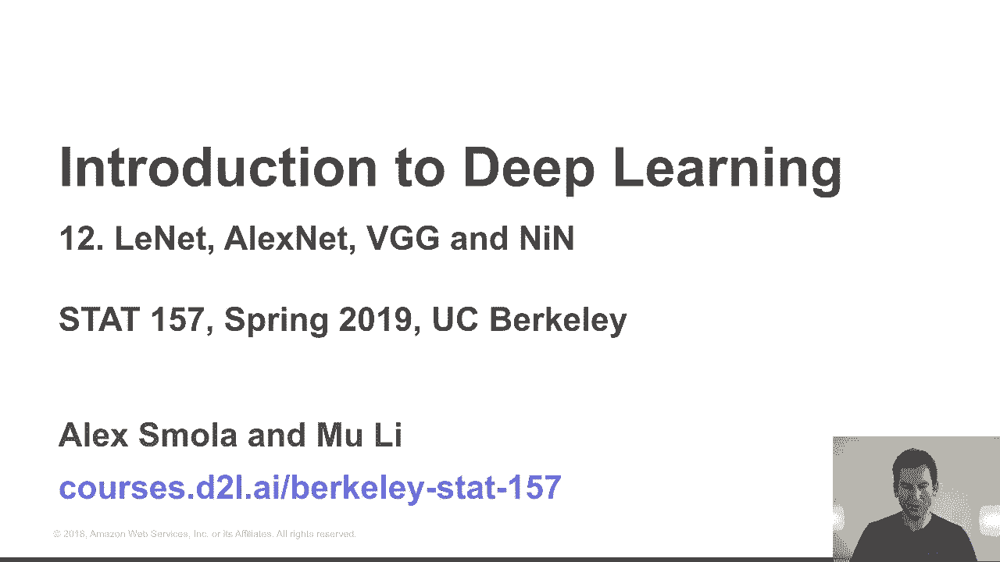
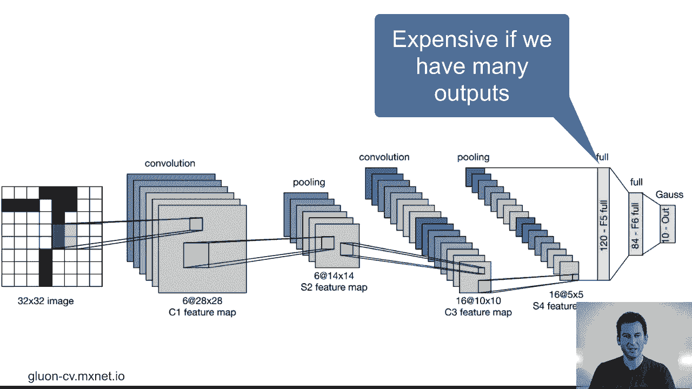

# P61：61. L12_1 LeNet - Python小能 - BV1CB4y1U7P6

 In this lecture， we're going to talk about convolutional neural networks。 In the previous lectures。

 we encountered the basic components， such as convolutions， padding， stride， pooling。

 basically all the key components that make up a continent。

 Today we're going to use those components in order to design specific networks， and。

 in particular we're going to design Lynette， AlexNet， VGG， and then NIN as in networks。

 inside networks。 The next lecture will cover advanced networks that lead us to the state-of-the-art in object。

 recognition， but for today let's take a brief walk down history lane。

 So let's start with Lynette。 This was a network proposed in the '90s。

 so Lynette V is around 1995 by Yandli Khan， his team。 In the simplest version。

 this was engineered for low resolution black and white object， recognition。 The inputs were。

 let's say 32 by 32 bit size images， and those images were then convolved。

 to turn into six channels of 28 by 28 pixels， which were then reduced through average pooling。

 to 14 by 14。 Remember the channel size is the same because pooling doesn't adjust that。

 This was then followed by another convolution， which reduced it to 10 by 10 images with 16。

 channels。 The resolution then gets halved again by average pooling， so you get 16 by 5。

 This is in the end followed by 120 fully connected units， then by 84 fully connected units。

 In this case， this was a Gaussian RBF network to map things into 10 classes。

 At the time this was serious engineering， it probably took about between three months。

 and half a year to implement， including all the tooling that was needed。

 Now why would people have cared about it in '95？ Well， essentially handwritten digit recognition。

 So at the time， AT&T had a project in order to recognize handwritten characters for postal。

 codes on letters and also check amounts on checks。

 So the algorithm at the time was to identify whether check amount， the dollar amount is。

 then to recognize it and to use that in order to then pay that amount。 Obviously。

 that's not quite a trivial。 For instance， if you look at the check， well， you could have picked。

 you know， 11，725 assets， dollar amount， or you could have picked maybe the postcode of Wells Fargo Bank or the tracking。

 number in the bottom。 And while this sounds quite obvious to humans that it's not that。

 it's non-trivial to do， that on checks。 But for the purpose of this tutorial。

 we're going to focus just on character recognition。

 So MNIST was a data set that was engineered specifically for that purpose。

 This consisted of centered and scaled images， 60，000 training data and 10，000 test data at。

 the resolution of 28 by 28 pixels。 There were 10 classes because， well， there are 10 digits。

 And these digits were realistic digits as in obtained by looking at letters and actually。

 segmenting them appropriately。

 To see how this worked， well， let's have a look at the demo of Lynette。

 So here you can see digits scanning through the network and the network outputting its。

 estimate of what it thinks that digit would be。 And as these digits scan through。

 you can see that even for different shifts， it still recognizes， let's say， a 5 and a 6， a 6。

 And furthermore， you can see on the left hand side the activations of the various layers。

 So you can see that in the first layer after the convolutions， you pretty much just get。

 edge detectors， right？ So you get horizontal edges， vertical edges， things that enhance contrast。

 things that reverse， contrast and so on。 The next layer， so that's the column here。

 you can see how this now turns into high-level， features but still sort of kind of spatially related。

 Then beyond that， here are the activations of the fully connected layers。

 And you can see that this is now much more diverse。 In the end。

 this is converted into an estimate of a particular digit。

 So the paper that documents this from 1998 is a really landmark paper and I don't think。

 it's getting anywhere the recognition that it should。 I strongly recommend reading this。

 There's a lot of detail in there also on graph transducers which I don't think are fully。

 appreciated even nowadays。 Now if you look at that network architecture。

 I mean this wasn't such a big deal in 1995， because the images were not too high dimensional。

 But what you can already see is that as you move towards the output parts of the network。

 we have fully connected layers。 These fully connected layers can be quite expensive if we have many outputs。

 So for 10 classes， it's not a big deal。 Once we will move to maybe a thousand classes for ImageNet。

 this will actually become the， dominant factor in our network design and we'll have to find ways around it。

 We'll get to that in a moment。 Before that， let's have a look at how to actually implement that。

 We'll see that later in action in our notebook， but let's look at it for now。

 So all we do is we basically just say， okay， well， I want to have a sequential composition。

 of layers in that network。 And then I just add a convolution， average pooling， another convolution。

 another average， pooling operation， and then two dense layers and a dense output。 And that's it。

 So this is something that fits very comfortably on a single screen， whereas， well， in 1995。

 this would have been a lot more complex to implement。 Mind you。

 a lot of the size and the shape inference here is automatic， so you don't really。

 need to specify what the input dimensions to the next layer are。

 They implicitly define as you parse the network from input to output。

 And that's the net。 [BLANK_AUDIO]。