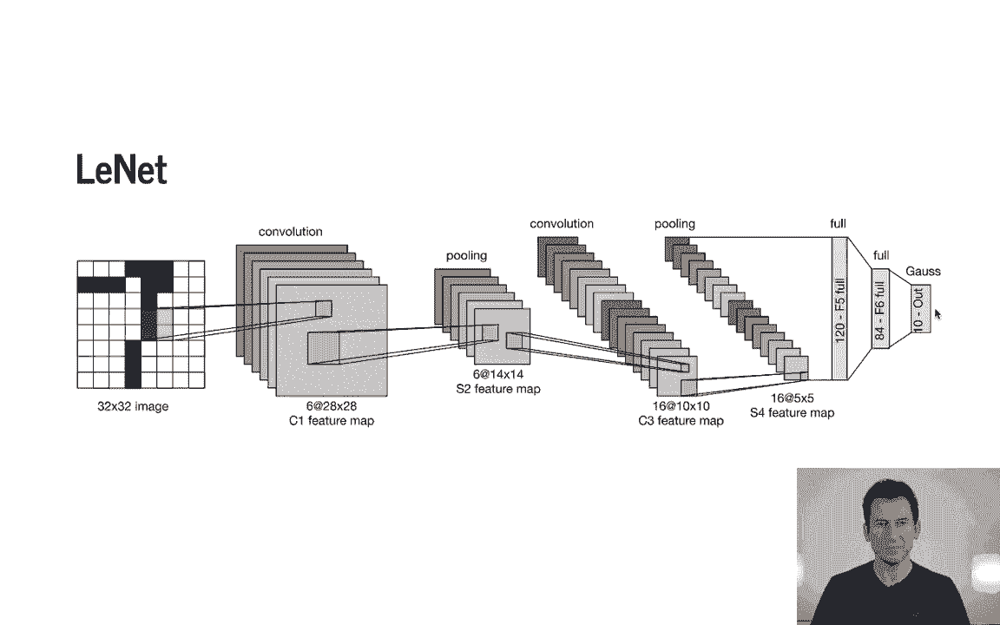
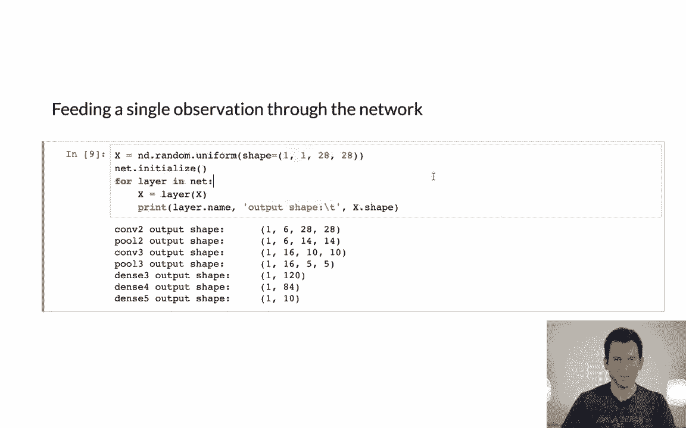

# P62：62. L12_2 LeNet in Python - Python小能 - BV1CB4y1U7P6

 Let's look at how to implement Lynette。 So just for a refresher。

 here's the architecture that we're going to implement。 So there's source image， convolution。

 pooling， another convolution， another pooling， and then a couple of dense layers。

 So the first thing we need to do is。

 we need to actually go and import， MXNet and all the appropriate libraries。

 And then we need to define our network。 So we already saw that before on the slides。

 but here's just as a refresher。 So we have 2D convolutions with six channels， kernel size 5x5。

 average pooling， another convolution， another average pooling。

 and dense will actually automatically recognize， what the right width and height and so on is。

 so you don't need to actually do anything like flattening。 So you have a dense layer。

 another dense layer， and then in the end you produce some output。

 And that's the full definition of Lynette。 So then we need to define and see what happens。

 actually if we feed some data through the network。 And okay， there we go。

 So we feed in a 28x28 pixels image， and well， since we have the appropriate padding。

 so after that we get six channels with 28x28。 We then perform pooling， so we get 14x14。

 Another convolution reduces it to 10x10。 Remember we have a 5x5 convolution。

 Then we halve the resolution again by pooling， and then we have three dense layers。

 And that's exactly as we would have expected。 Okay， mind you。

 until you actually send some data through， this isn't bound。

 so if I had sent some data that looks different， than 28x28 to it， well。

 things would have looked very differently。 Okay， so the next thing we need is we need a few tools for training。

 So the first thing we need is we need some data iterators。

 namely that will actually give us the data。 So D2L， so dive into deep learning， load data。

 fashion MNIST， is essentially just a convenience function that will load the MNIST data set。

 And I'm going to pick a fairly large batch size just because the images are tiny。

 otherwise our pool GPU doesn't know what to do。 Then okay。

 we need to check whether we actually have a GPU。 That's convenient because if you don't have that。

 then， well， your code might throw an exception if you don't have a GPU。 As a matter of fact。

 checking whether the code throws an exception， is one way of finding out whether you have a GPU。

 So that's why you have to try， accept， loop， and somewhere you basically try and generate， you know。

 some one by one matrix， or actually one dimensional array of zeros， so just a single entry。

 And if that succeeds on a GPU， we know we do have one。 If it fails， then we know， well。

 we obviously don't have a GPU， so it has to be a CPU。 And then it just returns a device context。

 For single GPUs， that's fine。

 Now， the next thing is we need to have a mechanism to compute the accuracy。

 So evaluate accuracy takes three arguments， a data iterator， the network and the context。

 The context is needed because I need to move the data into the context。

 So we can see you iterate over the data， and you make sure that's available in the context that I need。

 So as in context， we'll move it to the context if it's not already there。

 otherwise it will do nothing。 And here for convenience， we convert everything to float 32 bit。

 And then we just compute the accuracy by looking at how many times the art max。

 the output of the network， matches the correct label， and we sum that up。

 So one minus the accuracy is the error。 Then of course， you know。

 we also need to increment the counter n， which counts how many observations we've seen。

 So in the end we return the accuracy divided by number of counts。 That's fairly straightforward。

 And that's what gives us an accuracy estimate。

 Now we need the training loop。 Well， this takes as an input the network， the data iterators。

 mini batch size， the optimization algorithm， the device context， and the number of epochs。 And yeah。

 okay， first we tell， hey， we are training on a CPU or a GPU。 We need to define a loss function。

 In this case， you know， it's softmax。 And then we go over the data as many epochs as we have。

 We set some of the bookkeeping variables to zero， so training loss and training accuracy。

 And then we go and happily iterate over the data set。 Corrects in Y in training iter。

 so that iterates over the training set。 So we first move things into the context。

 We compute the prediction of the network。 So Y hat is net of X。 We compute the corresponding loss。

 So that's loss of Y hat and Y。 We sum over that。 We go and compute the gradient， so L backwards。

 And we take an update step。 That's very straightforward。 In the end， well， we take those labels。

 those Y's， and we look at our training accuracy just， to make sure that we also keep track of that。

 So this does something very similar to what we have in terms of evaluate accuracy just。

 that we do that on the training set。 In the end， we just print out some status of how well we did。

 So number of epochs， loss， training， and test accuracy。 And that's it。 It's very generic code。

 And then you let it run。 So for instance here， let's actually do that。 It gets to about， you know。

 82， 83% accuracy。 It's running on a GPU。 And you can see it's fairly swift。 Now。

 this takes about two seconds or so for one pass。 If I had wanted to run this on a CPU， well。

 there's a simple way how I could have done this。 Let's wait until it's done。 Actually。

 I can just write context is mx。CPU。 And let's see what happens。

 Make complaint because it's on the network was probably initialized on the other device。

 but let's see what happens。 Yeah， it does complain because the network was initialized on the wrong device。

 So if I wanted to get this right， I would have to go and go back to where I defined my device context。

 And， okay。

 So let's do that here。

 And then we can go and try this again。 It's really just to give some idea of how fast things go if it's not on the right device。

 So， okay。 We find this training loop。

 And now， if we run it， we'll see that on a CPU。

 This is a lot slower。 So remember before that， it took us about 2。

3 seconds to do one pass through the data。 And even though this data set is really。

 really tiny and not really optimized for CPUs， well， it takes forever to perform even just one pass。

 It takes about 10 times as long。 So that should give you some idea of why you would want to use GPUs rather than CPUs。

 Now， the next step is going to be to use some heavy YouTube real networks such as AlexNet。

 And we'll see how for those networks， CPUs are just completely hopeless and GPUs are really what you want。

