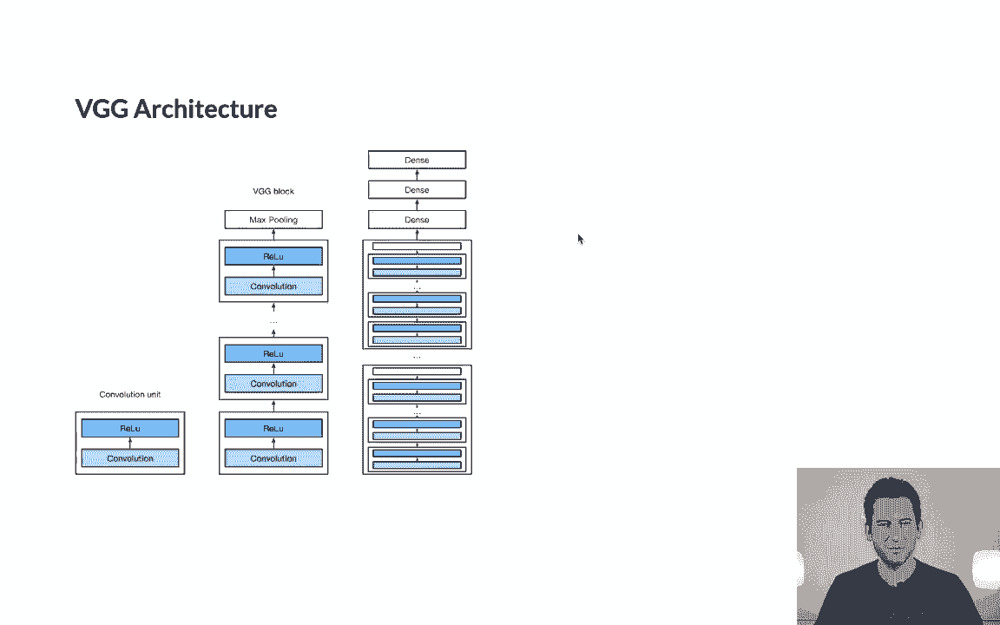
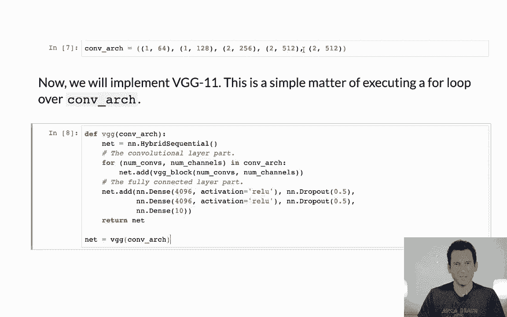
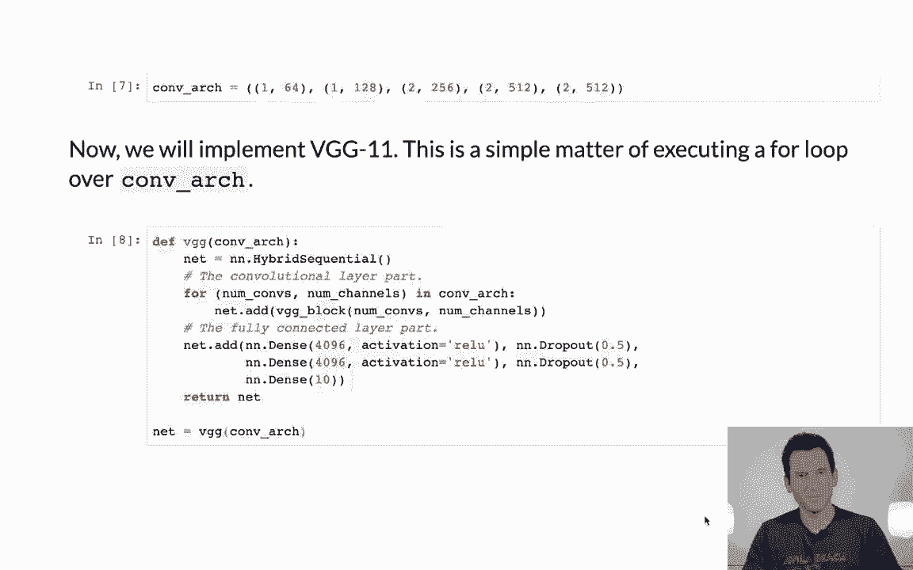
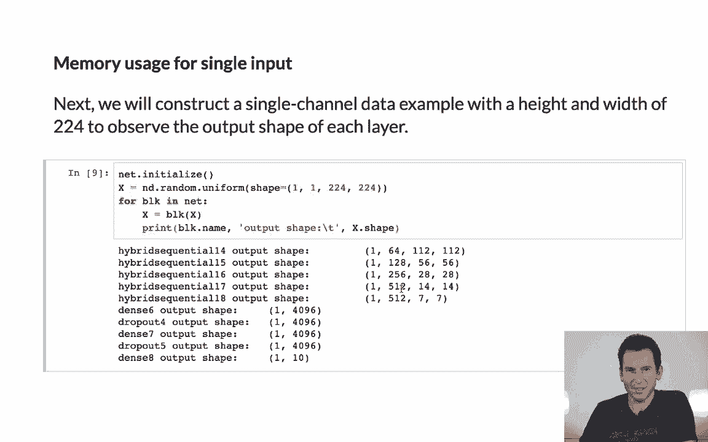
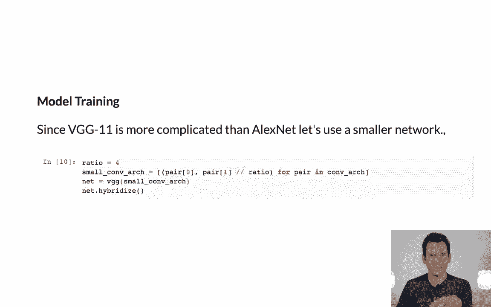

# 【AI 】伯克利深度学习Deep Learning UC Berkeley STAT-李沐 & Alex - P65：65. L12_6 VGG in Python - Python小能 - BV1CB4y1U7P6

 Let's have a look at networks using blocks。

 So this is the really first part where VGG made a significant difference conceptually。

 in terms of how people started thinking about network designs。

 Namely not in terms of defining individual layers but designing blocks and then composing。

 the network out of blocks。 Okay， so for that we first need a VGG block。

 So the VGG block does nothing particularly special besides actually taking a number of。

 convolutions as an argument and number of channels。

 And what it then does is it just performs a sequential composition。

 In this case I turn on hybrid sequential， that's because I'm going to use my JIT compiler。

 to make this go a little bit faster and I'm just adding one convolution after the other。

 And in the end I just perform max pooling。 That returns a block。

 So rather than sequential I just use hybrid sequential that's all that's needed for now。

 in order to activate the JIT compiler。 Or at least to tell the JIT compiler that this can be used。

 Okay。 So let's recall the VGG architecture， we've got a couple of those blocks in the end， we've。

 got three dense layers。

 Okay。 So the architecture that I'm going to use is one where I first have 64 channels and just。

 one convolution， 128 channels， one convolution， then 256 channels and two convolutions， 2， and 512。

 2 and 512。 And so now， and this is the nice thing。

 basically my network looks like a very simple for loop。 Right。

 So I start again with hybrid sequential because the overall block is hybridizable and I'm adding。

 to this network individual blocks。 So let's add a VGG block of number of convolutions and number of channels。

 it adds an entire， block rather than just a layer。 Then in the end， I add well。

 three dense layers and that's it。 It's very clean， right。 Then the end， yeah。

 I just go and execute VGG of convarch。 So that's the architecture。

 If I wanted to pick something else， I could have for instance omitted one layer or added。

 one more or one more block。 That's quite straightforward。

 So let's have a look at how much memory it uses。 Well， we have， you know， 112， 512， 64 channels。

 128 channels， 256 channels， 512， 512。 So this is after all exactly what we picked here， right。

 So the top line here， convarch defines exactly what we get。

 Now， and lo and behold， that's what we have here。

 Then the end， the behemoth dense layers as you would expect them。

 Okay。

 So then， well， since we want to train this and we want to train in a reasonable time， we're。

 actually going to make our network a little bit smaller。

 So the thing that we'll do is we'll simply divide all the sizes and the ratios by， you， know。

 four and that makes sure that everything is considerably more concise so we can actually。

 run this inefficient time。 Now， I generate from my small architecture my network and I hybridize。

 So hybridization now tells the network， okay， the first time going to execute it， look at， you know。

 all the parameters that you have。 And then afterwards， don't bother about bothering Python anymore。

 Just use the framework directly in the back end to perform computation。

 Okay。 So， and then we train。 And as a matter of fact， if you were to do this。

 you would have to wait for about maybe， one and a half minutes per pass。

 So I'm not going to do that right now or at least let's look at the outcome first。

 You basically have a learning rate that's still quite small， five passes， mini batch size。

 of 128 and of course， your random GPU。 So this is exactly the same code as what we saw before in the previous two cases and。

 then you just iterate to the data。 And since this is in our book， the trainer from chapter five。

 it's just trained on the， score of chapter five。

 If I were to invoke this now， you'd see that it takes forever and it gets you down to about。

 eight and a half to nine percent error after five epochs。 If you want to get it a little bit better。

 you might have to use more epochs。 But that's all that you need to know when it comes to training using VGG on fashion MNIST。

 [BLANK_AUDIO]。