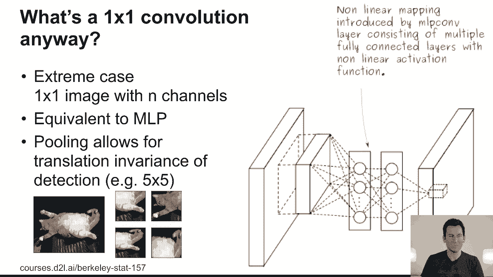
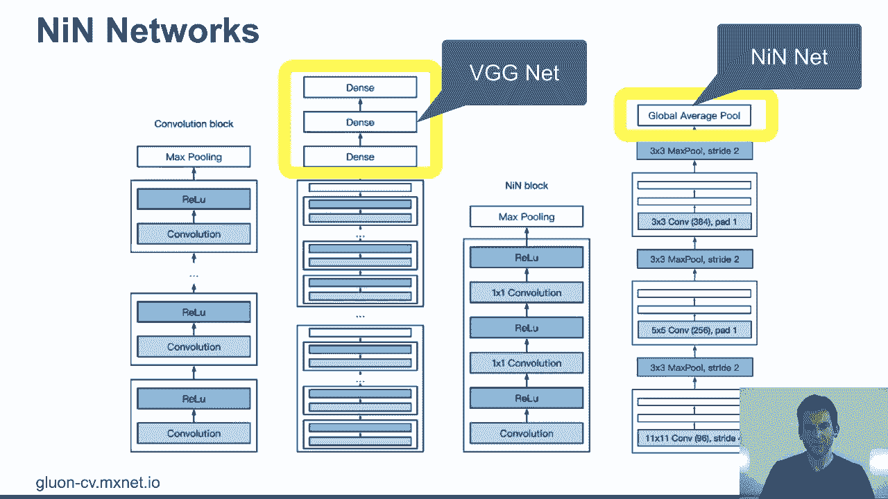

# 【AI 】伯克利深度学习Deep Learning UC Berkeley STAT-李沐 & Alex - P66：66. L12_7 Network in Network (NiN) - Python小能 - BV1CB4y1U7P6

 So let's talk about how we can actually make those networks a little bit smaller。

 Networks in networks are a convenient strategy for doing this。 So if you look at the picture。

 you basically see that there's a multi-layer perceptron。

 inserted as intermediate layers in my convolutional network。

 And that sounds like an abstract and peculiar and strange idea， and as a matter of fact。

 when that idea was published， people didn't quite appreciate the impact of it。

 Let's have a look at why it actually matters。 So if we look at the last layers in Lunette， well。

 they're not that big， right？ The main is basically just， you know， 120 hidden units， 84 and then 10。

 So that wasn't a big deal relative to whatever came before。

 But if we move on to AlexNet or VGG， well， those things actually get quite massive。

 So if you look at the last layer just connecting from the convolution， well。

 you have number of channels times the width and the height of the last resolution， you know。

 that you get before you go dense。 And in Lunette， there was 48，000 parameters。 In AlexNet。

 there was 26 million parameters， so that's about， you know， 3/0 of magnitude more。 In VGG。

 it was four times again that number。 So that's pretty bad。

 whereas convolutions were actually kind of well behaved。 It's， you know， input times output times。

 you know， convolutional kernel size， if you had， you know， kernel size of 3， then， you know， that's。

 you know， 9， so it's 9 times input times output。 That's quite well behaved。

 But those last layers are the ones that really made life hard。 So the question is， of course。

 how can you fix it？ And the issue is， in the end， you need to produce something that is， you know。

 for dimensionality that matches the number of classes that you have。 So at some point。

 you need to go from a two-dimensional times， you know。

 number of channels representation to something that's a vector。

 And the challenge is how do you do that？

 So let's have a look at it in a bit more detail。 If I print the size distribution for VGG。

 you can see that as I'm going from， sequential 5， so this is basically the last convolutional block。

 so that's 512 channels， with 7x7 to a 4096-dimensional output。 Well， that eats a lot of memory。

 Now， one way to address this is to get rid of those fully connected last layers。 Well。

 that sounds quite easy in theory， but how do you do it in practice？

 The problem is convolutions and pulling reduce the resolution， so you keep on having things。

 But then at some point， you still need to map to this， you know。

 number of classes dimensional object。 And at the same time。

 you also need to have some degree of nonlinearity。

 to mix and transfer the information between the various channels into representation that works for the number of classes。

 And this is exactly where one-by-one convolutions come in。 As we saw before。

 they only act per pixel on all the channels。 So this is really a multi-layer perceptron applied to pixel-wise activations。

 And so if in the end you only have maybe a 5x5 activation， well， resolution。

 then this really allows you to get a large amount of already per channel information。

 quite nicely presented in the form that will tell you how many classes you need。 Now。

 in the very last layer， essentially they just got rid of it。

 So rather than bothering with one last dense layer， they just perform global average。

 pulling in order to take care of things。

 That worked rather nicely。 So if you look at it again， well。

 the one-by-one convolution is just a multi-layer perceptron。 And that's what address things。

 So this led to something called the NIN block， network-in-network block。

 So you basically have a convolution followed by two-one-by-one convolutions。

 And those act in the same way as you would have a dense layer。 You repeat that a few times。

 and so you get the following architecture。

 So the NIN net had a number of convolutions followed by one-by-one convolutions。

 max-pulling in order to reduce the resolution。 And you did that three times in order to get a meaningful network-in-networks network。

 And this completely got rid of the dense layer。 So that's the contribution of network-in-networks。

 They didn't perform quite as well as VGG， which is one of the reasons why people initially overlooked it。

 But they were a key component in order to go to things like inception or resnet。

 which we're going to cover in the next few lectures。

 But just to compare in the end， so rather than the dense layer。

 you just had those multi-layer perceptrons and then average volume。

 So to summarize things， what you get is you get this dimensionality reduction。

 so you can see you go from 96 to 256 channels to 384 channels。

 which then keeps on getting reduced further and further until we have something that's 5x5。

 Then you drop down to in this case 10 dimensions because it's a 10-dimensional classification problem。

 You perform global average， falling， you drop the remaining few dimensions， and there you go。

 That's all you need。

 So in conclusion， what we cover today is Lynette。 So this was the first convolutional neural network。

 Then we moved on to AlexNet， which was just bigger and better and better。 VGG was bigger still。

 and then which offered a constructive alternative to those behemoths， dense layers。

 The next lecture we will then see how all those ideas can be combined to get inception。

 and then by further refinement of the function classes we will get to resnet and resnext。

 But that's topic for the next lecture。

 [BLANK_AUDIO]。