# P73：73. L13_6 ResNet in Python - Python小能 - BV1CB4y1U7P6

 OK， so the thing that we didn't get a chance to cover last Thursday was， you know， how。

 do you actually go and implement the ResNet？ And just for refreshers。

 the picture there is like the core unit in a ResNet。

 So you have like a weight layer and an activation and maybe another weight layer。

 And actually what you would have is you would have patch normalization and other things， in between。

 But this is the overall flavor。 And the first thing to do is you go and import， you know。

 all the relevant libraries。

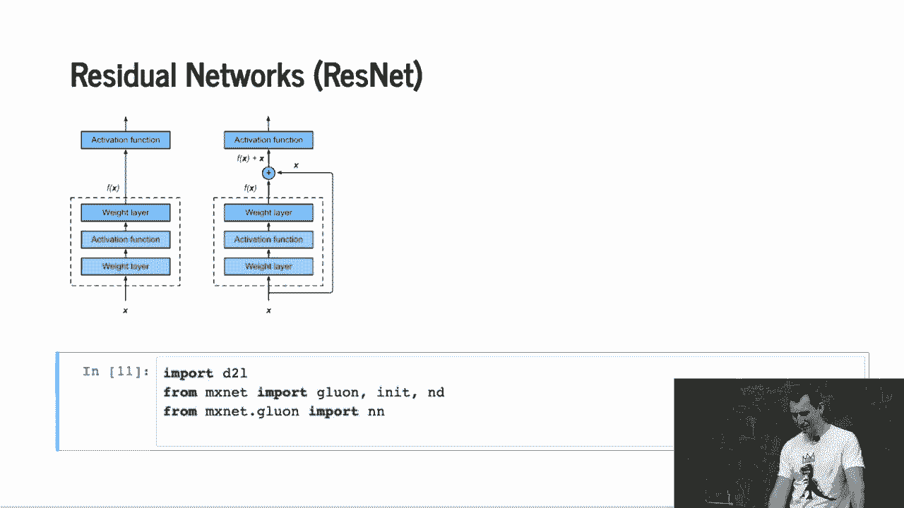

 And now here comes the famous residual block。 So this is verbatim from the graph that we saw last week。

 And let me just walk you through it。 So as a matter of fact。

 we saw that code last week in the slides， just the second part named， the forward function。

 So what I need to do is I first need to instantiate two or possibly three convolutions。

 Three convolutions if I used the one by one convolution on the side and only two if I。

 don't do that。 And so the first conflock is just three by three with padding of one。

 So in other words， the image size doesn't change。 Second one has the same property。

 And the outcome number of channels is a parameter that I'm going to feed to the constructor。

 And if the constructor has also the use one by one in it， then okay， fine， I need that， too。

 And then I need two batch norms because I have batch norms before the relos appropriately。 Okay。

 so this just instantiate still layers。 And then the forward function does nothing else but just applying a convolution in a batch。

 norm in a relo。 Okay。 And the second layer， the second step， so this is this one here。

 That's the same thing， except that I'm now going to apply the relo to the sum of y and， the input x。

 So that's the thing here。 Obviously， if I decided that I want to have a one by one convolution for that secondary。

 path on the side， then I update x is self-con three of x and then I add things together。

 So all that does is just mixes within the channels and then I throw that all into the， relo。

 Everybody cool with that？ Okay。

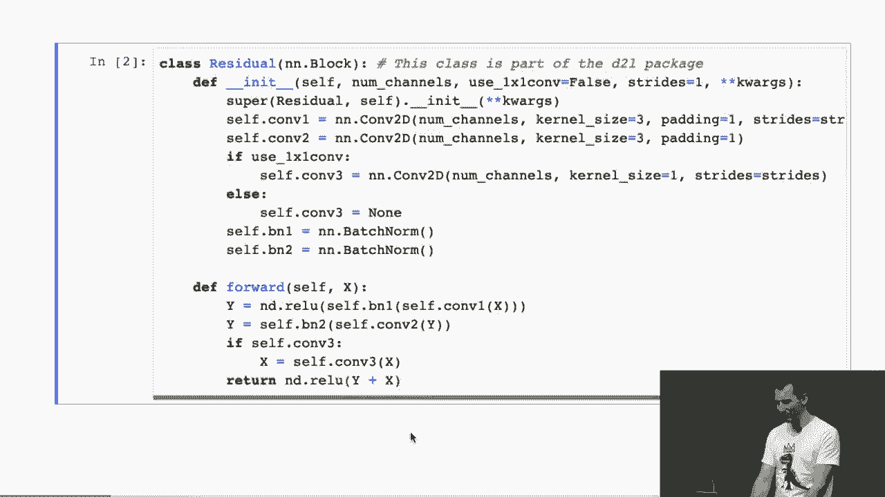

 So that's the network again。 So basically if it says use one by one， then I have this piece。 If not。

 then I have just this one here。 There's the convolution batch norm， relo， convolution batch norm。

 relo。

 Which is exactly this code here。 Okay。 It's just kind of nice because it makes life easy。

 Okay。 So now if I define a residual block， so let's say， you know， three channels， then initialize。

 that and I now pipe some data through it， which is， you know， six by six。 And then I have， you know。

 three input channels and， you know， mini batch size for equivalent。 And I apply x to it。

 Then what actually what happens is they get the same output。 That's kind of convenient。

 Now let's say， for instance， I used four here。

 Then， whoa。

 I was， I probably didn't define this guy。 Yes。

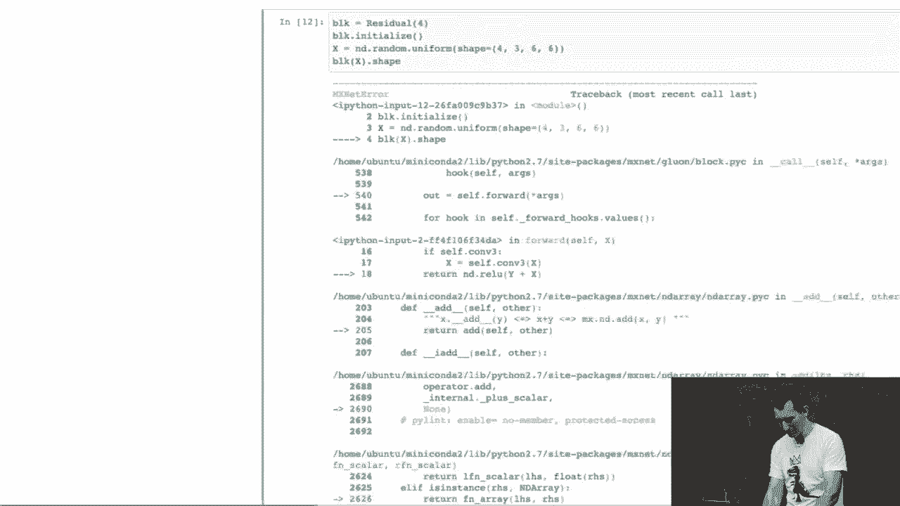

 Whoa。

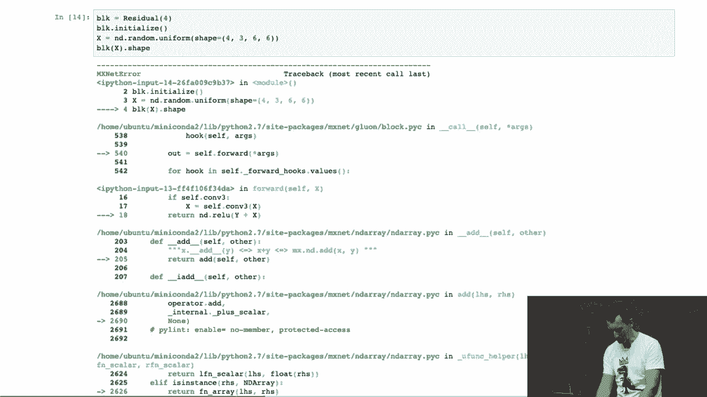

 Let's see。 Okay。 Interesting。 Yeah。

 Because the input didn't work here。 Okay。 Okay。 Now。

 if I use the one by one convolutions on this side， well， the same thing happens。

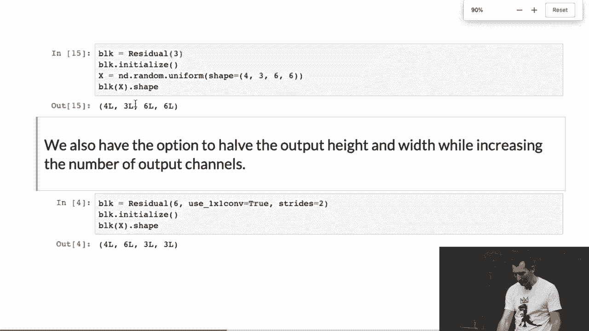

 Except that if I use strides of two， then it'll down sample it to three by three。

 If I were to use strides equals three， I'd get the two by two。 All right。

 So that's kind of convenient。 Let's just go back to what happened before with that first argument。

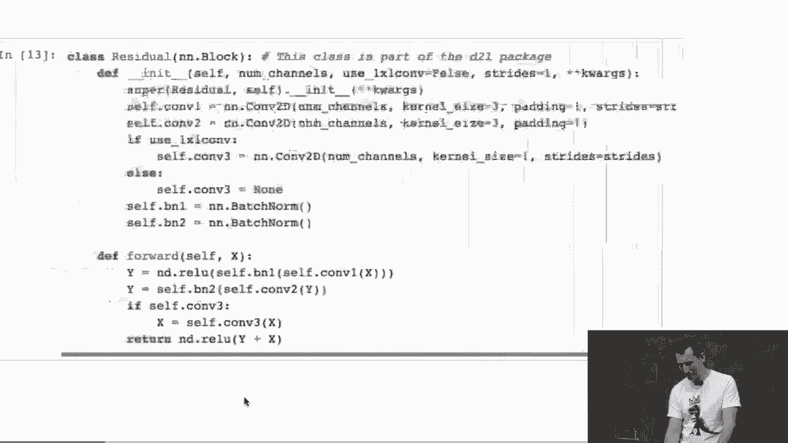

 Other channels， yeah。

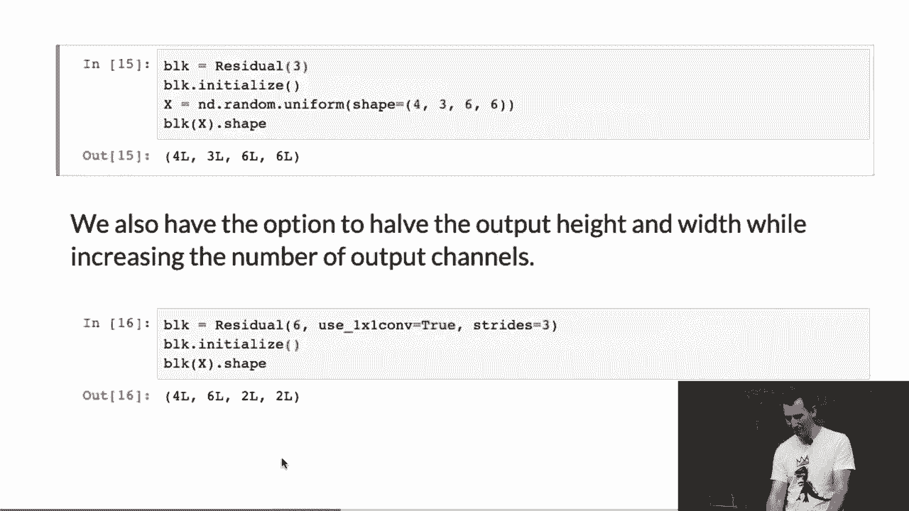

 Okay。 So now that we have this， we can actually compose this to the corresponding blocks。

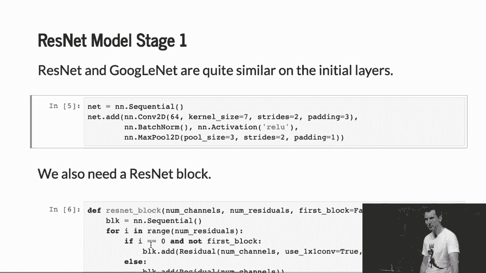

 So stage one is pretty similar to GoogleNet。 So you just add， you know， a seven by seven kernel。

 a relu， and then a three by three。 So it's a little bit smaller than on GoogleNet for the first stage。

 And then we need a resnip block。 So this resnip block does something very simple。

 It just adds one residual network after the other with the appropriate number of channels。

 And what it does is， and if this is， you know， in the first， if this is the first resnip。

 in the entire stack， it just down samples everything by a factor of two。

 So the down sampling happens at the beginning rather than the end。 And obviously not first block。

 Well that's quite straightforward because you don't want to down sample too aggressively。

 in the beginning。 Right。 So that's why this first part is， you know， it's there。 Okay。 Yeah。

 so that's pretty much what that network does。 Okay。 Any questions so far？ Okay。

 Good。 So now that we have， you know， these blocks， now we can add several of those blocks together。

 So remember we had this， you know， residual unit。 We stacked some of them up。

 We got the resnip block。 Now we add up several resnip blocks to get， you know， most of that network。

 And so we have， you know， two residual units for one resnip block with 64 channels and。

 128 and 256 and 512。 So you can see we keep on doubling the number of channels。

 So the number of channels typically increases in a convolutional network。 If not。

 then something's wrong， right？ So you want to check that in your code。 At the same time。

 we down sample。 So you typically do not want to get a situation where you have maybe 20 channels first and。

 then 10 channels later， right？ That's probably a bug in your code。 And so in the end， well。

 you use just like in Google net global average， pooling， and， that's it。 And of course。

 since we only have 10 outputs because we are doing fashion MNIST， you know。

 the last layers and end ends of 10 if it were more classes than you'd have more there。

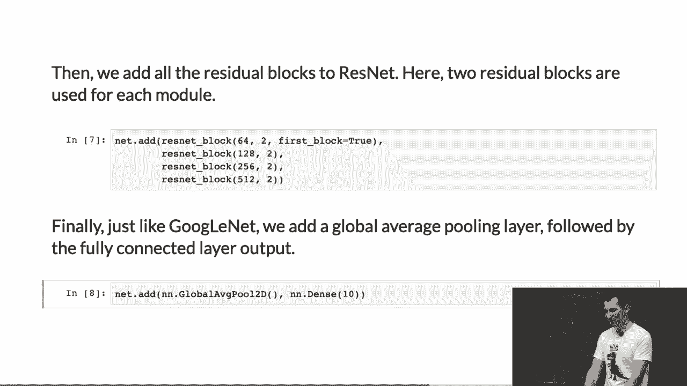

 Okay。 So this is the full resnip that we just constructed， resnip 18 because it's got 18 layers。

 So remember， this is basically two residual blocks here， then two here， then， you know。

 you repeat this， you know， three times， three more times， so that's basically the other， sorry。

 two here， then basically a total of eight such stacks。

 This is the input and then in the end you have the average pooling。

 That's the simplest of the resnits。 Resnip 50 is kind of popular and then you can go up to resnip 1 to 52。

 This is sort of where people get bored and there's a tradeoff between accuracy and speed。

 There are better ways to get high accuracy than making it even deeper。 Any questions？ Good。

 Now， if you were to run the data through it， you'd actually see how the dimensionality。

 is changed。

 Right？ So initially， we， and this is basically just sending a 224 by 224 image through it。

 It only has one color channel and it's got a mini batch size of one。 So after the first， you know。

 block， well， we have basically 64 channels， 112， 112。 Then。

 batch number doesn't really change anything， no， that's the real node， no， that's pooling。

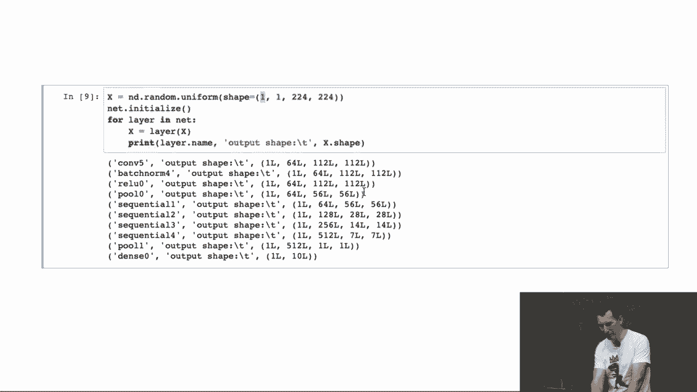

 So this is all fully detailed。 That's basically just the first block， right？

 Then we have those resnip blocks。

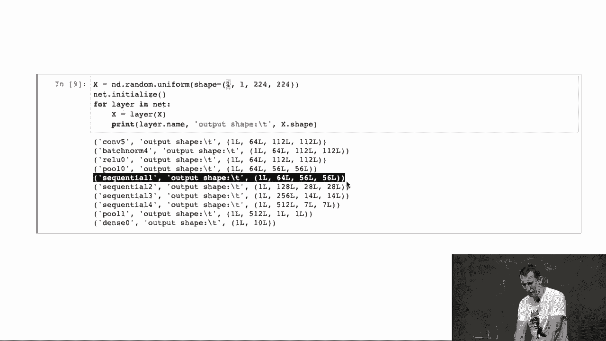

 We have four of those， right？ And remember， we went from 64 to 128 to 256 to 512 channels and the dimensionality kept。

 on halving at every step。 So then， I perform pooling， so global average， pooling。

 and then just a dense layer。 This is exactly what we constructed before。

 And then， you can run it and this is on a slightly slower machine。

 So you can see this takes about a minute or so per pass， which is why I'm not going to。

 show you this live right now。 But it's a different machine because mu afterwards is going to show you multi-GPU training in。

 a bit more detail。 And for that， you need the machine with a few GPUs。

 So it took something with individual GPUs that are a bit slower but it's cheaper to run。 But yeah。

 it behaves exactly the same way as before and you can see that the accuracy， is pretty solid。

 Any questions so far？ Yes？ >> Is there any reason why there is no kernel regularizers used？

 >> Why are we not using any regularizers？ Well， the number of regularizers being used。

 the most important one actually in this case， being the batch normalization。

 So the batch normalization in the context of a convolutional network has pretty much。

 replaced dropout just because it works a lot more accurately。

 So effectively what it does is rather than knocking out individual coordinates entirely。

 it's adding a little bit of noise and changing the scale a little bit。

 So that's essentially what the centering and scaling does。 And since those are random variables。

 they noise up。 They basically perform a noisy affine transformation to zero mean and unit variance。

 And that's a good way of adding noise that's calibrated to the size of the outputs。

 So that's a really important thing。 So if my activations were 100 times what I would have happened otherwise。

 the regularization， would have had exactly the same effect because it's scale invariant。

 It's actually a very nice property。 So matter of fact。

 this also ensures that things converge much more nicely because you're bringing。

 everything back to a reasonable well-defined scale。

 So just to recap a little bit what we could have done in terms of regularization， we could。

 have used some weight decay。 And depending on which optimizer you're using。

 there might actually be something built in， or not。 We could have used dropout。

 We could have just injected noise directly into training by， you know， noises up our data。

 Or we could have used batch normalization。 Or for instance， we could have used early stopping。 Yes？

 [INAUDIBLE]， Yeah。 [INAUDIBLE]， OK。 So the question is basically why aren't we using that？ Well。

 there aren't really a lot of dense layers around， right？

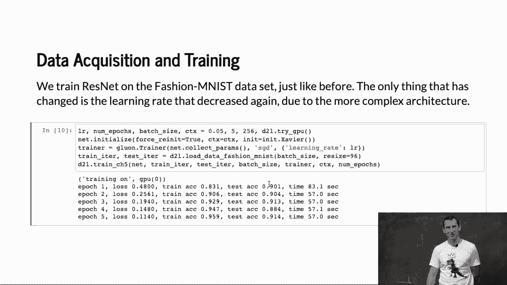

 The only dense layer that's there is just the last layer that goes from， well， let's， see。

 512 dimensions to 10 dimensions。 I could have probably used the regularizer there。

 I don't know whether it would have made a big difference。 Why don't you guys try that out later。

 download the notebook， and give it a try？ It might have made a slight difference。

 I don't think it would have been significant， though。 This is one thing you can experiment with。

 But in general， if you're using batch normalization， that takes care of a lot of the capacity。

 control that you would have had otherwise。 It's probably the more sophisticated way of regularizing。

 You could have also required sparsity。 And that makes optimization sometimes a little bit unpleasant。

 And if you're not doing it right， it might not converge really well， and so on。

 So it's not that easy to control。 You could have tried quantizing parameters that sometimes regularizes。

 So there are many， many different strategies。 There are， to some extent， complementary。

 and which one you use depends a little bit， on what outcome you deserve。 Everything's cool？ Yes？

 [INAUDIBLE]， Will resnets work for regression problems？ Yes。 So if you have a regression problem。

 right？ So I mean， it depends on the input。 If you're trying to do regression on images， yeah。

 I think that would work quite nicely。 If you're doing more general multi-layer perceptron regression。

 actually， you can use， residual connections， too。 So images aren't the only place where resnets occurred。

 Basically， people then took the idea and applied it to pretty much anything that people。

 had design networks for， simply because of the fact that it gives you this very nice。

 parameterization away from the identity， as opposed to away from the function zero。

 It's a very useful concept。 We'll have mostly time to cover that for images。

 but it works for other things， too。 So for instance， for sequence models。

 they're a very popular modification。 Good question。 Any other questions？ Good。

