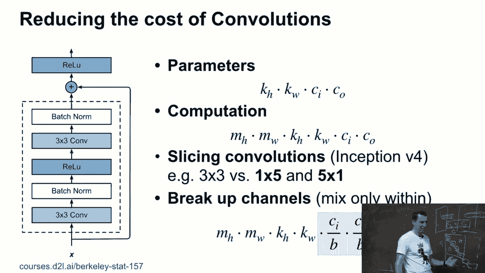
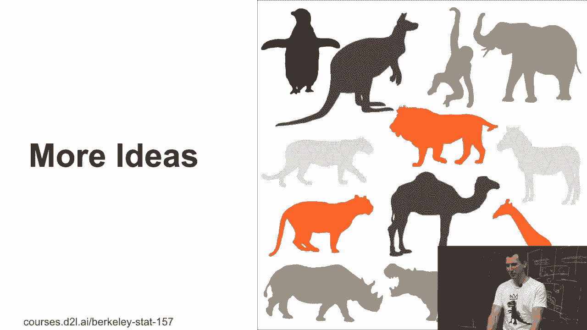
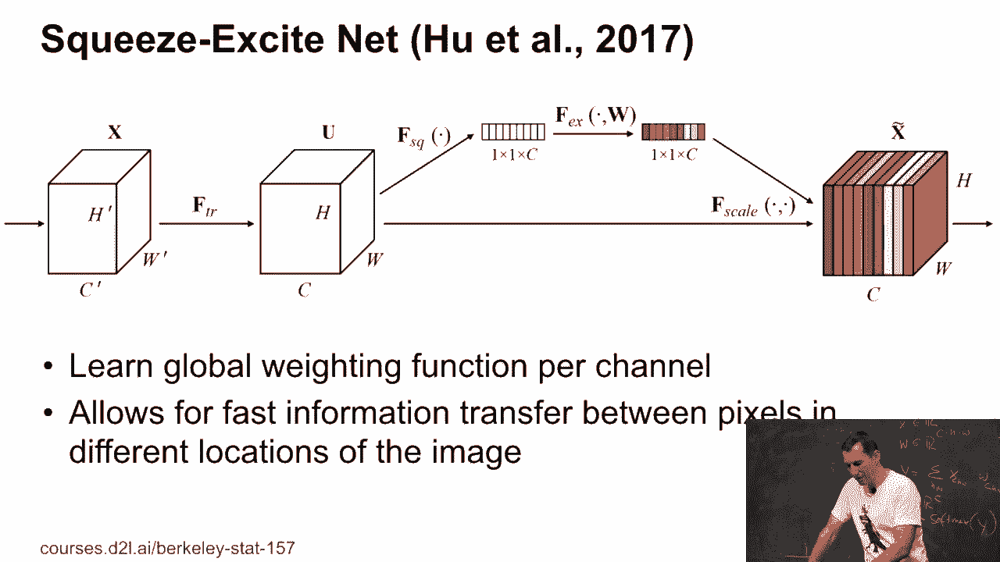
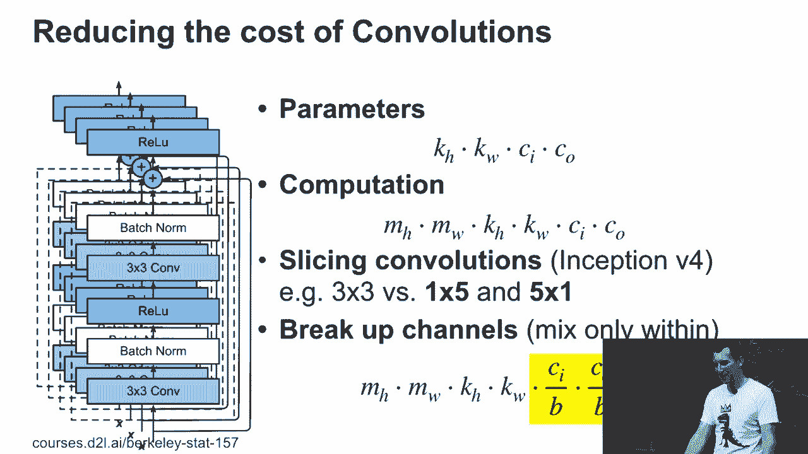
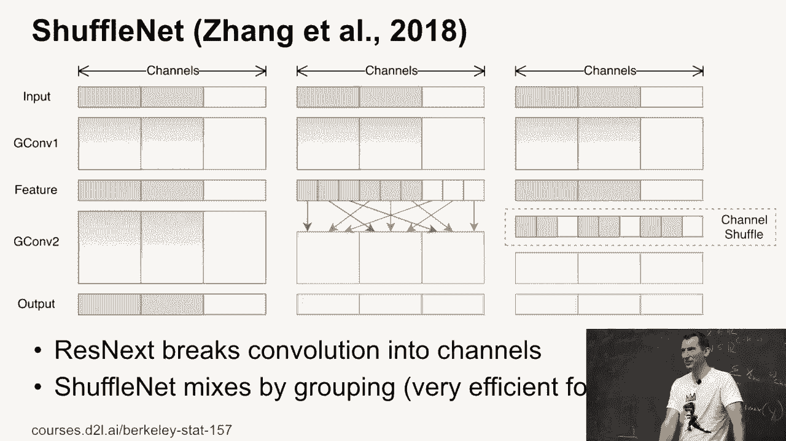
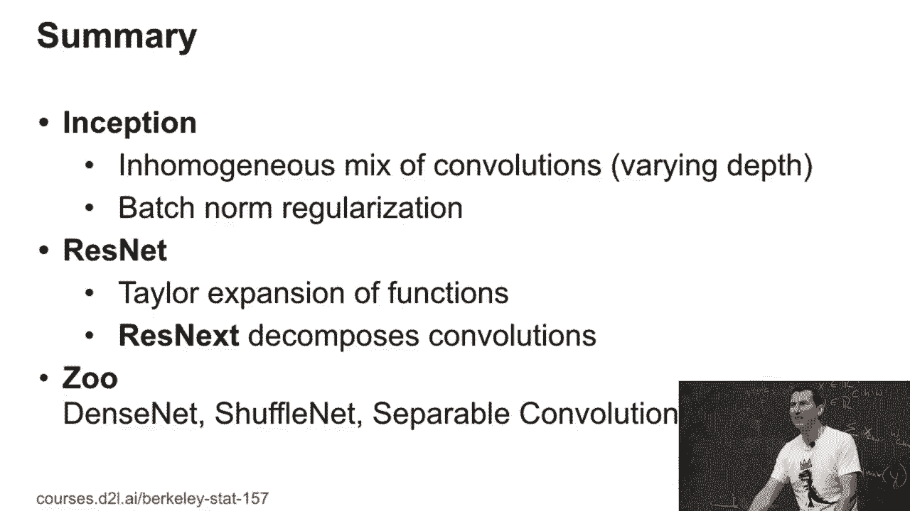

# P74：74. L13_7 Beyound ResNet - Python小能 - BV1CB4y1U7P6

 Well， an obvious thing that you can ask yourself is what comes after ResNet， right？

 And that's ResNEXT。 I think we briefly covered that last time， but it was a little bit brief。

 so I'm just， going to review that in a bit more detail。 So remember in ResNet。

 you essentially have this stack of 1 by 1s and 3 by 3s。

 And effectively what happens is that if I have one layer here， another layer there。

 then within a single pixel， right， so you have this entire stack of， you know， channels。

 You want to turn that into another stack of channels。 Now， if you do that。

 then this requires basically a C_i times C_o operation， which is expensive。

 And the dimensionality that you can afford is basically proportional to C_o。 And obviously also C_i。

 but really， you know， so you have two knobs that you might want， to control separately。

 namely the number of parameters， which depends on this。 And the number of output dimensions。

 which already depends on that。 And so ResNet is a very clever way of separating the dependency between those two。

 So what you do is， effectively， if this is my matrix， you know， C_i times C_o。

 rather than taking the full matrix， you're basically approximating it by a block， diagonal matrix。

 where now within each block things are dense， but the rest is all， different。 So。

 you can afford a large matrix， right？ You can make it larger like so， if I have another two blocks。

 maybe。 And the number of parameters alternatively is reduced。

 So if you look at it again， basically， by breaking up the convolutions into。

 individual sub-channels， you get， you know， more memory efficient tools。

 And if you then go through the detailed calculations， so that's what they did in， the ResNet paper。

 And they use the design that is very， very similar to a ResNet。

 which isn't such a big surprise because coming here is one of the authors on both， papers。

 They basically engineered ResNet to have essentially。

 identical number of parameters and number of flops， but just have more channels。

 but at the same time have no larger number of parameters of flops。 Yes？

 >> What's the difference between doing this and say having this one combination that has a。

 large output channel but the convolution matrix is sparse？ >> Okay。 So sparse convolution matrices。

 Yeah， so effectively this is a special sparse matrix， right？ If you think about it。

 what the question was is， well， okay， Alex just wrote down a。

 really weird block diagonal sparse matrix。 Why can't we have a general sparse matrix？

 As a matter of fact， you could do that。 The problem is that GPUs are really awful when it comes to sparse matrices。

 All right？ Part of the reason is that， well， GPUs don't like pointer lookups。

 So if the matrix is not too sparse， then you're better off actually just using。

 the zeros for the rest。 So you might go and have only 10% non-seros and you're。

 still faster off writing it out as a dense matrix。 And where that tradeoff occurs。

 whether it's at 1% or 10% or 30%， that really depends。

 on the GPU or the CPU on which you're executing things。 So in other words。

 you're not going to get any speed up by going sparse unless you're， extremely sparse。

 And the other thing is it's a lot harder to， control the result of that。 So you're much。

 much better off having a predefined sparse D for which you can， then optimize on your GPU。 Now。

 there's no reason why you couldn't have another few blocks in here， right？

 Maybe something like that's block sparse。 There actually be an interesting research project to maybe add。

 you know， another set of blocks sparse interconnections here。 As a matter of fact。

 I'm going to show you a strategy that's very similar to that， in the next few slides。

 So that's shuffle knit。 But it's a good question。 Yes？ [ Inaudible ]， Exactly。

 So if I know where my sparse is and if the sparse D is predictable in such a way。

 that I don't need a secondary index structure to store the sparse index。

 then I can do this efficiently on my GPU。 Whereas if I need to always encounter some surprise by doing that sparse look up。

 then my GPU is going to be slow。

 So let's look at the zoo of more ideas。 And this is really just going to give you， you know。

 the tip of the iceberg。

 So one idea is， well， after all， resnet worked。 So why not go even further， right？

 So if you think about it， you know， resnet went from parameterizing， you know。

 f of x equals zero to f of x equals x as the simple function。

 But you can essentially get like a higher order Taylor series type expansion。

 So what you do is basically you define xi plus one to be the concatenation of xi， and fi of xi。

 So as a result， that vector will keep on growing and it will basically have increasingly。

 higher order terms in its expansion。 So you start with x1 is x。 x2 is， you know， x and f1 of x。

 So type here is x， f1 of x， f2 of x， and f1 of x。 And I got bored after that because the expansions just get a lot longer。

 right？ Basically， x4 would be， you know， this term plus f of all of that term， right？

 So it just gets tedious。 Now， this is what Densnet did and at the time it looked like this was the right way to go。

 Actually， quite surprisingly， if you train resnet really well or resnet really well。

 it outperforms Densnet。 So how did they manage to do really well and I think they got the best paper。

 price for it for Densnet？ Well， their training implementation was better。

 So sometimes it's not the network but how you train it that lets you win benchmarks。

 This is the thing that isn't always clear to people when they read papers， right？ Because I mean。

 how would you know， right？ Sometimes the description of training is quite vague。

 Sometimes the only way to get to the bottom of it is to actually look at the code。 Okay。

 so Densnet is kind of useful but not that much。

 Here's one that's actually a little bit more exciting。 It's called Squeeze Excitnet or SCNET。

 And this uses something that we will cover in a bit more detail later on。

 namely something called attention。 So attention is essentially a mechanism where rather than taking averages over a。

 bunch of vectors， we're using a separate function to gate how that average should， be computed。

 And I'll just leave it at that。 For now， we'll get into that in a lot more detail later on when we cover attention to。

 a lot more detail。 But what Squeeze Excitnet does is if you think about the various channels。

 maybe there's a cat channel and there's a dog channel and maybe there's a， a dinosaur channel。 Now。

 if you knew that you're recognizing a cat， well， what would you do？

 You would overweight that cat channel and you'd downweight the race， right？

 But that's kind of stupid， right？ Because， I mean。

 how would I know that I'm recognizing a cat until I've actually， recognized a cat？

 It's like once I know the answer， well， the question becomes a lot easier。

 The other thing is that the information transfer that I have in convolutional。

 networks is kind of slowish， right？ So if you think about it， right。

 we have maybe a three-by-three convolution， another three-by-three， then we pull and so on。

 So it can take like four， five， six layers until the information from this corner。

 percolates to that corner。 And that's awful， right？ Because maybe if there's， you know。

 a ball of milk here， I know that， well， the chances that there's a cat over there is much higher。

 right？ So I would know that from the context。 So my cat detector can use the fact that there's a ball of milk to infer that。

 well， there's a cat。 So what are we supposed to do？ Well。

 what you could actually do is you could take very simply in a product of the， entire image。

 you know， on a per channel basis with some other vector。 And so now you get some numbers。 You know。

 you get channel mini numbers out of it。 So this is a very simple object。

 It's fairly cheap to do compared to all the convolutions and everything。

 And now you use those numbers in a softmax over them to re-weight your channels。 So therefore。

 if this very cheap procedure tells me， well， there's a good chance that， there's a cat somewhere。

 I can now up-weight the cat channel。 I bet there is no cat channel， but if there was one。

 it would do that。 Suffice it to say， a CNET actually improves the accuracy。

 So they're currently actually the best ones in the model zoo。 Yes？ >> So this weighting function。

 is it the same across layers？ >> No， I have one weighting function per layer。

 And so this basically gets computed in parallel to the convolution。

 And then the results from both paths are merged， right？

 You're basically performing a pixel-wise vector multiplication of， you know。

 that weighting vector that's written in nice pretty colors with the original tensor。

 >> So the Y is a global weighting？ >> Because I have weighting that is global overall the pixels in a channel。

 right？ So it's global in that sense。 And that allows me to send information about what's going on in the world very。

 quickly to other parts of the image。 >> So this weighting function。

 what kind of form does it take to also function？ >> Okay， so the weighting function， okay。

 let me quickly write that out。 So let's say I have X and that's maybe in our， you know， channels。

 I'm going to drop the batch right now times maybe height times width， right？

 And so now I'm going to multiply this by some weighting matrix。

 And that weighting matrix is also going to be in Rc times height times width。

 And I get the following result Y is sum over height and width of XHWC， well， CHW times WCHWCYC。

 So these are now， you know， so basically YC that's of course in Rc。

 And then I go and perform update YC becomes softmax of YC。 Well， Y becomes softmax of Y。

 And now in the end， I can go and use that to reweight every element in X。

 So every element in X then becomes XCHW goes into YC XCHW。

 >> So this W is like a convolution that's the size of the entire image and one channel， well。

 the channel。 And it would be not quite because you actually get one result per output channel。

 >> Right。 >> And the result of X times W is like a。 >> Not quite， right？

 Because you have one output per channel。 If it were a convolution， then you would only have one Y。

 >> Which would entirely defeat the purpose because then you'd have a single number。

 of times which you reweight the entire activations。 So now again。

 you have not made any preference between any of the channels。

 So it doesn't fit quite into convolution。 It fits much more closely into just an inner product。

 >> Right。 >> It's pretty good to answer reduction。 >> W's are also learnable。

 >> W's are all learned。 >> And it's a fairly small number of parameters in addition to everything else。

 So the overall cost is reasonably benign。 Makes training a bit more expensive。

 but the cost is overall reasonably benign。 And then you get higher accuracies。

 >> Now here's the last thing and this was in the direction of， well， can we do something。

 more structured or more sparse structured with our networks， right？ So if you think about ResNext。

 ResNext breaks up the channels into subgroups and。

 then each of subgroups of the channels you do your stuff and then you， need to combine。

 Now that's not necessarily very good because you may end up getting those。

 very long stove pipes essentially where the features only mix within each of those。

 but not across them。 I mean， after all， you got rid of the cross-channel mixing in order to get。

 you know， faster computation and everything。 Now， one way to bring it back is you just go and reshuffle things in between。

 convolutions。 And so in this case， if we have three channels， well， I go and basically pick。

 you know， one from the red， green and blue and， you know， turn that into a new。

 block and then I essentially intertwine things in a meaningful way。

 That gives you a little bit more accuracy。 So shuffle net is what you get out of that。

 And so they apply the shuffle operation to ResNext and to ResNext and to， ResInet and DI。 Yes？

 >> [inaudible]。

 >> Yeah， they basically what you would have gotten before in ResNet if we look at， that， right？

 So you would basically have had， you know， those four networks operating in， parallel。

 What they do is basically between every convolution， they mix up the。

 features between the various networks。 So they essentially add another permutation matrix in it。

 And so with that， it only has， you know， unit weights， so there's nothing to learn。 Yes？

 >> [inaudible]， >> It doesn't learn how to shuffle。 No。 That's an interesting question。

 Maybe somebody can figure out the way how to do that。

 My hunch would be that going from permutations to something we have， maybe。

 two copies or three copies。 But overall， you know。

 log number of channels copies might potentially help。

 But I don't know whether it would really make any difference relative to， other architectures。

 So given that the number of， you know， channels isn't that large， I mean， it might be 32。

 There isn't that much that you can gain。 Yes？ >> [inaudible]， >> Why is it very efficient？ Well。

 so on a mobile， on a mobile phone， I mean， you don't want to have a lot of， computations。

 And risk next is one of those cases where you can get high accuracy for a small。

 number of comparatively small number of computations。

 And risk next gives you even high accuracy for that。

 So now you have to straight off accuracy versus speed。

 And you can either try to win the benchmark by having a network that's humongous and。

 highly accurate。 And mind you， there's essentially a shuffle net paper that aims for， high accuracy。

 The title is a little bit different， but it's basically same authors， very。

 similar network architecture， but high accuracy。 Or you can go on this paritocarve of accuracy versus speed。

 and you push for， speed。 And shuffle net tends to be a little bit faster than， for instance， mobile。

 net。 So there are a number of other tricks that you can do， but that's pretty much。

 the bag of tricks that kind of work in the context of computer vision。

 Probably next year by this time they'll be， they will be like three， four more。

 slides of things that work。

 And yeah， so one last thing would be separable convolutions。 If you will， so that's in mobile net。

 that's actually a precursor of risk， next。 So risk next has groups of channels。

 Separable convolutions basically treat each channel separately。 So if I have 20th channels。

 then I can get 20 separate convolutions。 Whereas in a risk next。

 maybe I break up those 20 channels into five groups of， four each。 In a shuffle net。

 I would do the latter and then shuffle between them。 Okay。 This is about it for， you know。

 what covers the more interesting parts of the。

 model zoo。 So to summarize a little bit， we talked about the inception。 And resnets。

 And the key point in inception was essentially that you can mix and match。

 different types of convolutions and you can use batch norms。

 Resnet use this idea of a tail expansion。 Resnet decomposes convolutions。

 So it's basically separable convolutions， but with a bit more control。

 And then there's this entire zoo of additional things that you can do。

 And probably a C net and shuffle net are the more interesting parts of， the model zoo。 Now。

 any questions so far on the theory？ Okay。 Good。 Good。

