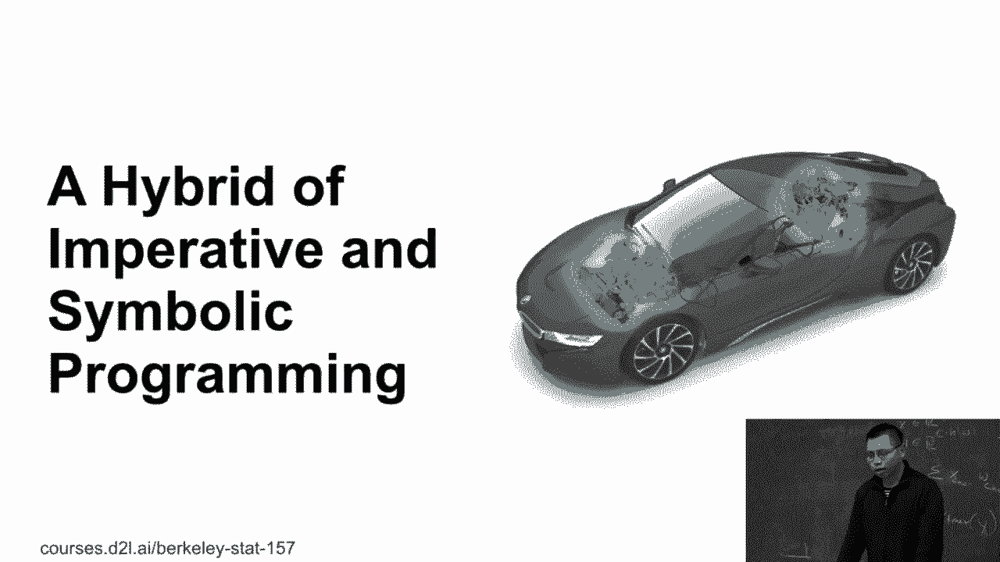

# 【AI 】伯克利深度学习Deep Learning UC Berkeley STAT-李沐 & Alex - P77：77. L14_2 Hybridization (Just in Time Compilation) - Python小能 - BV1CB4y1U7P6

 >> Yeah， let's continue。 I like to talk about a lot about network stuff。 If you did homework。

 you will find that the network getting， More complex and you're going to need more time to train。

 The networks。 So in this lecture， maybe， Awesome， this Thursday we're going to talk about how to make。

 Your program faster on your gpu's or using multiple gpu's。

 So that's unfortunately because the hardware is not so， Grow so fast。

 even that media manager to do two times， Speed up every year， but then the net will itself。

 maybe it， Goes to four times speed up， four times more complex every。

 Year and data set also increases。 So it makes us pretty。

 Harder to try our best to get the performance from the hardware。

 Maybe after ten years the net was getting too stabilized and， Harder was still being fast。

 then we don't need to manage， But all the things anymore。 So the first topic is how to。

 Do hybridize the training to mix up all the imperative and。

 Subbonding program。 We talked about the imperative， Programming before。

 so far we all used the imperative， Programming。 So that is the common way to do。

 The first step is to use the， Productizing in Java in c++。 So here example， just three lines。

 Of code on the right， we first assign values to a and b and， Then compute c equals to a plus b。

 So every time we execute every， Nine， we actually run the code here。 So it's pretty straightforward。

 It's easy to debug if everything goes strong and just print the， Byde， that's all。

 But if it did the homework before， you see， That this have some issues here。 Firstly。

 if you use a python， That's nothing called a python interpreter。 Every time you run a， Life code。

 the interpreter very first compile your code into a， Bight code。 Then this byte code we run on the。

 Virtual machine for the python。 So every time the compilation and。

 The run on the virtual machine have overhead。 So here we have three。

 Overheads because we issues three calls to the python virtual， Machines。

 And also because it has interpreter， you need to run the， Code in python。

 If the mobile phones don't have python， Or it's not。

 it's hard to run your python code in your mobile， Phones。 So the major issue for imperative。

 Program is that the performance and the portability。 On the other。

 Hand， we mentioned something called symbolic programming。 If we。

 Use tasafro or keros before it's actually using symbolic， Program。 In this program model。

 we first define the， Program and then we give data to ask good。 So in mass we do it， That way。

 We first define the equations and then feed the， Data to run。 If we use the sql before。

 we first define a， SQL synthesis and then feed the data table to get the results。

 So here we give the example。 We first write a string expression。

 About c equals a plus b and then we compile this expression to。

 Get executable objects and then we give data a and b with values， And then we divide it。

 So the problem here is that people don't， Like this way to program because they're pretty hard to use。

 And how to debug all this way。 How to print。 We're going to show。

 Re-examples later on how it's hard to debug all this code。 But the benefit here is the speed。

 Given because when you're， Going to compile this code， you know the whole program here。

 You can do a lot of optimizations because you know the， Whole program。 For example。

 if i know that a and b are going to， Use the after we finish the c。

 then we can just delete a and b to， Release the memory because gpm memory is so expensive。

 Similarly， if we have a very long program here and we actually， To compute c。

 but in fact we didn't use c in any place， then， We don't need to ask you to see a plus b。

 This is not the， Optimization we can do。 And the other thing is that because。

 We can have the program first and we compile one and run the， Code one。 So it has a single core。

 No matter how long the program you have， i only do a single。

 Combulation and run a single and call the function one。 In addition。

 if you're using the symbonic way， we probably can， Present the program using the not so python way。

 We can present by an intermediate presentation and then it's。

 Maybe not so related to python and we can run the code without， The python。

 Which means we may be running the， Code in c++。 So far we see two programming things。

 One is easy to use， one is faster and ems and actually we can， Get two things together。

 So far we see that how to define， Network by using dot sequential or un-dot block and using the。

 Hypotize model just using the hybrid sequential or un-dot hybrid， Block。

 Everything here is similar to before， Only saying that we define the network dot equals to un-dot。

 Hybrid sequential and adding two dense layers as normal as， Before。

 The only thing here that if we call net， Don't hybridize。

 we can switch from impality of execution mode to， The symbonic execution mode。 That's all。

 So let me give some concrete examples how to do the things。

