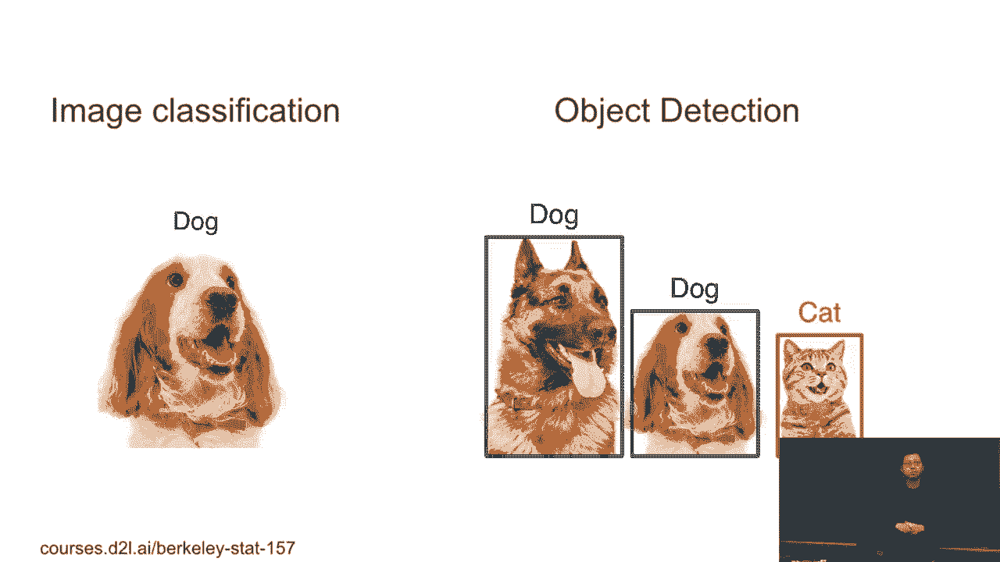
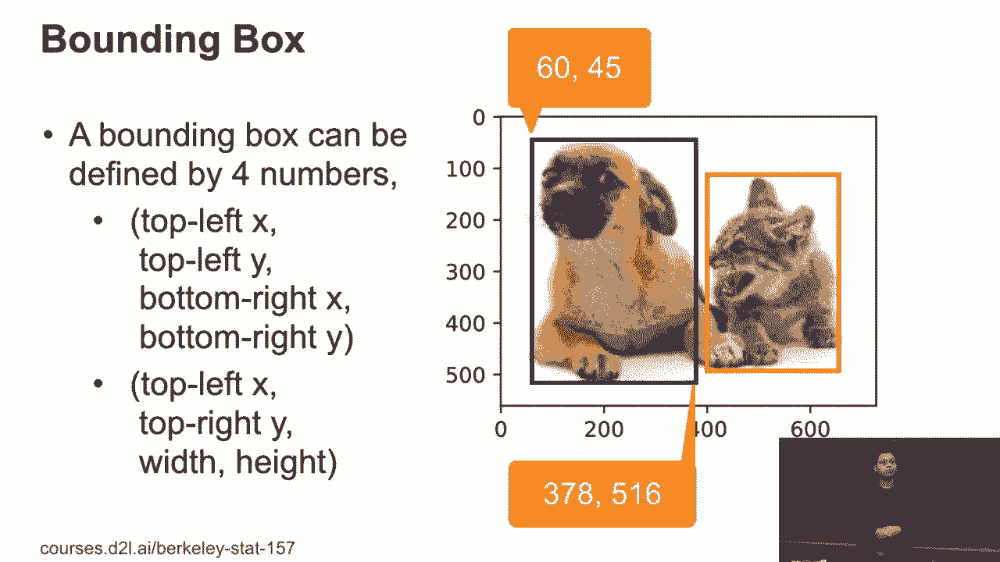
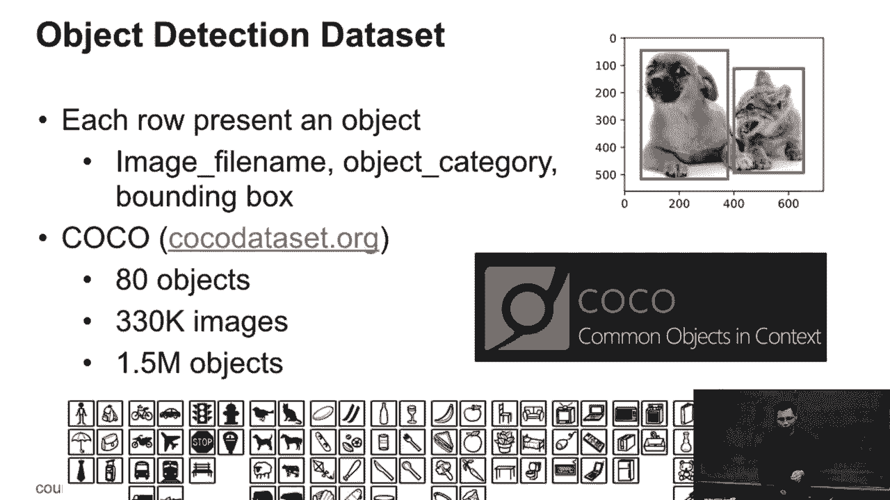
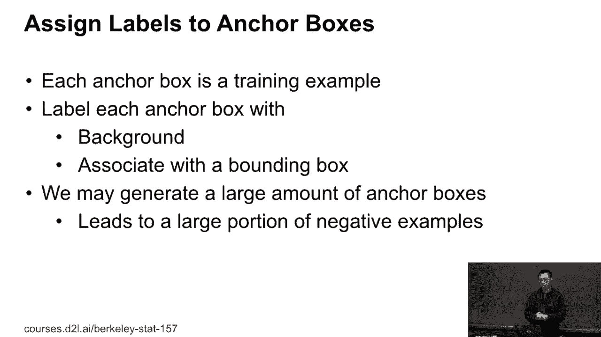
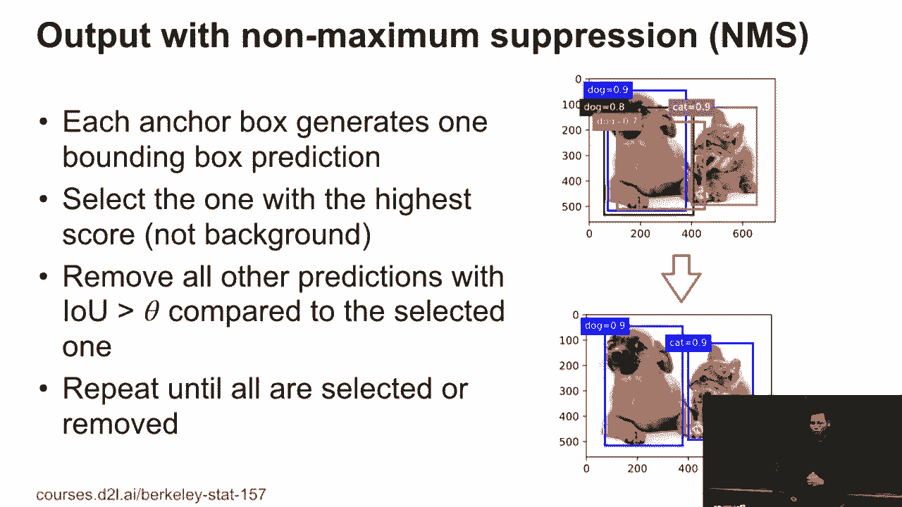

# 【AI 】伯克利深度学习Deep Learning UC Berkeley STAT-李沐 & Alex - P86：86. L16_1 Object Detection - Python小能 - BV1CB4y1U7P6

 So in image classification， we're trying to identify the main objects on the image。

 Usually we assume this image only contains a single object， a large one。 But for object textures。

 we're trying to grab all this interesting objects in a single image。 So here we have two dots。

 one has。 Besides we know what objects we have， we also want to know the location of these objects。

 So here we're using rectangle boxes here。 It's called a bounding box to define where the object is。

 So this is in reality， especially interested by a set of driving cars。

 We want to take a picture of the street and try to identify all the cars。 You see there's a person。

 the bicycle， and they identify two bicycles here。 There's a traffic light。

 So this is an interesting object we are interested in。 A car， humans， traffic light。

 And there's other objects we are not so interested in， especially for self-driving cars。

 So we only identify a few objects。 We can see that it's actually pretty hard。 First of all。

 the traffic light is not so easy to identify， even by human。 Also they find a car behind the truck。

 For human， it's also pretty hard to notice that。 So well。

 you can see that originally how to label the data set。 Let's think about the labeling。

 Now you see an image。 You know the object here。 But now you give a labeler or yourself。

 This is a kind of image you want to cross a lot of things in the image。 And pretty hard。

 especially the small cars， small things， traffic light。 So labeling the object text is pretty hard。

 So also make it really much harder。 The reality， well， you not give a state image。

 You just give a video。 If the car is driving on the street。

 you want to continue to identify all these objects， in damage。

 So which means we can't put a throughput。 Especially if you run the car。

 you don't want to have very powerful GPUs because you burn， your gas or burn your money actually。

 And it makes the car very hot。 You cannot make the car very hot。

 Then you need to have air conditioning in the heart。 Question。

 Is the GPU both in the street training？ Not in the audience？ Are you comfortable？

 Both training and inference are pretty efficient for GPUs。 Once the network is big enough。

 So if you put the GPU in the car， you have a temperature problem。

 If you want to reduce the temperature， you need air condition to eat your more gas。

 But if you don't care about temperature， the GPU will burn out and the driver is driving。

 at the middle of the road。 It's just burned out and not able to have。

 So which means object detection is much harder。 You need care about the inference speed very much。

 Okay。 Let's start with the basic concepts。 The boxes， the bounding box and the anchor boxes。

 So this is a new concept we have from image classification。

 So a bounding box you can define by a rectangle。 You can， well。

 the reason why you have such a thing， I don't know， you can have a cycle， as well， even simpler。

 But here， a bounding box can be defined by four numbers。 So one， for example。

 you can do by top left x， top left y， bottom right x， bottom right， y。 So for example。

 in this image， the origin is on the top left。 So zero， zero is on the top left。

 You can see that we can define this bound box by 60。

 The x axis is 60 and the y is 45 and also the right bottom ones。 Okay。 On the other hand。

 you can also define by top left x， top right y， the width of the bounding。

 box and the height of the bounding box as well。 But in any case， it's just the four numbers。

 Okay。 So then what object detection does that looks like is that now each row， the bottom。

 is not just the image and the objects you have。 It's now each row identifying an object in the image。

 So for example， you can specify the image file name and the object class you have and。

 the bound box is the four numbers of the objects。 So which means if you have few images。

 you may have 10 times more objects you have and， each object is the training examples you have。

 So for example， the largest care public dataset is called a coco。 Three years ago， if such coco。

 you get the first result is the dataset and nowadays you， got the movie。 So I do have， well。

 students asking to， okay， train on neto in coco and then hit down on， the movie and how I can start。

 Well， so the coco dataset have 80 objects。 And so this is pretty daily life objects。

 That's more useful comparing to image net contains a lot of animals you've never saw， that before。

 Also， there's less images。 It's only currently only have 3，300，000 images。

 It's a less comparing image net。 But in average， we have four objects in the image。

 So we have about 1。5 million objects in this dataset。 Usually one million is a good number。

 One million size dataset usually can deal reasonable deep learning models。

 If the two largest 10 million， the four images have 10 million images。 It's kind of hard to train。

 If it's just 100，000 images or examples， well， it's pretty too small you need to find tuning。

 So what many images is good and give a single GP machine take a few hours to a few days。

 That's manageable。

 Okay。 Then the other concept is called anchor box。 Well， the name is pretty random。 But you can。

 the idea here is that how in all of the detection algorithm works here， different。

 to the classification we want to predict the body box。 What do you do here？

 The algorithm usually first propose multiple regions。 Each region we call the anchor box。

 For example， this we have a picture here。 We show four anchor boxes centered at a single pixel。

 And each anchor boxes have a different size and a different width and height ratio。

 So the anchor is going to propose multiple anchor boxes。 And then for each anchor box。

 we're going to predict if this anchor box contains objects， or not， or just a background。

 If we predict the contents objects， then we're going to predict how to map this anchor box。

 to the real， the labeled， the real actually bonding box。 So this is one choose。 So we only。

 because as four numbers， we just predict the offset， which is another four。

 number to transfer this anchor box to a bonding box。

 So different detection algorithms have different way to propose all these anchor boxes and。

 give an anchor box how to predict the labels， how to predict the class， how to predict object。

 classes， how to predict offset。 But in general， they are pretty works as this way。 Any question？

 Depends on algorithms。 For example， we're going to talk about SSDs。 For each image。

 it's proposed 10，000 anchor boxes。 For different algorithms， usually。

 we're going to talk about the first RCM family。 It's also proposed to thousands of anchor boxes。

 but do a refinement to reduce to maybe， hundreds。 And even though a fast algorithm is trying to reduce the number of anchors。

 you see that， the more you propose， the coverage may maybe get because the more you propose。

 the likely， you can cover all these objects。 But the more you have。

 the more expensive competition that you have。 So this is a trade-off question。

 We don't have the true label for each box， but we have the label。

 So here， the other things are boxes。 But by bounding box， we mean the ground truth。

 which is labeled by human。

 And the anchor box is just proposed by algorithms。

 So then we're going to talk about how to map anchor box into the ground truth。 How to join that？

 Another question？ What is the anchor box that would happen？ Okay。 So given the anchor box。

 you have four numbers to present anchor box。 These four numbers。

 A bounding box is another four number。 So you want to predict how to change this four number to another four number。

 We just offset this number。 This anchor box plus offset equals to the bounding box。

 Or the bounding box for numbers minus the anchor box you get offset。

 >> Is there something to make it too unaggression？ >> Yes。 Because it's a real number， it's weird。

 we are doing regression at the end。 Okay。 Any questions？ Is the concept a change？

 Like the setup or the things。 Okay。 Then， where all this difficulty is on the boxes。

 we cannot dive more for the boxes。

 Firstly， how to measure the similarity between two boxes？ Well， in classification。

 we know either it's true or false。 But for boxes， we usually do this IOU。

 it's called intersection over union。 But the idea here。

 we compute the intersection between two bound boxes and divide it by the。

 union of these two bound boxes。 So this is， we get the number between zero and one。

 Zero means the two bound boxes not overlap any one and one zero or one means die then equal。

 to each other。 So the closer to one， the more similar you have for these two boxes。

 So the IOU is called on， well， we are the lamb by the object detection community。

 It's actually a special case of the JACART index。 So given two sets， A and B。

 the index can be computed by the set size of the intersection。

 between set A and B and the size of the union of the set A and B。

 So if we think about the bound boxes just a set of pixels and each pixel element on， the set。

 you can think of just a easy application here。

 The other thing that， yes， during training， the algorithm proposed a bunch of anchor boxes。

 and then you need to get labels for this anchor box。

 So we in the map all this labeled bound boxes to the anchor boxes。

 So during training each anchor box is a training example and we need to associate the object。

 with the anchor box either as a background。 So in bound boxes we don't have a background。

 But the anchor box because we made random purpose， so maybe we have nothing there。

 So it's just a special class that's called a background。

 And all associated with the bound box and associated with the objects。

 So then we can now talk about how to associate with the bound box but you can see that we。

 may generate a larger number of anchor boxes。 And only a few of them contains the objects we have。

 A larger amount of objects are just the backgrounds。 And how to， so this is unbalanced。

 the classification problem， how to make it trainable is pretty， hard。

 Okay， so here let's see a typical way how to match anchor boxes to a bound box。

 So each row presents the anchor box and each column is a bound box。 So here we have。

 we label the four bound boxes but we have nine anchor boxes。

 Usually anchor boxes are larger than the， we have more anchor boxes than the bound boxes。

 So each element here is a， IOU score of the anchor box to the bound box。 Okay？

 Then what do we first do here？ We find the largest score。

 For example here is the largest score is the anchor two with the bound box three。

 So then we assign bound box three to anchor two， which means that this anchor box two。

 we have the objects contains on the， on the bound box and offset how the particular offset。

 is just the difference between these two boxes。 After we do that。

 we remove bound box three and anchor two in the set。 So we just mark it as white。

 So next time we cannot consider all these IOU values。

 Next we're gonna pick up the largest one in all these blue cells。 Which is the anchor。

 anchor seven mapped to bound box one。 This is the largest IOU we can have。

 Then we assign bound box one to anchor seven。 Okay？ Then we remove both one。

 three for the bound boxes from the set and also like two and seven， for the anchor boxes。

 And to repeat that again to get a map bound box four to anchor box five。

 We just repeat until no bound box left。 And the rest of the anchor boxes we just label as back one。

 So we finish the labeling。 Okay， question here？ Question。

 >> How do you know if you bound in boxes two years？ >> Well you don't know。

 It depends how they are labeled。 So for example， you mean how many use we gonna use all of them？

 We gonna match all the bound box to the anchor boxes。

 If you cannot map then the bound box you propose to probably not a good idea。

 But the bound boxes varies。 Like maybe one majority can test two or maybe some large。

 If you serve a drawing card they're labeling 4K images。

 Like 4K videos they have maybe 10 to maybe 50 objects in the images。 Okay。

 Then the other things like now in the prediction each anchor box we gonna generate one bound。

 box prediction。 So which means and also the offset。

 Which means we maybe get a lot of very similar bound boxes。

 Here for example in this dock we generate this each boxes actually the anchor box with offset。

 Which is very close to the rear box。 But well we have three predictions at the lumbots here which means the probability。

 At the probability the algorithm think is a contest a dock。

 So we want to reduce all these duplications here。 A typical one is called an MS like a law maximum suppression。

 This is another time for technical time for detection set。 It's actually a simple algorithm。

 What we do is very similar to the one we had before。 So what do we do here？

 Given a set of predictions we pick up the one with the largest probability score。

 Which means I'm most of for sure it is a dog or it is a cat depends。

 So for example we're gonna pick up the blue one of dog equal to 0。9。

 And then we're gonna remove all these other predictions with the IOU。

 Log it on a threshold compared to the one I picked。 For example if I pick the theta equal to 0。

5 you should I can remove all this， the other two dog predictions here。

 I'll remove all of them and then select the largest one in the remaining。

 And then remove the duplication。 And then we repeat and here either we select or。

 remove all these predictions。 So at the end you can see that we're gonna have two bonnet boxes here。

 Okay， questions？ Questions？ >> [INAUDIBLE]， >> You mean what 0。9 means？ >> What is it？ >> Oh。

 you mean for this particular example？ >> Yeah。 >> I can show you in a few。

 I don't remember but I can show you this is actually from， the source code。 I probably 0。

5 I think here。

 Okay， so。

