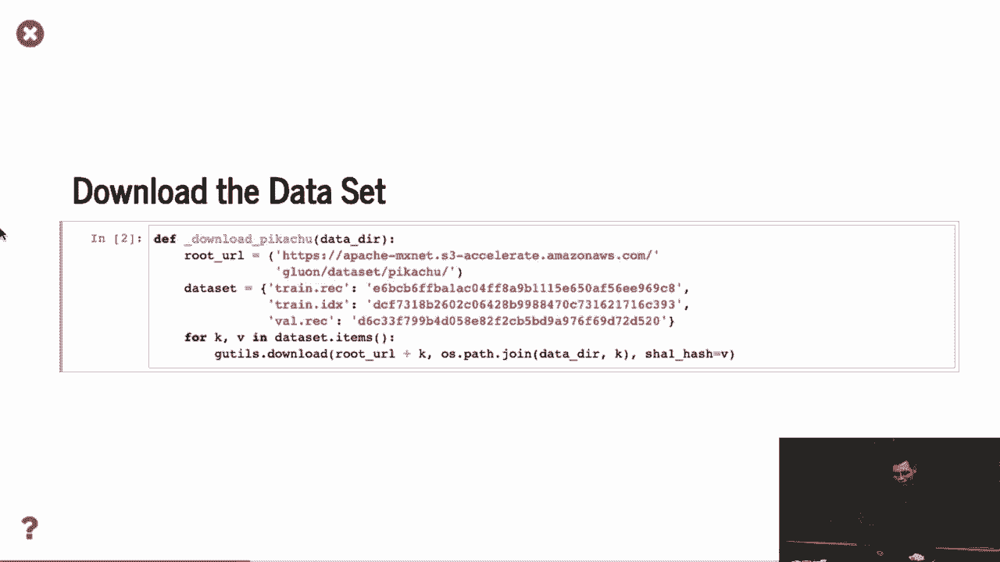
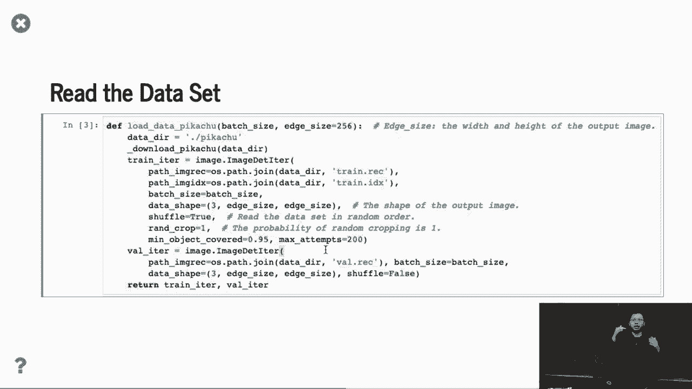

# 【AI 】伯克利深度学习Deep Learning UC Berkeley STAT-李沐 & Alex - P88：88. L16_3 Object Detection Dataset - Python小能 - BV1CB4y1U7P6

 Okay， so different to image classification， there's unfortunately no small-scale object detection。

 dataset， so which means you cannot get a C file， to try on during the class。

 So what do we do here？ We just show you how to make a synthetic dataset， for object detection。

 So we actually downloaded dataset from web。

 So the thing here， we use a different data iterator。

 which will be different to the image classification， iterator we have。

 The user dataset is a record of fire， which will put all these images in。

 just cut all the images into single binary。 Usually make the training must， and reading much faster。

 You don't need to read those small files。 You read a lot chunk of data。

 So then we tell them the data shape， to random shuffling， to random crop， and well， the thing。

 here's the different thing。 You do random crop， yes， but you maybe crop with something just to have。

 only have background。 So here it shows that， I just。

 I want to random crop at least the contents objects， cover the 90， cover the raw objects。

 and with 95 area of the objects。 If I don't have， I just throw it away， and repeat it by 200 times。

 So this is a little bit different to how to， random crop the image classification。

 The image classification， I assume， don't purchase it so big。 You always can't crop， get part of it。

 Then， where I'm gonna basically note dataset， I'm gonna skip。 So what you can see here。

 it's a batch， the data zero shape with the image。 Batch size equal to 32。 So this RBG channel。

 this is within height。 Okay， so here， this is a batch size。

 So this is number of objects in the image。 So here， we pretty simple， each image only contains。

 single objects， but it contains 10 objects。 So this will be 10。

 Then the first one is the classification ID。 The last of four is just the bony box。

 So comparing to image， if you just image classification， you don't have such a thing。 You only。

 you don't use like 32 by one labeling。 But for object detection， so you have。

 so this is the maximum objects per images， and this is always five。 Okay？

 And the show， what it looks like， well， it's pretty， what we did is that。

 we download the 3D picacho model， and render rotated， and the grabbed bunch of images。

 and nature images， and put the picacho there。 Because we know the bony box。

 we know where we put the picacho， we always know the bony box。

 So that is pretty easy data set we can get。 So that's why we call it a set。

 You see that it's pretty， well， the easy way just to check the RGB histogram。

 you can just do object detection。 You don't do fancy things， because we know， this is pretty yellow。

 and we do lots of image patch， and the computer histogram。 But we just use this one to show。

 how to try and object detection。 Well， yes， we can do more fancy things， so you can use again。

 actually， the agenda images more close to a real ones。 Okay？ [BLANK_AUDIO]。

