# 【AI 】伯克利深度学习Deep Learning UC Berkeley STAT-李沐 & Alex - P92：92. L16_7 SSD in Python - Python小能 - BV1CB4y1U7P6

 So we will dive deeper into how to implement SSD。 So， you know it's very similar。 But fast-d。

 to do category prediction。 So here， assume we have a number of anchors given a feature map。

 We have given input this number of anchor boxes。 And then give the number of classes。

 So for each anchor box， we will predict number of class plus， one category。

 The plus one means a background。 This means don't belong to any class。

 So what do we do here with your convolutional kernel？ The output channel。

 we have a number of anchors， times the number of class plus one。 OK。

 so this is because for each anchor box， we will generate--。

 we need to generate number of classes plus one prediction。 It's a class prediction。

 And then why we choose convolutional 2Ds？ Because we choose kernel size equal to 3。

 Paddy equals to 1。 Then we know that the output shape will be the same as the input， shape。

 Which means every pixel in the feature map， we can have a coding pixel in the output。 In additional。

 for each output， we， have number of anchors times number of class plus one channels。 So each output。

 we predict the anchor boxes， centered the ad that's pixel。

 Because we have a number of anchor boxes and so many， classes， we need so many channels。

 That's very little bit different to what we have before。

 Before we only need to predict the whole image。 So the output channel， what we did like net in net。

 is that we do average pooling， so make into a single feature， map。

 And the number of channels equals the number of class。 But here， we don't do average pooling。

 because we need to predict for every pixel。 OK， any questions here？ OK。

 so that's the concept of change。 How you to predict so many different kinds of outputs。

 Similar thing， for bond-- OK， let's do a sanity check。 So we have a function called forward。

 Given input x， given network， we first initialize it。 And given x， I just return the output。

 So if the input is like 2 by 8 by 20 by 20， to the batch size， 8 is the number of channels。

 the input channel。 20 by 20 is the feature map with a height。

 And if I'm going to predict number of five anchor boxes， and 10 classes， then the output should。

 be the batch size we don't change。 And this is the feature map height， feature map with。

 we don't change。 We only change the output channel。

 So 55 equals to number of anchors times 10 plus 1。 OK， so all these things are predictions。

 Given each example， we can generate so many predictions， here。 Any questions？ Good。 Similar thing。

 for the other thing， we can generate like no matter what， the input channel we have。

 then we always generate， to 3 times 11 is 33 and 10 by 10。 This is the input feature map。

 Another thing is that we want to concat all the prediction。

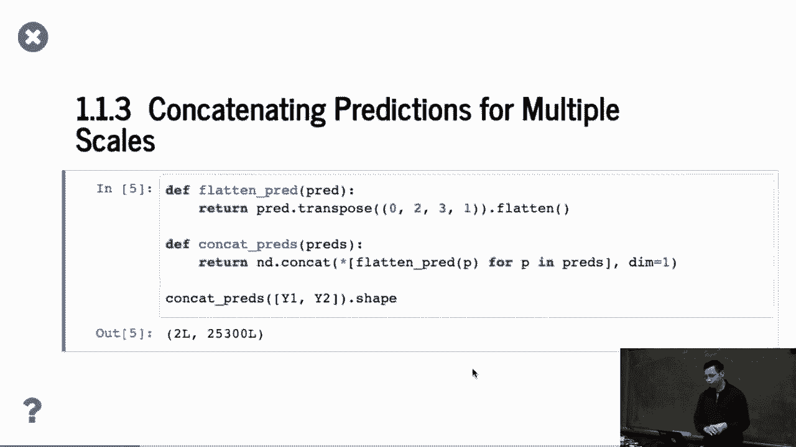

 for multi-scale， because we output for each scale。 Every scale have different feature map。

 We want to concat them together and fit into a loss function。 So what we do here， we transpose。

 the number of output channels into a loss， the channel or into a loss the shape dimension。

 And then this is the height， this is the width。 And then we flatten。

 which means we transpose into 2D matrix。 And then we concat for different scale。

 we're going to concat them on the first dimension， which， is not the batch size dimension。

 So the goal here， the y1， we can think。

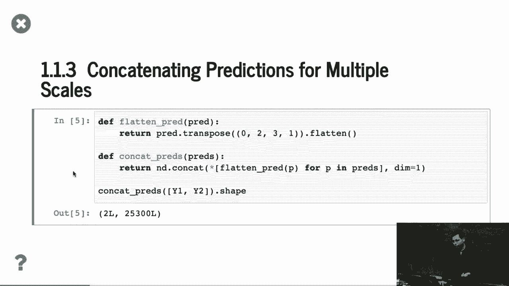

 if you assume y1， this is the first scale， y2， we have of the width and the height。

 And we want to concat together。 That is， we make into a matrix and put the number of channels。

 which is the channel。 It's the kind of the number of classes。

 we have into a loss the channel and do flat in the 2D matrix。

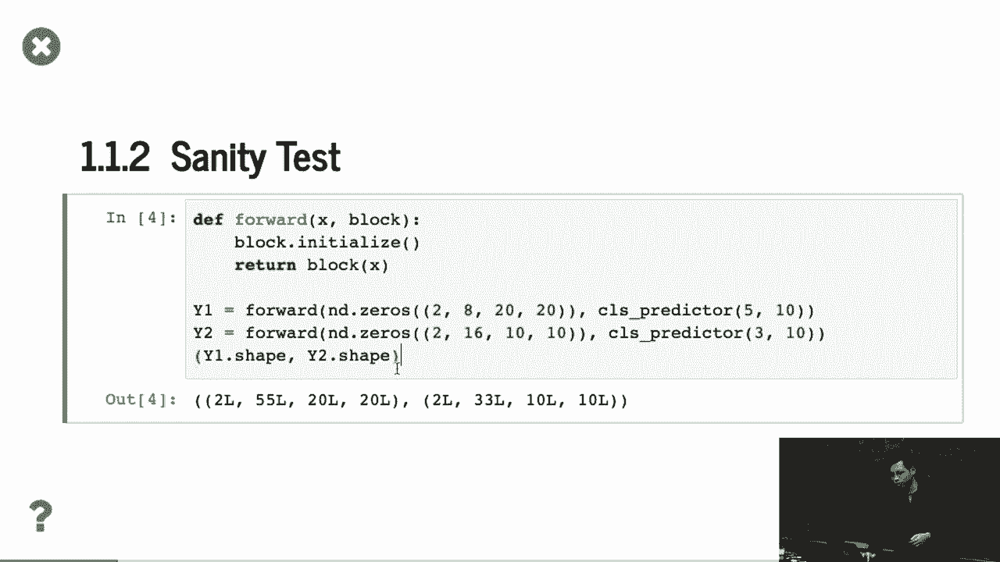

 And then you give a 2D matrix。 Pretty the number of columns is pretty high。 OK。

 that's the way how we can put the output， for different scale together。 Similarly。

 how do the bound box prediction？

 We know that the bound box just the four numbers。 So we only need to know the number of anchors。

 And then the output channel will be for each anchor box， we can predict four values。

 This is the anchor box。 We can define the anchor box。 And then similarly。

 we have kimos as equal to 3， paddy equal to 1， so that we can understand output， as the input。 OK。

 so now we know how to do prediction errors。

 And the other one we mentioned that we have done sample， box that is half the height and width。

 So it's pretty easy here， whether you can see that。

 Assume this is the number of the channels of the input。 What do we do here？ We add in two blocks。

 The first one is conv2D， kernel equals 2。3， paddy equals 2。1。 Basically， we don't change with-- oh。

 sorry。 The number of channels is output channel。 It's not the input channel。

 We don't care about the input channel。 So firstly， we use a conv2D map to output channels。

 We didn't change the height and width here。 And adding as normal as we have a rest in it。

 before we add in a batch on here。 And after batch on， we do a rel。

 This is the typical block we have in rest net。 Then we add in two such blocks to get。

 how to do feature instructions。 And then last， we do max pooling。 So strad equals 2。

 then which means， we can reduce the height and width by half。 So this is a done sample block。

 So given-- for example， given an input， we have 20 by 20 and fit into done sample block。

 And output channel is 10。 There we get-- we don't change the number batch size。 Two。

 we change the shape。 We change the channels to 10。 And then， most importantly。

 we reduce 20 by 2 to 10。 OK， this is done sample block。 OK， the last one， we need a base net walk。

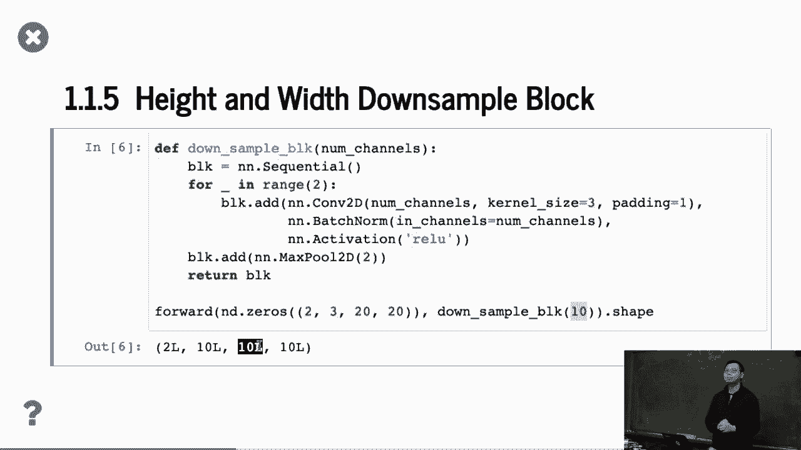

 Usually， we pick up rest net or any one we've known before。 And also， we can-- for fine tuning。

 we can use a pre-trained network。 But here， just because we're going to use a very simple data， set。

 what we do here， we just concat， bunch of done sample block together。

 We first use a done sample block to 16 number of channels。

 And then reduce the height and width and double the number， of output channels。 And double again。

 the base three done sample channels， as the base net walk。 OK， that's the full tiny case。

 So given-- if given the input size， two batch， RGB three， channels， 256 to 256。 So this one。

 just to reduce the height and width by 4， by 8。 And also change the number of channels to 64。

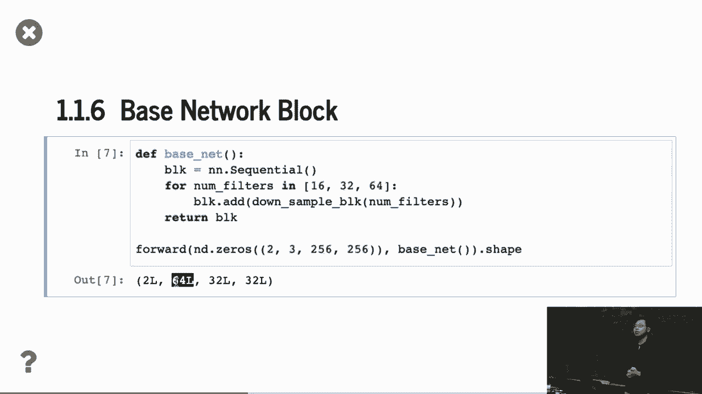

 So that's the base net walk we have。 So basically， we have implemented the base network。

 the done sample blocks block， and also the prediction， for category and the classes already。

 So now we are ready， kind of， to get a block。

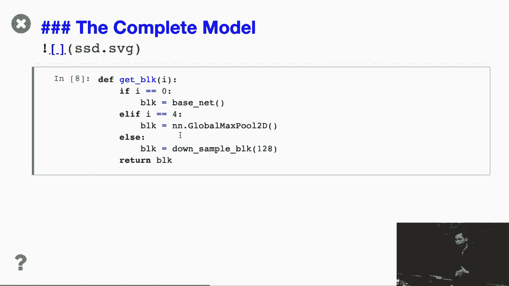

 Given the block， we have five blocks here。 Stear goes to here block one base network。

 And in the middle three is the done sample block。

 The last one we actually just did--， sorry。 The first one is the base network。

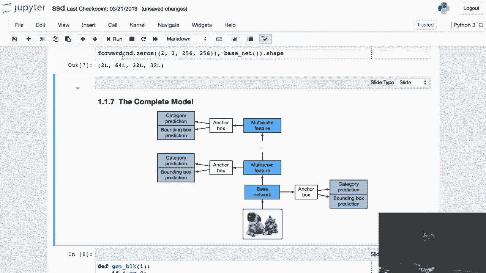

 And for one， two， three， we use a done sample block。 The last one， we just do a globe max pooling。

 to reduce the shape that features into one by one， no matter how large you have。 OK。

 So this is-- so the net we have five stage。 So here's another thing。

 Given a block， how to run a forward function？ So this is a little bit different to what。

 we have for classification before。 So assume the block is the model。

 And then we have how to choose the size， which， means different size for the anchor， box。

 which is a list。 The ratio-- the list of ratios we， going to choose for the anchor box。

 And a class predictor， the bond box predictor。 So first we do here。

 we fit into the input into a block， to get a feature map， which is why。

 And then we know that we showed this function before， like given a different shape， different size。

 given， the ratio， going to return a bunch of anchors。 So for this block， given that input shape。

 given the list of size， the list of ratios， we will have the anchors for this block。

 the output of this block。 So then we fit the output of y into the class prediction。

 and the fit of y into the bond box prediction。 Then the output， we have four things。

 So here's the feature map， y， which， is going to be the input for the next block。

 And the anchors for this feature map， also the class。

 prediction and the bond box prediction for each pixel， we have。 OK， so we have four output。

 And the previous classification， we only have a single one。

 But because now it's a little bit complicated， we have four here。 Let's do a sanity check here。

 We've given different size because we have five stage。 This star put off the base network。

 And this is kind of the three down sample network。 And this is for the last average pulling。

 And we choose different size。 Well， it's pretty random number。 You can see we start with 20% of--。

 well， it's pretty random。 So we start with 20%。 The anchor box will be 20% of the original feature image。

 We cover 20% of the area。 And the next level we change to 0。37。 Well。

 we basically just like what we do here。 OK， what do we do here？ We pick up the last one。

 The last layer， we cover a large object， cover 80% of the original input。

 And then we linearly find this 0。37， 0。94。 Like 0。37 minus 0。2 equals to 0。17。 Similarly。

 this is equal to 0。17 equals 0。054。 And basically， the linear scale between the first 0。2。

 and the last 0。88。 OK， so how about the second shape？

 The second shape actually is the square root of 0。2 times， 0。37。 It's kind of in the middle。

 Similarly， this is kind of the square root of this guy times， this guy。 Kind of see between。

 So for the ratios， first we use a square ratio。 Then we choose two。

 which is one side is two times larger， than the other side。 And we choose another one， 0。5。

 And for each scale， we just choose the same ratio。 So the idea here， for the bottom layers。

 we use a kind of small anchor box， trying to catch up small boxes。 For the last one。

 we use the larger ones here。 So then for each scale， the number of anchors。

 will be this is 2 and plus 3 minus 1， which is 4。 For each pixel。

 we're going to generate the four anchor boxes。 OK， any question here？ OK。

 Then we have the whole model。

 We call it tiny SSD because it's not actually SSD。 Because the best in those pretty small。

 So it can leave it complicated， not too much。 The thing here， due to initialization。

 we have the number of classes。 And then we have five blocks。

 We use the Python set attribute because we， won't have a self block underscore 0 means get the first block。

 kinds of。 And so this is kind of the way we don't want， to have a list of this only thing。

 For each block， we get the base block network， get a， predictor， get a bound box， cross predictor。

 bound box， predictor。 So we have five stage。 We have actually 15 kinds of different blocks。

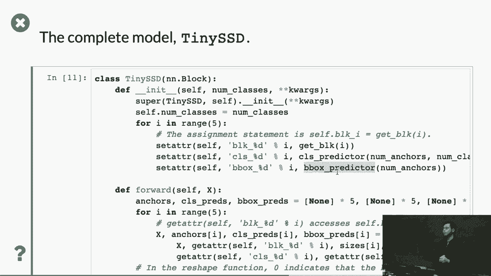

 Then in the fourth function， so firstly， we have each block。

 each level， we cannot give you anchors， class prediction， bound box prediction。

 Then what do we do here？ For each stage， we feed x input and get the blocks。 Get the block。

 Get the sizes。 Get the ratios。 Get the class predictor。 Get the bound box predictor。

 Fading to the blocks forward function we defined before。 And we get x anchors， class prediction。

 and the bound box。

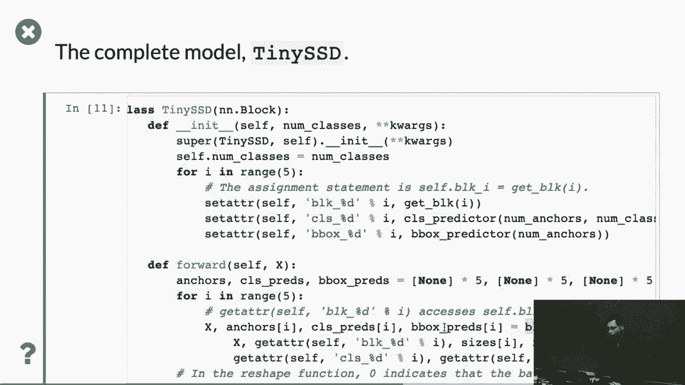

 prediction。 At the end-- well， let me--， At the end， we do here。

 We just concat all these output for each layer together。 So at the end， we concat all the things。

 We concat the anchors。 We concat the cross predictions， also the bound box predictions。 So here。

 the reshape means for cross prediction， we want to have all kinds of--。

 this is number of class plus one， this class prediction。 And we don't care about this one too much。

 because we can run softmax level。 And for bound box， we don't change anything here。 So the tiny SSD。

 given input， we， give you all these anchor boxes we。

 have at the cross prediction and the bound box prediction。 Three things。 OK。

 the libia sanity check is libia complicated here。

 Sorry。 [INAUDIBLE]。

 So I create network。 The number of classes equal to one。

 We need to show that a fit into the network is batch size， equal to 32。 RGB channels 3。

 and the input is 256， twice 256。 So then given to x， we have number of anchors。

 and number of class predictions， bound box predictions。

 So we know the base network going to divide the width and height， by 8， so we get 32。

 And then we fit into another down sample block， another one， another one。 And finally。

 we get average pooling。 So this is the feature map size for each scale。

 And we have four anchors for each pixel， because we choose two sizes and three ratios。

 We get four anchors。 So in total， we have 4，444 anchors。

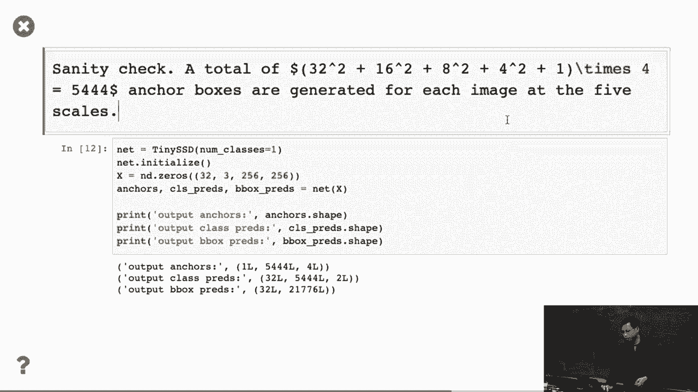

 and in total， we can generate。 So then you can see that the output shape， the number of anchors。

 because the anchors are shared across all these batches。 So no matter the batch size we have。

 it's always one。 And this number of anchors we have， each anchor box， can pretend by four numbers。

 So this is four here。 The number of classes， the batch size， and the number of anchors。

 And these two， because we have single class， but plus a background， class， we have two classes here。

 Similarly， the bound box prediction， we just concaten， to 2D shape， because of the concaten。

 So which means it's a 4，000 number， times 4。 It gives this little larger number here。

 So you know the shape of this one。 Also， you can see that even through the tiny SSD。

 we generate a lot of anchor boxes here。 It costs a lot of computation overhead。

 So now that we have the whole network defined。

 And next one is like the data reading we already--， in the last lecture， we already talked about--。

 we have the tiny Picacho dataset。 Given image， we put the 3D Picachos all over around。

 and to get the since that data set。 So here， we noted the Picacho dataset。

 We choose the batch size equal to 32， and we need to try to use GPUs and tiny disk model we have。

 We initialize it with x over here。 And we choose a non-linearity equal to 0。2。

 And the weight decay is like a small weight decay。 OK。 So this is set up。

 So the other thing is the loss function。 Well， we have two kinds of loss here。

 The first is softmax cross entropy loss。 This is for cost prediction。 So that's no more we have。

 The other one， the bounding box， we use L1 loss， which is the predicted bounding box minus the brown choose。

 and they use the L1 norm。 The reason we don't want to use L2 is because we really， bad predictions。

 very far away from the bounding box， that we don't want to penalize that too much。 So here。

 then the loss function we have a lot of things here。 This is a cost prediction to the cost label。

 So the loss function-- so we just， fit the cost prediction。 The loss-- cost labels into the loss。

 into the cost loss here。 The softmax loss。 The other thing is like the bounding box predictions。

 the bounding box labels。 And here's a mask。 We talked about mask before。 If the anchor box。

 we didn't find a ground choose bound， box associated with this one， we can mask as 0。

 So if for each this anchor box， we find bound box associated， with this one。

 we just mask it equal to 1。 So here， the loss function， we only。

 want to penalize the anchor box predictions actually， mapped to a bounding box here。

 So if we didn't find any associated， which may be a background， then we。

 don't want to penalize the prediction here。 But we still need to penalize the loss。

 because we have a background category here。 So here， we first get the prediction。

 times the mask to get all these anchors we have the bound。

 box and also the labels tends the mask and do the L1 loss。 So this is the prediction loss。

 We return and just for simplicity， we just plus the prediction loss at the cost prediction loss。

 plus the bound box prediction loss。 In normal， you maybe have a weight here。 You maybe-- here。

 we just for simplicity， we just adding equally。 OK。 So this is the evaluation matrix。 So class 1。

 class is easy。 We just equal to the number of labels we have。 This is the long accuracy we have。

 For the bound box we have here， this is the label we have。 This is the prediction。 We just minus it。

 I test the mask。 We only care about the bound box。 The anchors have objects。

 And just the absolute value and sum together as scalar。 This is basically the L1 loss we have。

 So we call it the bound box matrix here。 Then we have all of the things。

 This is the last one is the training script。 A little bit long， but pretty similar to each other。

 So we initialize something like the accuracy， the--， well， the minimum-- the bound box， the sum。

 the bound box， arrow， and the iterator we're going to reset here。

 So we have the iterative we have x and the y。 And the only thing， the only difference here。

 So given network， we can just reoutput as the normal as， before。 And then given the anchors we have。

 and given the labels y， we're going to do the target。 We're going to map the anchors to bound boxes。

 We talk about in the last lecture about that。 So then we're going to retense you the bound box labels。

 the mask we have， and those are the labels that we have。 Then once the match is done， we'll。

 feed all the things to calculate the loss。 And so this is a fold function。 So in the fold function。

 given x， you generate the anchors， cast predictors， bound box predictors， anchors map into。

 the bound box， generate the labels， and then lastly， compute the loss。 So that's all。

 So that's why we call a single shot。 We get everything together。 In the master's here。

 you first predict the anchor boxes， and then do the prediction here。 For here。

 we just generate at the same time， it's causing a， short。 Then we do the--， have a loss。

 We do computer gradients。 And evaluate the accuracy， evaluate the bound box， then。

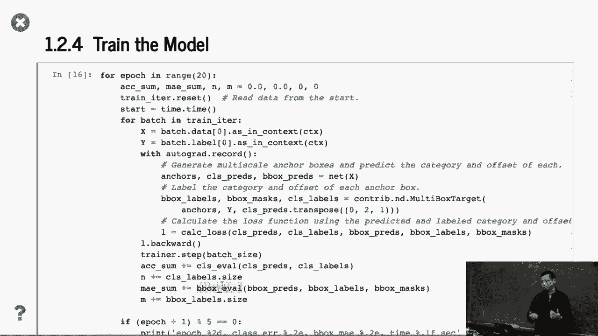

 almost everything's similar。 And the printed results。

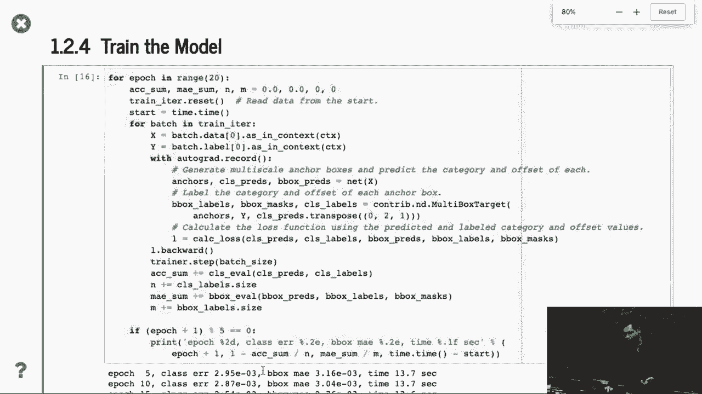

 So let's see。 So the running here is to be a bit slow。

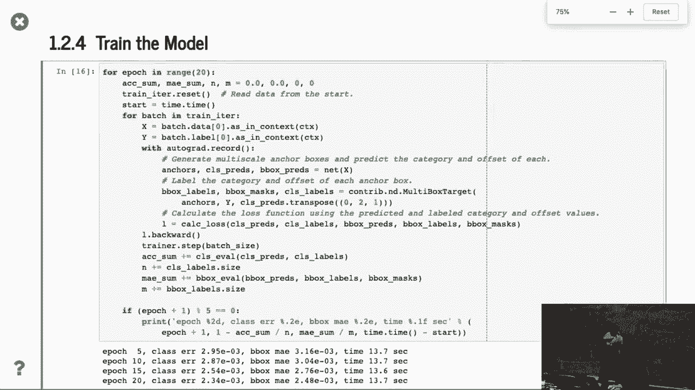

 I can just show the training log we have。 Pretty small。

 Let's do--， let me--。

 you can see the log here。 Well， we only have two classes， and that's pretty easy。 And the bound box。

 you can see that decreases a little bit。 Because there's a tiny application here that's pretty。

 easy to train。 But again， still， every five people， even tiny classes， take like 20。

 30 seconds to run on a GPU。 So in general， object detect is much more complex than。

 image classification。 The last thing， once we train the network， we want to do。

 predictions。 So predictions， given the input x， still we fit into the， network。

 We have the anchor boxes we have， class prediction， run the box prediction。

 And we run a softmax on the class predictions to get all， these classes we have。

 The other thing we mentioned that we want to run--， we have a lot of overlap。

 anchor box predictions， we just， want to remove the duplications。 It's called NMS。 So then lastly。

 if it's just a minus one， which means we， think it's a duplicate， we just removed them。

 And this returns out the last one we have。 They're pretty straightforward。

 So then we read image here and do a resize because the， input is like 200 by 5th， 6， 200 by 5th。

 6th as converted， floating and transport to put the RGB channel in the last， layer。

 We'll put the RGB channel into the first dimension and。

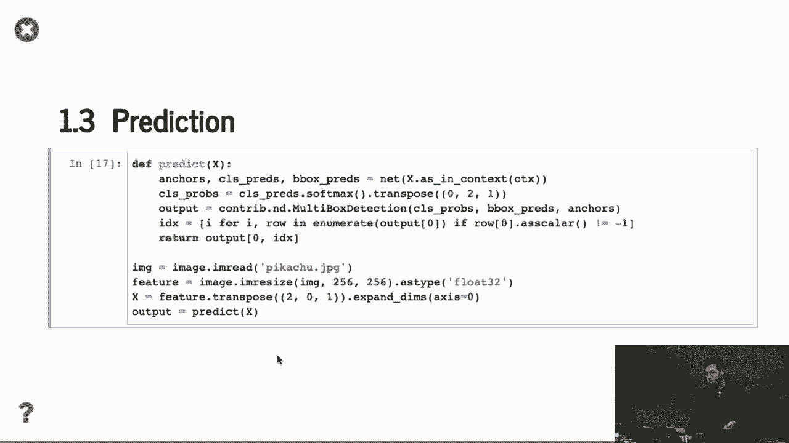

 then prediction here。 And finally， we can show that， OK， display that。

 We also talked about that before。 Given the stretch holding， which is if the stretch。

 holding means the confident value is larger than the， stretch hold icon print。

 if the confidence score is too small， I can ignore to print that out。 So what we do here。

 every time we get a score， if the， score is larger， smaller than the stretch hold， it can， continue。

 Otherwise， you can print the bundle box here。

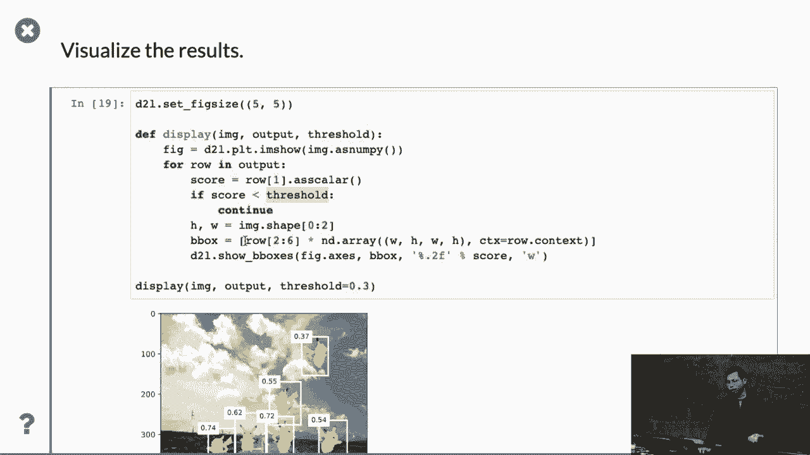

 So here finally， you can see that， well， OK， so finally。

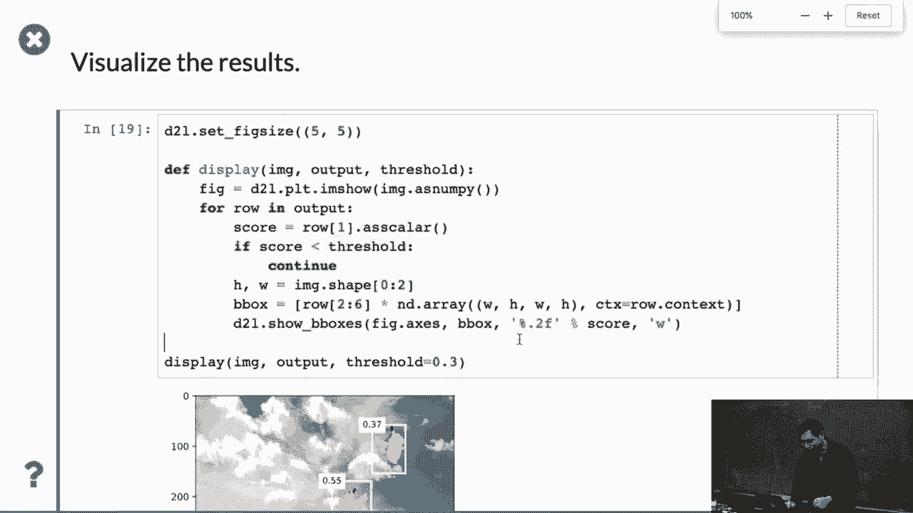

 you can see that， given a synthetic image， you can， bunch of picaches around， you can see that。

 well， at least， you get all this bundle box right。 So the wide ones predicted。 Usually。

 you can change the stretch holding。 If you load the stretch holding， you get more bundle， boxes。

 you get a high stretch holding， you get a small， bundle boxes。

 So you can see that it's not so confident 0。3， second， 3， 7， and 0， 5， 4。 In the normal way。

 we pick up with just 0。5， 0。5。 This normal way， choose the stretch holding。

 So that's kind of all for the object detection。 And be a bit more complicated than the image。

 classification， because every time you run forward， you， get a multiple output。 And also。

 the output， you want to do a lot of， cleaning up to show the results。 Any questions so far？

 Question？ Just a very general question。 Why do we call it with different numbers for the。

 found boxes？ Like， are these-- do you want to get， a percentage of the confidence in the， detection。

 and then so why do we like， there's a y？ So remember， we have two output。

 Once the bundle box is offset， which is the location， the， other one is the class prediction。

 So here， even though we want to have a single class。

 because here we have another class called a background。

 So this call means I predict this bundle box。 I first predict this bundle box。

 And then I think you have 37% probability you， content the big cultural。

 And 63% just this background。 So this is a confidence score。 This box contains these objects。

 So this is why we always have--。

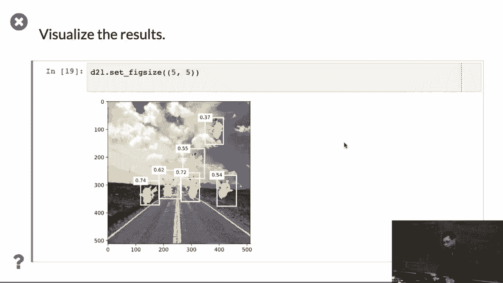

 like， I can show you the slides at the beginning。 You show this one。 You have all these numbers。

 That's a person， 99%。 The person is like， it's a car。 Always you have a number。

 But this one is much more confident。 You almost get 99% here。 For us。

 we have a tiny SSD then we can， do an ordinary job。 OK。 Other questions？ [BLANK_AUDIO]。

