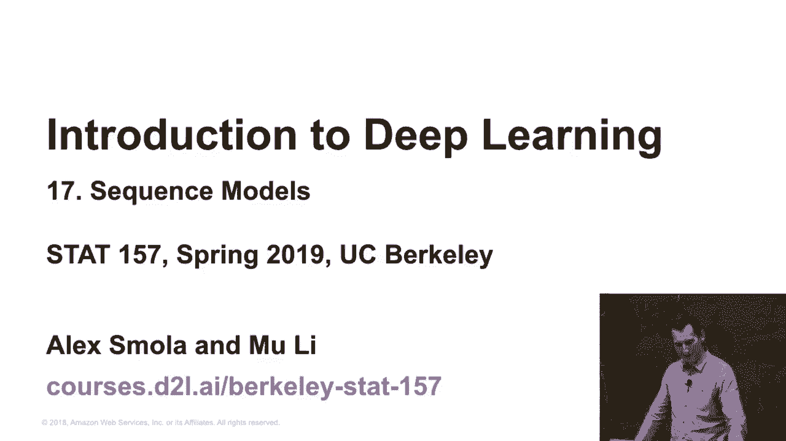
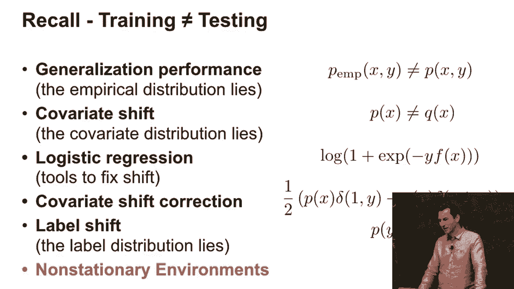
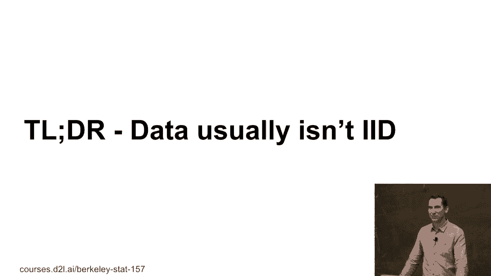

# 【AI 】伯克利深度学习Deep Learning UC Berkeley STAT-李沐 & Alex - P93：93. L18_1 Dependent Random Variables - Python小能 - BV1CB4y1U7P6

 Okay。

 Sequence models。 The first thing that we need to think about is， you know， why on earth do we even。

 need sequence models， right？ In so far， we've mostly talked about， you know。

 here's our training dot， and then we， train on it， and then good things happen in the end。

 and maybe we do well on， CAGU or in reality。 So， dependent random variables。

 So， basically， what we did so far is， you know， we collected some observation， pairs， you know， xi。

 yi from some joint distribution p of x and y。 And then we would go off and estimate， you know。

 y given x， you know， maybe from， some p of y given x for some unseen x prime。 And then， you know。

 we had maybe images and objects or regression problems or， house prices。

 and the order of the day didn't really matter。 And life's good if that's the case， right？ So。

 you can， you know， randomly go through your training set and everything's great。 So。

 I guess you can see where this is going。

 Well， that's not quite reality。 So， quick recall。 This is something we did maybe about eight units ago。

 So， when you interact with an environment， right， you can have different modes of， interaction。

 you could， you know， do batch training。 So， you download， you know， all the data。

 then you train on that data， those air observations， and then deploy。

 Or you could do things online where you get one observation at a time， you， update your model。

 and then you， as you deploy。 In computational advertising。

 you make here about doing things like that because， the fresher your model is。

 the more money you make。 So， that's why there's a significant premium on being able to respond very。

 quickly to how things change。 So， fun story。 Once upon a time。

 there was a large advertising company that did not have some。

 very popular consumer electronics device in the inventory for a non-trivial， amount of time。

 and that was probably an expensive thing not to have that， keyword in the inventory。 And。

 sorry for having to be so vague because otherwise I'd get into trouble。

 but I guess you can figure out what it is。 Well， maybe a phone rings。

 then you know which one is still wise I'm talking about。 Active learning。

 you can actually interact with environment， you can run， experiments。 For instance。

 in computational advertising， you may be able to do things like， hey， let me show this weird ad。

 I'm not sure whether it's any good or not， but if I try it out， I'll know。 And then bandits， well。

 you can actually， you know， decide in sequence， you know， what you do， which you pick。

 and then there's reinforcement learning。 And reinforcement learning， you take an action。

 the environment responds， and， then you take a new action。 For instance， if you're driving a car。

 this happens， and if you take the wrong， action， then well。

 you end up in a tree and that's not good， but so there are， certain， you know。

 performance clips that you may encounter， or if you turn， up all the fans for your service center。

 then the service center over heats and， you're out of a job。 So。

 there are certain non-trivial constraints that you want to satisfy， but， sort of that。

 it's basically taken action， the environment responds， and it。

 remembers。 So， systems can be stateful， and here is the same system， one stateful， one's not。

 because in one case that Rhino was shot by a tranquilizer。 So。

 you can do whatever to the Rhino on the left， but I wouldn't recommend it， on the right。

 Same system， different memory。 Yeah。 So， in short， while training and testing may not be the same。

 and in， particularly， you may have non-stational environments， and the entire。

 aim of the next two weeks is how we deal with non-stationary and stateful。

 and dependent Rhino variables。 So， basically， we'll dive right into a lot of the myths that we pretend。

 that didn't exist so far。

 So， here's an example。 So， this is from a paper by Uda Kureng。 This is on Netflix。

 and this was basically on the Netflix data set。 He just plotted the mean rating by date。 Okay。

 and there's maybe some fine structure in there。 Maybe weekends， people are more forgiving。

 or maybe they are more， demanding， but then there's this big jump。

 Does anybody recall why there was this big jump in ratings for， Netflix movies？

 What do you think might have happened？ So， what happened is that at some point， Netflix changed the。

 labels on its rating scale。 It changed the rating for， I think， some very bad movies from， I hated。

 it to， I didn't like it， or the other way around。 So， from， I didn't like it to， I hated it。 And so。

 people then thought， well， I'm not going to give it a one。

 star because I didn't really hate the movie， I just didn't like it， so I'll give it a two stars。 So。

 it's not that Netflix's recommended system suddenly got better， around 1500 days， but just that。

 you know， all of a sudden the， different labels caused people to write and label quite differently。

 And point two， point three points is a significant difference。 Okay。 So， here's another one， again。

 from the same paper。

 So， if you look at movies， the mean score for the movie improves， over time。 So。

 why might that be the case？ Okay。 It's great inflation， that could be it。 Actually。

 it's quite different。 If you think about it， if there's an old movie and you want to watch， it。

 are you going to watch a garbage movie？ No， you're going to watch a good movie， right？ So。

 therefore， as a selection bias towards watching good movies。

 The movies you might watch are either very recent ones because， hey。

 they just came out and you want to see what it's all about。 Or you want to watch a movie that。

 you know， is universally， acclaimed to be good， because you're not going to watch a random old。

 movie， typically。

 All right。 Here's another one。 So， this is something that we did three years ago。

 We looked at how would a certain movie have been rated by the same set of， users over time。

 And you can see those peaks。 And when those peaks happen， while the ratings go up by maybe， 。2。

3 points。 And essentially， this is， you know， whenever the movies won a prize。

 all of a sudden everybody said， well， that's a good movie。

 And does anybody remember who got the Oscars last year？ Okay。 Nobody does， right？

 And you can see exactly that， basically， after a year， the ratings are back to。

 where they should have been before。 Right。 So， it's only in the very short term that everybody remembers。

 Well， you know， let's say the color of water。 It was supposedly a good movie。 So。

 I guess if you want to see a frogman round， then， yeah， okay， that's a cool， movie。 And then。

 you know， maybe a year later， you don't remember anymore that it would have。

 got the Oscar and you would say， well， hey， what's up with this weird frogman。 Right。 So。

 that's why that happens。

 Okay。 Here's another one。 This is a fun thing。 So， it's a paper by Karli Monning-Krigger。

 And this is stratifying women's happiness， drone women， relative to their time of， marriage。 Okay。

 So， maybe German husbands are just really bad。 And maybe they do a， you know， bait-and-switch。

 right？ So， they're really nice to their price to be。 And then， after they get married， well。

 they turn out to be really not so nice。 Well， so， I'm German， so I'm a lot too bitter about that。

 The thing is， it's actually probably more head-on adaptation。 As in。

 no matter the situation that you're in， once things get better at some point。

 you reset that to your normal bias。 And by the way， it's not just Germans。

 This is life satisfaction in China。 There's another graph which。

 where it's unfortunately continues after 2005。 So， even though people earn more。

 money doesn't necessarily buy you happiness， actually， the happiness has decreased a little bit。 So。

 yeah， so there's that。 So， what this should show you is that that is decidedly non-stationary。

 And， well， we want to deal with it。 By the way， it's not just time。 It's also special。 So。

 in other words， the dependence can be on a lot of other variables， not necessarily just time。 So。

 this is， as you can easily imagine， birth quake prevalence across the United States。

 And there's nothing particularly surprising there， right？ I mean， we live in California。

 and at some point， well， we'll have a big earthquake。 And then there's this big blob， you know。

 in the East， right？ So， if you look it up on the map， there's Oklahoma。

 Does somebody have an idea why you have this big prevalence of earthquakes in Oklahoma？ It's weird。

 right？ There's nothing there。 I mean， not even earthquakes want to go there。 Well， it's fracking。

 If you extract a lot of oil from underground and do stuff underground， then， well。

 you disturb the geology， and then， well， you get earthquakes。

 That's why you have earthquakes in Oklahoma。

 Yeah。 This is the obvious one， you know， stock price over time， and you can see， well， you know。

 the FTSE100。 。com bust， well， you know， it took the index down， and then there was subprime。

 and I don't know where it will be。 Maybe they'll be the orange head peak or bust or whatever。

 but yeah。 So this is decided nonstationary， and if you didn't pay any attention so far， well， TLDR。

 data usually is not IID。

 Almost always IID is just a simplification， and if you can deal with the fact that the data isn't IID。

 then typically a model will get better。 Any questions so far？ Okay。 Good。 [BLANK_AUDIO]。

