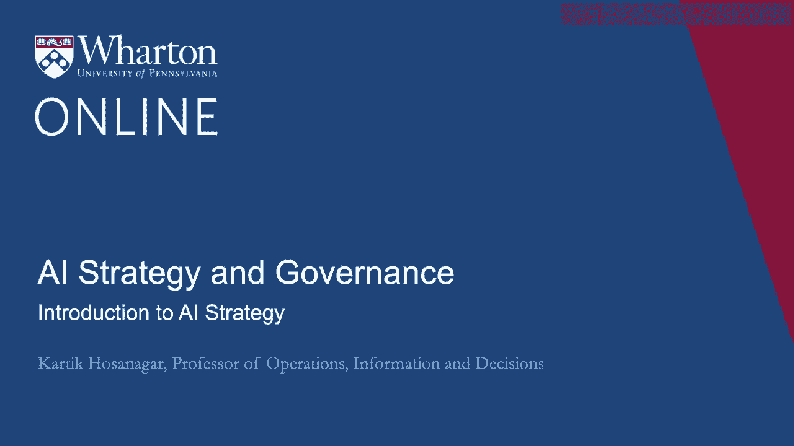
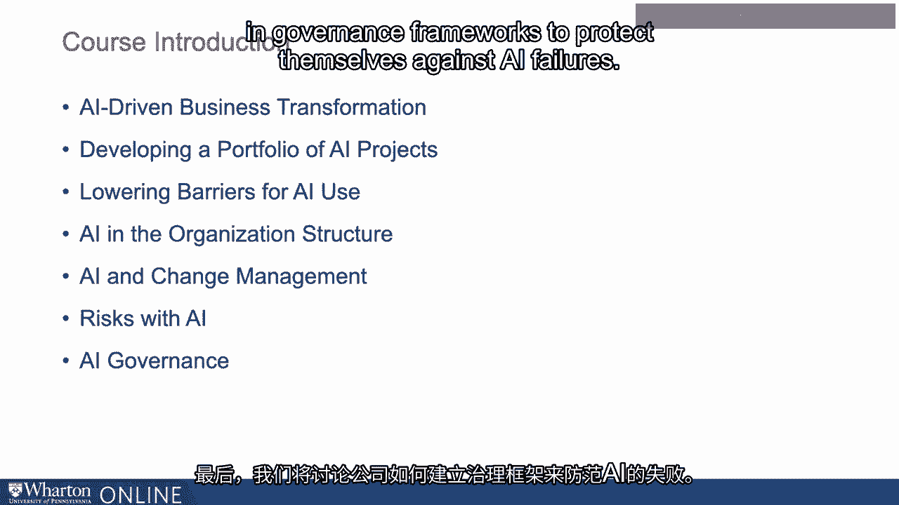

# 沃顿商学院《AI For Business（AI用于商业：AI基础／市场营销+财务／人力／管理）》（中英字幕） - P101：0_AI战略简介.zh_en - GPT中英字幕课程资源 - BV1Ju4y157dK

 This is a course on AI strategy and governance。

 We will begin by discussing AI-driven business transformation。

 We'll talk about why some early AI initiatives by some companies have failed。

 and what can we do about it。 Specifically， we'll look at strategies used by companies that are successfully。

 leveraging AI to gain competitive or business advantage。

 These include ideas such as developing a portfolio of long-term projects as well as short-term projects。

 We'll also talk about how the democratization of machine learning is lowering barriers for AI use in various enterprises。

 Specifically， my colleague， Sunny Thambay will talk about the many inputs to using AI in the enterprise。

 This includes software， people， computing and data。

 and how companies should think about all these four inputs coming together in the right way。

 I'll also talk about AI in the organizational structure。 Specifically。

 what are the behavioral patterns of organizations that are successfully applying AI today？ Next。

 my colleague Professor Lin Wu will talk about AI and change management。

 specifically how AI is playing an important role in business process reengineering。

 We'll discuss some of the challenges with AI。 We'll talk about the ways in which AI algorithms can fail。

 and the risks these failures bring and the implications for firms。

 We'll conclude with a discussion of how companies can build in governance frameworks。

 to protect themselves against AI failures。

 My colleagues， Professor Kevin Wurback and Professor Sunny Thambay will discuss principles of AI ethics。

 issues around AI explainability and the law。 [BLANK_AUDIO]。

