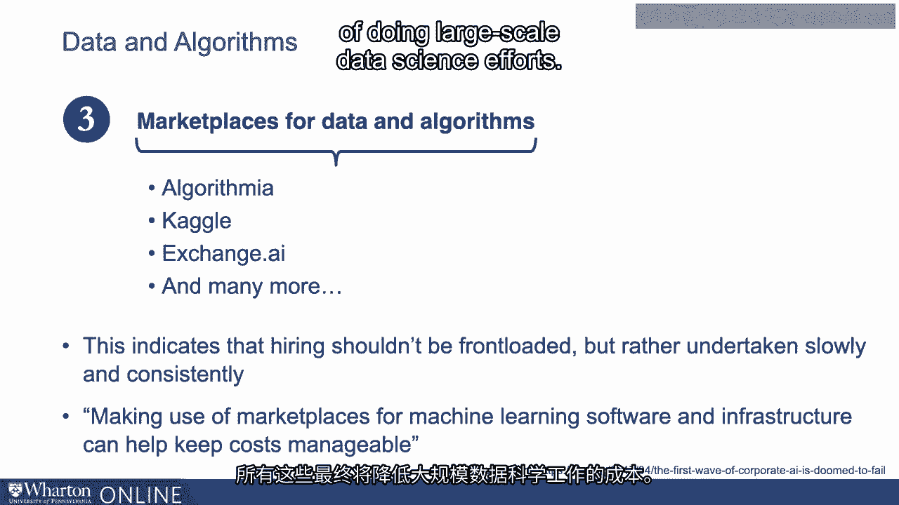

# 沃顿商学院《AI For Business（AI用于商业：AI基础／市场营销+财务／人力／管理）》（中英字幕） - P104：3_降低AI使用壁垒.zh_en - GPT中英字幕课程资源 - BV1Ju4y157dK

 In the last lecture， we talked about how Google has used AI to reinvent itself and created。

 an AI first organization that is producing great dividends for the company。

 Now it is easy to see how a large company， a large tech company like Google has the resources。

 and the engineering capabilities in-house to reinvent itself around AI。

 But how can small companies do that or how can large companies without the tech DNA do， it？

 The great news is that there is a shift on going which is a democratization of machine。

 learning which allows all kinds of organizations to access some of the capabilities and resources。

 and assets needed to embark on an AI driven business transformation exercise。

 When I talk about democratization of machine learning， I'm talking about democratization。

 in terms of the hardware to do machine learning， the software to do machine learning， the data。

 to do machine learning， the machine learning models themselves and also the people， the。

 data scientists needed to do machine learning。 Let's look at each of these in terms。

 First let's start with the hardware。 Large scale machine learning often requires custom hardware。

 For example， even the processors used for heavy duty machine learning is customized。

 There are GPUs that are used for machine learning as opposed to traditional CPUs。

 Now it can be expensive for a company to create custom hardware and a custom infrastructure。

 for machine learning。 The good news is that most of the major cloud computing platforms like Amazon。

 Google， Microsoft， Alibaba and others have created scalable computing platforms to do machine learning。

 So companies don't have to invest up front， rather they can rent it at low prices as。

 and when they need it。 This reduces the hardware barriers in order to do machine learning。

 Another trend that is very helpful for a lot of organizations is that a lot of open source。

 frameworks have been created to do machine learning and because they're open source they're。

 very easily accessible and again that lowers the barriers to do machine learning。

 There are also a number of developer tools available that can automate the data science。

 process and that allow companies to use their software engineers who may not have deep background。

 and data science to actually contribute to the data science effort。

 There are in fact many dragon dog tools， lots of visualization tools。 All of these can be leveraged。

 These include tools from large companies like Microsoft， Amazon and Google， but they also。

 include open source tools like H2O and also many other tools from other vendors like Data， Robot。

 Ultimately all of these tools make it easy for companies to get started with machine learning。

 without having to build custom software。 Finally in order to succeed with machine learning you need good data and you need good models。

 There are a number of marketplaces emerging where companies can download or buy data sets。

 and also download or buy algorithms or models to do machine learning。

 Kaggle for example has emerged as one such marketplace for both data and algorithms。

 A number of the major cloud computing platforms including Amazon， Snowflake and others are creating。

 marketplaces for data and marketplaces for algorithms as well。

 All of this will ultimately lower the cost of doing large scale data science efforts。

 Lastly data scientists are needed in order to do data science and of course data scientists。

 can be expensive today。 But as more and more training of engineers and data scientists is happening the cost of data。

 scientists is also going down。 All of these trends imply that the barriers to use machine learning in your industry are。

 rapidly decreasing。 The implications are that you want to invest slowly and steadily in AI rather than invest。

 heavily up front and the slow and steady investments will produce returns over the long run and。

 the barriers will continue to drop over the next several years making it easier and easier。

 for companies to initiate or grow their AI efforts。 [BLANK_AUDIO]。

