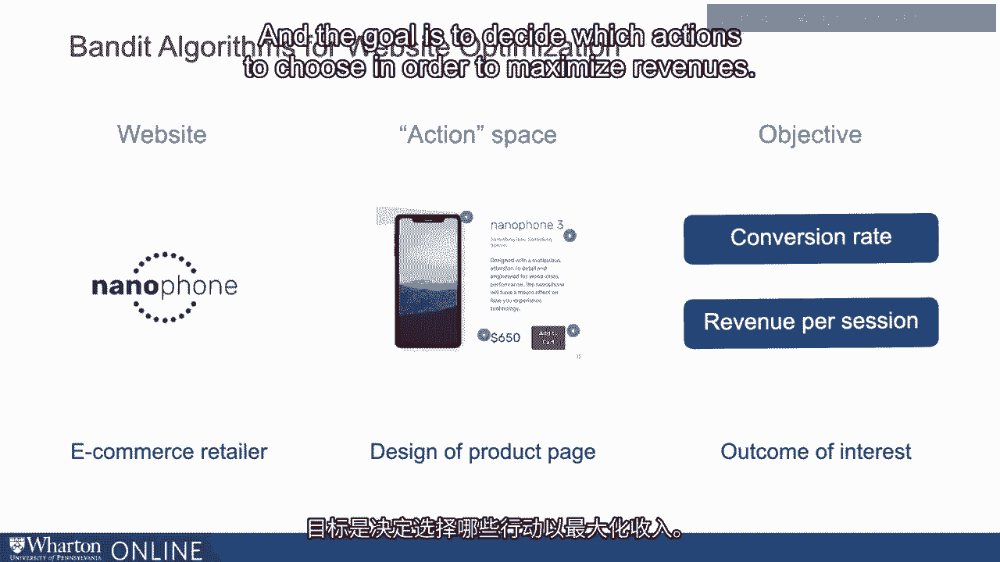
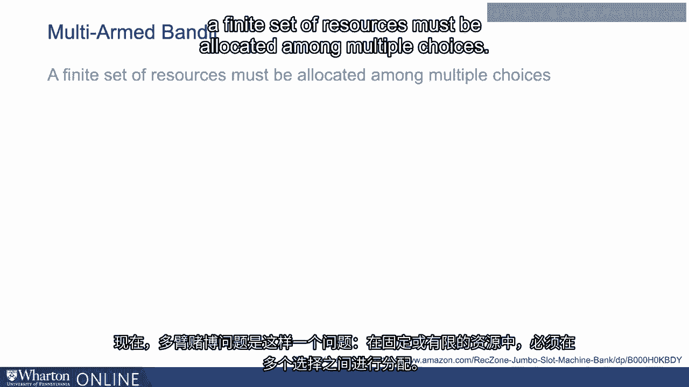

# 沃顿商学院《AI For Business（AI用于商业：AI基础／市场营销+财务／人力／管理）》（中英字幕） - P10：9_强化学习.zh_en - GPT中英字幕课程资源 - BV1Ju4y157dK

接下来我们来看强化学习，特别是多臂老虎机算法。

更加深入地了解。这些算法在你有连续数据输入时是一个强大的工具，我们可以。

从数据中学习以改善决策。例如。

考虑一个媒体网站，比如一个希望个性化的新闻媒体网站。

该网站需要为其用户决定，例如，展示成千上万条不同新闻中的哪一条。

文章在其主页的顶部展示。或者考虑一个电商零售商。

我们称之为Nanophone，假设这是一个手机零售商。

当消费者登录网站时，Nanophone需要决定如何个性化产品。

向消费者展示的页面。他们可能需要决定向消费者展示10种不同手机图片中的哪一种。

他们可能需要决定向消费者强调哪些产品特性。例如。

是不是应该关注手机的电池续航？

还是应该专注于时尚的设计或其他产品属性？

他们可能希望决定向这些消费者提供哪几种不同的折扣。

零折扣、五折、十折。

他们可能会有多个行动号召。并且他们需要选择使用哪个行动号召。

因此，行动空间或决策集或可供营销人员选择的选项集。

在这个背景下，目标是决定选择哪些行动以最大化收入。

这个问题的核心是我们探索多少，利用多少。

我们所说的探索是关于收集更多关于。

决策环境。例如，提出这个问题。

如果我选择不强调电池，会发生什么呢？

尽量少考虑电池续航，而选择关注手机的时尚设计。相反。

利用是关于在当前信息基础上做出最佳决策。

单纯基于当前信息，我们相信最能吸引的营销信息是。

消费者是一个强调电池续航的信息。

那我们应该坚持那个，还是尝试一些新的东西？

现在我们在日常生活中经常使用探索和利用的理念。例如。

假设你要去餐厅。你会去一个全新的餐厅，这相当于探索吗？

还是去你常去的最喜欢的餐厅，你知道那里的情况。

是不是经过验证的？那就是利用。而有时你可能会选择去你最喜欢的餐厅。

选择去利用。而有时你可能会说让我们尝试一些新的东西，了解。

餐厅。即使这冒着我们可能不喜欢食物或体验的风险。

这就是探索。这类决策问题的核心问题是我们如何平衡探索。

探索与利用？我们如何决定何时尝试一个全新的营销信息或完全不同的。

将网页提供给消费者，或者何时使用一些已经有效的内容。

过去的经验。这种权衡正是多臂赌博算法等算法真正处理的内容。

我之前提到的，这种方法有点像经典的强化学习方法。

现在，多臂赌博问题是一个固定或有限资源集的问题。

必须在多个选择之间分配。

例如，想象一下赌场中的一个赌徒面临一排老虎机。

赌徒必须决定拉哪个老虎机，而赌徒在赌场中只有有限的时间。

因此只能进行100次或200次拉动不同的老虎机。

因此，他们必须随时决定是否尝试一个全新的老虎机。

如果它与更高的获奖概率相关联，赌徒应该如何选择。

坚持一个已经产生合理回报的老虎机。

现在有许多算法可以用于平衡探索与利用。

确实有许多算法用于多臂赌博问题。

例如，一种叫做Epsilon优先的策略本质上是一种启发式方法，我们往往倾向于。

提早进行实验，也就是在早期进行大量探索，然后一旦我们学到了一些东西。

然后我们开始利用这些信息。所以在个性化纳米手机网站的背景下，我们可能会在。

在最初的几周，我们可能选择探索并尝试许多不同的营销信息。

尝试许多不同的图像等等。一旦我们学会了想要的内容，我们选择利用，也就是分配。

100%的流量分配给我们在前几周发现的表现最佳的变体。

探索的几周。另一个可用的算法是汤普森采样。

对于纳米手机面临的问题，汤普森采样可能会最初。

将进入网站的网络流量平均分配给所有不同的。

公司正在考虑的选择。意味着我们是否应该强调显示电池的消息和视觉效果。

我们是否应该使用谈论流线型设计的视觉和信息？

我们是否应该使用关于手机应用商店等的视觉和信息。

汤普森采样将最初把流量平等地分配给这些选择。

概率。但是，随着越来越多的数据进入，汤普森采样将选择那些。

产生更高或更好的结果。它会以更高的概率选择它们。

所以如果例如强调应用商店的信息和视觉效果是那一个。

逐渐但稳步地产生比选择的概率更好的结果。

被选择的内容将不断增加。定性而言，这就是算法的作用。

显然，算法如何工作的细节可能不是大多数人最感兴趣的。

我们的重点是讨论人工智能的商业应用，但希望你能感受到。

这些方法背后的直觉。总之，我们假设机器学习是基于对大型数据集的访问。

强化学习提供了一种依赖较少训练数据但更多依赖。

在动态实验中学习哪些策略表现更好，并更多地使用这些策略。

更多。强化学习在游戏和在线个性化方面找到了许多应用。

也就是说，今天并不像其他机器学习方法（如监督学习）那样广泛使用。

机器学习。鉴于监督机器学习在商业环境中是多么普遍，我们将。

现在深入探讨监督机器学习方法的世界。[BLANK_AUDIO]。

