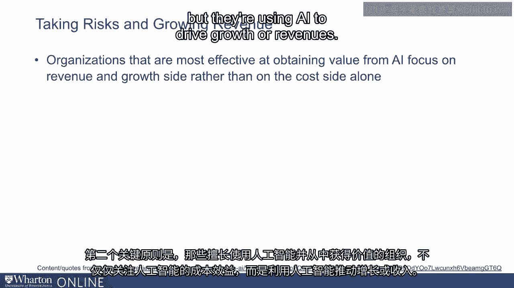
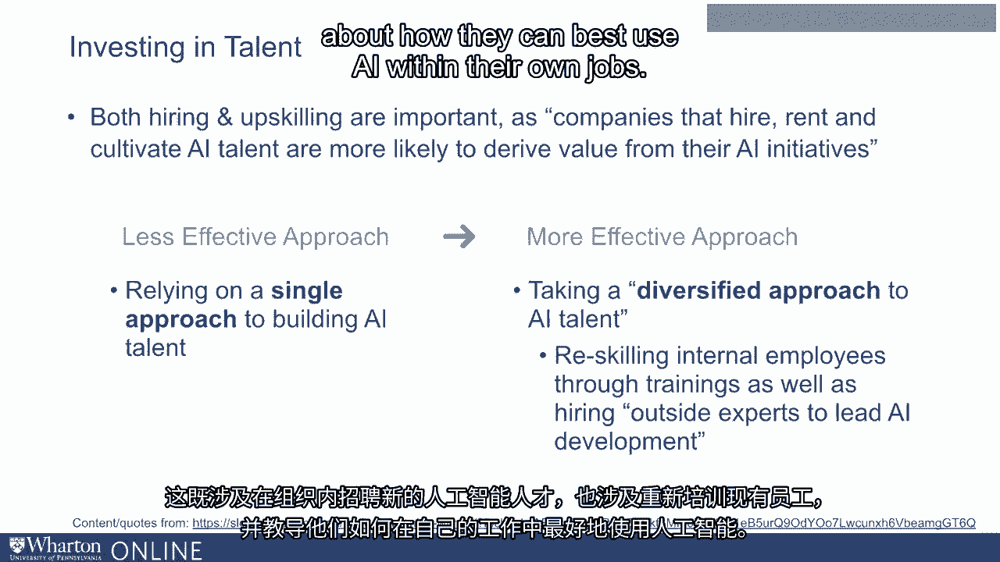
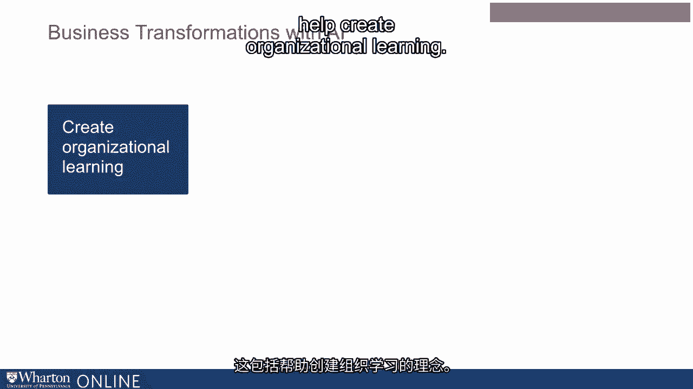

# 沃顿商学院《AI For Business（AI用于商业：AI基础／市场营销+财务／人力／管理）》（中英字幕） - P113：12_组织架构中的AI.zh_en - GPT中英字幕课程资源 - BV1Ju4y157dK

 We've talked about constructing portfolios as an important part of an AI strategy。

 What are other things that managers can do as part of their AI strategy？ In this lecture。

 we're going to explore some of these strategies。 BCG and MIT conducted a survey of executives and asked them about their AI strategies。

 In particular， they asked the ones that were getting results from their AI investments。

 What are some of the things they did？ And here are some strategies that seem to be working for this group。

 The first principle is AI strategy integration， which is the idea that you can integrate the。

 AI strategy into the broader organizational strategy。

 Many companies develop a strategy for AI alone。 In other words。

 they think of using AI as a goal in and of itself。 In contrast。

 a more effective strategy is one where AI is conceptualized and imagined in。

 the context of a broader organizational strategy。 So whatever you want to do with AI is based on what are the broader strategic goals of。

 the organization and how does AI help advance that。

 Now， of course， it's important to realize that while we want integration over the long， term。

 it is okay for companies to start with less integrated and less ambitious goals in。

 the short term as a way to build consensus and as a way to acquire some of the skills， in AI。

 So it's okay in the short term to have some of those， but even then you want to have some。

 long term initiatives that are integrated or aligned with your overall long term strategies。

 as an organization。 A second key principle is that organizations that are effective at using AI and deriving。

 value from AI are not merely focusing on cost benefits of AI， but they're using AI to drive。

 growth or revenues。 So less effective strategy is to just think of AI as a cost reduction engine。

 In contrast， companies that are using AI to take risks pursue higher risk and higher。

 return projects are the ones that are seeing returns from AI。

 Similarly， another really important idea is that in order to succeed with AI， you need。

 to have the right infrastructure in place。 And the most important infrastructure is the data infrastructure。

 Companies that are really thinking about integrating their data assets across multiple divisions。

 multiple products and multiple data sources within the organization are the ones that。

 are finding results。 So in other words， if your data remains in silos and are used in a siloed fashion by individual。

 departments， it's unlikely that the organization as a whole will see great benefits from AI。

 In contrast， the companies that are succeeding with AI are the ones that are trying to integrate。

 their data。 Recollect that in an earlier module， we talked about data warehousing as one of the ways this。

 can be done。 Data warehousing involves pulling together data from different sources into a single repository。

 which is easy to access for analytics applications。 And that is a very important exercise。

 And investing in the data infrastructure is a very important exercise because without， it。

 you just have a very fragmented view of the customer or of the organization itself。 Next。

 we should be thinking of not just producing AI， but also consuming AI as an organization。

 What we mean by that is that while it's important to have data scientists and machine learning。

 experts who are creating new machine learning capabilities， we also want to have consumers。

 of AI within the business， meaning managers who are going to consume the insights of the。

 data science of the machine learning and make managerial decisions from it。

 In order to do that， you need to have managers who have data in their DNA。

 So not all managers have that。 So this might involve certain amount of rescaling as well。

 And you need managers who are working closely with data scientists and who are trying to。

 understand the results of the data analysis， who are challenging the data analysis， who。

 are bringing their domain knowledge to shape the data analysis。

 All of that is needed so that you have not just data scientists creating AI within the。

 organizations， but you have managers who are consuming the insights from data science and， AI。 Next。

 investing in talent is very important。 This last principle is something I've alluded to before。

 but we cannot have success with， AI if you have a siloed team of four or five data scientists working in isolation。

 You need to have AI knowledge and understanding and insights throughout the organization。

 This involves both hiring new AI talent within the organization， but also rescaling existing。

 employees and teaching them about how they can best use AI within their own jobs。

 So I mentioned a number of different principles that are needed to help transform an organization。

 around AI。 This includes ideas that help create organizational learning。

 also using a portfolio in order to。

 pursue multiple projects， integrating your AI strategy with your broader organizational， strategy。

 creating a data infrastructure in place that you can leverage for your AI efforts， and so on。

 But having mentioned all of these opportunities with AI， we also have to think through certain。

 risks with AI。 In the next few sessions， we will talk about those AI specific risks and how do we create。

 a governance framework to manage those risks。 [BLANK_AUDIO]。

