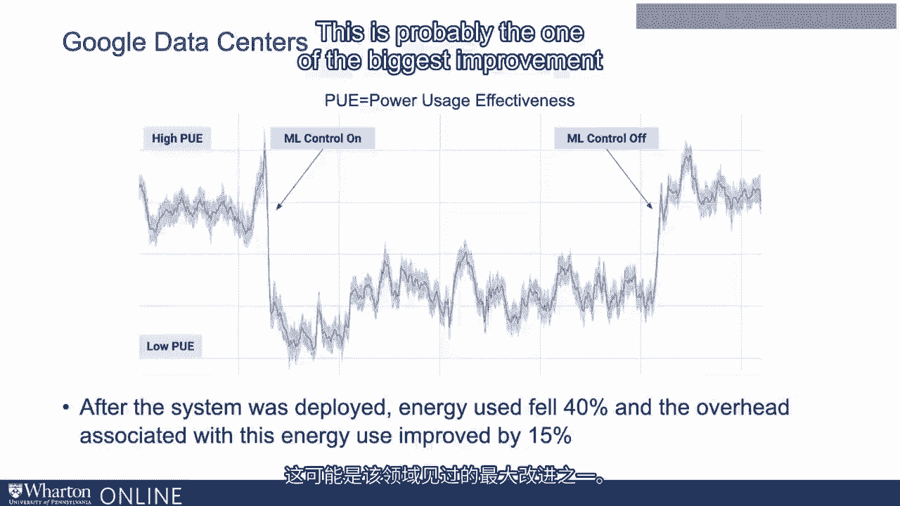
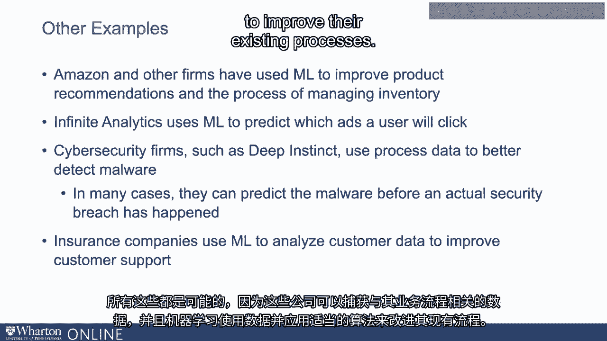
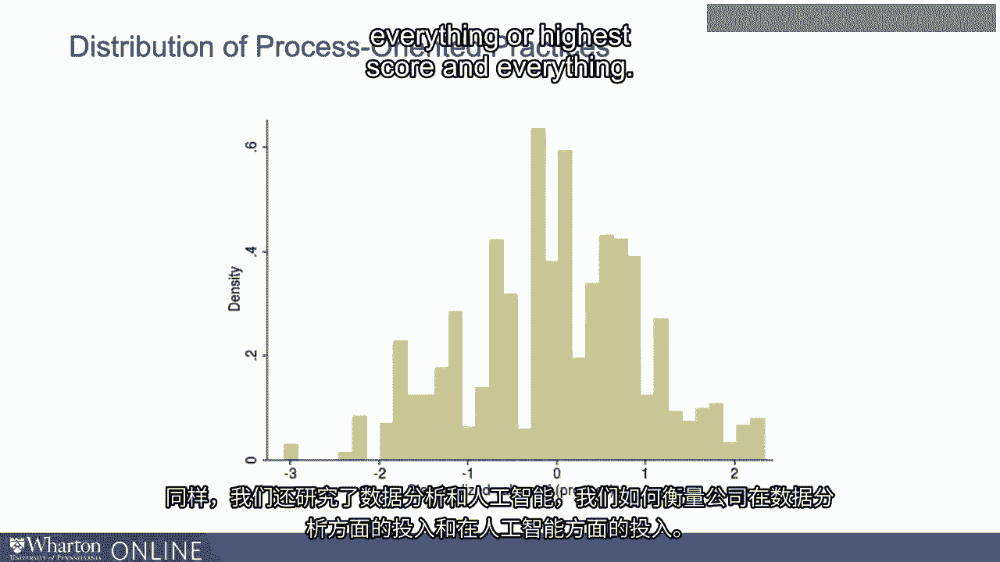
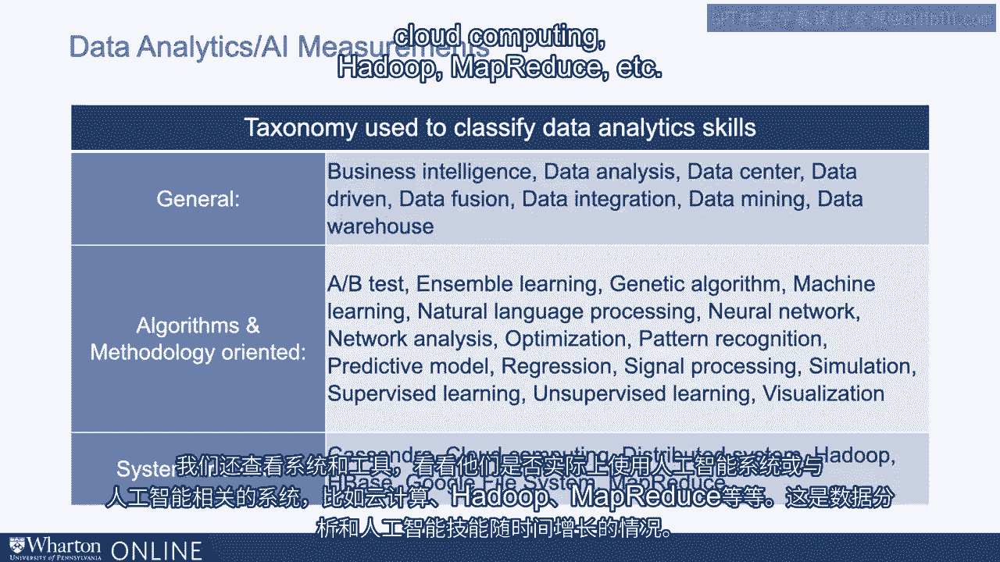
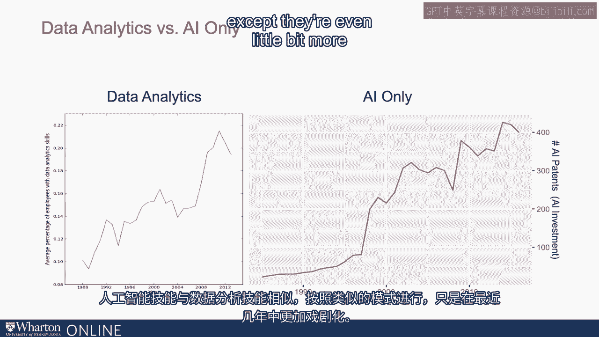

# 沃顿商学院《AI For Business（AI用于商业：AI基础／市场营销+财务／人力／管理）》（中英字幕） - P116：15_AI和过程创新.zh_en - GPT中英字幕课程资源 - BV1Ju4y157dK

 In this video， I am going to talk about how AI can help you improve process and generate。

 process related innovation。 It's probably a no surprise to you that the explosion of big data is ripe for advanced。

 AI and data-lenecks and various techniques。 From social media， mobile media， every single second。

 we generate thousands of tons of， thousands and millions of impressions， text messages。

 comments on social posts， reaction， on social posts。 All that involves explosion of text， pictures。

 videos and sounds。 And although they may come from user-generated data。

 but much of that data can also come， from business processes。

 Once firms can carefully curate their business process data and really analyze with advanced。

 machine learning analytics tools， this can lead to dramatic improvement in their process。

 innovation。

 Let me give you an example on Google's data center。

 Google runs some of the world's largest data centers。

 And these data centers are extremely energy intensive。 That means they can supply more than 100。

000 servers。 And it's important to keep the servers cool。

 The cooling challenge is further compounded by the fact that the computing load is varying。

 quite a bit。 Because it's difficult to predict how much power is being used over time。

 And how much people are using these servers。 And it also gets affected by outside temperature。

 humidity， et cetera， et cetera。 In the past， humans are typically controlling these pumps。

 these coolers， cooling towers， and other equipment。

 And it's really important to keep the data center at the right temperature。 Otherwise。

 you have a server malfunction。 So these people will monitor their thermometers， pressure gauges。

 and many other sensors to make， decision over time。

 And deep learning was a machine learning platform。 Try to see if we can automate some of that。

 What they've done is they took years of historical data on data centers， computing loads， various。

 sensor readings， environmental factors such as humidity and temperature readings， and put。

 all that information to train a big neural network。 So that's deep learning model。

 And that neural network is used to control all available cooling equipment。

 This is also a reinforcement learning algorithm to train the deep learning neural network。

 You can see on this graph on top， in the beginning， we have pretty stable power usage effectiveness。

 pretty stable。 And then we turn on this deep mind platform to reduce the energy consumption or making。

 it more effective。 You can see a dramatic drop after machine learning is used to control these temperature pumps。

 coolers， and all the systems related to keeping the servers cool。 And over time。

 you can see it's lower dramatically。 And once the system is turned off and back to human control。

 you can see the power usage， effectiveness has actually gone back to the prior level。

 After the system is deployed， energy use fell by 40%。

 And the overhead associated with this energy use also improved by 15%。

 And this is probably one of the biggest improvements ever seen in this area。

 There are many other examples you probably use or heard of them。

 Amazon and other firms have dramatically used machine learning to improve product recommendation。

 and the process of managing inventory。 Amazon Analytics has used machine learning to predict what asks a user what click and。

 all that data can then be used to predict conversion rates and likelihood of person returning to。

 the website or buying a product。 Cybersecurity firms such as Deep Instinct have used this process data to better detect。

 malware。 And in many different cases， they can protect the malware before the actual security breach。

 has happened。 The insurance company is also a big use of machine learning to analyze their customers。

 data and also to improve their customer support。 And all that is enabled because these firms can capture the data associated with their。

 business processes， a machine learning can then apply， uses data and apply the appropriate。

 algorithm to improve their existing processes。

 So I gave you a bunch of examples of how AI and data analytics can improve process innovation。

 But to really see if this is one off thing or this is actually applicable for most firms。

 So to do this， we actually conducted a large survey of more than 300 firms in a partnership。

 with McKinsey。 In this survey， we actually asked many questions about firms。

 And one such section is on process based innovation。

 So there are eight questions we've asked on a scale of one through five， how likely a。

 firm is oriented to improve their process innovation。 So we asked the question such as。

 to what extent the following statement describe the。

 work practices and environment of your entire company？

 And one of the such statement is we have a strong ability to make incremental changes。

 or improvement to our business processes。 And we also asked a question such as。

 please list important core activities of your primary， business。 If you listed process development。

 process quality， process management or improvement。

 and then we also classify you as a firm that audience to our process improvement。

 We also asked questions such as， how is your organization in proactively engaging with。

 business leaders to refine existing processes and systems。

 So we aggregate all these scales and the firm that has very score very high on this scale。

 we label them as firm who have interests or oriented toward process innovation。

 So what do we find？ This is the distribution of the firm that our process oriented。

 You can see not all firms are process oriented。 Some are less so and some are more so。

 But it has to follow a pretty interesting bell shaped curve and that's what we expect。

 So it's not a case where everybody says， oh yeah， of course we are interested in processes。

 and clippies or everything or higher score and everything。

 And similarly， we also looked at data analytics and AI。

 How do we measure how much the firm invests in data analytics and how much the firm invests， in AI？

 Okay。 So what we did is we actually used the resume data of these firms。

 So we look at data on their employee skills， whether they have skill sets related to data。

 analytics and skill sets related to artificial intelligence。

 So we can look at general AI measurements to see their words such as do words like business。

 intelligence， data center， data driven， data integration are showing a resume。

 Similarly for algorithms， we look at words like A/B testing， machine learning， natural。

 language processing， neural network， et cetera， et cetera。

 We also look at systems and tools to see that they actually use AI systems or a system related。

 to AI such as cloud computing， Hadoop， Map of Dues， et cetera。

 And this is the growth of data analytics and growth of AI skills over time。

 You can see we see a big jump in the same timeline。

 We see a huge improvement or a huge increase in skills in data analytics， the big number。

 of people with data analytics skills and we see even sharper increase in the AI skills。

 in the reason years。 So AI skills， mirrorist data analytics skills， follow a similar pattern。

 et cetera， even a， little bit more dramatic in the most recent years。

 So what we find is that data analytics and AI can greatly facilitate process based innovation。

 Not only that， we find that firm that use AI tools and are oriented toward process improvements。

 experience even greater productivity gains as measured by their revenues。

 We measured that one standard deviation increase in investment AI tools are associated with。

 7% more productivity。 And similarly， if a firm invest in AI but are not interested in improving their processes。

 and they will not experience that 7% productivity gains。 So only we have both。

 You have both the investment AI tool and are you oriented toward processing improvements。

 and we see the productivity gain。 So it's give you one factor that could explain AI innovation paradox in the sense that if。

 you are using AI to improve your processes， you're more likely to see greater gains。

 Thank you。 [BLANK_AUDIO]。

