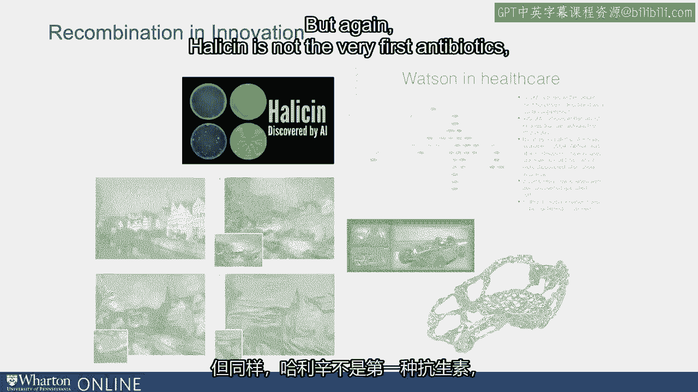
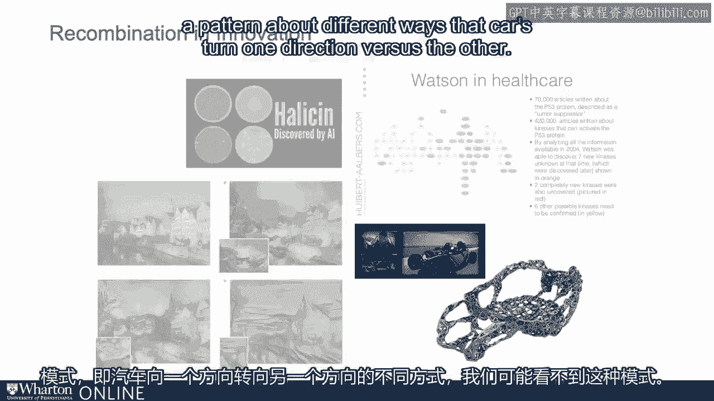
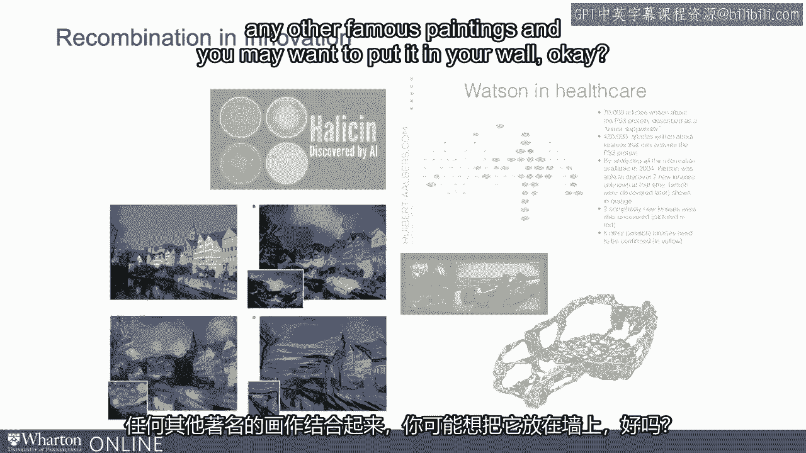
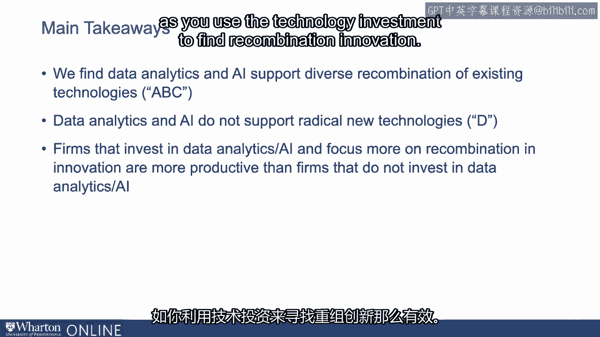

# 沃顿商学院《AI For Business（AI用于商业：AI基础／市场营销+财务／人力／管理）》（中英字幕） - P118：17_不同类型的产品创新.zh_en - GPT中英字幕课程资源 - BV1Ju4y157dK

 In our last video， we examined that general product innovation doesn't seem to be getting。

 much help from AI and data analytics。 Where processed improvement and process innovation seem to get a lot of help from data analytics。

 In this video， we're going to deep dive into product innovation to see， are there any。

 differences between different types of product innovation？ If so。

 how are AI affecting them differently？ So remember I showed a lot of examples about how AI can fundamentally change many industries。

 from healthcare to drug discovery to product design of cars and to the realms of arts and， music。

 So but notice how these innovation have in common。

 In Watson Health example， we have identified P53。 But there are already many。

 many examples of P53 out there and also other proteins that， interact with P53。

 So AI and data algorithms have lots of examples to look at to figure out what a new P53 protein。

 may look like。

 In terms of a halosine， it's brand new antibiotics that have never been discovered before。

 And it's obviously a very important discovery。 But there are also many other antibiotics out there。

 So we kind of know what an anhabitis can do or should do when we find ones easier to verify。

 But again， halosine is not the very first antibiotics out there。

 Car chassis is again a great example of improving an existing product。 It's a chassis。

 It's very innovative。 We probably wouldn't have seen one without the use of AI to tell us about a pattern。

 about， different ways that cars turn one direction versus the other。

 But again， fundamentally， it's still just a chassis。 And if you look at the paintings。

 you see that you take a picture from Europe and then you。

 combine it with Van Gogh's theory night or any other famous paintings and you may want。

 to put it in your wall。 But notice they all have something in common in the sense they are recombination innovation。

 So what do I mean by recombination innovation？ That means you might be marrying two different things together to create a new thing。

 So you can think about the photos and the theory night is a great example。

 You're literally putting two things together。 A photo and a theory night together and that gave you a new painting。

 It's very beautiful。 It's very innovative。 But it's a combination of two things。 Summer was chassis。

 It is still an improvement of existing chassis。 It's chassis marrying sensor。

 marrying many other technologies and data analytics to help， discover improved chassis。

 Halosine again is by mining lots and lots of data points and lots and lots of research。

 papers about antibiotics but also many other drug interactions out there。

 To find a halosine that might be very difficult to discover before but it's still fundamentally。

 antibiotics， not a first pedicillin。 By combining information from different disciplines。

 different sources of information and then， put it together to figure out what halosine may look like。

 A same cell that you can go with P53 proteins。 Again。

 you already know what to look for in P53 but you just need to find other patterns。

 In a sense， AI and analytics can drastically expand the search space for you to find that。

 innovation。 By doing the linkage， the tech hidden patterns among all these research papers。

 all these， data points， we are able to find new ways to combine existing technologies in a new way。

 That is fundamentally a recombination innovation and is very powerful for innovation。

 I just gave you intuition on the type of product that AI can help you support。

 Not only can AI can help you combine things in a new way， they can also do so by combining， many。

 many different things in a new way。 That combinatoric combination is something AI is really good at。

 Maybe in our mind， we can do combination with three or four or five elements。

 AI can do that in hundreds of thousands。 A much more effective way to figure out a combinatoric combination to figure out what。

 works and what doesn't。 Let me give you an example。 What does it mean by a diverse recombination？

 What does it mean by going through combinatoric？ For example。

 if you have four existing technologies， A， B， and C， and B， C。 A， B， and C are technology。

 belong to its own class。 They are very different from each other。 B。

 C is a technology that combines B and C together。 In a diverse combination。

 it would be something like A， B， C that you combine all four technologies。

 three technologies together to form a diverse combination。 A very new。

 a potentially radical innovation called D is a technology class that has not， existed before。

 Our hypothesis is that AI can greatly help you to find a diverse recombination， combining。

 many different elements together in a new way。 It could be A， B， C， B， C， A， et cetera。

 in a different way， different orientations。 But it may not help you find that first in the class innovation。

 So it's great in finding hellosene， but it may not be great in helping you find penicillin。

 with the very first antibiotics out there。 That means a technology class that does not exist before。

 If you think about it， a technology that does not exist before doesn't have much data， about them。

 It's very limited in terms of what AI and data learners can do to help you find that。

 radical new innovation， a D。 But it is very good at finding innovation that combine different。

 things together in a new way， a diverse recombination。

 So how do we know that our intuition is correct that AI and analytics can facilitate a diverse。

 recombination innovation？ One way to do that is using patent。 Patent has several advantages。 First。

 that patent has a specific classification code telling you whether it is new or not。 In a sense。

 if the first patent showing up in that particular technology class， it is， very novel。 Furthermore。

 we also know the patent that is current patent-sided。 So in this red box here。

 we look at all the patents that this particular patent has cited。

 And it's important because this is all prior art that this particular patent is drawing， from。

 For example， if a patent has ten citations all belonging to the same patent class， then。

 we know it's not a diverse combination。 It's coming from a single technology class。

 But the same ten patents are coming from ten different technology classes， then it's。

 likely that this patent is more of a diverse combination because it combines ten technology。

 elements together。 And that is a diverse combination。 Furthermore， to measure novelty。

 we can also look at the abstract of the patent to look， at whether the words that use is very new。

 For example， if the first time the word HTML showed up on abstract， that's a very new， word。

 That means its patent is probably very novel。 If this patent is the one thousandth patent that mentioned the word HTML。

 then it's not， a very novel patent relatively to the first one。

 So this is how we use patent data and classes by each patent into a diverse combination。

 And since it is a combination of many， many different technology classes together， or。

 is it a very new technology， whether it's being the first of his own technology class。

 or they have used words that are so novel that have not seen in other patents before。

 Then we examine the relationship between data analytics and AI investments to this two different。

 type of product innovation。 Number one being diverse combination。 Number two。

 where there's a novel technology。

 As you see in this graph here， you can see that if you look at the first one， it's diverse。

 combination。 And a Y axis is the likelihood of investing in AI technologies and other technologies。

 And if you look at diverse combination， they're far more likely to adopt diverse combinations。

 And the effect size is pretty large and the error is very small。

 But if you look at the corresponding graph for novel technologies， remember this is the。

 first of its own kind。 It's not a combination like A， B， C together。

 but a brand new technology kind of D that， you haven't seen before。 In fact。

 we see it's actually almost a negative relationship between novel technology and AI。

 and lives investment， although it's virtually zero because it's so noisy we can't really。

 measure it effectively。 Then let's look at the productivity effect。

 Do firms that tend to combine existing technology in a new way and when they adopt AI analytics。

 do they correspondingly see a gain in productivity？ Okay。

 And we do that same thing with whether this firm is oriented very new technology。

 And we see the first bar in this graph， we can see it's the fastest dramatic。

 The firm that invests in AI and also are interested in combining technologies， existing。

 technologies in a new way， seen much bigger effect。

 This is about 1% change in productivity is huge given that the fact of sheer AI is very， small。

 So it's actually a huge effect。 And if you see the same corresponding change on D。

 remember this is a novel technology， that we haven't seen before。 And the fact is almost negative。

 although it's slightly hard to tell， but it's at least， small zero。

 And we see that this is not an IT phenomenon。 This is really about an AI phenomenon because we rapidly this graph for IT replacing AI。

 technology measurement with just general IT。 So next two graph， the bars。

 you can see that this effect does not happen when you see diverse。

 combination investing in general IT technologies。 In fact。

 that's almost going up the direction than AI。 And similar with novel technology。

 you also don't see that in general IT investment。 So what I'm showing here is really about AI driving diverse recombination of these technologies。

 And the firm that do both， they use AI and they use it to find diverse combination of。

 these technologies。 That's when they receive a dramatic increase in productivity。 On the other hand。

 if you use AI and you're primarily using to find a novel technology， class， the first is own kind。

 the fact doesn't seem to be there。 Similarly， you can't just invest in general IT。

 It's really about AI that is driving the fact we're seeing here。

 So the main takeaway here is that we find that the analytics and AI support diverse recombination。

 of these technologies， such as ABC， three element together。

 But analytics and AI do not support radically new technologies， such as D for its own kind。

 And we find that firm invest in analytics and AI and they focus on recombination innovation。

 They are a lot more productive than firm that do not invest in analytics by itself or firm。

 that are interested in recombination but do not invest in analytics。

 So it's really the combination that matters most。 That you invest in AI and you're using it to find recombinations。

 That could be another reason why the paradox exists。

 You're using AI to find novel new technologies such as D。

 That effort may not be as effective as you use the technology investment to find recombination。

 innovation。 Thank you。

 for watching。 [BLANK_AUDIO]。

