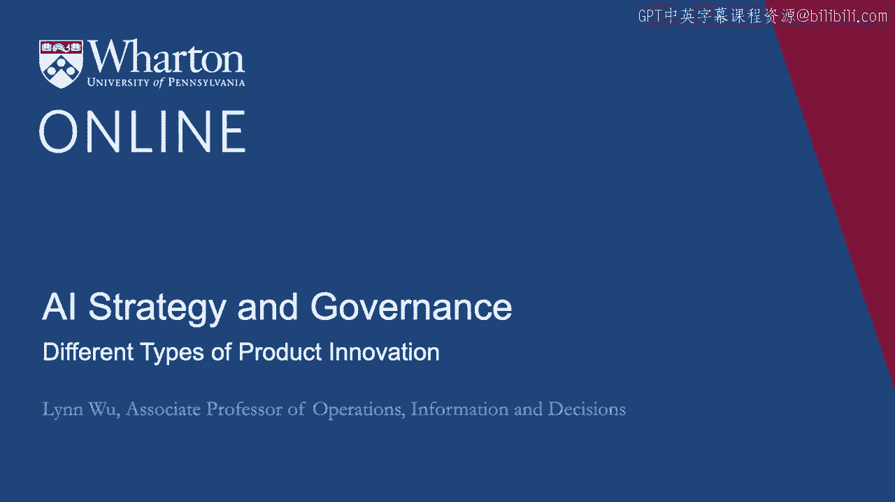
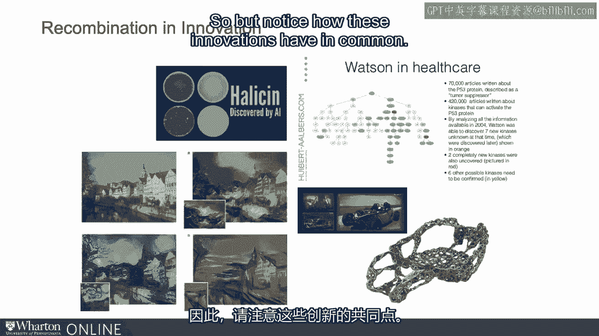
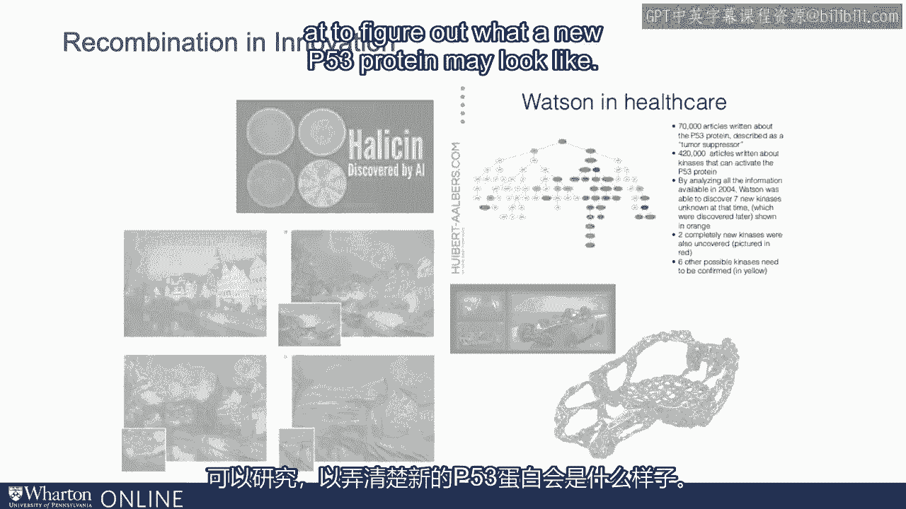
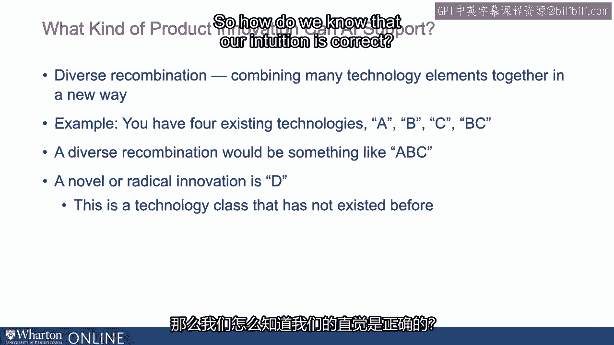
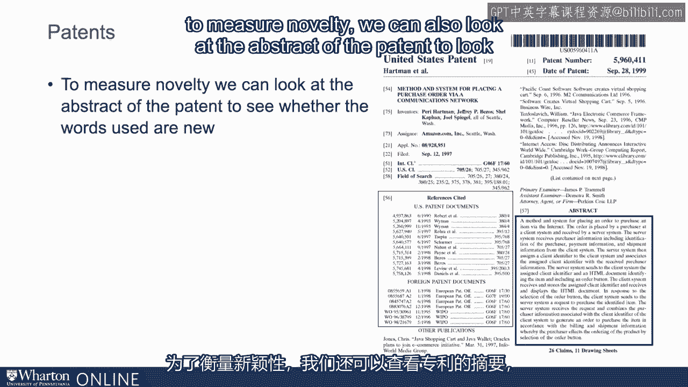
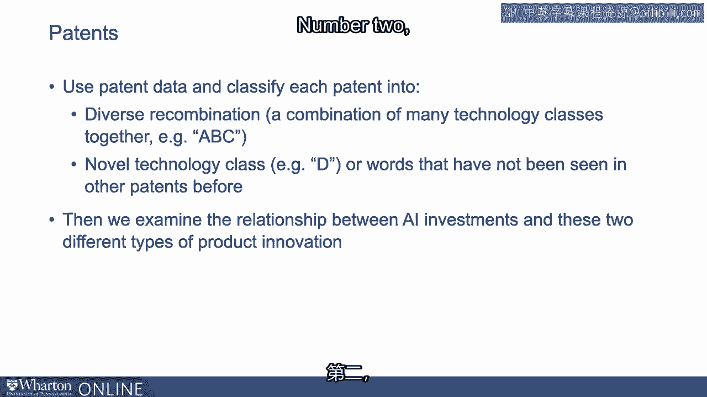
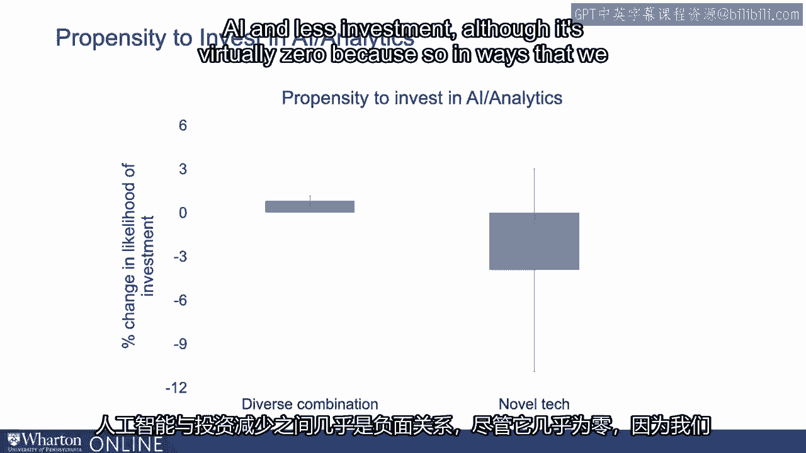

# 沃顿商学院《AI For Business（AI用于商业：AI基础／市场营销+财务／人力／管理）》（中英字幕） - P118：17_不同类型的产品创新.zh_en - GPT中英字幕课程资源 - BV1Ju4y157dK

在我们上一段视频中，我们研究了通用产品创新似乎没有取得进展的情况。

在AI和数据分析的帮助下。处理改进和流程创新似乎得到了数据分析的很大帮助。

在这个视频中，我们将深入探讨产品创新，看看是否存在任何。

不同类型产品创新之间的差异？如果是这样的话。

人工智能如何以不同的方式影响它们？所以记住我展示了许多关于人工智能如何从根本上改变许多行业的例子。

从医疗保健到药物发现，再到汽车的产品设计，以及艺术和音乐领域。

所以请注意，这些创新有什么共同之处。

在Watson Health的例子中，我们已经识别出P53。但已经有很多。

许多P53的例子，以及与P53相互作用的其他蛋白质。

因此，人工智能和数据算法有很多例子可以参考，以了解新的P53蛋白是什么。

可能看起来像。

从新抗生素的角度来看，这是全新的，之前从未发现过的。

显然这是一个非常重要的发现。但还有许多其他抗生素存在。

所以我们有点了解抗生素在我们找到更容易验证的情况下可以做或应该做什么。

但再一次，halosine并不是现有的第一种抗生素。

汽车底盘再次是改进现有产品的一个很好的例子。它是一个底盘。

这非常具有创新性。如果没有人工智能告诉我们模式，我们可能根本看不到它。

关于汽车向一个方向与另一个方向转弯的不同方式。

但从根本上说，它仍然只是一个底盘。如果你看看那些画作。

你会看到你从欧洲拍了一张照片，然后你。

把它与梵高的《星夜》理论或其他任何著名画作结合在一起，你可能会想。

将其放在你的墙上。但请注意，它们在某种意义上都有共同之处，即它们都是重组创新。

那么我所说的重组创新是什么意思呢？这意味着你可能将两种不同的事物结合在一起，以创造出新的东西。

所以你可以考虑照片和《星夜》是一个很好的例子。

你实际上是在把两样东西放在一起。照片和理论之夜结合在一起，这给了你一幅新画作。

它非常美丽，非常创新。但它是两样东西的结合。夏季的底盘。

这仍然是对现有底盘的改进。它是将传感器结合在一起的底盘。

将许多其他技术和数据分析结合起来，以帮助发现改进的底盘。

halosine再次是通过挖掘大量数据点和大量研究而实现的。

关于抗生素的论文，还有许多其他药物相互作用的研究。

寻找一个可能以前很难发现的**halosine**，但它在本质上仍然是。

抗生素，而不是第一种青霉素。通过结合来自不同学科的信息。

收集不同来源的信息，然后将其结合在一起，以找出**halosine**可能的样子。

一个与P53蛋白相结合的相同细胞。再一次。

你已经知道在P53中要寻找什么，但你只需找到其他模式。

从某种意义上说，人工智能和分析可以大幅度扩展你寻找的搜索空间。

创新。通过在所有这些研究论文中做链接，发掘隐藏的技术模式。

所有这些数据点，我们能够找到新的方式以新的方式结合现有技术。

本质上这是一种重组创新，对于创新非常强大。

我刚刚给了你关于人工智能可以支持你产品类型的直觉。

人工智能不仅可以帮助你以新的方式结合事物，还可以通过结合许多。

许多不同的事物以一种新的方式结合在一起。这样的组合组合是人工智能擅长的。

也许在我们的思维中，我们可以用三、四或五个元素进行组合。

人工智能可以在成千上万的案例中做到这一点。找出组合的组合以更有效的方式来理解。

了解哪些有效，哪些无效。让我给你一个例子。多样重组意味着什么？

通过组合意味着什么？例如。

如果你有四种现有技术，A、B和C，B、C。A、B和C是技术。

属于其自身的类别。它们之间差异很大。B。

C是一种将B和C结合在一起的技术。在一个多样化的组合中。

它可能是像A、B、C这样的组合，你结合了所有四种技术。

三种技术结合在一起形成一个多样化的组合。这是一个全新的概念。

一种潜在的激进创新称为D，是一种之前不存在的技术类别。

我们的假设是，人工智能可以极大地帮助你找到多样的重组，结合不同的元素。

许多不同元素以新的方式结合在一起。可以是A、B、C、B、C、A等。

以不同的方式、不同的方向。但这可能无法帮助你找到那种第一类创新。

所以它在寻找**halosene**方面表现出色，但在帮助你找到青霉素方面可能不够好。

与最早的抗生素相结合。这意味着一种之前不存在的技术类别。

如果你考虑一下，之前不存在的技术没有太多数据可用。

在人工智能和数据学习者能帮助你找到这一点方面非常有限。

激进的新创新，一个D。但它非常擅长找到将不同事物结合起来的创新。

事物以新的方式结合在一起，多样重组。

那么我们如何知道我们的直觉是正确的，即人工智能和分析可以促进多样的。

重新组合创新？一种方法是使用专利。专利有几个优点。首先。

该专利有一个特定的分类代码，告诉你它是否是新的。从某种意义上说。

如果在特定技术类别中出现的第一个专利，它是非常新颖的。此外。

我们还知道当前被引用的专利。因此，在这个红框中。

我们查看所有该专利引用的专利。

这很重要，因为这是该专利所参考的所有现有技术。

例如，如果一个专利有十个引用，都属于同一专利类别，那么。

我们知道这并不是一个多样化的组合。它来自单一的技术类别。

但如果同样的十个专利来自十个不同的技术类别，那么。

这个专利更可能是多样化组合，因为它结合了十种技术。

元素在一起。这就是多样化组合。此外，为了衡量新颖性。

我们还可以查看专利的摘要，以了解使用的词汇是否非常新。

例如，如果“HTML”这个词首次出现在摘要中，那是一个非常新的词。

这意味着该专利可能非常新颖。如果这个专利是提到“HTML”的第千个专利。

那么相较于第一个，它并不是一个非常新颖的专利。

这就是我们如何通过专利数据和每个专利的类别来创建多样化组合。

由于这是许多不同技术类别的组合，或者。

它是否是一项非常新的技术，是否是其技术类别中的第一个。

或者他们使用的词汇是如此新颖，以至于在其他专利中未见过。

然后我们研究数据分析与人工智能投资之间的关系，涉及这两种不同的。

产品创新的类型。第一种是多样化组合。第二种。

这里存在新技术。

如你在此图中所见，如果你看第一个，它是多样化的。

组合。Y轴表示投资于人工智能技术和其他技术的可能性。

如果你查看多样化组合，他们更可能采用多样化组合。

效果大小相当大，误差非常小。

但如果你查看新技术的对应图形，请记住这是。

是它自己类别中的第一个。并不是像A、B、C的组合。

而是一种全新的技术D，你以前未见过。实际上。

我们看到新技术与人工智能之间实际上几乎是负相关的关系。

投资几乎为零，因为它非常嘈杂，我们无法真正。

有效地测量它。接下来，让我们看看生产力的影响。

公司往往以新的方式组合现有技术，并在采用人工智能分析时。

他们是否相应地看到生产力的增长？好的。

我们在判断这家公司是否非常关注新技术时也采取同样的方法。

我们看到图表中的第一根柱子，它是最快的、最戏剧性的。

投资于AI且对现有技术组合感兴趣的公司。

以一种新的方式看待技术，见到更大的效果。

生产力的1%的变化是巨大的，考虑到纯AI的影响非常小。

所以这实际上是一个巨大的影响。如果你看到D的相应变化。

记住，这是我们以前没有见过的新技术，事实几乎是负面的。

虽然稍微难以判断，但至少是小于零。

我们看到这并不是一个IT现象。这确实是一个AI现象，因为我们迅速将此图表替换为IT。

与一般IT技术的技术测量。接下来的两个图，柱子。

你可以看到，当你观察到多样性时，这种效应不会发生。

一般IT技术的组合投资，实际上也是如此。

这几乎是在朝着AI的方向发展，类似于新技术。

你在一般IT投资中也看不到这一点。我展示的真的是关于AI驱动这些技术多样化重组的内容。

同时，既使用AI又使用它来寻找这些技术多样化组合的公司。

这些技术。那时他们会收到生产力的戏剧性增长。另一方面。

如果你使用AI，并且主要用于寻找新技术，类别是自己的那种。

这个事实似乎并不存在。同样，你不能仅仅投资于一般IT。

这实际上是AI推动我们在这里看到的现象。

所以这里的主要收获是，我们发现分析和AI支持多样化的重组。

例如ABC，三个元素结合在一起。

但分析和AI并不支持根本性的全新技术，如D自身的那种。

我们发现投资于分析和AI的公司专注于重组创新。

投资于分析的公司比那些不单独投资分析的公司更具生产力。

他们对重组感兴趣，但不投资于分析。

所以真正重要的是组合。你投资于AI，并使用它来寻找重组。

这可能是悖论存在的另一个原因。

你在使用AI寻找新技术，如D。

那种努力可能没有像你用技术投资寻找重组那样有效。

创新。谢谢。

谢谢观看。[BLANK_AUDIO]

