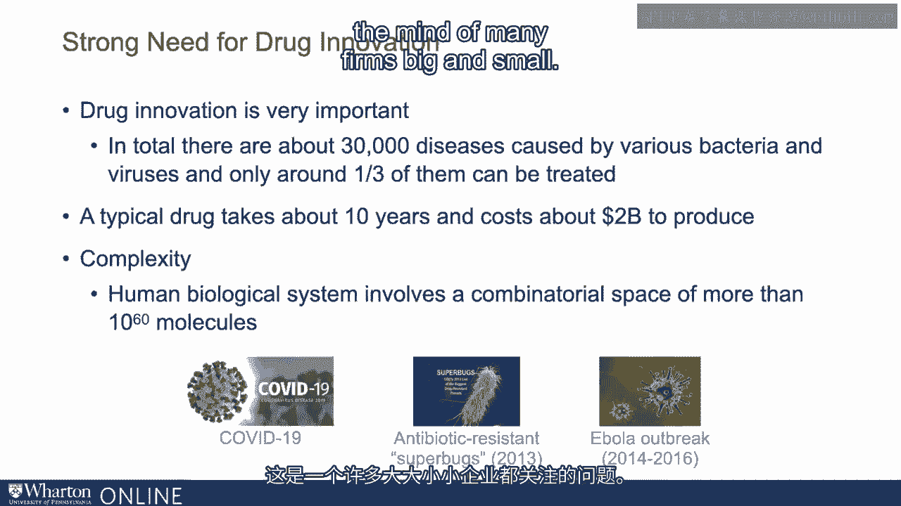
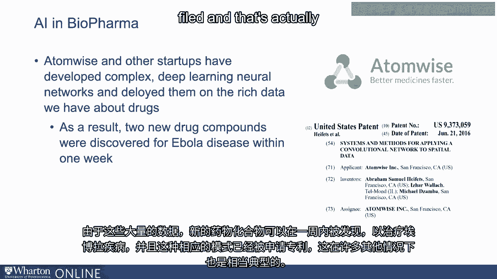
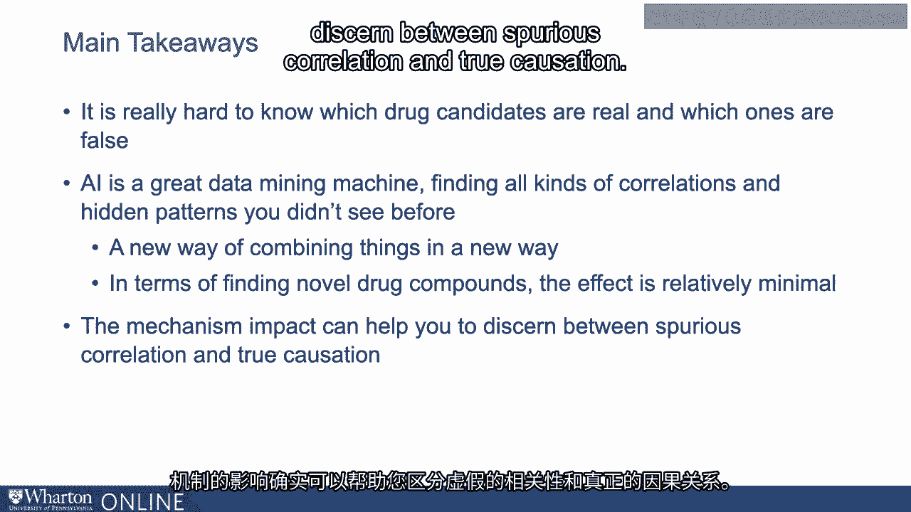
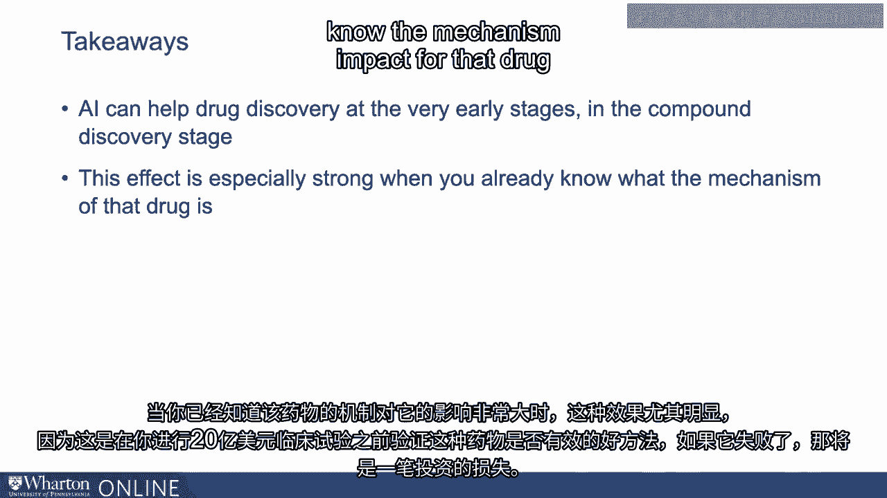
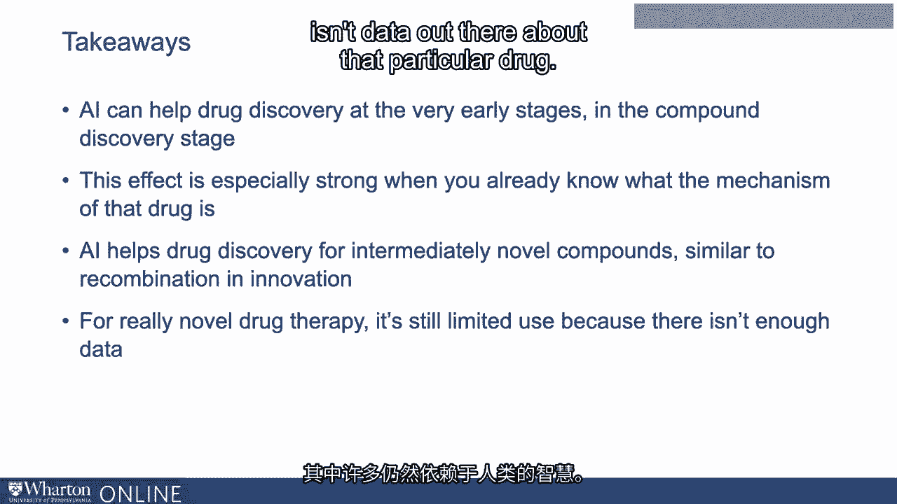
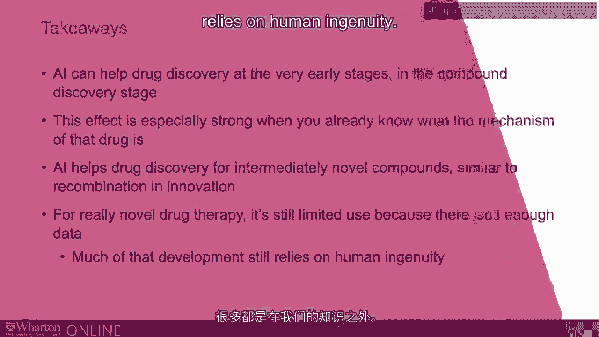

# 沃顿商学院《AI For Business（AI用于商业：AI基础／市场营销+财务／人力／管理）》（中英字幕） - P122：21_AI和药物的例子.zh_en - GPT中英字幕课程资源 - BV1Ju4y157dK

 So in the prior videos， I explained how AI can affect innovation， what type of innovation。

 how organization structures， from practices， employment change， managerial change are all。

 needed for firms to really effectively leverage AI。 That may seem a little abstract。

 even though I gave you many examples right away， for example， IBM Watson， Hallosine。

 the car chassis， the arts。 Let me provide a deep drive into the drug industry or pharmaceutical industry to give。

 you an example of what is really going on in that drug space。 Drug innovation is important。

 especially when we have just gone through the pandemic。 In total， there are about 30。

000 diseases by various bacteria viruses， and only a third， of them can be treated。

 And drugs are extremely expensive to produce。 It takes about more than 10 years。

 and a typical drug costs $2 billion to produce。 As in part。

 that complexity of this drug discovery is very， very， very large。

 The human biological system is extremely complex， and that involves a combinatoric space of more。

 than 10 to the 60th molecules。

 And because of that， we've seen the COVID-19 pandemic， we've seen superbugs， anti-resistant。

 superbugs， we've seen Ebola outbreak a few years earlier。

 And I'm going to show you how AI can potentially address these issues。

 This is an issue that's been the mind of many， many pharma firms， big and small。

 And for them， AI has ability to correct and interpret external data and learn from such。

 data and use these learning to achieve a specific goal and tax is critical。

 So what is the fact of AI on drugs？ How do we use AI to exploit data about a known drug compound and predict whether that compound。

 actually can be developed in a drug that a human can consume safely？

 Atomize and many other startups have developed complex deep learning neural networks and。

 deployed them on the rich data we have about drugs， about biological interactions， about。

 medicine。 As a result of this large corpus of data。

 two new drug compound can be discovered for Ebola。

 disease within one week and this corresponding patent has been filed。

 And that's actually quite typical for many other conditions as well。

 And this is the AI investment pharma industry。 It mirrors a larger trend。

 especially in the more recent years。 There's a huge AI investment by our pharma firms。

 And what we are really interested in is drug as innovation。

 To what extent do AI can really help solving this really long complex innovation process？

 And remember in our general studies， we shown that AI is really great at finding recombination。

 innovation or intermediate novelty in terms citations， like it's best at the sweet spot。

 between 50-60% coming from your own knowledge and 50% from 40-50% from other people's knowledge。

 We replicate this for drug novelty。 So here， drug novelty is measured by chemical novelty in terms of how it's a structured。

 novel compared to all of these same chemical compounds out there。 And interestingly。

 we find very similar things， even though it's not exactly the same measurement， of recombination。

 then we find that generally， AI is great at the middle range。

 So AI is not great at finding really brand new chemical compounds that you haven't seen， before。

 It's effective for incremental but not as great。 But the biggest thing in the book is with an intermediate level。

 AI really can help you pharmaceutical firms finding drugs and intermediate level novelty。

 And if you think about intermediate level novelty， it's probably likely to be some kind。

 of recombination innovation。

 And remember， AI and analytics is really a pattern machine。

 It finds all kinds of correlations and uses those correlations to make predictions。

 But we all know that correlation is not causation。 And if you find the wrong correlation。

 that means a $2 billion mistake in the drug industry。 So even though it can come up with many， many。

 many different possibilities of potential， chemical compounds in addressing a disease condition。

 many of that correlation could just， be spurious。 It may be wrong。

 So how do we know which one's which？ Because the fact can be dramatic。

 AI could have a negative effect on drug innovation if a wrong target or wrong compound。

 was being picked for further development。 So we looked at this issue by classifying these drugs compound into do we know about。

 the mechanism impact on how they target or treat a disease or if we don't know the mechanism。

 So we look at AI's effect on these drugs or these new chemical compounds that we discovered。

 through AI。 So the first bar is the case is when no mechanism is being found。

 So we don't know the mechanism impact on how this particular drug targets these。

 But many drugs we know it works but we don't exactly know how。 If we do know exactly how。

 maybe it's easier to create drugs。 That's why we sometimes a lot of disease caused by virus is a very difficult treat because。

 the mechanism shifting where we don't know exact mechanism。

 We're bacteria we do know because we know how antibiotics kills bacteria。

 In that case we do know what a mechanism is。 So look at the first bar when no mechanism is known you see that AI's effect is minimal。

 It's almost it's pretty much zero。 So AI does not help you find compound when you don't know the mechanism impact。

 It makes sense because you're blind looking for correlation you don't know which one。

 correlation is right and whatever correlation you find may be spurious。

 However if you do know the mechanism in the case of bacteria， halosine， when you find。

 one you know it will work。 You know why it will work。 Okay。

 When you have the ability to verify because you have known the if you already know the。

 mechanism and AI can have a great effect。 Okay。 But even with the known mechanisms you see that in terms of chemical novelty in like。

 three graphs， really the middle medium novelty that's driving the fact。

 Even if you know the mechanism if it's really incremental effect， basically the chemical。

 compound is incremental improvement of existing one and its effect is relatively small。

 Positive is relatively small。 And when it's very novel， very new， again the effect is almost zero。

 And most of the fact that we've seen AI's effect on known mechanism come from drugs。

 and it goes into intermediate novelty。 So the main takeaway is that it's really hard to know which drug candidates are real。

 which， ones are false。 Again， AI is a great data mining machine。

 finding all kinds of correlation and pattern， and hidden links you have never thought about before。

 you've never seen before。 For example， a new way of combining things in a new way。

 Or a way to link to a thing you haven't seen before。

 But in terms of finding really novel drug compounds， that's just， you know， then the。

 effect is relatively minimal。 But again， it's not saying that this new combining and new thing in a new way is not beneficial。

 They're extremely beneficial。 This is how we find Hellesine potentially helping us address a next superbell problem。

 This is how we find a COVID-19 vaccine using AI。 That's because they're not necessarily radical。

 There's because they're new way of combining things。 This still means this is extremely useful。

 But the key here is to think about whether innovation is really a recombination innovation。

 whether you've already known the mechanism of how it affects the disease。

 That mechanism impact really helps you to discern between spurious correlation and true， causation。

 And the way we think about this novel innovation， really the first of this new type， right？

 If you think about it， right， as I mentioned before in our earlier study， we don't see。

 in patent study。 We don't see AI's effects on this first of its kind innovation。 Remember。

 indeed in a prior video， the first technology of his class。

 And if you think about how AI can affect these class of innovation， in drug case， it's hard。

 because they're so new， they're very limited to data about that particular drug， about。

 that particular condition。 And there's lots of tacit knowledge in the clinical experience of people。

 right？ And that's not exactly codifiable。 And it's very limited in terms of what AI and machine learning and data analysis can do。

 to aggregate and detect patterns when this tacit knowledge cannot be used because it cannot。

 be codified。 If you think about breakthrough drugs， the novel therapy for malaria。

 this is discovered， by Dr。 Yu Yu 2。 She's a 2015 Nobel laureate， okay？

 This drug come from a single line of ancient Chinese text， okay， combined with her clinical。

 expertise and deep understanding of malaria conditions。 This is how Dr。

 Yu Yu 2 linked that single line of ancient text to the creation of the， first malaria drug therapy。

 Again， in this case， AI really can't do much。 Limited data， even there's more than one line of data。

 you know， AI's can't use that。 They need a lot more data than that。

 And lots of this clinical experience， tacit knowledge， just not codifiable for AI to use。

 Maybe one day they are。 When they are ready to be used， maybe we can't make breakthrough。

 but right now tacit knowledge， are not codifiable yet。

 And they're very limited things we can do to use AI for this type of discovery。

 So the main takeaway is that AI can help drug discovery at a very early stage and can't。

 mount discovery stage。 And the mechanism for doing that is that it can go through millions of compounded in a。

 very short amount of time。 I'm finding lots of correlation。

 lots of patterns that you haven't seen before。 And this pattern are critical to generate hypothesis about specific drugs。

 And the fact is especially strong when you already know the mechanism impact that drug。

 is。 Because that's a great way to verify if this drug works or not。

 Before you go down a $2 billion path in clinical trials and figure out whether this thing works。

 or not in the clinical trial， then it is failing。 That is investment down the drain。

 And we've seen that in general innovation using patent data， the AI really helps drug。

 discovery by finding the intermediate novel compound。

 And that are pretty much similar to recombination innovation。 But for really novel drug therapy。

 by novel mean chemical novelty， it is still limited。

 use because there isn't data out there about that particular drug。

 And much of that we have almost still relies on human ingenuity。 [BLANK_AUDIO]。

