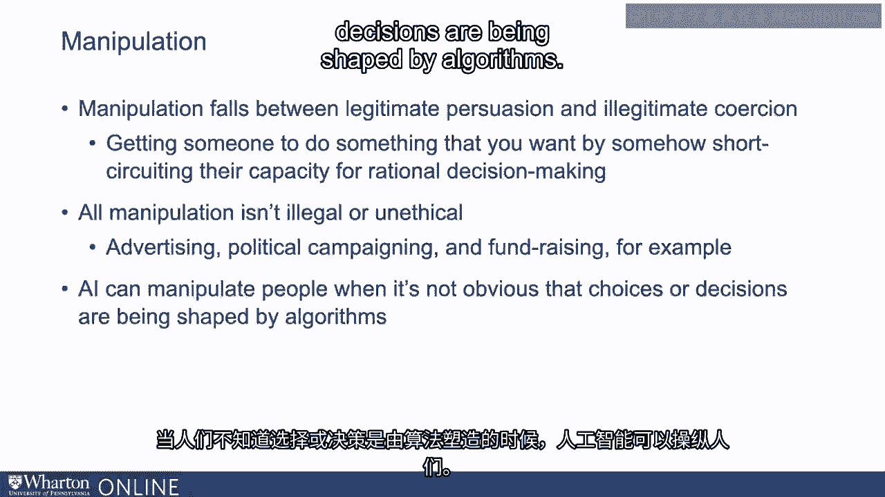
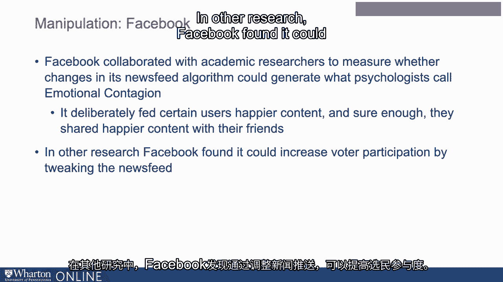
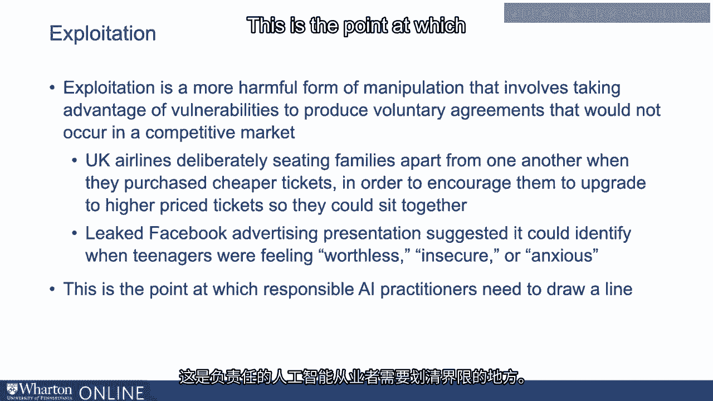
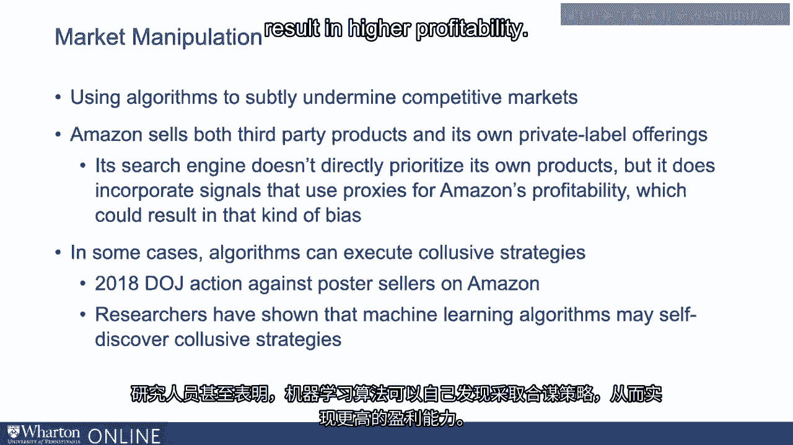

# 沃顿商学院《AI For Business（AI用于商业：AI基础／市场营销+财务／人力／管理）》（中英字幕） - P125：24_操纵.zh_en - GPT中英字幕课程资源 - BV1Ju4y157dK

 Manipulation falls between legitimate persuasion and illegitimate coercion。

 It means getting someone to do something that you want by somehow short-circuiting their。

 capacity for rational decision-making。 All manipulation isn't illegal or unethical。 Advertising。

 political campaigning， and fundraising involve pushing people's buttons to get them。

 to take actions。 They might not have if they stopped and thought through them logically。

 Or maybe they would， but they didn't realize someone was deliberately influencing their， choices。

 So the line between merely creepy and unethical， or even illegal， can be hard to draw。

 But it's still an important one to understand。 AI can manipulate people when it's not obvious that choices or decisions are being shaped。

 by algorithms。

 For example， Facebook sparked a firestorm when it collaborated with academic researchers。

 to measure whether changes in its newsfeed algorithm could generate what psychologists。

 call emotional contagion。 Facebook deliberately fed certain users happier content。 And sure enough。

 they shared happier content with their friends。 When the academic paper was published， though。

 it provoked outrage。 Facebook was deliberately changing users' moods。

 If they could make people happy， they could also make them sad， or perhaps depressed。

 In other research， Facebook found it could increase voter participation by tweaking the。

 newsfeed。 What if it subtly shifted content to favor one candidate over another？

 Users would never know that their votes were being influenced。

 One of the challenges here is that everything you see on the Facebook newsfeed is the result。

 of algorithms。 And they're changing all the time。

 Would Facebook showing you more post about climate change be manipulative？

 If the company's executives believe that would be good for the world？

 Or if they did so because they think they'll earn more revenue from electric vehicle ads？

 Some forms of manipulation， though， are legally prohibited。

 Those are categories like false or subliminal advertising。 Those， however。

 are generally defined pretty narrowly。 The major legal concept that's relevant here beyond those examples is deception。

 It's perfectly fine to market a product to customers that you think they want to buy。

 even when it's personalized through AI。 Because users understand advertising is about selling them things。

 The problem comes when the nature of the relationship isn't obvious。

 Then there's exploitation。 That's a more harmful form of manipulation that involves taking advantage of vulnerabilities。

 to produce voluntary agreements that would not occur in a competitive market。 In the UK。

 for example， airlines used algorithms to deliberately seat families apart in the。

 plane when they purchased cheaper tickets that didn't give them the right to select， their seats。

 That was a way of encouraging those people to upgrade to the higher-priced tickets where。

 they could sit together。 But the algorithm was deliberately separating them in the plane as a result of generating。

 that effect。 Now， that was a pretty simple algorithm。 It just looked at last names。

 But one could imagine more devious systems that identified users in times of stress or， difficulty。

 An infamous leaked Facebook advertising presentation suggested it could identify when teenagers。

 were feeling worthless， insecure or anxious。

 This is the point at which responsible AI practitioners need to draw a line。

 In addition to the likely PR backlash， if you wouldn't consciously design a business。

 practice to exploit vulnerable people， you shouldn't do it through algorithms indirectly。

 And then there is market manipulation， using algorithms to subtly undermine competitive， markets。

 Amazon， for example， sells both third-party products and its own private label offerings。

 Its search engine doesn't directly prioritize its own products。

 But it does incorporate signals that use proxies for Amazon's profitability， which could result。

 in that kind of bias。 So the question is whether that is impermissible manipulation of the market for products on。

 Amazon。 Or in some cases， algorithms can engage in collusion， which is generally prohibited under。

 antitrust competition policy laws。 In 2018， the U。S。

 Department of Justice brought an action against poster sellers on Amazon。

 because their algorithms were deliberately colluding to keep prices high。

 Researchers have even shown that machine learning algorithms can figure out on their own to。

 engage in collusive strategies which result in higher profitability。

 So what should you do then to address all of these concerns about manipulation？ As I've said。

 there's no bright line defining manipulation。 Except maybe in some of those market manipulation cases where general principles of antitrust。

 or competition policy， as it's called in some countries， can be applied。

 The question you should ask though is whether the objectives of your AI system are creating。

 mutually beneficial relationships with your stakeholders。

 Are people getting what they would likely choose on their own if they understood the。

 nature of the relationship？ Or are you essentially tricking them？

 In the context of academic research on human subjects， a standard set of principles were。

 developed in something called the Belmont Report in the 1970s。

 The four main elements are first informed consent， meaning users truly understand what they're。

 getting into unless it's something that involves no real risk of harm to them。 Second， beneficence。

 which is basically a do not harm principle。 Do not put people in a position where they could be exposed to serious physical or psychological。

 harm。 Third， justice， which is the idea of not being exploitative， not taking advantage of people。

 in vulnerable situations and the system being implemented in a fair way。 And finally。

 a dedicated review board。

 In universities， this is called IRB， Institutional Review Board， which has to approve before。

 any academic research on human subjects can commence。

 It doesn't make sense to subject every AI project， especially in the private sector， to。

 that level of scrutiny。 But many organizations find it helpful to have a dedicated center of excellence or committee。

 to evaluate these and other ethical questions about major AI implementations。 That， however。

 shouldn't come at the expense of defusing responsible AI throughout the。

 organization。 Everyone involved should feel responsible for avoiding unethical manipulation and exploitation。

 as well as algorithmic bias and other concerns that I've highlighted in this program。 Thank you。

 [end of transcript]， [ Silence ]。

