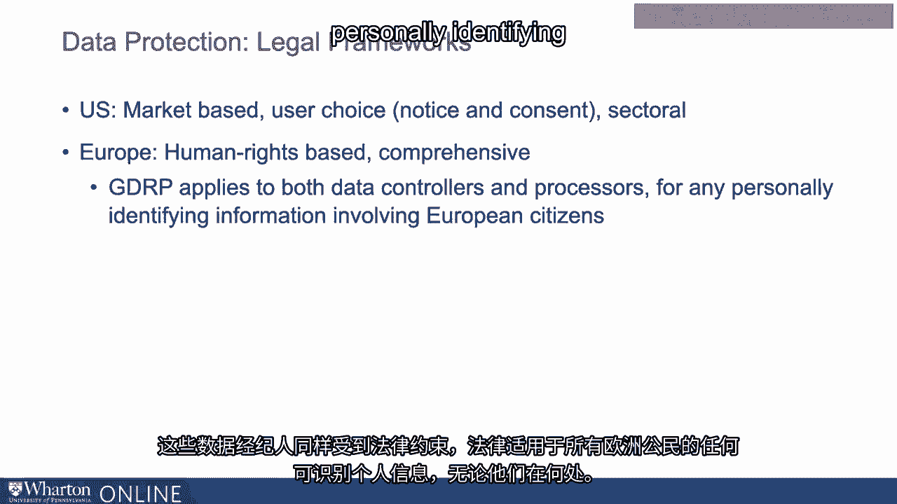
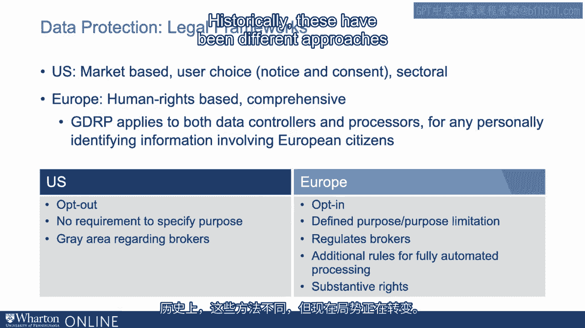
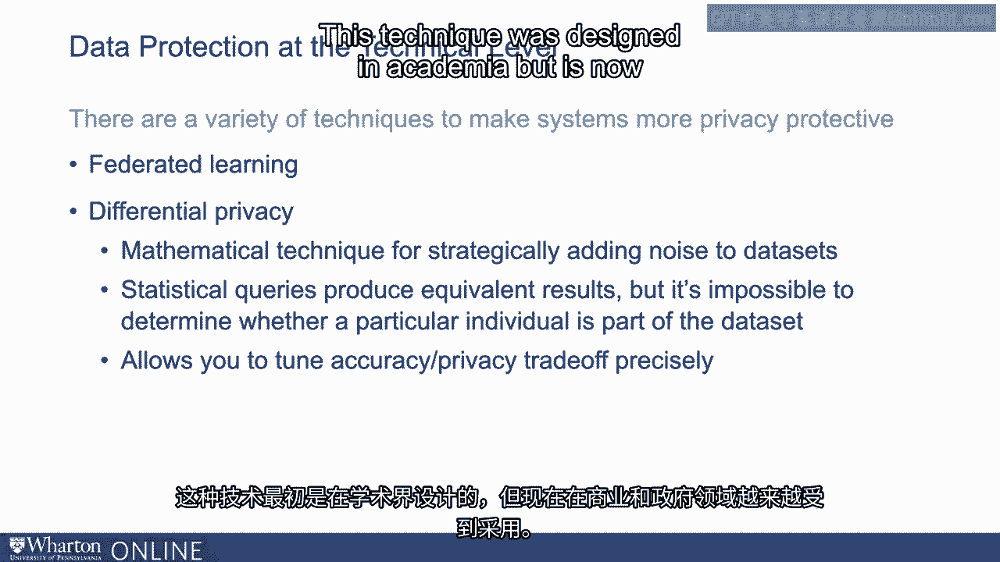

# 沃顿商学院《AI For Business（AI用于商业：AI基础／市场营销+财务／人力／管理）》（中英字幕） - P126：25_数据保护.zh_en - GPT中英字幕课程资源 - BV1Ju4y157dK

 AI and analytics depend on data， big data。

 You've learned in this program about some of the techniques for aggregating， analyzing。

 and applying data to drive machine learning and other types of algorithms。

 At the same time as AI has taken off， however， there has been growing concern around the。

 world about digital privacy。 Governments are increasingly concerned about what the scholar Shoshana Zuboff has labeled。

 "surveillance capitalism。"， The business models that see personal data as a resource to be exploited through ever。

 more sophisticated personalization and targeting。 It's worth noting that these issues have been around for a long time。

 Ever since databases were widely applied in business in the 1960s， there have been concerns。

 about how that power might be abused or might violate fundamental rights。

 However， big data and machine learning raise novel data protection issues。 First of all。

 they require so much data。 The value of machine learning often comes from the ability to employ massive data sets。

 And more data means more that needs to be collected from more people。

 And more opportunities to integrate different data sets and different pieces of information。

 which individually might not be so concerning but overall build a comprehensive profile of。

 an individual。 Second is the possibility for what are called inferential privacy violations。

 With machine learning and other data analysis techniques， sometimes you don't even need。

 to ask someone for a piece of personally identifiable or sensitive information in order to figure。

 it out。 For example， the researcher Michael Kaczynski built an algorithm that was able to reliably。

 predict sexual orientation based on Facebook profile photos。

 The system didn't need to collect gender or sexual orientation information directly from， the users。

 It just figured it out by association。 This is a murky area， both legally and ethically。

 Users often care。 Users often think if you're able to figure something out and target me based on a sensitive。

 characteristic that it's similar or equivalent to a situation where you had deliberately。

 asked me for that information。 The third new issue with AI machine learning is that models often require significant data。

 transfers in order to be updated。 When data is collected from many users。

 for example from activity on phones and then aggregated， in the cloud and processed there centrally。

 then there has to be all of this transfer， of that personal data across the network and storage in the cloud。

 There are， however， some new techniques being developed to moderate this problem， especially。

 one called federated privacy， which allows for models to be updated without necessarily。

 transferring all of the personal information from the end user devices。

 The first thing to recognize about data protection in general is that it's not just an issue。

 of collection。 There are five stages of what's called the privacy life cycle。

 each of which is important， to consider in development of your AI solutions。

 The first stage is collection。 That's the obvious one about getting the information from users。

 The second one is aggregation and analysis。 Sometimes the issue is not just what information is collected but what's done with it。

 As I talked about， sometimes users may only give a small bit of information but that data。

 set is integrated with other data sets collected in other places。

 And sometimes it's the analysis and the feature engineering of the data which ultimately brings。

 out the concern about privacy。 The third step is storage。 And this is one that's often ignored。

 If you are using a large data set in order to derive machine learning algorithms， then。

 that data set becomes a huge security risk。 We usually think of security as different from privacy but the more private data you。

 have， the more concern you should have about security。

 Even if you're not doing something that is illegal or unethical， if your data gets hacked。

 and the private data gets exfiltrated， then that becomes a huge problem。

 So storage and maintenance and decisions about what data you store and keep become critically。

 important as a matter of privacy。 Fourth is use。 Sometimes the collection of the data is fine but the data gets used for reasons that users。

 might be concerned about。 If for example your medical practice collects very sensitive health data from you。

 you might， be okay with that。 It's necessary for your medical treatment。

 But if they then sell it for profit to an aggregator that uses it for marketing other products。

 for it to you， then you might be concerned。 You didn't think that was an appropriate use。

 The scholar Helen Nissenbaum has an influential concept about this called contextual integrity。

 People want the data to be used for the context that they accepted it being collected for。

 And the final stage of the privacy lifecycle is distribution。

 Where does the data go if companies transfer it or resell it？

 Manufacturing data is the foundation of a huge economy of data brokers。

 It's not generally per se illegal if it's authorized under the contracts for collection。

 and transfer data。 But it's an issue that users are often very concerned about and also it's an issue that。

 raises additional security concerns。 What if you are very good about what you do with data but then you transfer it to a third。

 party which isn't？ That becomes a problem。 So five stages that you need to think about。

 Basically there are two dominant approaches to privacy law。

 The US based approach and the approach that developed mostly in Europe but has been adopted。

 in many other countries around the world。 The US approach is generally market based。

 The idea is to create a functional market where there are transactions。 There's not market failure。

 People are not abused。 People don't have data stolen from them。

 But as long as there is basic notice and basic consent the idea that users have some choice。

 Under the US approach that is a legitimate market for data。 And the US approach is also sectoral。

 There is not today a comprehensive US data protection or privacy law。

 There are rules that apply in specific sectors like healthcare or consumer finance and a。

 general backstop under the Federal Trade Commission which is about consumer protection in general。

 but it has been applied in some cases to privacy。 That's the general foundation of the US approach。

 The European approach is very different。 It's based on human rights。

 Based on the starting point that data is fundamental to our humanity and this is about。

 basic human rights。 It's comprehensive。 Human law applies to all kinds of collection in all potential cases。

 And it applies to all kinds of actors。 The general data protection regulation which is now the major privacy law in the European。

 Union applies both to what are called data controllers。

 Those who collect data as well as third party data processors。

 These data brokers are equally subject to the law。

 And it applies to any personally identifying information or something that could become。

 personally identifying about any European citizens wherever they are。

 So it's much broader and more comprehensive and more detailed than the US approach。

 There are a variety of differences between these two frameworks。

 For example the European framework is opt in。 There has to be explicit authorization from the user before data gets collected。

 And it has to be for a defined legal purpose。 You can't collect data and not know what you're using it for。

 You have to show that you had a legitimate reason for collecting it。

 And then you have to limit what you do with the data to that purpose unless you get further。

 consent from the user。 In the US the general default standard is opt out。

 And there's not a general requirement that you specify the purpose for which data is， collected。

 Europe explicitly regulates brokers as I said whereas in the US they're kind of in a gray， area。

 Europe has additional rules for what's called fully automated processing。

 When an algorithm makes a decision entirely for an important or legally significant consequence。

 There's specialized rule there for what rules there for what can be done with the data。

 And then Europe has a whole set of substantive rights。 Explicit rights that you have。

 For example the ability to go in and correct information about you that's incorrect。

 And what's called the right to be forgotten。 The right to ask for certain data to be removed from databases。

 So historically these have been different approaches。

 But really the tide is turning。 The world is moving to something much closer to the European approach。

 I call it the European approach。 But laws that look much more like GDPR than the US approach apply in many other major jurisdictions。

 such as Japan， South American jurisdictions， even China which is a huge market that many。

 people think of as not having significant concerns about privacy。

 China both the Chinese government and consumers。 People in the private sector in China have serious concerns about privacy that's collected。

 for data that's collected by private companies。 The privacy of data from big Chinese digital platforms like Tencent and Alibaba。

 And China now has data protection laws that while certainly not the same look somewhat。

 similar to the comprehensive set of rules in Europe。

 So most of the rest of the world has comprehensive privacy laws and the US is moving in that direction。

 There have been several initiatives towards comprehensive privacy laws at the federal level。

 in the US and there have been laws adopted in the states。

 Notably the California Consumer Privacy Act which impose more significant explicit right。

 space restrictions on data collection。 There's also movement in Europe and other jurisdictions to go further to require more。

 explicit protections for AI systems when they involve high risk data collection。

 For example medical data collection or data collection that's at greater risk of leading。

 to discrimination and bias。 So we seem to be seeing something of a race to the top。

 We seem to be seeing around the world countries and other jurisdictions that have less protection。

 for privacy moving to have more protection and multinational companies if they have to。

 either comply with the most stringent rules in major jurisdictions or have multiple systems。

 are generally making the decision let's implement something once that's more protective around。

 the world。 So this is something that you need to understand of course what the rules are in your particular。

 jurisdiction but be aware that the requirements in practice you face may be stronger。

 And the European GDPR by the way applies to data on European citizens anywhere so you。

 might be a country incorporated somewhere else and still be subject to those rules。

 Non-legal compliance though what should you do？ In building an AI project it's crucial to consider data protection at two levels the。

 technical level and the operational level。 As I've already mentioned there are a variety of techniques to make systems more privacy。

 protective。 Federated learning is one of them。 Another important one is differential privacy。

 differential privacy is a mathematical technique for strategically adding noise to data sets。

 As a result statistical queries produce equivalent results but it's impossible or more difficult。

 to determine whether a particular individual is part of the data set。

 Just doing the query doesn't leak information about a user being in the data set and differential。

 privacy allows you to tune just how protective it is because there is a trade-off。

 Putting more noise into the data making it more privacy protective can make it less accurate。

 So with differential privacy different projects can decide how much privacy protection they。

 want to implement。 This technique was designed in academia but is now increasingly adopted in commercial and。

 governmental context。 Uber for example uses differential privacy for internal queries about rider data。

 Apple uses differential privacy for data that's collected on the iPhone。

 And the United States Census is using differential privacy for the data sets that's it's collecting。

 massive data sets about everyone in the United States in the 2020 US Census。

 Another technique that you can apply going beyond these technical mechanisms is to think。

 about the operational level。 The operational level is about the business techniques。

 the mechanisms in practice that， you use， what you do in your organization as a business matter around your data collection。

 and your AI system development above and beyond the technical design decisions。

 There's a major concept in this area called privacy by design。

 It was first introduced by Anne Kavukian who was then the privacy commissioner of Ontario。

 Canada but it's now formally incorporated into the European GDPR and other mechanisms。

 The idea of privacy by design is that you should incorporate privacy and data protection。

 considerations into every decision involving personally identifiable or potentially personally。

 identifiable data。 You do that at every stage of the process。 Remember。

 privacy and data protection is not just about collection， it's about all those， five stages。

 If everyone on your team is aware of these kinds of risks and thinking about where something。

 could be problematic， you're much more likely to avoid a controversy。

 There are also formal mechanisms such as data impact assessments that can be applied。

 Two laws such as the proposed algorithmic accountability act in the United States would。

 require these mechanisms。 It's similar to a concept of environmental impact assessments that have been used for。

 decades in environmental protection requiring formal reports that identify risks of data。

 leakage for a major or high risk system to be implemented。

 But that doesn't make sense for every system， it would be too much overhead。

 There just needs to be a decision about when a formal process needs to be implemented。

 The most important principle for privacy and data protection is to see them as pervasive。

 They are not just a one-time box you have to check。

 I'm privacy compliant。 There may be specific legal requirements you need to meet but you need to always be thinking。

 what could happen here？ Where could something go wrong？

 Where could I do everything right but a third party or an attacker gets access to data and。

 I get blamed by my customers。 You need to take privacy into account at every stage of the process。

 [BLANK_AUDIO]。

