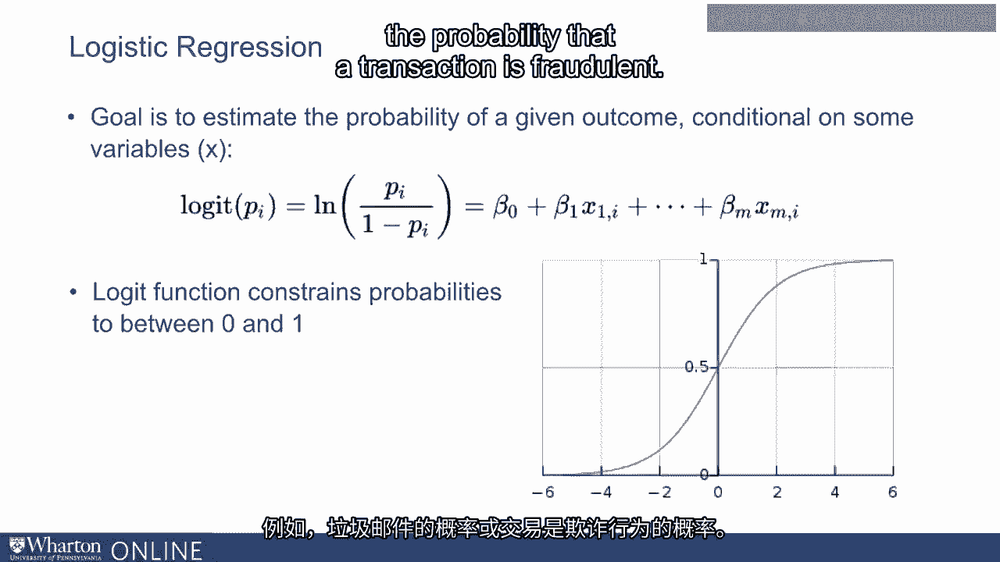
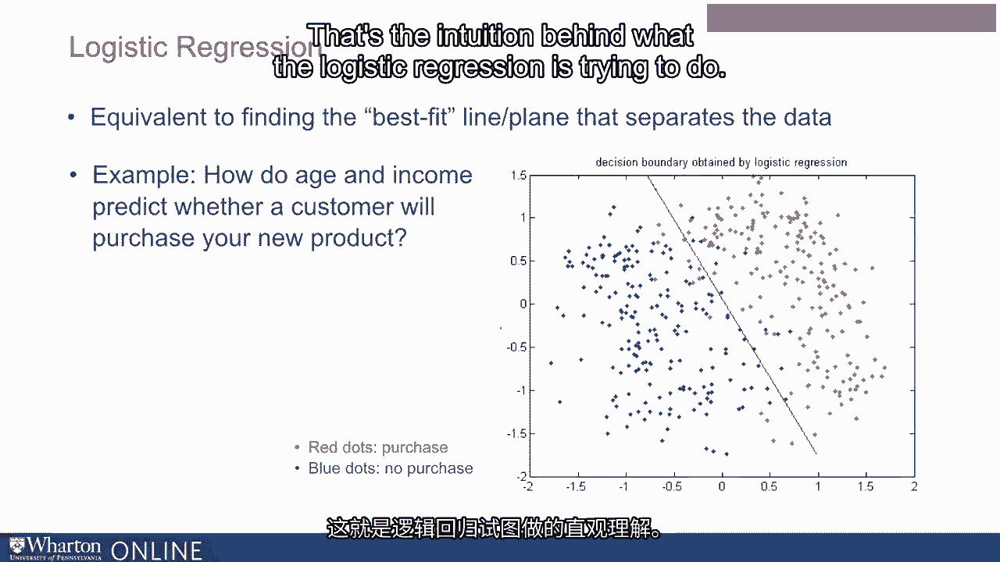
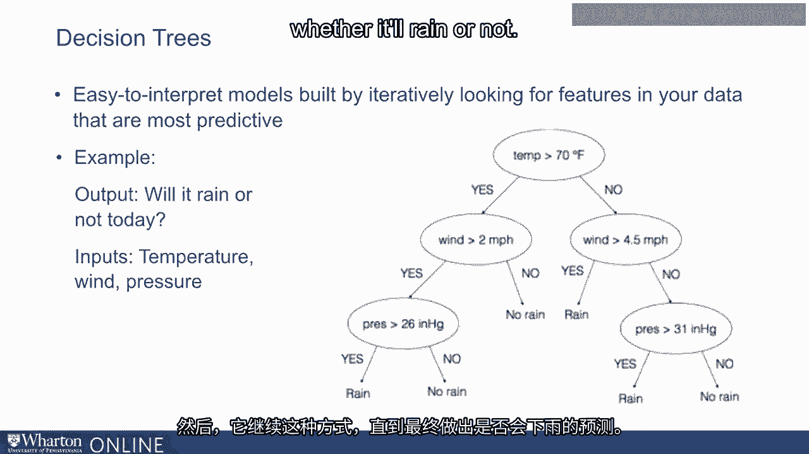
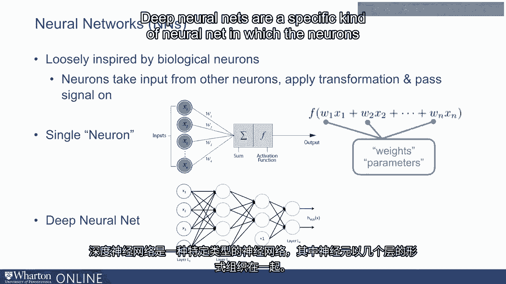
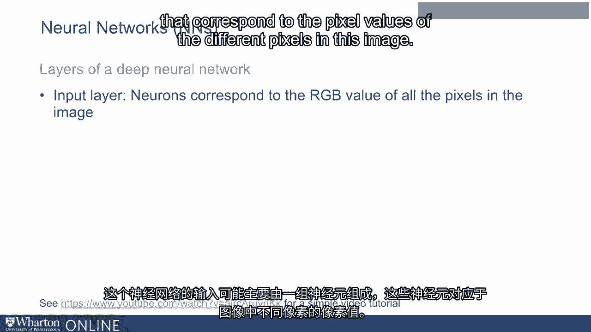
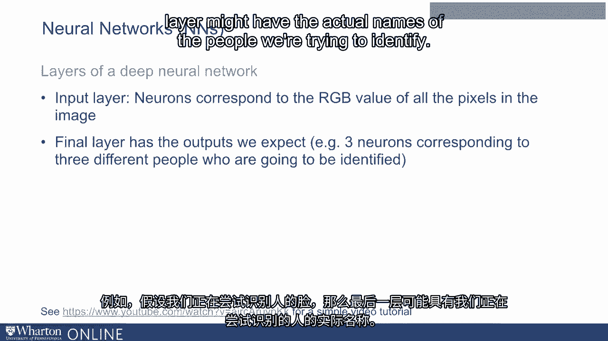
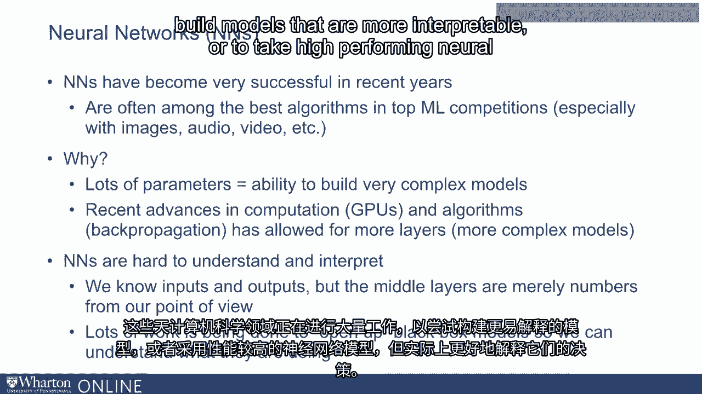

# 沃顿商学院《AI For Business（AI用于商业：AI基础／市场营销+财务／人力／管理）》（中英字幕） - P12：11_具体的机器学习方法深度潜水.zh_en - GPT中英字幕课程资源 - BV1Ju4y157dK

 In this lecture， we're going to deep dive into some machine learning models and look at how exactly they work。

 Now， one warning I'd like to offer is that this lecture is perhaps going to be more technical than probably every other lecture in this course。

 For those of you who don't have an experience or background in data analysis。

 you might find this lecture harder to understand than some of the other lectures。

 I think it's okay if you don't understand everything I describe in this lecture。

 high level understanding or even a qualitative sense of how these machine learning models work is perhaps sufficient。

 and will nonetheless be very useful for you as you interact with data scientists。

 And if not anything else， I hope you get that out of this lecture。 And of course。

 if you're able to understand the details of these models。

 then it'll be even more useful in your work when you interact with data scientists。

 So I mentioned previously that at the end of the day。

 given any set of input variables x and an outcome variable y。

 that the machine learning model is trying to predict。

 the job of a machine learning algorithm is to figure out some transformation or some function f that takes the input x and transforms it and makes a prediction of y。

 There are many different types of algorithms and each of them corresponds to a different choice of that function f。

 So in this discussion， I'll look at a few of these choices。 I'll begin with logistic regression。

 which is one of the simplest classification models。

 These models are useful for classifying or prediction problems where the outcome can take only a few values。

 For example， we're trying to predict whether an email is spam or not。

 So that's a yes or no decision。 Or we're trying to predict whether a consumer will click on an ad or not。

 That's again a binary decision。 Often logistic regression is built for binary models。

 but it is straightforward to extend logistic regression for situations where the outcome can take multiple but a finite small set of values。

 for example， four or five values。 Now logistic regression is one of the most useful and popular techniques used in data science and in statistics and is a very successful and effective approach for classification algorithms。

 Now one question that often arises when someone uses logistic regression is whether it is really machine learning or not。

 especially given that logistic regression actually has its origins in the 19th century。

 And has been used in the field of statistics for a long period of time。

 It is indeed true that logistic regression has a nice long history and in fact predates some of the modern developments in machine learning。

 But I would argue that that distinction doesn't matter。

 It is a very important technique that should be in the arsenal of all data scientists。

 Now essentially what a logistic regression is trying to do is given a set of input variables x1， x2。

 x3 and so on。 It's trying to predict the probability of a given outcome。

 Now in a binary prediction problem where there's only two possible outcomes that is whether an email is spam or not or whether a credit card transaction is fraudulent or not。

 then the logistic regression boils down to the function you see here where the log of the probability that an email is spam divided by 1 minus the probability of email being spam is a linear function of the input variables。

 And essentially the logit model or the logistic regression model takes the inputs x1， x2。

 x3 and so on and computes the probability of an event。

 For example the probability of spam or the probability that a transaction is fraudulent。

 Now one can intuitively think about a logistic regression as something that's trying to create a best fit plane or a line that is separating all our data。

 So for example if you look at this chart here we have data about customers。

 we have their age and we have their income。 Both of these are mean centered meaning that an age of zero indicates that this person has an age which is equal to the mean in the population。

 Any values of age greater than the mean have a positive value here。

 Any value of age that is less than the mean has negative value on this graph。

 Now both income and age are mean centered here and we have this data and we are trying to predict whether a customer will purchase a product or not。

 The red data points are essentially data corresponding to users who have purchased in the past。

 The blue data points correspond to users who have not purchased in the past。

 Logistic regression essentially is trying to figure out a line that partitions the data into two regions。

 One corresponding to customers who are likely to buy and another corresponding to customers who are likely to not buy。

 In essentially it tries many different ways of partitioning this plane。

 many different ways of placing a line on this graph and finds the best possible such line。

 That's the intuition behind what a logistic regression is trying to do。

 Another technique that is commonly used is a technique known as decision trees。

 Decision trees are very easy to interpret models and essentially what they do is they take the data and they create a tree that helps to partition our data into different groups。

 For example， suppose we are trying to predict whether it's going to rain today or not and we have data on temperature。

 we have data on wind speed and we also have data on the air pressure。

 Now we might use this past data where we have the input data meaning temperature wind and pressure on any given day and we have the output data meaning whether it's rain that day or not。

 Decision tree looks at the data and creates a tree that is trying to predict whether it's going to rain or not。

 In this tree you observe that the first step in this decision is to ask whether the temperature is greater than 70 degrees Fahrenheit or not。

 If the answer is yes， then next the decision tree looks at what is the wind speed and then based on the wind speed it proceeds。

 But if the temperature is not greater than 70 degrees Fahrenheit。

 it again looks at the wind speed but it looks at a different question whether the wind speed is greater or less than 4。

5 miles per hour。 And it proceeds in this manner until it eventually makes a prediction of whether it will rain or not。

 Of course， a natural question to ask here is how exactly did this model decide which variables to split on at each branch and also which value to use at each branch。

 For example， why did the tree decide in the very first branch to ask whether the temperature is greater than 70 degrees？

 Why not 60 degrees？ Now the mathematical answer to that question is that the decision tree selects the variables and the splits so as to minimize what's known as the entropy of the data set。

 In very simple terms， the idea is you want to choose a variable or a way to split your tree so that you have the maximum predictive power。

 In the first branch of the tree， the decision tree will consider all of our variables。

 meaning it will consider air pressure， it will consider wind speed and it will consider the temperature as well。

 It will try and figure out which one is most predictive of rain and it chooses that as the first branch of the tree。

 It continues in this manner and at each step it asks what is the way to partition our data so that we can best predict the outcome。

 And this is how decision trees work and they actually work quite well in practice。

 Another machine learning technique that is commonly used is random forest。

 A random forest is an example of what's called an ensemble algorithm。

 These are algorithms that combine multiple other algorithms to make their predictions。

 And a random forest combines multiple decision trees to make its predictions。

 Random forests are actually quite effective in practice and therefore they're also quite popular among machine learning and data scientists。

 The basic idea in machine learning is to take any data set and to randomly partition it into a bunch of smaller sub data sets。

 For each subset of the data you might train a decision tree that is trying to make the best possible prediction given the subset of data available。

 And now once you have multiple decision trees each trying to make the best possible prediction given the sub sample or the subset of data that is available to each decision tree。

 Then we ultimately combine the predictions of all of these decision trees and the combined prediction becomes the prediction of the random forest。

 So it's called a random forest because it combines multiple decision trees。

 So again let's consider an example here。 In this example we have a very large data set which consists of many features or many input variables。

 Now a random forest algorithm might break up that data set into multiple subsamples。

 Each subsample might have a different set of features。

 So the first decision tree is built using the features available in that subsample。

 The second decision tree is built using the data available in that subsample and similarly a large number of decision trees are made。

 Each decision tree tries to make a prediction。 For example each decision tree might predict whether a given credit card transaction is fraudulent or not。

 The random forest takes the prediction of all of these decision trees combines them。

 For example by saying it's going to use the majority votes or the most popular prediction and choose that as the prediction of the forest。

 And that's how random forest work。 Now what's interesting to note here is that each of the decision trees within a random forest actually use a subset of the data。

 And therefore each decision tree is not as good as a decision tree that is built with a complete data set。

 But when you combine multiple decision trees as part of a random forest together they tend to perform in practice better than an individual decision tree built on the full data set。

 In some ways this is like the wisdom of crowds or like prediction markets。

 The idea behind prediction markets or behind the wisdom of crowd is that if you take predictions made by a bunch of lay people and you combine them then the combined prediction of the crowd sometimes equals and sometimes might even beat the prediction of an expert。

 It is really interesting that a bunch of lay people together can beat the prediction of an expert even though individually each of these people cannot beat the expert。

 This is because each lay person has different information。

 has different decision making criteria and when we combine them we start to get something that looks like an expert or like true intelligence。

 A random forest is similar where it has multiple decision trees each of which has access to partial data and makes decisions based on the data available to each。

 Each of which is not a very good prediction model but when you combine these models you get a high performing random forest。

 And that is partly why random forest perform well and are used quite frequently in practice。

 Next let's talk about neural networks which is another advanced machine learning technique。

 Neural networks are loosely inspired by biological neurons。

 Now neurons in our brains take inputs from other neurons they apply some transformations to those signals and then they pass on a new signal to other neurons they are connected to。

 Similarly a digital neuron might take inputs from other neurons。

 It takes these inputs and applies some transformations to these inputs。

 So in this example on this slide the inputs are values x1， x2， x3 all the way to xn。

 Each of these inputs has a weight applied to it so you have w1， x1， w2， x2， w3， x3 and so on。

 And finally a transformation f is applied and a new signal or a new value is created and that is the output of the neuron。

 Neural nets essentially consist of many of these neurons that are interconnected with each other in the form of a network。

 Deep neural nets are a specific kind of neural net in which the neurons are organized in the form of several layers。

 Let's consider an example。 Suppose one is trying to use a neural network specifically a deep neural network to try and do face recognition。

 The input to this neural network might essentially consist of a set of neurons that correspond to the pixel values of the different pixels in this image。

 If it's a black and white image then each neuron might correspond to the value of the pixel in that image。

 If it's a color image then you might have RGB or red green blue values associated with that pixel and neurons might capture the values of these pixels。

 The final layer of this deep neural network essentially has the outputs that we want from the neural network。

 For example， suppose we are trying to identify people's faces then the final layer might have the actual names of the people we are trying to identify。

 In this image we have just three neurons in the final layer and so let's assume we are trying to identify three specific people in our face recognition task。

 In between the input layer and the output layer are a series of hidden layers。

 Now in a biological neuron when you have certain combinations of neurons firing then it causes certain other neurons that are connected to them to also fire。

 Similarly in a neural network based on the value of neurons in one layer certain neurons in the next layer get activated。

 So based on the values of the pixel in the input image some neurons in the input layer get activated。

 Now based on the pattern of neurons activated in the input layer some very specific neurons in the very next layer which is a hidden layer gets activated。

 In turn based on the neurons that are activated in hidden layer one certain specific neurons in the next layer get activated。

 And this proceeds in a certain manner until the penultimate layer has certain neurons that are activated。

 The hope is that through these series of activations we are capturing certain features of people's faces。

 So for example in the penultimate layer if the shape of a person's face is oval a certain layer might be activated。

 If the shape of their face is more round then a different neuron might be activated。

 If the shape of their eye is like an almond then certain layers might be activated。

 If the color of their eyes are a certain way then certain neurons are activated。

 Based on the combination of neurons that are activated then we can recognize the person's face。

 That is the idea behind a neural network。 Now essentially the hope is that this pattern of neuron activations captures certain aspects of people's faces。

 and ultimately based on the pattern of neurons that are activated we make a prediction which is who is exactly in a given image。

 Now neural networks have become very successful in recent years。

 In many machine learning competitions online with large datasets neural network actually ends up performing very well。

 And this is especially true when the input data consists of images or audio or video in other words unstructured data。

 Now if you look at why neural networks are so successful as we looked at the structure of a neural network we saw that it has many layers。

 Within a given layer there are so many different parameters for example the weights assigned to all the different signals that are coming in from a previous layer。

 the functional form or the transformation。 So there is indeed many parameters that allows us to build very complex models so that given any input x that transformation f of x can be quite complex。

 Also there have been lots of recent advances in computational power specialized processors known as GPUs have been developed。

 There are specialized algorithms that have been developed which allows neural networks to have more and more layers and allows us to build complex models。

 and yet estimate these models quite rapidly。

 Now even though neural networks come with a lot of horsepower and flexibility and high predictive performance。

 the flip side is that neural networks can be very hard to interpret and understand。

 So for example we might know the input layers we might know the output layers but the middle layers are hard for us to interpret。

 The face recognition task I mentioned the hope is that the middle layers are capturing ideas such as the shape of the face or the shape of the eye。

 In practice that's not always the case。 So looking at the previous layers will not allow us to understand why the neural network made a certain prediction。

 And thus even though you have very accurate models you have models that are not highly understandable。

 There's a lot of work going on these days in computer science to try and build models that are more interpretable or to take high performing neural network models but to actually interpret their decisions a little bit better。

 We will talk about the challenges with interpretations in a later module。

 Now I've mentioned several different machine learning techniques in this lecture。

 These are by no means exhaustive or even representing the vast majority of techniques。

 There are a bunch of other techniques out there for example boosting techniques。

 support vector machines。 Even neural networks can be of many different types and there are also other regression techniques。

 So regression techniques might be plain old regressions。

 There are other more advanced regression techniques like LASO and RIDGE weighted regressions and so on。

 For a detailed discussion of these techniques I would recommend that you can look at a computer science course or machine learning course and it isn't really in the scope of a course that's looking at business implications of AI。

 So I'm not going to go into the details of this model but hopefully you got a rough sense of what exactly is being done by these machine learning techniques where they take in input data。

 they make predictions and often based on cleanly labeled data that is available from past transactions or past data that can be used to train these algorithms。

 [BLANK_AUDIO]。