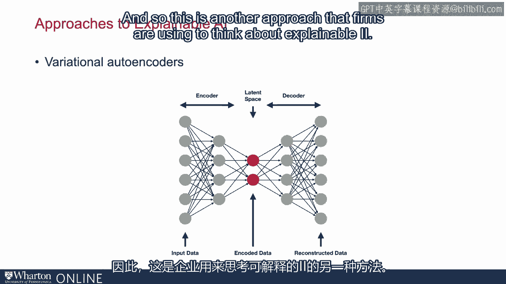
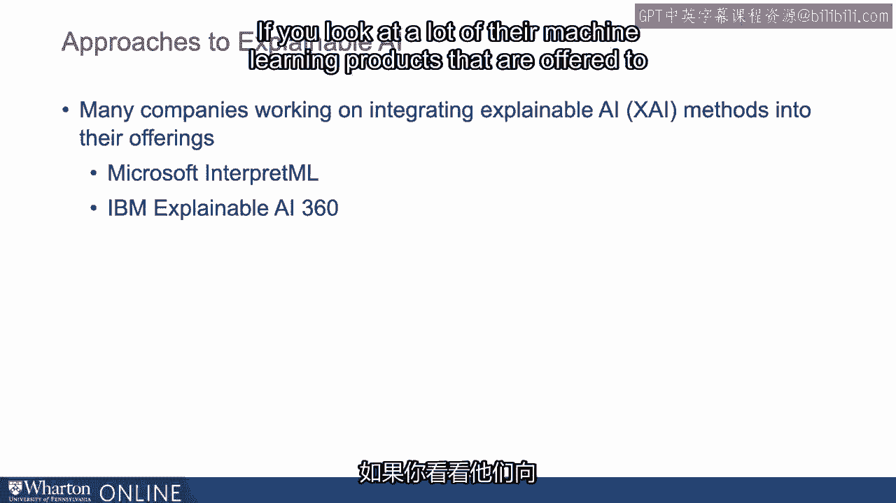

# 沃顿商学院《AI For Business（AI用于商业：AI基础／市场营销+财务／人力／管理）》（中英字幕） - P133：32_可解释AI的方法.zh_en - GPT中英字幕课程资源 - BV1Ju4y157dK

 Let's talk a little bit about some of the different approaches that are being taken to。

 make algorithms more explainable。 So I'll talk about a few。 One is called SHAP。

 short for Shapley additive explanations。 The idea behind SHAP is that if you have a number of variables or types of data that。

 are going into making predictions， what SHAP is going to do is kind of going to tell you。

 something about how much each of those variables matter for making the final prediction。

 It's going to kind of identify the role of the importance of each of those features for。

 making the final prediction。

 The goal of it is really to explain the prediction of an instance by computing the contribution。

 of each feature to the prediction。 So it's going to essentially what it's going to do is in turn swap out each different。

 feature to kind of see how the predictions change。

 And what you get at the end of that is essentially some indication of how important each of those。

 features was。 You can look at that and sort of say， "Well， when I think about a final decision。

 this， feature， this variable is really what mattered more。"， So from a demographic perspective。

 if you think about gender， if you think about age， and so on。

 it will tell you which of those things mattered most maybe for making a final。

 prediction so you can get a sense of what matters for the outcome there。 So that's SHAP。

 One approach is called Lyme， local interpretable model agnostic explanations。

 And the idea is to generate a simpler linear approximation to a more complex boundary for。

 the total data space you're dealing with。 So imagine you have a space。

 you have lots and lots of customers， and the model you're。

 using for prediction can really is really difficult to interpret across the entire customer， space。

 What Lyme will basically do is narrow in on a smaller set of customers that maybe look。

 similar and within that smaller set of customers， it'll be able to provide a way to explain。

 to those customers， at least in that little neighborhood exactly why the decision was。

 arrived at that's accurate， even if that may not translate to the larger set。

 So you can kind of start to tell people， compared to your people who look much like you， this。

 is why you were a little bit different and this is how the decision arrived， the predictive。

 model arrived， the decision that was slightly different。 So that's Lyme。

 it provides user interfaces that help make those kinds of decisions transparent。

 to people who are affected。

 A third approach is called surrogate decision trees。

 And the idea here is to generate a decision tree， which is a little bit easier to understand。

 that approximates a more complex model。 So think about a more complex model like a deep learning network。

 The idea behind a surrogate decision tree is to create a decision tree that mimics in。

 many ways the deep learning network and what it will output， but a decision tree is going。

 to be much easier to interpret than the deep learning model。

 And so the surrogate tree can be used then to explain the deep learning model in a way。

 that makes the application of that model much more explainable。

 Another application called variational auto encoders， these variational auto encoders will。

 take data and distill them down to some key features and these key features tend to be。

 much more interpretable than the raw data itself。 And so we think about raw data being put in and decisions coming out of a predictive。

 model。 There's an intermediate step where the data are boiled down to a set of interpretable。

 features。 And so this is another approach that firms are using to think about explainable AI。

 So there are a variety of different approaches that are being used to make AI systems more。

 explainable。 Different approaches have different advantages and disadvantages。

 but it's a very active space， right now。 Microsoft， IBM for instance。

 a lot of companies looking at integrating explainability into， their products。

 If you look at a lot of their machine learning products that are offered to customers， to。

 the cloud for instance， a lot of them are offering interpretability or explainability。

 in terms of their model output in a way that's going to matter certainly for adoption and。

 number of industry contexts。 [BLANK_AUDIO]。

