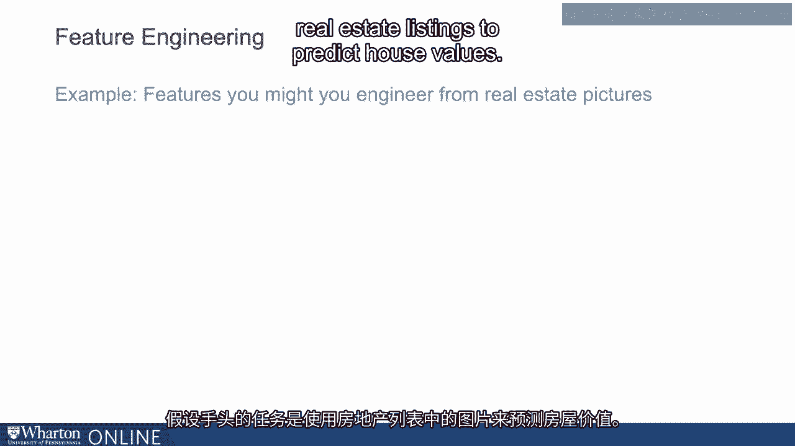

# 沃顿商学院《AI For Business（AI用于商业：AI基础／市场营销+财务／人力／管理）》（中英字幕） - P14：13_特征工程与深度学习简介.zh_en - GPT中英字幕课程资源 - BV1Ju4y157dK

 >> Hi。 My name is Prasana Thambay。

 I'm on the OID faculty here at the Wharton School。

 I teach courses related to analytics and to AI and on AI， especially related to business context。

 I do research on a number of different areas， particularly pertaining to the economics of technology。

 I have a particular interest as well in labor markets and， the application of AI to HR。

 Given a set of variables， machine learning algorithms are meant to allow the algorithm to learn a mapping。

 between these input variables and whatever it is that the algorithm is meant to predict。

 So imagine you have a column of variables or several columns of variables and。

 you're trying to use these to predict some type of output。 But what about unstructured data， right？

 It's the big revolution in prediction really has been around predicting from unstructured data。

 So think about things like online reviews or sound or pictures and images。

 How does data like that get converted into columns that can be then used to predict。

 some kind of outcome？ How do you pull out information from that unstructured data。

 convert it into something that could fit into a spreadsheet for instance， and。

 then use that to predict？ When data are not structured， when they're unstructured。

 like online reviews for， instance， you have to go through a process called feature engineering。

 Features have to be engineered from the data。 And what that means is you take the unstructured data and。

 you basically create or code individual features from that unstructured data。

 This is a time consuming and often fairly challenging process。

 And often requires also a fair amount of domain expertise。

 This is one of the most difficult parts in many ways of the machine learning。

 process and it's where data scientists really tend to spend a lot of their time。

 It can really be as much of an art as a science。 So let me give you an example。

 Let's say the task at hand was to use pictures from real estate listings to。

 predict house values。 So lots of pictures of house of a house of the different rooms in the house of the yard。

 maybe even of the neighborhood。 And you want to use the data in that picture to generate some kind of a prediction。

 of the house values。 So what you have to do is take these images， these individual images。

 and extract individual features or data you might use。

 variables you might use to be able to predict how much is the house。

 how much the house is really worth。

 So if we're taking these images and extracting features you might care about。

 when thinking about real estate value， this will require a number of different types of knowledge。

 It's not just a software development task because you would also need to know。

 what a realtor knows about things that matter。 What are you looking for？

 What are you looking for in terms of rooms， in terms of the layout。

 in terms of the lot and lot style， right？ And so all of those sorts of things require kind of a combination of knowledge。

 So if you think about feature engineering， in this case。

 it would require the knowledge of a realtor。 It would also require a software developer。

 They could work together to try to pull these things out of the images。

 to sit down together and say， okay， let's write something to pull out。

 relevant aspects of these images that might matter for predicting house value。

 But there's a good amount of guessing involved。 It's a time consuming task。

 And you're very likely to miss critical features that ultimately do matter。

 for predicting house value。

 Deep learning， which we want to talk about next， solves many of these problems。 [BLANK_AUDIO]。

