# 沃顿商学院《AI For Business（AI用于商业：AI基础／市场营销+财务／人力／管理）》（中英字幕） - P29：28_教学机器.zh_en - GPT中英字幕课程资源 - BV1Ju4y157dK

 Let's talk a little bit about no code tools and how they're making machine learning。

 deep learning， more accessible for more and more people so that people can take ideas。

 and implement them straight， and turn them directly into products and solutions that。

 can be widely used。 So a great example of a no code tool that makes deep learning relatively easy is Teachable。

 Machine。 And so I'm showing it to you here。

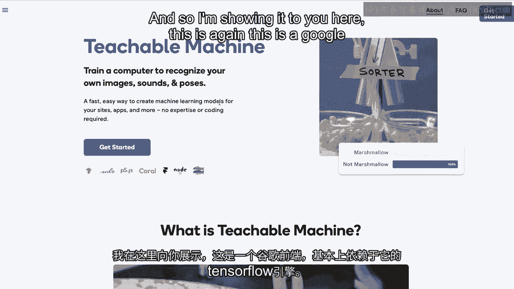

 This is， again， this is a Google front end here that basically relies on its TensorFlow。

 engine， which is a package that contains a lot of logic for deep learning。

 And so Teachable Machines called that because you can teach the machine， like any machine。

 learning algorithm， is a great front end to be able to use to try to play around a little。

 bit with deep learning。 So we're going to use Teachable Machine here。

 So as you see， you can train a computer in this context to recognize images， sounds， poses。

 I'm going to get started， and I'll show you how it works。

 All right， so we are on the Teachable Machine here。 We have a number of different models more。

 It says that are more coming soon， but we have some options here to do some different。

 kinds of deep learning based on images， image classification。 If you want to do audio。

 audio classification， pose classification， for instance， if you want。

 to teach it to recognize poses。 We'll start with images。

 We'll try an image project here。 I'm going to click on that。 Okay。

 so what we have here is an interface where we can essentially train the machine。

 the model to classify or recognize different types of images。

 There can be a number of different categories of images。 I'm just going to do two here。

 and I'll start with a simple example， which is teaching it， to recognize cats versus dogs。

 So as we talked about with machine learning， what you need as a starting point is a dataset。

 and that dataset has to have a lot of examples。 It's going to have a lot of examples in this case of images。

 and those images of pets， and， those pets will be classified as being a cat or a dog。

 Once I feed that data into the deep learning algorithm， it should， from that point on， be。

 able to learn or identify any future images what a cat is or what a dog is。

 The way I'm going to do that is I'm going to upload images of cats into category one。

 I'm going to image， upload images of dogs into category two。

 And so that's basically implicitly saying here are a bunch of images of cats and dogs。

 to start with as a training dataset。

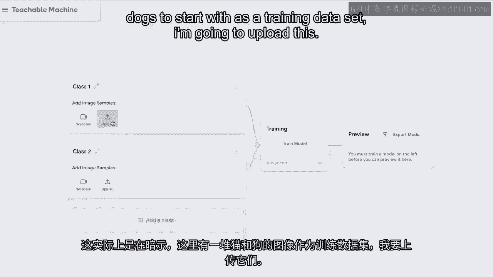

 I'm going to upload this。 So I'm going to put my dogs into category one， and I'll just。

 I'll just upload here a。

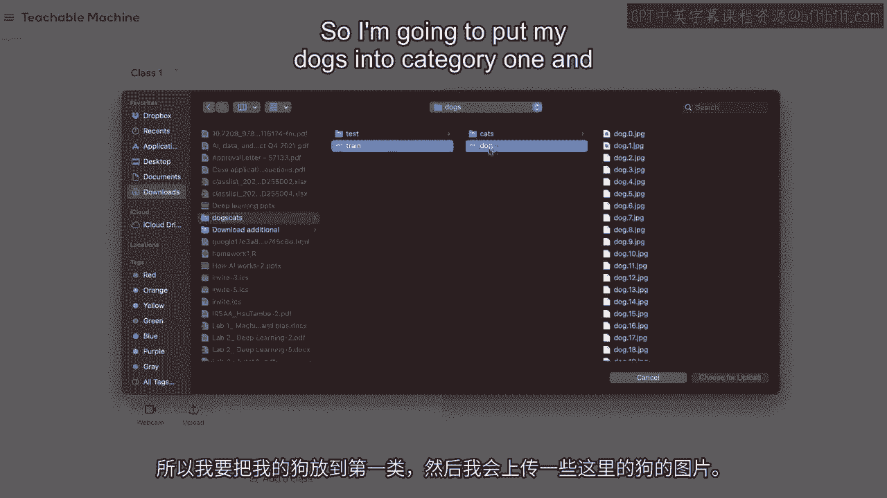

 number of。 All right。

 So now these pictures of dogs are uploading to a teachable machine。

 I'm going to do the same thing down here for the cats。

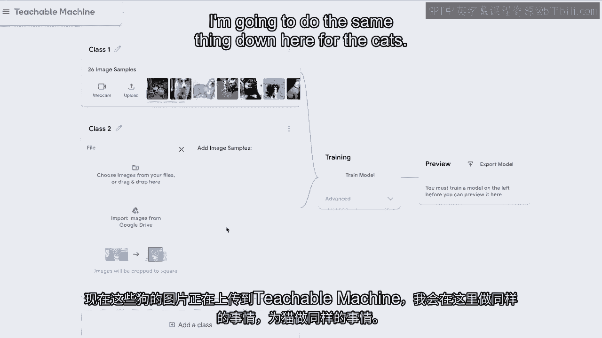

 And the more I can do， the better the model will perform。

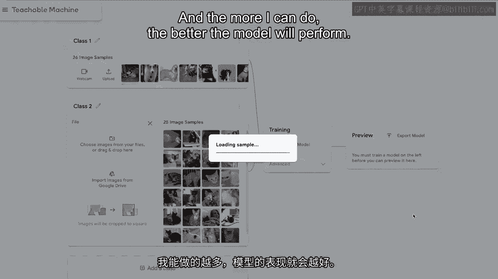

 I'm going to start with a relatively small， relatively small number of images here just。

 for example sake， but in general for a engine like this， the more images and more examples。

 you can provide to it， the better and better it's going to perform。 So now I've basically given the。

 the teachable， the machine examples of two types of images， dogs and cats。

 And I'm going to train the model。 And I'm going to click on this just to show you what's going on。

 There are a variety of things。 These are called hyper parameters that you can。

 you don't need to do anything but they're， showing you what's under the hood so to speak。

 But these are just hyper parameters that you can tune to make the model work in different， ways。

 When I train the model now it's going to start to prepare the training data and it's going。

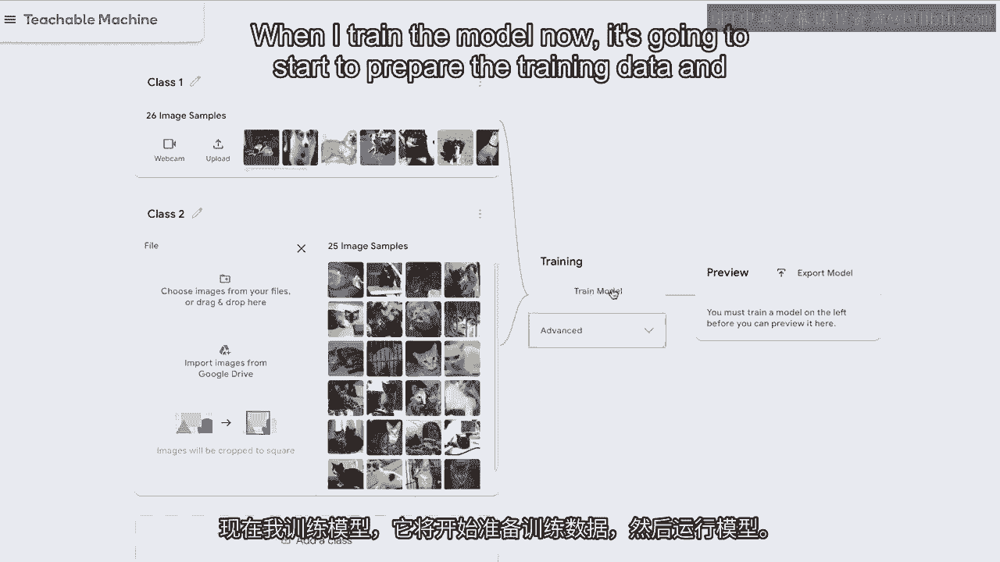

 to run the model。 It's going to take a while to think about this and now it's running the。

 it's running， the model。 Working through the images。 So it's going to， say the model is trained now。

 And what I'm going to do is click on file here。 And now what I can do is have a train model that can basically recognize cats or dogs。

 And if I drop an image in here of a cat or a dog it should be able to automatically recognize。

 whether it's a cat or dog。 And this is not of course one of these images。 That's the training data。

 But if I drop a brand new image in here of a cat or dog it should do a reasonable job。

 of recognizing a cat versus a dog。

 Let's go back to a folder。 And I'm going to click over， I have a。

 I have a test data set available as well。

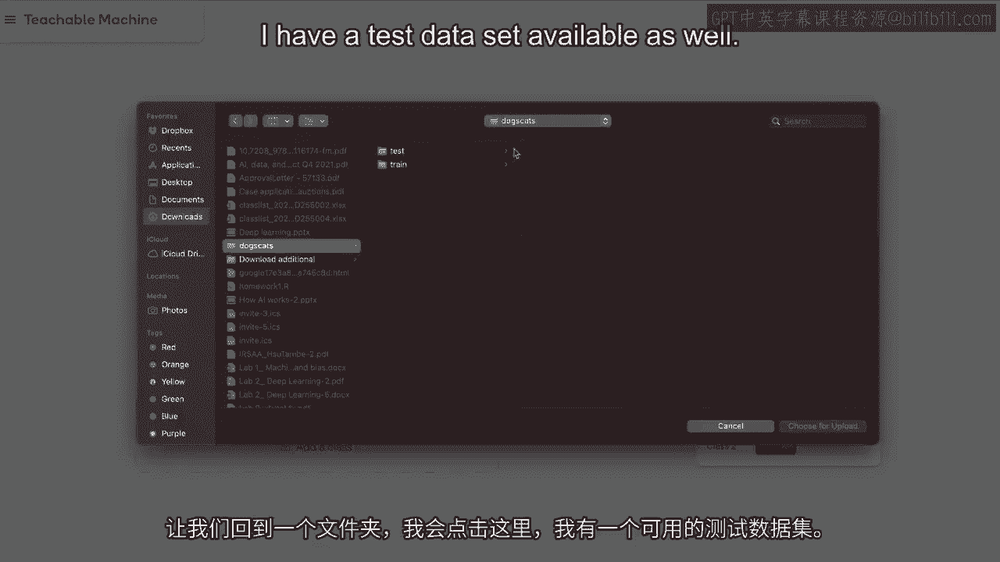

 I'm going to click on that。 And if I say this looks like a dog picture。

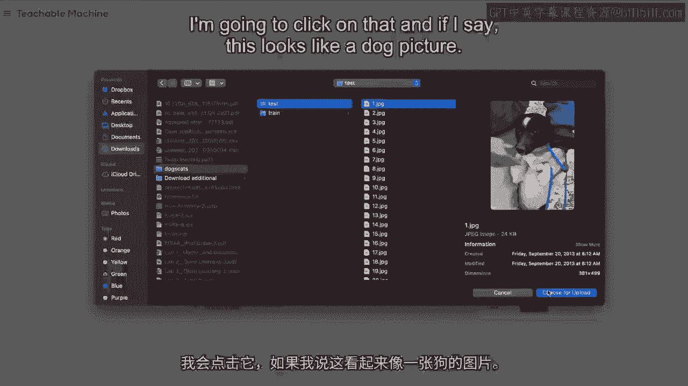

 So if I choose that for upload it is going to say this is class one which is again a dog。

 with a relatively high degree of certainty。 If I choose another image here。

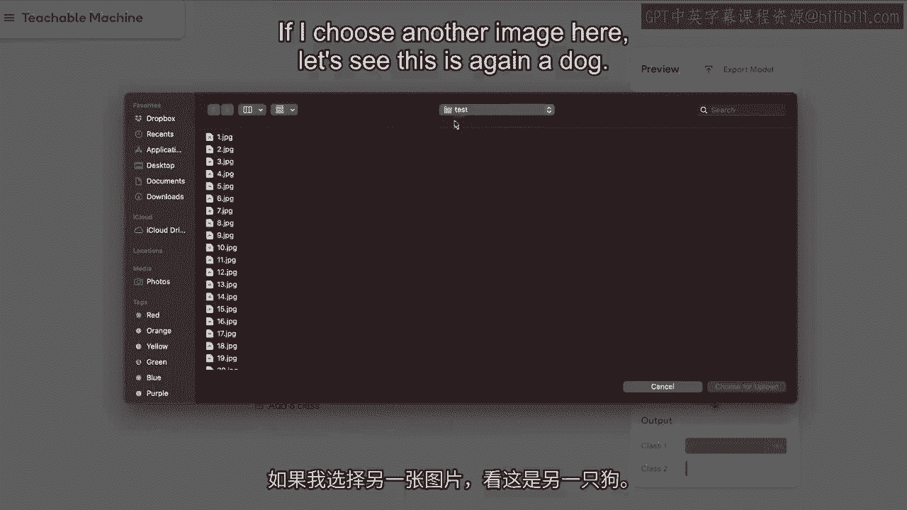

 Let's see。 This is again a dog。 I'll do that one as well。 Then I'll do a cat maybe after that。

 This one it's 100% sure it's a dog。 There's no human in the picture that time。

 So maybe it was a little bit easier for it to identify。

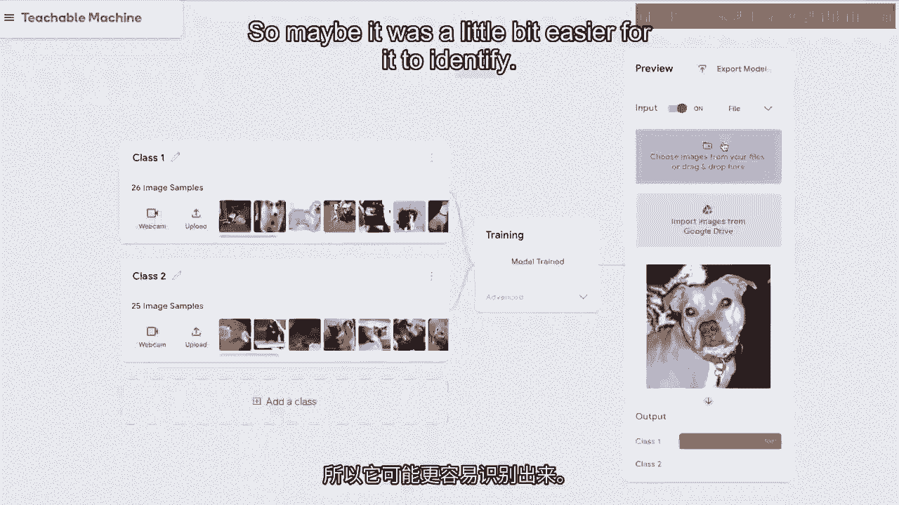

 Now if I drop over to a cat in this case it'll flip over and recognize that that's a cat。

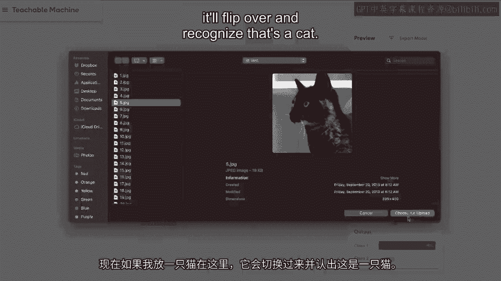

 So the point is that with an interface like this I had to do very little in the way of， coding。

 I had to do very little in the way of under really understanding the machine learning algorithm。

 It's really about getting the data into shape and then passing it into the interface in a。

 way that it can then train itself。 And then from that point on you can just start to deploy it on data。

 You can even export the model in a way that it can be used more widely。

 So a lot of applications like this that are making it easier and easier to use deep learning。

 for people who have ideas but don't necessarily have the machine learning expertise。

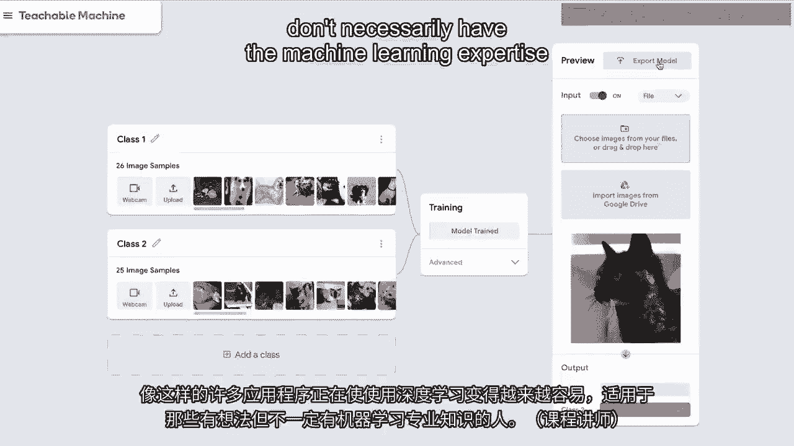

 [BLANK_AUDIO]。

