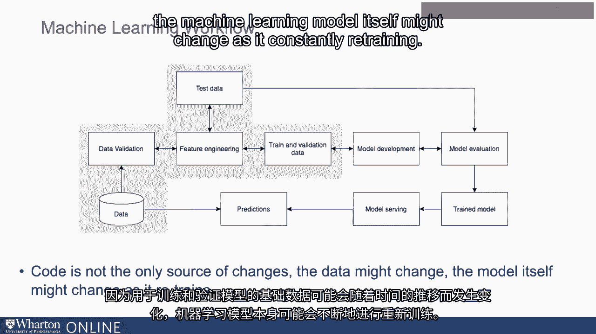
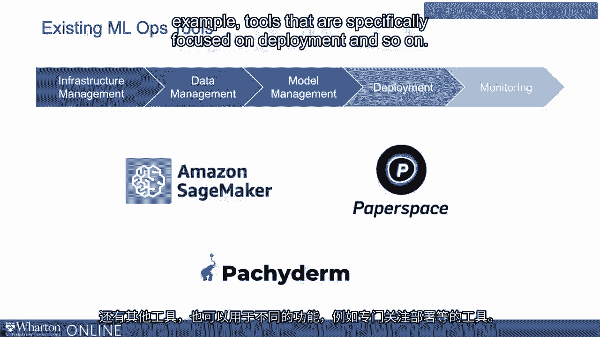

# 沃顿商学院《AI For Business（AI用于商业：AI基础／市场营销+财务／人力／管理）》（中英字幕） - P31：30_机器学习运维.zh_en - GPT中英字幕课程资源 - BV1Ju4y157dK

在这次讲座中，我们将讨论 MLOps 或机器学习运维。

这是你在与数据科学家合作时可能会遇到的术语。

这是一个有用的术语，但在我们深入讨论 MLOps 之前。

谈论 DevOps 或开发者操作是很有用的。

这是一个在软件世界中已存在并被频繁使用的术语。

开发。ML DevOps 是指开发者用于构建、测试和部署的实践和工具。

在生产环境中运行代码。每当开发者对非常大且复杂的代码库进行更改时。

恐惧在于，这些变化可能会在代码中引发问题，并导致软件意外失败。

因此我们需要一种更系统的方法来对软件进行更改。

一种涉及创建新代码分支的方法，可以在不影响主分支的情况下对该分支进行更改。

触及生产代码，然后在进行更改前使用自动化测试对软件进行测试。

将代码合并回主代码，并最终推送到生产环境中。

现在传统 DevOps 有两个主要组成部分。

一个称为持续集成，另一个称为持续部署或 CI/CD。

简称 CI。CI 指的是创建主代码分支的实践。你进行更改。

你推送它，测试它，最终合并更改。

持续部署或 CD 指的是在代码最终推送之前运行的测试。

推入生产环境。因此，这是标准的 CI/CD 流程。

现在，机器学习模型的开发也需要对细节给予谨慎关注。然而。

与传统开发操作有一些关键区别。在机器学习系统中。

代码并不是唯一的变化来源。随着用于训练和验证模型的底层数据可能会随时间变化。

机器学习模型本身可能会随着不断的再训练而改变。

在任何机器学习系统中，机器学习模型的输出也可能会。

还需要对其进行验证和质量检查。这是因为随着模型的演变。

我们事先不知道系统在所有不同情况下的正确输出是什么。

因此我们需要关注细节。

市场上有许多工具被数据科学家和开发者使用。

MLOps 的范围广泛，包含用于管理机器学习硬件基础设施的工具。

机器学习通常需要一些定制的硬件，例如不同种类的处理器。

被称为 GPU 的硬件用于进行机器学习。存在管理这种基础设施的工具。

有数据管理工具，也有管理模型本身的工具。

用于将这些模型部署到生产环境的工具。

以及监控AI模型行为的工具，意味着监控AI模型的输出。

并确保输出与我们预期的一致。现在。

市面上有许多工具。例如。

亚马逊有一个名为SageMaker的工具，可以处理许多这些功能。

我提到的MLOps。像PaperSpace和其他一些工具。

还有一些专业工具。例如。

PackyDerm是一个专注于数据管理和模型管理的工具。

还有其他工具可以用于不同功能，例如。

专门关注部署等的工具。

这些工具对于数据科学家来说非常重要，以确保机器学习。

他们构建的大规模应用能够良好运行且无故障。[沉默]。

