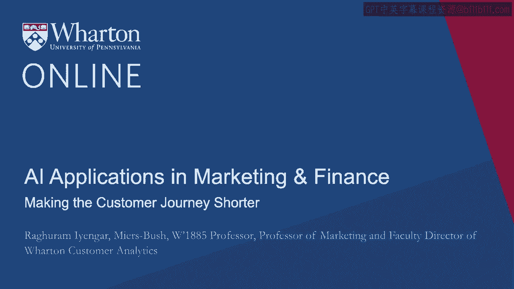
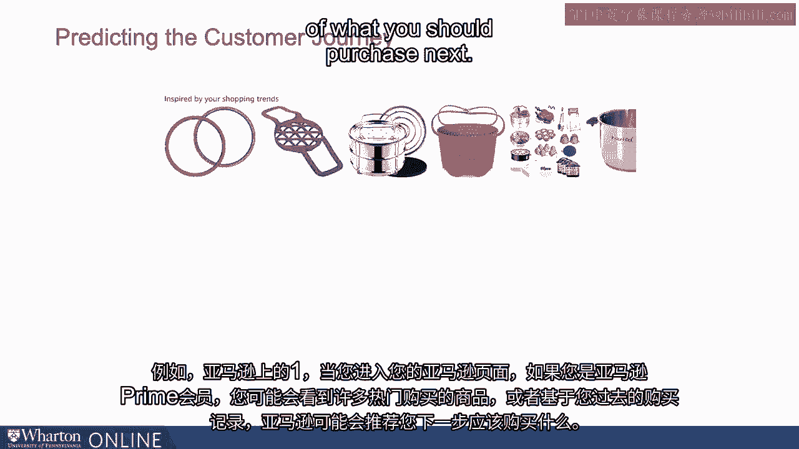
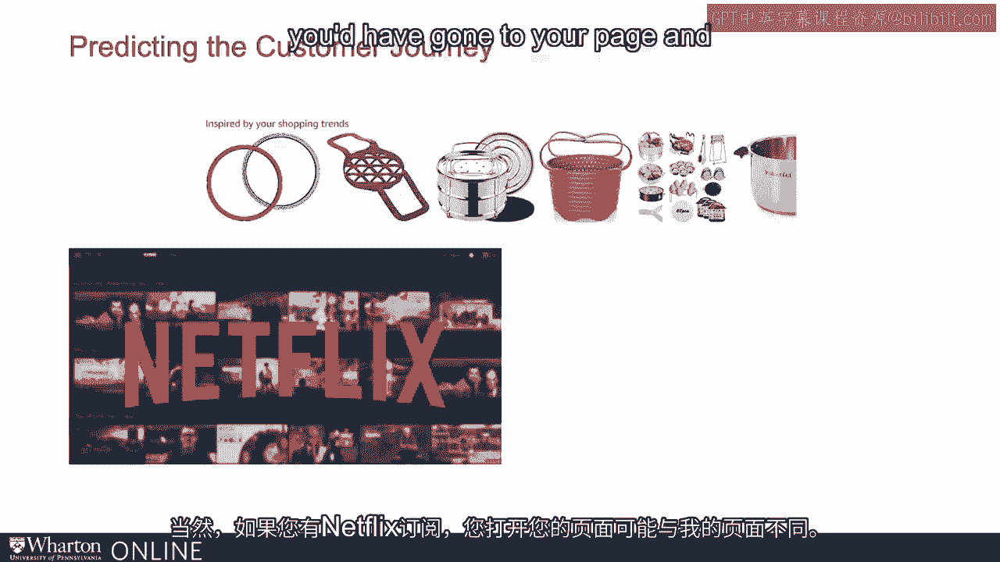
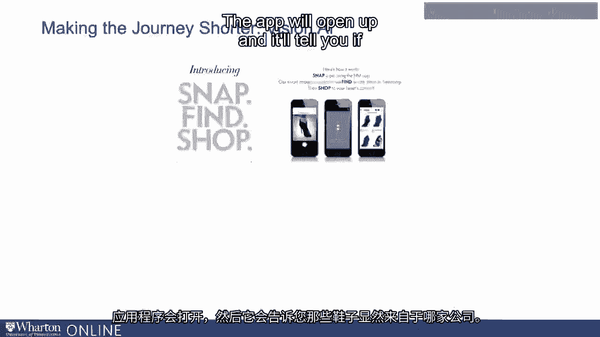

# 沃顿商学院《AI For Business（AI用于商业：AI基础／市场营销+财务／人力／管理）》（中英字幕） - P37：3_缩短客户体验周期.zh_en - GPT中英字幕课程资源 - BV1Ju4y157dK

所以在这个模块中，我们将开始讨论客户旅程与人工智能的结合。

尤其是从人工智能能为我们做什么的角度。

要么预测客户旅程，要么缩短旅程。

让我们举一些例子，更好地理解技术、机器学习、人工智能。

我们在之前的模块中讨论的所有内容都可以帮助我们。

理解客户旅程。让我们开始讨论预测客户旅程。

所以这些都是非常常见的例子。比如说，亚马逊的例子，当你访问你的亚马逊页面时。

如果你是亚马逊Prime客户，你可能会看到，比如说。

很多流行的购买选择或基于你过去购买的内容。

亚马逊可能会推荐你刚刚购买的内容。

所以这是一个例子，如果某人过去购买了一些东西。

亚马逊和所有背后的算法正在试图预测。

他们未来的客户旅程会是什么样子？同样的例子也许来自Netflix。

当然，如果你有 Netflix 的订阅。

你已经访问了你的页面，而你的页面可能与我的页面不同。

为什么？因为基于你正在观看的内容。

Netflix 使用其算法推荐可能的内容。

未来你可能感兴趣的一些内容。当然。

那个算法是个性化的，可以这么说。基于某人正在观看的内容。

算法可能会决定未来他们可能感兴趣的一些内容。

同样的例子可能是一个叫 Stitch Fix 的公司。现在这里，它是一家公司。

这是一个订阅公司，基本上为不同的客户提供服装。

现在他们想知道，比如说，如果 Raghu 是 Stitch Fix 的订阅者。

他们想知道什么？考虑到 Raghu 拥有的衣物。

他下一个想买什么？那么在所有这些例子中，这里的想法是什么？

在所有这些例子中，算法和机器学习的方式。

所有这些后台内容，它试图做什么？

看看你到目前为止购买的内容，你下一个会去哪里？

所以这全是关于预测客户旅程的。

让我们再举一个例子，看看机器学习和人工智能在旅程方面能做些什么。

更短。因此，一个例子可能是你现在拥有的各种不同类型的应用。

在这里你可以拍照，应用会告诉你产品是什么。

所以有很多这样的例子。比如说，有一个叫做 Snap Find Shop 的应用。

那么这个应用的想法是什么？这个想法是公司发布的。

你或许可以拍下某个人的鞋子，比如说你觉得它们非常好看。

你想要弄清楚这些鞋子是什么。

应用程序将打开并告诉你这些鞋子是否显然来自那家公司。

如果没有，它们会推荐其他东西。这背后的想法是什么？

回想一下我们在前一个模块中讨论的客户旅程。

我们谈到了一旦你有了意识，便会开始思考的事实。

考虑时，你开始思考选择，或许开始考虑在哪里买。

这个应用程序使用视觉人工智能试图做什么？它基本上是在缩短那段旅程。

一旦你拍了照片，视觉算法，或者说，视觉人工智能就在尝试。

找出那张图片是什么。在这个案例中，它恰好是一双鞋。

它将开始推荐你可以在哪里购买。那么它在尝试做什么？

从某种意义上说，它试图缩短从意识到最终购买的旅程。

尽可能地缩短。这种方式，当然，公司可以在竞争的世界中尝试。

因为你可能正在查看那个特定的应用程序，看看那些鞋子。

公司在推荐，而不是去其他地方。有许多其他例子。例如。

我之前提到的虚拟试衣间与此非常相似。

你可以想象，当你考虑在网上购买某种产品时。

你知道，裤子、裙子等等，任何更具体验感的东西。

现在你可能最终会去试衣间，看看那些东西，但如果你在家。

你仍然想购买，但你想减少例如，你知道的麻烦。

如果不合适，你就得退货。如果你想减少麻烦成本。

这就是一些公司的出发点。因此，style.me、Sugara、Magic Mirror。

有很多这样的公司的例子。他们试图找到最合适的搭配。

再次，使用视觉人工智能，他们试图做什么？

他们试图找出如何“减少”你所需的时间。

通过去一个实际的试衣间，也许试穿不同类型的衣服。

这样他们再次在减少那段旅程。因此，通过查看一些这些应用程序的整体想法。

这些都与视觉人工智能有关，想法是作为公司如何通过提供良好的技术来缩短这段旅程？

示例也来自B2B公司。

现在有很多聊天机器人，比如说，在这个案例中是语言人工智能。

这些也允许企业与其他企业的客户进行交流。

所以这样，你知道，从某种意义上说，如果你是一家公司，你想快速交易。

从其他企业来看，很多语言AI聊天机器人在这种情况下正在帮助我们的例子。

企业。例如，还有许多其他例子，Google在其中。

例如，Google Glass，或其他类型的视觉软件正在不同的工厂车间提供帮助。

比如说，一个人不需要携带大手册。

在某种意义上，他们能做到的是使用Google Glass或。

任何其他类型的软件，并能够确切看到需要做什么。

所以这是另一个从商业角度缩短旅程的例子。

当然，从语音AI的角度来看，如何缩短旅程的经典例子。

比如说，亚马逊Echo和Google Home。想想他们做了什么。例如。

一些可能在家中拥有亚马逊Alexa的人，你可以让Alexa，比如说，播放不同的歌曲。

当然，你还可以开始制作购物清单，所有这些都可以做到。

类似地，在Google Home中，你可以让Google Home，比如说，搜索附近的餐馆。

甚至尝试进行预订。那么这些应用试图做什么？

他们想要做的是，一旦你意识到某个特定需求。

他们试图在某种意义上使用语音AI来表达。

我们如何从意识到最终购买的角度缩短旅程？所以再说一次。

总的来说，当你开始考虑不同类型的应用时，如我们在这里看到的。

我们看到了语音AI应用、语言AI应用和视觉AI应用。但当然。

我想关注的不仅仅是应用本身。

正是当你开始思考客户旅程时，它在做什么。

到目前为止，我们看到的两件事。一是确保我们能理解什么。

客户旅程是什么样的，并能够预测它。所以这是预测下一步。

客户旅程和机器学习算法在其中的帮助。我们看到的另一个例子是。

刚才看到的是缩短旅程，一旦公司理解到存在一个。

对需求的意识，我们如何确保能满足特定需求。

现在往前看，我们还将关注其他类型的客户旅程以及AI能做什么。

[空白音频]。

