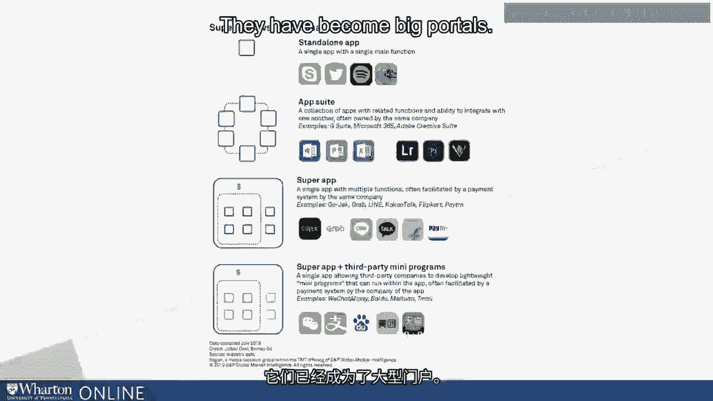
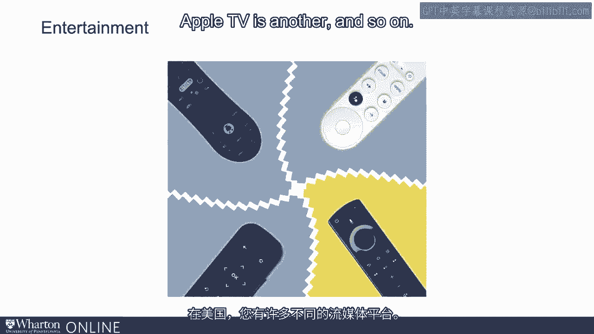
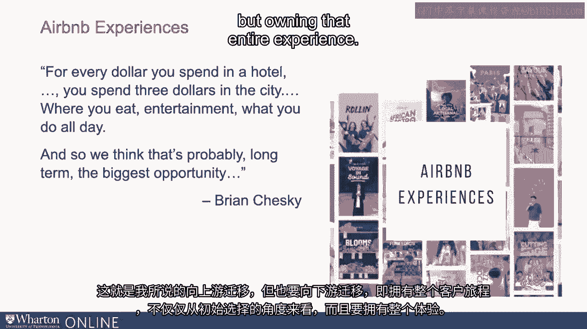
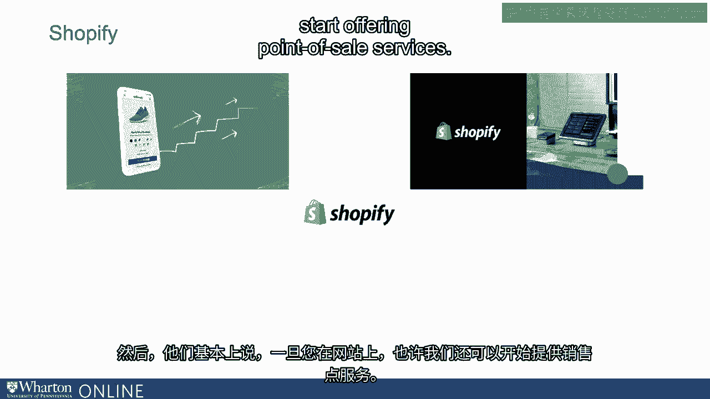
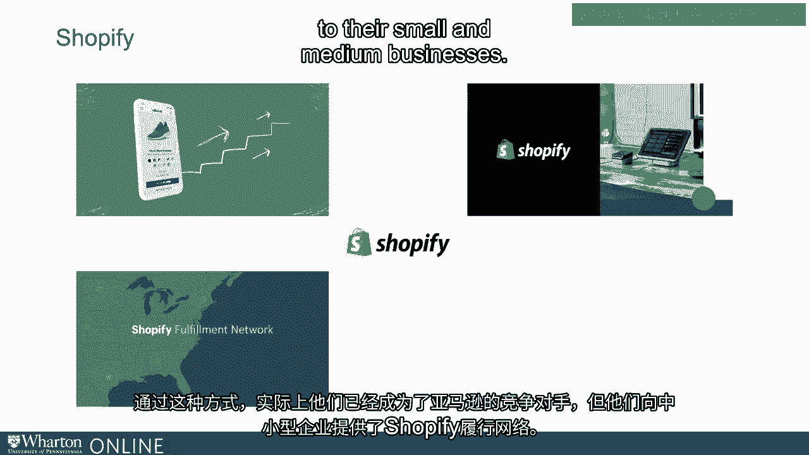
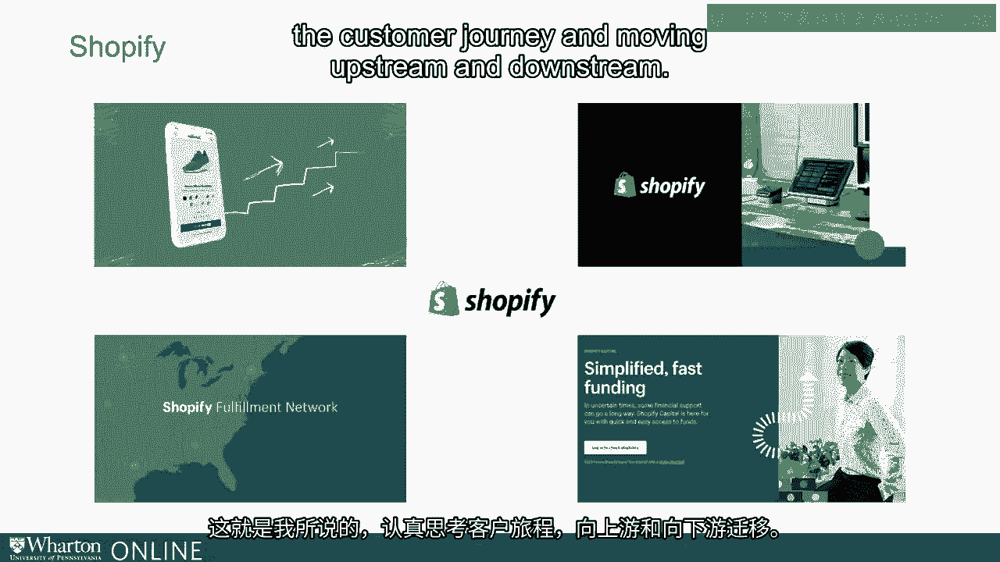
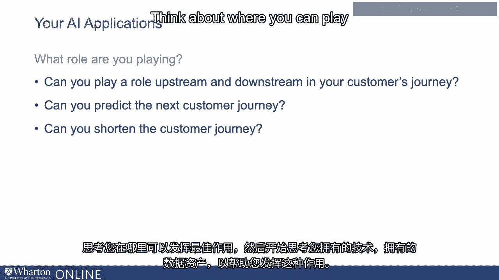

# 沃顿商学院《AI For Business（AI用于商业：AI基础／市场营销+财务／人力／管理）》（中英字幕） - P38：4_向上游移动客户体验.zh_en - GPT中英字幕课程资源 - BV1Ju4y157dK

 So in this module， we'll talk about something exciting。

 This is about how companies can move upstream in the customer journey。

 Now we talked about something predicting customer journey， making it shorter。

 Let's try to contrast this。 Let's take an example first to get started。

 When you start thinking about search， perhaps Google is the first company that comes to your。

 mind。 But look at these numbers。 What they're suggesting is when people are searching for products to buy。

 in fact if， anything， Amazon is much higher than Google。 And for prime users。

 the difference between Amazon and Google is even higher。 What does that suggest？

 What that suggests is that if you are an Amazon prime customer， when you go on the Amazon， website。

 what Amazon is able to do is not just recommend you products。

 Of course they can do that。 But what they're able to do is to curate your entire journey。 Which is。

 if you're thinking about buying a smartphone， you go on Amazon， looking at， your past purchases。

 looking at all the things that they know about you， they might be not。

 just able to recommend what smartphone you should be buying， but they might be able to。

 quote unquote look at your entire customer journey of how you should go about buying， it。

 So that's the idea of moving upstream in the customer journey。

 So let's revisit the example of Amazon Alexa and Google Home。

 So when I talked about this example， we had talked about Google Home and Amazon Alexa。

 shortening the customer journey。 Let's further this example a little bit in terms of how they own the customer journey。

 So Amazon， for example， of course， also owns Whole Foods。

 So let's think about an application on Amazon Alexa where you can in some sense make you。

 grocery lists。 Well， you can certainly make you grocery lists and keep that grocery list there。

 that's fine。 But you can also in some sense at the end then decide that you would like to order from Whole。

 Foods。 So what is this doing？ What this is doing is it's not just a way of shortening the customer journey。

 it's entirely， curating that whole journey right from the awareness stage where you might start using。

 Amazon Alexa to make your grocery list。 Then you go ahead and order from Alexa。

 it will also make the purchase for you。 Similarly， with Google Home。

 you can start searching for restaurants nearby， but you can， also make reservations on it。

 So that's the point I want to get across here with many other examples of how as a company。

 you can then start thinking about not just shortening the customer journey or predicting。

 the customer journey。 You can start thinking what I call owning the customer journey。

 So I wanted to bring your attention to something called super apps。 So for example。

 you might be comfortable going on your phone and going to a Facebook app。

 a Twitter app perhaps or a Spotify app for instance。 Of course these are separate apps。

 What that means is you go on Twitter， you go and look at what's happening on Twitter。

 you come back out， you go on Facebook and so on and so forth， you're visiting different， apps。

 But what's happening in many other countries as well is that there are many applications。

 which are called super apps which in some sense have become the landing page of where。

 everyone goes for a variety of different things。 So as an example， in Korea it's K-Talk。

 in China it's VChat and so on and so forth， what， will these apps do？

 Well they have become big portals。

 So for example in China you can use VChat to pay your peers money just like you would。

 use Venmo here for example in the US。 You can of course have the social network environment in there。

 you can perhaps make， purchases， you can talk to other businesses。

 pretty much it's become the landing page。 Now you can imagine how different that experience is for a customer when using VChat or a K-Talk。

 as compared to perhaps using a Facebook or a Twitter。 Why？ Because in some sense what VChat。

 K-Talk and in India something called PTM， what are they， trying to do？

 They are becoming in some sense the curators of your customer journey。

 So that's what I mean by going upstream。 You are in some sense becoming the place where customers go when they start their journey。

 Let's take another example from the entertainment perspective。

 And of course in the US you have many different streaming platforms。 So Roku is one of them。

 Apple TVs and so on。

 Now when you start thinking about this why do I say that they are also in some sense。

 figuring out how to go upstream？ For those of us who might have used Roku for instance the way the platform is set up is。

 that you have different tiles let's say you have Netflix， Amazon Prime， many other applications。

 So what do you end up doing？ You end up thinking about what you want to watch。

 You go to a Netflix tile and go down the Netflix streaming app。 Look for things。 And so on。

 Apple TV for example is an Amazon fire quite different。

 There you end up looking at what you want to search for and they might show you all。

 different places where you can find it。 So look at the different ways in which in some sense by using either Roku。

 Apple TV， Amazon， Firestick you're in some sense getting a very different experience the way they are curating。

 your customer journey is different。 Roku for example curates that journey by different streaming platforms。

 You decide you want to access Netflix or Amazon Prime or something else Disney Plus for instance。

 whereas on Apple TV you start by thinking of the content that you want to watch。

 So notice the two different ways in which you can go about it。

 And of course these two different ways have different implications of what the customer。

 journey would be like。 Let's think about healthcare。

 Of course healthcare is very fragmented industry。 There are lots and lots of things going on in healthcare。

 So I wanted to bring your attention to the idea of who owns the data and why do I bring。

 up the same companies that we've talked about before。

 So the examples that I have on this page about Apple， about Amazon， about Google。

 The same companies that we had talked about before are now making inroads into healthcare。

 Of course for Apple it's a lot about what I call mobile technologies。 It's all about variables。

 So the Apple watch that you wear， the phone that you have， of course it's becoming more。

 and more compatible with a lot of different kinds of perhaps measurements that you want， to take。

 So the Apple watch can perhaps look at what your heart rate is like and all of that。

 So technology is making healthcare more personalized as the Apple slogan says。

 Similarly Amazon is getting into healthcare as well。

 And Google for instance is looking at many other companies that are looking into for example。

 doing lots of early test studies and so on。 The big question here of course is whether you're going to Apple route。

 Google route， Amazon， whatever the case might be， he's who owns the data。

 What's going to be happening in terms of where the data lies and what kinds of applications。

 can be built on that data。 So again going back to the Apple example。

 clearly by looking at their phones， the watches that， they have， the apps that they have。

 how they're trying to in some sense make healthcare more， personalized。

 Clearly if you buy into the Apple ecosystem you clearly might be in some sense locked into。

 that ecosystem in terms of all the different facilities that they have。

 So thinking about who owns the data becomes quite critical even in healthcare environment。

 Now let's also take an example of what I call upstream and then downstream。 What is the idea here？

 The idea here of course is we've taken many examples of how companies can go upstream which。

 is thinking about awareness， thinking about how they can shorten the journey， own that。

 journey and so on。 But of course the journey doesn't stop once somebody purchases。

 The journey continues， why？ because there are many other purchases that somebody can make。

 For instance Casper company here in the US that basically gives mattresses for much lower， prices。

 What does it want to be？ It wants to be what they call the Nike of sleep。 What's the idea here？

 They want to in some sense own that particular vertical of quote unquote sleeping。

 So they want to think about what other facilities can they offer， what other products can they。

 offer which is beyond mattresses as well。 So the nectar another competitor wants to expand their product line。

 So the idea here is when you start thinking about the customer journey， you don't just。

 think about the initial part of the customer journey which is going upstream。

 You also start thinking about what happens when that particular purchase is done。

 Are there other things that you can also offer to that customer？ Let's take some another example。

 Airbnb。 Of course Airbnb is very very popular service to in some sense go ahead and you know if。

 you want to take a vacation you can go ahead and either rent a room in somebody's house。

 you can rent the entire house and so on。 But what Airbnb also realized is that when people take a vacation they're not just going。

 there to stay in somebody's apartment or a house。 They want to do many other activities。

 So if you notice Brian Chesky who is one of the co-founders of Airbnb basically says for。

 every dollar you spend in a hotel you spend three dollars in that city。 Where you eat。

 the entertainment， all you do all day。 They basically want to think of this as a long-term opportunity。

 So there's something called Airbnb experiences。 So if you go on Airbnb you can see like for example let's say you want to go to Philadelphia。

 or New York you can go ahead and see what other things are out there in that city as you start。

 traveling。 So that's where I talk about going upstream but also going downstream which is owning the。

 customer journey not just from the point of view of just the initial choice but owning。

 that entire experience。

 Let's take one more example。 This time from a B2B perspective， business to business perspective。

 Shopify of course is a very big company which helps small and medium businesses go on the， web。

 That's how they started。 In some sense you can think about you know the local mom and pop store wants to go on。

 the internet how do they set it up。 Shopify made it easy。 So what did they start with？

 They basically started out by offering services where you could in some sense you know put。

 your website very easily on the web， set up all the back end and so on so forth。

 So you as a company owner did not really need to be tech savvy。 Shopify will handle it。

 Then they basically said once you've in some sense gotten people on the internet on the website。

 Well perhaps we can also start offering point of sale services。

 So Shopify started offering point of sale services within the store。

 So first they were online then they became offline。

 So in some sense they started integrating more so with their customers other businesses。

 Then they said okay great。 Now that we've got online and we've got offline we can then start thinking about one big requirement。

 for the service for the companies which is inventory。

 Then they started going into Shopify fulfillment networks。

 In this way actually they've become a competitor to Amazon but they're offering Shopify fulfillment。

 networks to their small and medium businesses。

 That's great as well。 But of course you can imagine as Shopify gets to know more about customers what else do they。

 start thinking about？ Well which customers should we give money to？

 That's where they've gotten into funding。 So look at that entire journey from Shopify's perspective and their customers' perspective。

 Shopify started at the end so to speak。 They started thinking about how customers。

 their customers which are businesses can go， on the web。

 Then they started moving upstream or also moving downstream。 So thinking about funding。

 thinking about fulfillment or the different point pain points。

 that their customers' other businesses may have。 So that's what I mean by thinking carefully about the customer journey and moving upstream。

 and downstream。 So what I see here is that before we get into new technology before we start thinking about。

 AI applications don't put the cart before the horse。

 Start with the why。 What are your customers' needs？ What exactly are you solving for？

 And how are you solving for is important but starting with the how sometimes can make。

 you forget about the why。 So critically start thinking about the why first whether you're a B2B company。

 whether you're， a B2C company to be thinking about customer needs is critical。

 Once you think about the customer needs then you start thinking about what kind of technology。

 may be helpful。 Is it vision AI perhaps？ Is it language AI？ Or why is AI？ What is it？

 To me that's the next way of thinking about the how。

 And then you have a good synergy between the why and the how。

 So here's what I would ask you to think about。 When you start thinking about how you are addressing your customer needs what role are。

 you playing？ Are you playing a role in the customer journey in terms of moving upstream？

 The examples that I had given you was about Shopify， the Roku examples， even Amazon Prime。

 and Google Home where you're curating that entire journey。 That's a big win if you can have that。

 But of course you can start smaller as well。 Start first by thinking about can you predict the next customer journey。

 That's about predictions。 So those are the examples I was giving you around Amazon when it predicts for example。

 based on what you purchased what is the next thing you're going to buy。

 Of course you can also start thinking about shortening the customer journey。

 So think about where you can play the best role and then start thinking about technology。

 that you have， the data assets that you have that can help you play that role。 [BLANK_AUDIO]。

