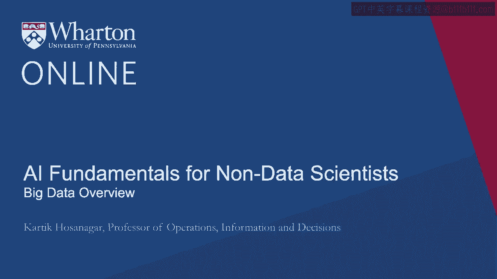
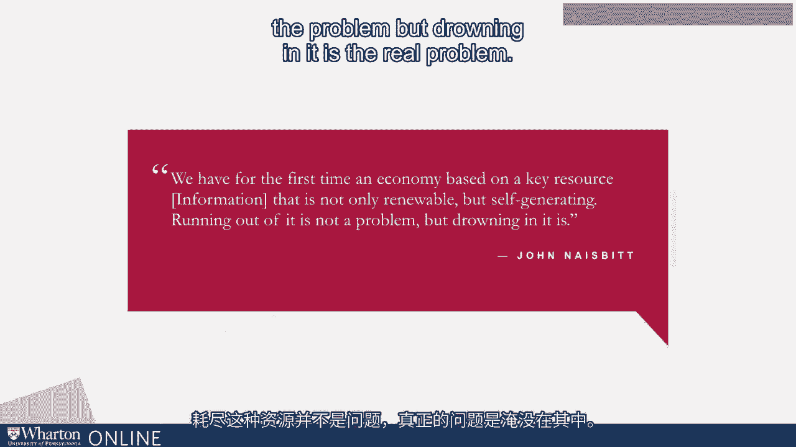
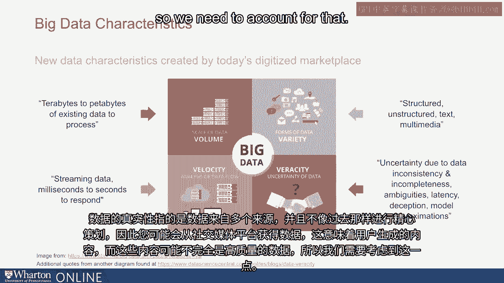
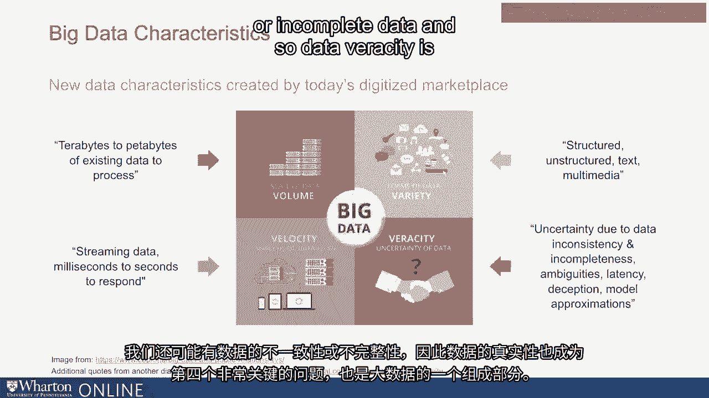
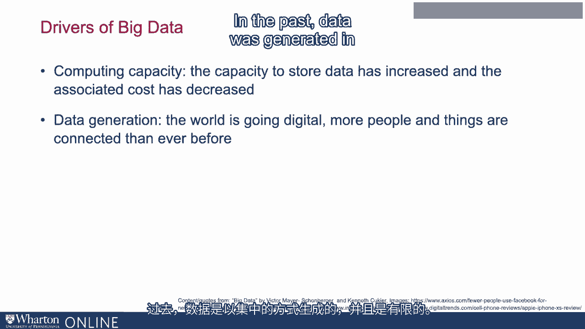
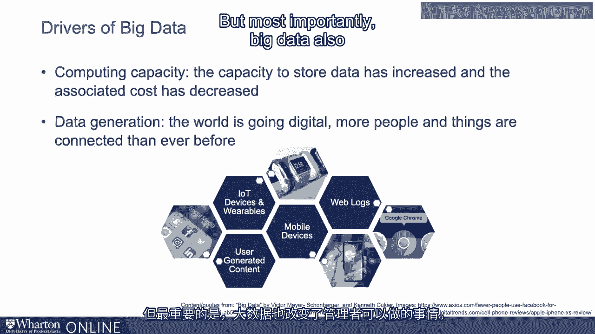
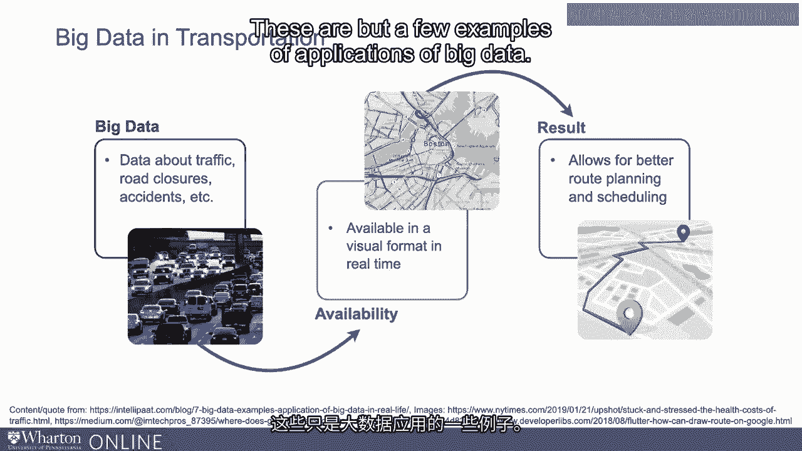

# 沃顿商学院《AI For Business（AI用于商业：AI基础／市场营销+财务／人力／管理）》（中英字幕） - P3：2_大数据概述.zh_en - GPT中英字幕课程资源 - BV1Ju4y157dK

 In this module， we'll talk about big data。

 In particular， we will start with an overview of what exactly is big data。

 We'll talk a little bit about what kinds of skills are needed to excel with big data。

 We'll talk about big data tools and infrastructure。

 And we will conclude by talking about data mining and setting up the stage。

 for machine learning which we will cover in module two。

 To begin with， let's explore what exactly is big data。 Now。

 data is certainly a concept that's been around for a really long time。

 And there has been an emphasis on data for several decades now。

 We hear phrases like "data is the new oil。"， "Data is just like crude。 It's valuable。"。

 But if undefined， it cannot really be used。

 Futurist John Naysbait says that we have for the first time an economy。

 which is based on a key resource that is information that is not only renewable。

 but it's also self-generating。 Running out of this resource is not the problem。

 but drowning in it is the real problem。

 Now， we've heard phrases like this for a while。 A data has been very important to businesses for multiple decades。

 But the focus or emphasis on big data is relatively new。 Now， big data， as the term suggests。

 is about large volume of data。 In fact， the National Institute of Standards and Technology says that big data。

 exceeds the capacity or capability of conventional methods and computer systems。 Now。

 volume is certainly a key aspect of big data， but it's not just about volume。

 When we talk about big data， we're talking about data with different structure。

 We're talking about data that is being created at a different speed。

 We're talking about different kinds of tools to analyze the data。 And most importantly。

 from a managerial standpoint， we're talking about different kinds of business。

 questions that we can answer with that。 Now， one way to think about big data is through the three V's of big data。

 volume， variety and velocity。 Volume of data simply implies that we're not talking about terabytes or petabytes of data。

 In short， the kinds of data that won't fit in our laptops and personal computers。

 The kind of data that we cannot open in Excel and just start analyzing。

 That's what the volume of data is all about。 In terms of variety。

 we refer to the fact that we're no longer talking about structured。

 numerical data that you can analyze in Excel spreadsheets。 We're talking about unstructured data。

 meaning text data， audio data， video data， where there's intelligence hidden in that data that we want to extract。

 In terms of velocity， we're referring to the idea that data are constantly coming in。

 It's streaming every second and milliseconds。 And we need to be able to perhaps even analyze the data and make decisions on the fly。

 That's what data velocity is all about。 Sometimes when we talk about big data， there's a fourth V。

 which is veracity or truthfulness of data that comes in。

 Data veracity refers to the point that data are coming in from multiple sources。

 and are not curated as in the past。 And so you might have data coming in from social media platforms。

 meaning user-generated content， and this content might not exactly be high quality data。

 So we need to account for that。

 We might also have inconsistency of data or incomplete data。

 And so data veracity is also becoming a fourth issue。

 which is very critical and an integral part of big data。 Now， of course。

 a natural question to ask is， why is this emphasis on big data so new？ And really。

 it comes down to two things。 The first is computing capacity。

 Computing capacity has been growing exponentially。

 Our ability to store data and process data has been growing exponentially。

 And that has made big data tools available today that simply weren't available ten years back。

 The second is data generation itself is being transformed。 In the past。

 data was generated in a centralized way。

 And it was limited。 In contrast， today data is being generated in a decentralized way。

 There's a lot of user-generated content that our customers， for example， are generating。

 There is data generated from mobile devices， again from each individual user。

 There's data being generated from thousands of sensors that a company might be using in its manufacturing facility or retail stores。

 All of these factors are resulting in an explosion of data and really is all about the transformation in data。

 But most importantly， big data also changes the kinds of things a manager can do。

 In particular， big data allows managers to ask new questions that they simply couldn't ask before。

 And they also help answer the same old questions better。

 So in terms of the ability to ask new questions， consider the problem of a marketing manager that's trying to design a marketing campaign for a new product。

 The manager has to decide what product features to emphasize。 If it's a phone。

 the manager has to decide whether we should be talking about the battery life of the phone。

 Or should we instead be talking about the sleek design of the phone？

 Or should we instead talk about the user interface and how user-friendly it is？

 Or should we talk about the brand as such and be talking about our social and philanthropic initiatives in our marketing campaigns？

 These are questions that are hard to answer。 In the past， they were answered partly by gut。

 partly by small-scale user service。 But now a marketing manager can look at data on social media platforms。

 And they can look at data on Twitter and Facebook and other platforms and look at what aspects of our products are customers really appreciating and enjoying。

 What is it that data on social media platforms that suggests that differentiates our brand from other brands？

 And they can use these data to precisely craft marketing messages。

 This might not have been feasible in the past， but is feasible through big data that is available on social media platforms that we can analyze at scale。

 I also mentioned that big data allows us to answer the same old questions better。 For example。

 consider credit card fraud detection。 Credit card fraud is rampant in the financial services industry and costs these companies billions of dollars。

 In the past， it was hard to detect。 And most commonly， it was detected well after the fact。

 For example， a customer might see their credit card statement and conclude that a certain transaction is fraudulent and might call the customer service center and flag that transaction。

 And then it gets corrected。 But it's done after the fact and often it's hard to really recover the lost money。

 In contrast， today with big data tools， companies can analyze transactions on the fly。

 Right after a customer swipes a credit card on a terminal。

 big data tools can analyze their transaction and determine whether it's fraudulent or not。

 This helps not only detect fraud faster。 It also helps do it at a scale which simply was not feasible before。

 And this is creating a lot of value to financial services companies。

 And the value of big data is not limited to just financial services company。

 We see applications in a number of industries like healthcare， education。

 transportation and many more。

 For example， if you look at healthcare， there's a big trend in wearable devices these days。

 A lot of consumers are wearing devices like Fitbit and others。

 And these devices are able to capture data about heart rate， sleep patterns。

 exercise and many more aspects of our daily lifestyle。

 This kind of data ultimately helps consumers take better actions to improve their well-being。

 Similarly， consider transportation。 There are sensors on roads that can capture data on traffic patterns。

 road closures， accidents。 And now that kind of data is being made available to us in real time on our mobile devices。

 This helps us plan our route better， helps in scheduling and ultimately is the basis of applications like Google Maps and many other mapping systems many of us use on a daily basis。

 These are part of a few examples of applications of big data。

 And in fact， later in module 3， we will look at a number of other applications of big data in a variety of industries。

 We will also look at how machine learning is being used in these industries to extract intelligence out of the data in these settings。

 [BLANK_AUDIO]。

