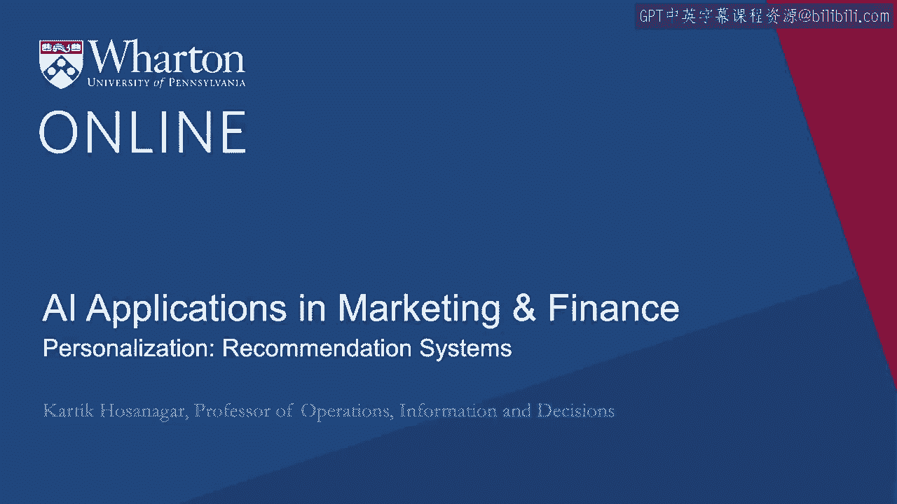
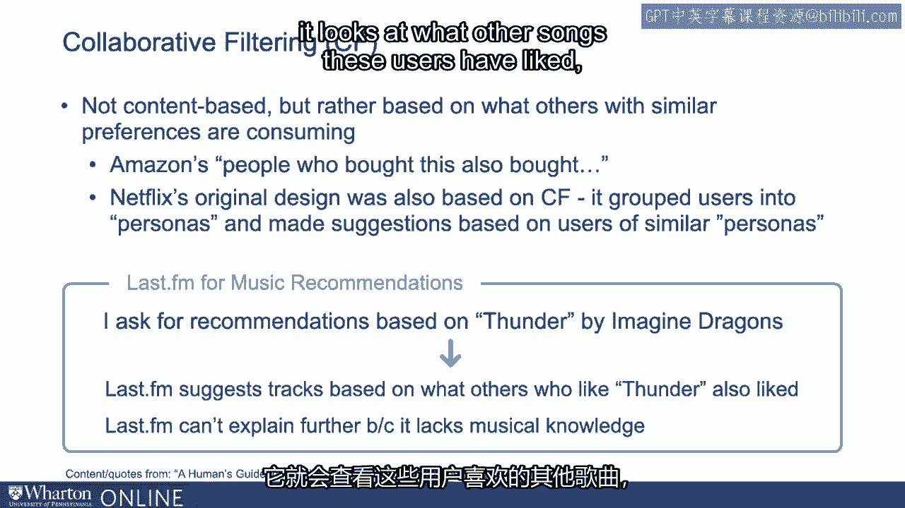
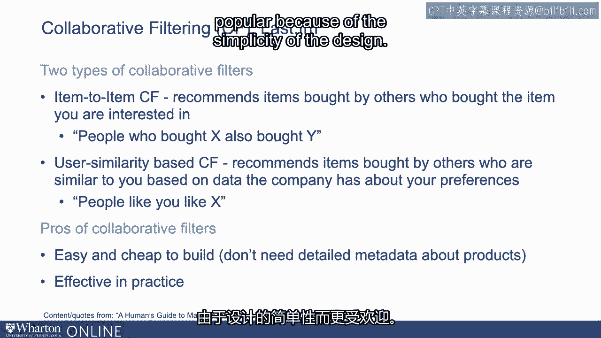
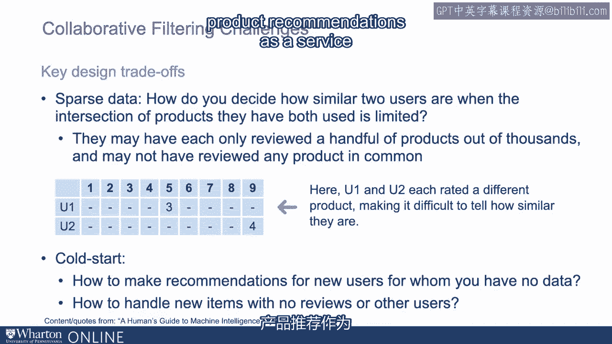

# 沃顿商学院《AI For Business（AI用于商业：AI基础／市场营销+财务／人力／管理）》（中英字幕） - P42：8_个性化推荐系统.zh_en - GPT中英字幕课程资源 - BV1Ju4y157dK

 In this lecture， we will start with an introduction to personalization on the web。

 and I'll specifically。

 dive into recommender systems。 Now recommender systems。

 also sometimes referred to as recommendation systems， are systems。

 that attempt to predict what items or product or content are of interest to a consumer or。

 a customer based on some information about the customer， such as their user profile or。

 their past purchases or their ratings。 The most common example of a recommender system is what is known as a collaborative filter。

 It is a system that recommends using taglines or phrases such as customers who bought this。

 also bought this or customers who viewed this product also viewed that product or people。

 like you bought these other products。 Now these kinds of recommendation systems are unique because they add value to both customers。

 and to firms。 For consumers， they help them learn about new products and they help them sort through。

 large choices， meaning when you have lots of choices， they help them identify the most。

 relevant choices。 And for firms， they help in converting browsers to buyers。

 they help in cross-selling products， and they help increase loyalty by providing a customized or personalized browsing experience。

 Now there are many examples of this。 You are used to a message such as people who bought this product also bought these other。

 products or on Google News， you might be used to seeing personalized news recommendations。

 or on YouTube or Netflix， you might be used to seeing personalized video and movie recommendations。

 as well。 Now if you look at the designs of these systems at a high level。

 there are two main types of， designs that are used in the industry。

 The first is what are known as content based recommenders and these are systems that attempt。

 to find other products of interest to consumers based on some information about product attributes。

 So for example， if you like a product， these systems look at the attributes of these products。

 that you like and they find other products of a similar nature。

 An example of that is Pandora's music recommendation system。

 The other design is what is known as a collaborative filter。

 A collaborative filter doesn't actually go deep into the product attributes。 Instead。

 collaborative filters recommend items based on others on what others are consuming。

 So they try and find other people who have similar tastes and they recommend what else。

 they might like。 So for example， people who bought this also bought this。

 So let's dive into both of these examples and look at them in greater detail。 So first。

 content based recommenders。

 As I mentioned， they tend to focus on content attributes or product attributes and they。

 tend to find other products with similar attributes。

 So an example of that is Pandora which is a music service， online music service。

 And Pandora essentially recommends and plays songs that are likely to be of interest to， consumers。

 Pandora emerged from a project that was known as the music genome project。

 Essentially in this project， many artists， hundreds or perhaps even thousands of artists。

 listened to millions of songs and rated these songs along multiple dimensions or attributes。

 So for example， you might say that a particular song is getting a high score in terms of electronic。

 influence but it might have a low score in terms of how rhythmic the song is， also known。

 as the rhythmic syncopation。 Or it might actually get a low score in terms of major key tonality。

 These are different musical qualities of a song。 A different song might get a high score in terms of rhythmic syncopation but might get a low。

 score in terms of electronic influence but get a high score in terms of major key tonality。

 and so on。 And in this example， I just mentioned three different musical attributes or musical qualities。

 of a song which is electronic influence， rhythmic syncopation and major key tonality。

 But in practice， Pandora has over 150 different attributes for any given song。

 And given these attributes and given a database of a large set of songs and with very deep。

 information on the musical qualities of each song， the goal of Pandora is to now start recommending。

 songs。 The way that works on Pandora is a user comes in and starts by indicating that there's some。

 song that they like。 For example， I might log in to Pandora and indicate that I like the song Thunder by Imagine。

 Dragons。 Now Pandora looks into its database and finds other songs with similar musical qualities。

 And then it recommends those songs。 For example， when I logged into Pandora and indicated that I like Thunder by Imagine Dragons。

 Pandora next played a ride by 21 pilots and it specifically said that it recommended the。

 song because it has a dub production， it has a reggae feel， it has an acoustic rhythm piano。

 it uses a string ensemble and it has major key tonality。

 These are the attributes of the song Thunder by Imagine Dragons that it also found in ride。

 by 21 pilots。 Now as you can see， this is based on deep knowledge about the product or the content being recommended。

 and this design can only be used when you have a lot of metadata about music or products。

 in general。 And these systems can adapt so for example if I listen to a song and give it a thumbs down。

 in other words indicate to Pandora that I do not like that song， then Pandora can incorporate。

 that feedback and learn and this is where learning comes in and adjust on the fly and。

 show us different songs that are closer to our preferences and that are different from。

 the songs we dislike。 And so this is a key portion of the learning that is built into these algorithms。

 The other design that is different from the content based design is the collaborative filter。

 The collaborative filtering does not require very deep knowledge of the products being。

 recommended so they don't require attributes of songs or other products。

 Instead they are based on information on what other people are consuming。

 So for example Amazon's people who bought this also bought that is based on collaborative。

 filtering。 In fact when Netflix originally launched its streaming service initially the design was。

 based on collaborative filtering。 It essentially grouped users into different personas based on their ratings and viewing。

 patterns and then made suggestions or recommendations to people based on what other people like essentially。

 what other people with similar persona like。 Now last。

fm is a music service on online music service that users collaborative filtering。

 to make recommendations。 The way this would work is that if I go to last。

fm and indicate that I like Thunder by， Imagine Dragons。 Now last。

fm does not necessarily have deep knowledge of the musical qualities of Thunder。

 Instead it would look at what other users have like the song Thunder and once it identifies。

 other such users it looks at what other songs these users have liked and it recommends their。

 songs。 So these are the two main designs within collaborative filtering there are many variations of that。

 design。 So for example there is a design known as an item to item collaborative filter and essentially。

 this design recommends songs to users based on what others are consuming but the input。

 to this design is a specific item that you have indicated that you like。

 So for example I started by saying I like Thunder by Imagine Dragon and that is the。

 input that is used by the system to start recommending songs and therefore that design。

 is an item to item collaborative filter。 The other design essentially uses information about the user as an input and not a specific。

 item。 This design is known as a user similarity based collaborative filter。

 And so essentially what this design does is it looks at all our past history and looks。

 at all the kinds of products that we have liked in the past and finds other people with。

 similar preferences。 I mentioned that Netflix used a design previously where it essentially created personas of people。

 and then found other people with similar persona and recommended what else they liked。

 That is a user similarity based collaborative filter。

 Another way both these designs don't require deep knowledge about the product being recommended。

 As a result they are very easy to build and also very cheap to build and that is why they。

 are also very popular。 The other aspect of their popularity is also that they are quite effective in practice。

 So all of us are used to seeing recommendations on retail sites like Amazon or on sites like。

 YouTube and we know they influence choices we make and indeed collaborative filter designs。

 although they are much simpler than content based designs are equally effective and therefore。

 are more popular because of the simplicity of their design。

 At the same time there are some challenges with building these kinds of systems。

 Whether you are building a content based recommender or a collaborative filter you have to contend。

 with how much data you have and you need enough data to start making recommendations。

 A collaborative filtering in particular leads a different kind of data set than content。

 based recommenders。 Content based recommenders need a lot of information about the attributes of the products being。

 recommended。 In contrast a collaborative filter uses information on what other people are consuming and so。

 it requires a lot of information on what others are consuming。

 And so one challenge in practice is that data might be sparse。

 Given user might have only rated say five or six items in a catalog of millions of different。

 videos or songs of a company and therefore now the company has to figure out how to recommend。

 songs to people or videos to people based on these limited recommendations。

 And these systems have to figure out how to use or similar to each other even though they。

 have each rated just five songs in common and these five songs might actually be very。

 different songs with very little overlap。 So sparse data is one problem。

 The other problem is what is known as a cold start。

 In other words a cold start is essentially the problem of how do you start making recommendations。

 to new users when you have no information about their past choices of interests or preferences。

 And also how do you recommend new items that have not yet been purchased by other people。

 or not yet being rated by other people but have been just added to the catalog and you。

 would like to start making recommendations。 And so that is another challenge。

 So there are many design challenges so data scientists will spend a lot of time thinking。

 through some of these design challenges but this is a field that is quite mature and there。

 are some very good answers to these kinds of questions。

 And so it is not very complicated today to build these systems。

 Companies also have the option of using a third party system so if you don't want to build。

 it yourself there are third party companies that provide recommendations product recommendations。

 as a service that companies can incorporate。 And so in summary there are many designs of recommendation systems。

 The two most popular ones are content based designs and collaborative filtering designs。

 These are very different designs in practice。 Both are quite effective and there are different tradeoffs with these designs and in later。

 lectures we will actually explore some of these tradeoffs a little bit more。 [BLANK_AUDIO]。

