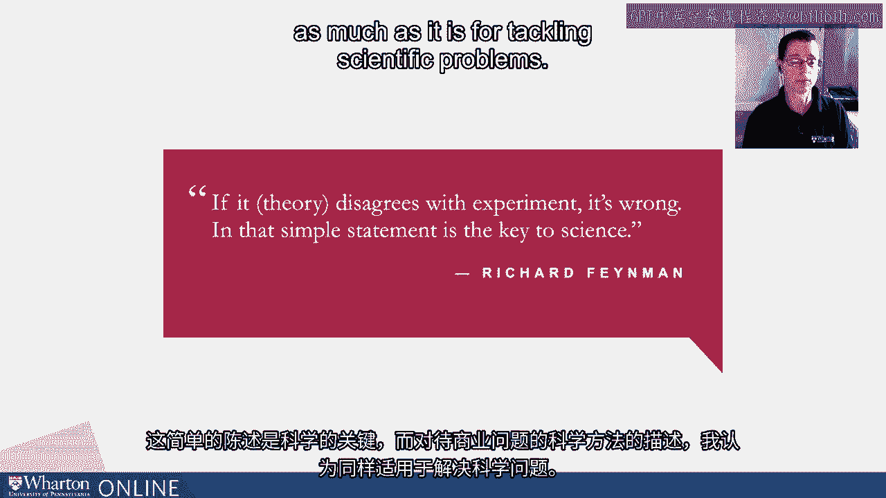
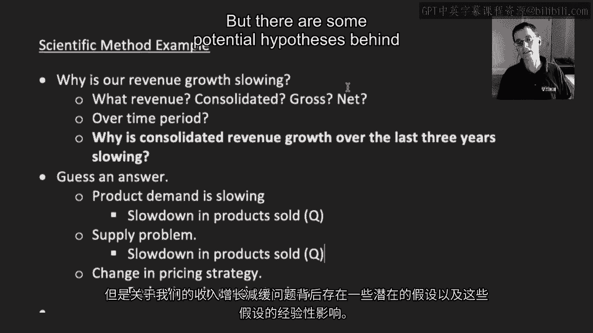
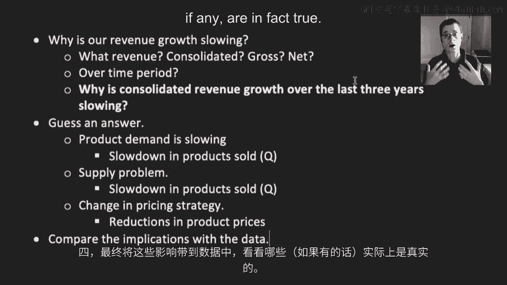

# 沃顿商学院《AI For Business（AI用于商业：AI基础／市场营销+财务／人力／管理）》（中英字幕） - P47：13_过程科学方法.zh_en - GPT中英字幕课程资源 - BV1Ju4y157dK

 So before any sort of machine learning or AI or more generally financial analytics exercise。

 we always want to have a process for how we attack a problem or question。

 And I think the most tried and true method is what most people refer to as the scientific。

 method。 And I love this quote by Richard Feynman， the great physicist， which sort of summarizes。

 the scientific method very succinctly and eloquently。 If it and by it， he meant theory。

 disagrees with experiment， it's wrong。 And that simple statement is the key to science。

 And that characterization of sort of the scientific approach to tackling problems， I think， is。

 incredibly useful for tackling business problems as much as it is for tackling scientific， problems。

 So let's be a little more explicit here。 So what is the scientific method？

 There's many ways to describe it， the one I find quite useful is the following。

 So first you start by clearly articulating a specific question。

 What problem are you trying to solve？ Then you guess an answer。

 Statisticians would say you hypothesize an answer。 Same idea。

 So you come up with some potential answers or hypotheses， solutions， proposed solutions。

 to the problem。 Step three， we want to then identify the empirical implications of those hypotheses or those guesses。

 to the answers to the question。 In other words， if the answer or hypothesis is correct。

 what should we see in the data？ And then finally， we want to compare the empirical implications of our guesses with what we actually。

 see in the data。 In other words， if our hypothesis is correct， this is what we see in the data。

 should see， in the data， but do we actually see it in the data？ And that's really the last step。

 So let's consider an example and apply the scientific method。

 Here's a question one might have。 Why is our revenue growth slowing？

 And question many business leaders might ask of their company。 Now it seems like a clear。

 specific question， but in fact， I have a lot of questions about， that question。

 It's not quite as clear as you might think if we want to go to the data to try and extract。

 an answer to that question。 So for example， what revenue？ Are we talking about consolidated？ Gross。

 net， net of returns， discounts， et cetera。 Over what time period？

 So are we talking about revenue growth just over the last year or over the last two years。

 five years？ And so if we want to take to the data， so to speak， this question， we need to be very。

 specific and clear about the question。 So let's imagine that what we're really interested in here is why is revenue growth over the。

 last three years？ Apologies for the typing。 And let's say it's consolidated at the aggregate level。

 not for a particular product。 Why is consolidated revenue growth over the last three years slowing？

 And eventually I'll learn how to type here。 This is our question。

 Remember that step two was to guess an answer。 What are some potential answers？ Why do you think。

 in fact， pause the video and try and come up with some answers？

 And the fact that you don't know what specific company we're discussing here is not relevant。

 Just use your general business sense and understanding of what drives revenue at a very general level。

 to try and come up with some answers to this question。 Okay， hopefully you're back。

 If you came up with some， what are some potential answers here？

 Some hypotheses as to why revenue growth is slowing。 Maybe one thing that's going on is that demand。

 product demand is slowing。 Maybe something else that could be going on is actually demand is not slowing。

 but we're， having a supply problem。 So there's a lot of demand for our products。

 but we just can't get product to the shelf， for some reason。

 Maybe what's going on is there's been a change in pricing strategy。 Remember。

 revenue is priced times quantity。 So a reduction in revenue over time or slowing of growth。

 more precisely， could come through， either the quantity or price channel。

 So there's a few hypotheses that we can test。 And then the third step was to identify the empirical implications of our guesses。

 Well the empirical implications of these different hypotheses are actually relatively straightforward。

 So if there's a change in pricing strategy， we can look at the data at the pricing of。

 our products to see if we have been reducing prices， perhaps too aggressively to maintain， demand。

 So we should see reductions in product prices。 Maybe what's going on is that instead we're seeing a slowdown in products sold quantities。

 And what's interesting is this is the same implication we would see for a supply problem。

 Growth will affect quantities。 And so if it turns out to be the case that we're just selling less units。

 we're going， to have to probe a little bit more deeply later on。

 But there are some potential hypotheses behind our revenue growth slowing question as well。

 as some empirical implications of those hypotheses。

 And then the last step is to compare the implications with the data。 That's our last step。

 So we'll have to actually look at some data on product sales， on product prices to see， what。

 if any of these hypotheses are actually playing true in the data。

 Now that's a very stylized example， but hopefully an illustrative one to emphasize the importance。

 of one clearly articulating a specific question that you can take to the data。 Two。

 guessing some answers to the question or hypothesizing。 Three。

 identifying the empirical implications of those hypotheses。 That is what we should see in the data。

 And four， eventually taking those implications to the data to see if which， if any， are in。

 fact true。 [BLANK_AUDIO]。

