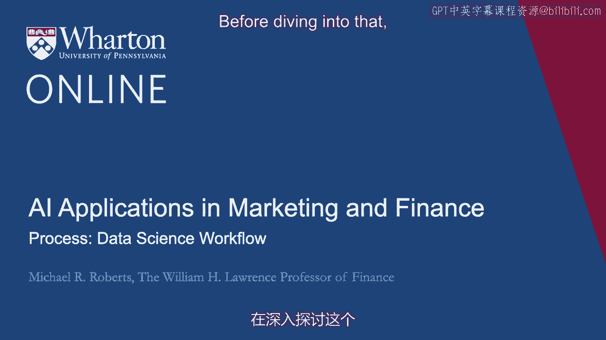
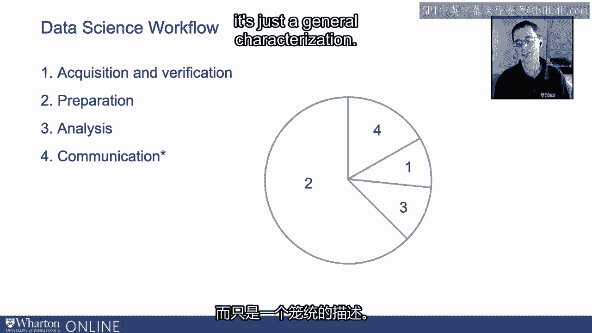

# 沃顿商学院《AI For Business（AI用于商业：AI基础／市场营销+财务／人力／管理）》（中英字幕） - P48：14_过程数据科学工作流程.zh_en - GPT中英字幕课程资源 - BV1Ju4y157dK

 So in this video I want to talk about the data science workflow。 And before diving into that。

 let me remind you of what we just spoke of， which is the scientific method。

 So that was a four-step process where we begin by clearly articulating a specific or precise question。

 We then guessed an answer or answers。 That is， we hypothesize the answers to that question。

 We then identify the empirical implications of those different hypotheses or guesses。 That is。

 if those hypotheses or guesses are correct， what should we see in the data？

 And then the last step is to compare those implications with what's actually in the data。

 And in this video I want to focus on that last step because there's an actual process for comparing those implications with what we see in the data。

 And that process is referred to as the data science workflow。

 Now as always， we start by Googling data science workflow and you get， in this case。

 over 95 million hits。 Perhaps more interestingly， there's a whole bunch of different images describing the data science workflow。

 some quite colorful， as you can see on the screen。

 But while there's many different ways to describe this workflow。

 many different labels for the different steps， I'd like to keep things very simple and intuitive。

 So let me describe the data science workflow in terms of the following four steps。

 The first step is acquisition and verification。 So first you've got to get the data。

 You've got to acquire the data。 And that could be a very simple process as easy as grabbing a spreadsheet off your local computer。

 It could be more involved with getting data from different parts of the organization。 It could be。

 it could involve hooking into external APIs to download data。

 It could be scraping data off of the web。 It could be purchasing proprietary data from different vendors。

 Data is everywhere and there's nearly as many ways to get it。

 But that in and of itself is a part of the process。 Of course once we have the data。

 you have to verify it。 Reagan used to say trust but verify。

 Never is it more true than when working with data。

 So quite often data will come with some sort of data dictionary or documentation。

 Never take that at face value。 We always want to verify the data by actually looking at it。

 by beginning to work with it and making sure we understand it。

 Now having acquired and verified the data that it is what we think it is。

 the second step is to prepare the data for analysis。

 And that might sound like a straightforward step。 But as I'll mention in just a minute， it is not。

 Quite often data is in a variety of formats。 We're going to have to wrangle that data。

 We're going to have to clean that data。 We're going to have to explore that data through exploratory data analysis。

 perhaps EDA。 To again improve our understanding to further verify。

 maybe we'll have to go back to step one to get more data or different data。

 But preparation is in and of itself an important step in the data science workflow。

 Once we've prepared our data， again ensuring that we understand it， that it's correct。

 that it's in a format that's ready for whatever analysis we intend to take。

 We then analyze the data and analyzing the data can be as simple as producing an average or standard deviation。

 some summary statistic， or can be as complex as running a machine learning or AI pipeline in which we explore。

 We train and test a variety of different models to arrive at a final model that will put into production。

 The last step of the data science workflow that's sort of alluded to。

 but not often considered a formal step is what I call communication。

 So having gone through the process of acquiring， preparing， and analyzing the data。

 arguably the most important part， or at least an equally important part。

 is being able to communicate your results to decision makers in a manner that is clear and compelling so that they can take action。

 And it's quite often there's a disconnect between steps one through three and step four that I think is a disservice to data analytics in the workplace that sort of puts a ceiling on just how powerful and how useful data analytics can be。

 because data scientists or whomever's working with the data is simply。

 able to communicate their findings in a way that resonates with management who may not be as well versed as working with data as data scientists。

 statisticians and others may be。 So those are the four steps of the data science workflow and I put a little very lowbrow pie chart on the slide to illustrate what I think is sort of a general breakdown of time and effort in the data science workflow。

 And so the numbers in the pie chart correspond to the numbers or the steps in the data science workflow。

 and you'll see that too preparation is the majority of the pie。

 And that's certainly been my experience。 It's been the experience of virtually all of my colleagues。

 preparing， cleaning， understanding the data takes so much time。 In my experience。

 a good 75 80% of the time at least， whereas， you know。

 the actual analysis once it's once the data is in a nice clean format is relatively straightforward。

 It's relatively easy to push data through models。 It's a whole different thing to have the confidence in the data that's being pushed into the model。

 And so you can see that just the preparation takes a lot of time。 And so don't underestimate that。

 Of course， there's always exceptions。 This isn't a rule。 It's just a general characterization。

 [BLANK_AUDIO]。

