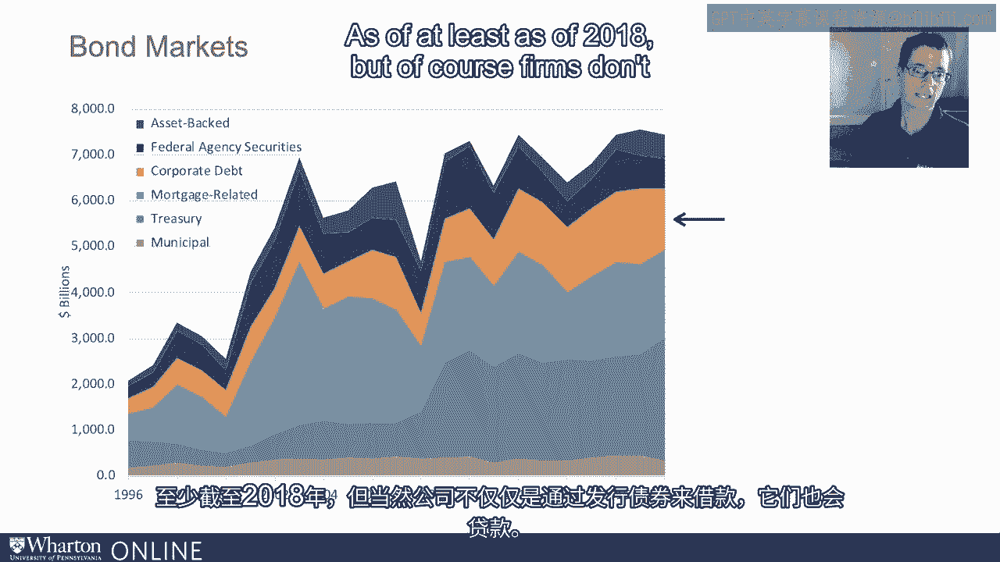
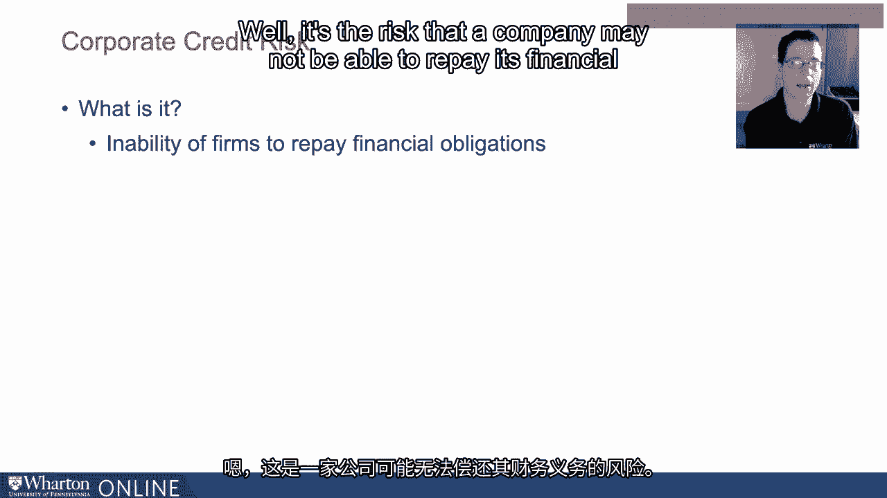

# 沃顿商学院《AI For Business（AI用于商业：AI基础／市场营销+财务／人力／管理）》（中英字幕） - P49：15_企业信用风险.zh_en - GPT中英字幕课程资源 - BV1Ju4y157dK

 So what I want to do now in this video is start talking about our。

 application or the example or illustration of financial analytics and some machine。

 learning and the context in which I want to discuss this is corporate credit。

 risk。 So just as a backdrop for some motivation here's a figure showing new。

 bond issuances across several different issuers in the US economy。

 Right we've got asset backed up here in Burgundy let's call it maybe Brown。 Navy is。

 federal agency securities。 This orange is corporate debt。 We've got mortgage。

 related bond issuances here。 Treasuries those are debt issued by the federal。

 government and municipal bonds down here in green bonds issued or debt issued by。

 states and municipalities local governments。 What we're going to focus on。

 are the this section the orange。 So we're going to focus on corporate bond。

 issuances which as you can see from the scale of this figure is in the near。

 trillions of dollars as of at least as of 2018 but of course firms don't just。

 borrow by issuing bonds they also take out loans and so if I just look at one。

 small component of the loan market in this case syndicated loans you can see。

 that the amount of syndicated loans and syndicated loans are just loans that are。

 syndicated or owned by several different financial institutions as。

 opposed to being owned solely by one institution。 You can see that the amount。

 outstanding is at least certainly today in excess of two trillion dollars in。

 total and you can see a slight breakout by by relative risk low risk versus high， risk。

 The point of these two pictures is simply to emphasize that corporate。

 credit corporate debt loans made to companies is a very large market it。

 consists of several different markets but they're all related through this。

 notion of corporate credit risk and so what do we mean by corporate credit risk。

 well it's the risk that a company may not be able to repay its financial。

 obligations。 Now why is that important hopefully the last two slides impressed。

 upon you that it affects an awful lot of money in terms of money borrowed by。

 companies but also money owed to different investors so it affects the。

 availability of credit it affects the price of credit。 Now for whom is credit。

 risk important a lot of different stakeholders so there's investors you。

 know I happen to own bond mutual funds shares and bond mutual funds so I am an。

 investor in corporate debt。 Employees are concerned about corporate credit risk。

 because if firm defaults and no longer exists employees no longer have a job。

 customers care about corporate credit risk think about I always think back to。

 2008 in the Great Recession and what happened with car companies you wouldn't。

 want to buy a car from an auto manufacturer that's about to go bankrupt。

 because on the one hand you you may get a great deal on the car on the other hand。

 where you're gonna get its service if the company goes belly up。 The flip side。

 of that is of course suppliers are concerned about credit risk suppliers。

 will be much more reluctant to extend trade credit or terms to their。

 purchasers if that purchaser is subject to a lot of credit risk and possibly a， default risk。

 And then finally I list taxpayers up there because again going。

 back to the 2008 financial crisis or the Great Recession you know wound up being。

 the case the taxpayers were on the hook for a lot of debts that certain。

 intermediaries financially intermediaries couldn't pay。 That's what， the bailouts were。

 So let me give you an outline here of where we're headed in， the remainder of these videos。

 I want to think about how to quantify and assess， corporate credit risk and I won't want to do it by way of examples。

 I want to。

 then segue into a stylized machine learning example in which we're actually。

 gonna predict credit ratings or at least a very narrow definition of credit。

 ratings just to sort of highlight the process and what goes on behind it some。

 of the thoughts。 And then we'll of course we can on the back end discuss。

 different extensions both of the example and into other domains。 So that's the。

 general outline。 [BLANK_AUDIO]。

