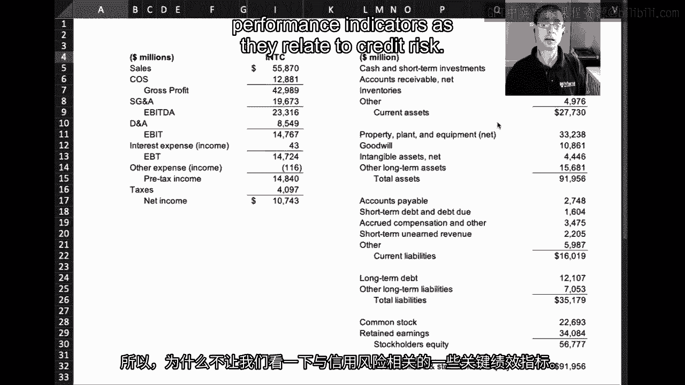
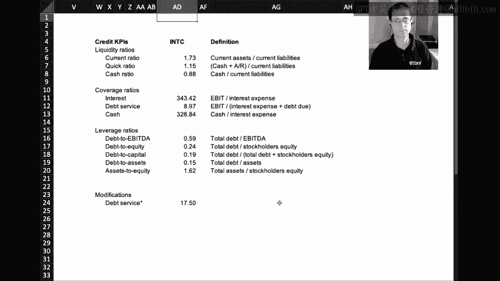
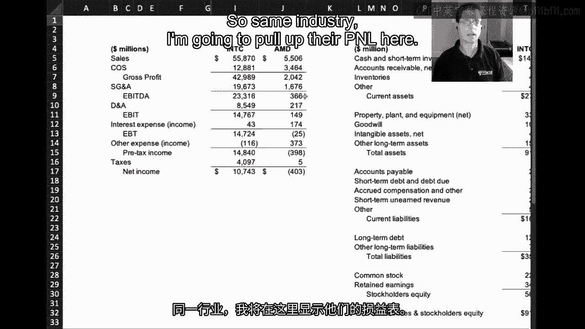
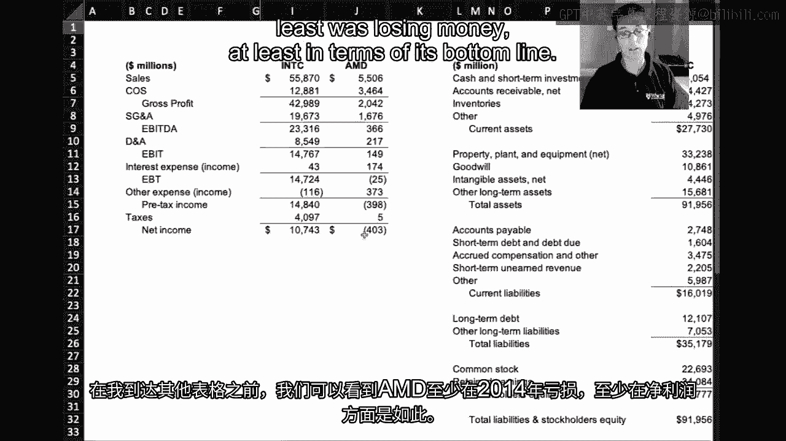
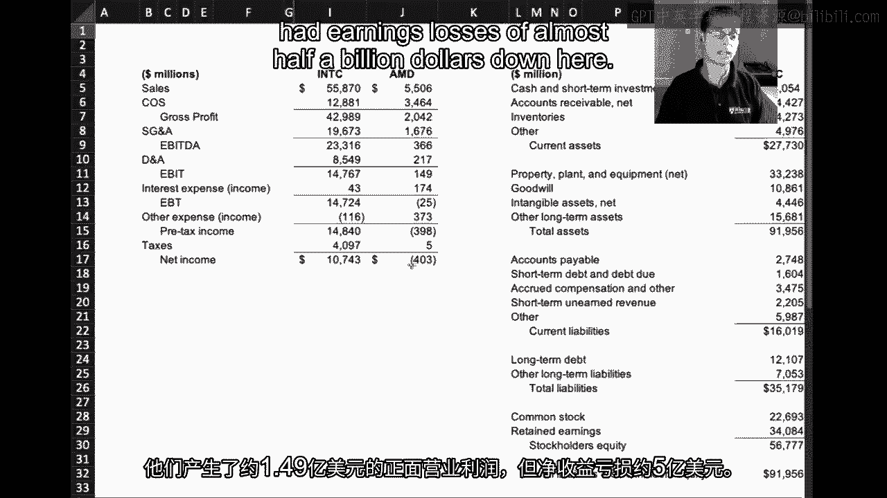
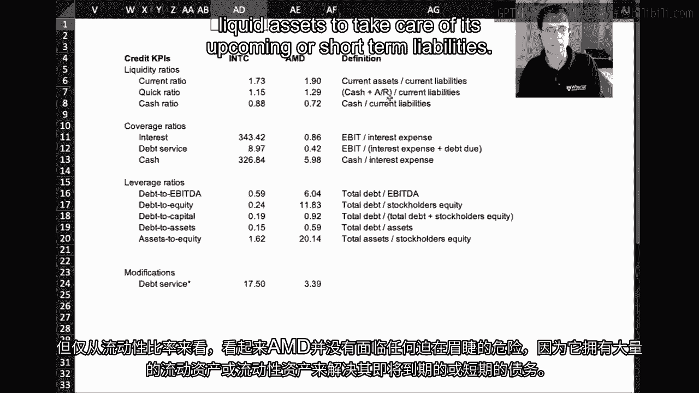

# 沃顿商学院《AI用于商业：AI基础／市场营销+财务／人力／管理》（中英字幕） - P50：16_信用风险KPI.zh_en - GPT中英字幕课程资源 - BV1Ju4y157dK

现在我想开始讨论信用风险KPI或关键绩效指标。

我将首先讨论如何评估信用风险，然后逐步引入这些内容。

我想这样做，让我们看看一些数据。

坦率地说，这是小而简单的数据，但仍然是数据。

这里屏幕上显示的是英特尔公司的损益表和资产负债表。

我认为这是他们2014财年的数据。这只是一些历史数据，用来说明我想讨论的一些概念。

让我们先看看他们的损益表，这里是他们的收入表。

你可以看到，他们的收入稍微超过550亿美元。

他们的营业收入超过140亿美元。净收入或收益约为100亿美元。

从信用风险的角度来看，仅看他们的损益表，我们可以看到这是相当的。

盈利的公司，但这并不一定意味着他们能够偿还所有。

我们无法知道他们的财务义务是什么。

那么让我们看看他们的资产负债表，看看他们有哪些义务。

现在他们有一些非财务债务，比如应付账款，我们。

目前我们将忽略的。我们将专注于财务义务。

特别是短期债务和到期债务。所以这是将在一年内到期的债务。

可能是因为它的到期时间非常短，比如商业票据。

或者因为其长期债务即将到期，所以稍微超过1美元。

短期债务为60亿美元。长期债务约为120亿美元。

所以财务债务稍微超过137亿美元。

有趣的是，他们实际上有140亿美元的现金和短期投资。

当然，它并不是真的坐在某个银行的储蓄账户里，而是在。

短期流动资产，易于转换为现金。

从一个非常高的层面来看，他们的收入表和资产负债表。

从表面上看，英特尔似乎不是一个特别高风险的公司。

在偿还其财务义务时，要考虑它所持有的现金数量。

以及它的年收益。但是这非常松散。再一次。

我想朝着更正式的方向发展。

那么我们为什么不看看与信用风险相关的一些关键绩效指标呢。

那么让我在我的电子表格上移动一下，让你关注这个表格。

就在这里，如果你愿意。现在让我们开始看一些流动比率，因为可以说大多数偿付能力问题开始于。

作为流动性问题，不是每个流动性问题都转变为偿付能力问题。

但流动性对于违约的重要性是众所周知和理解的。

所以让我们看看三种试图捕捉公司流动性状况的比率。

我所谈论的是流动比率、速动比率和现金比率。

首先，从顶部开始。流动比率，我在这一栏A.G.中有定义。

流动比率只是流动资产的比例。

这指的是公司所有可以在一年内轻松转换为现金的资产。

除以流动负债，即公司所欠的所有债务或所有钱。

在一年内。现在这个比率是1.73，可以简单理解为如下。

好的，每一美元流动负债有$1.73的流动资产。这是$1。

它有73的流动资产，可以轻松转换为现金以偿还每一美元。

在接下来一年内需偿还的债务。这似乎还不错。

所以它有足够的资产来覆盖其负债。

但当然，这种流动资产易于转换为现金的概念，并非全部。

流动资产是一样的。因此，速动比率通过从分子中排除库存来承认这一点。

所以它只考虑现金和应收账款。一旦我们排除库存，速动比率。

流动比率减去库存，从1.73降至1.15。

我们有现金和应收账款，每一美元流动负债有$1.15。

如果我们真正专注于现金，每一美元的流动资产有88美分现金。

债务。因此，这些数字会因为我们越来越多地排除库存而下降。

从分子中移除它，以优先考虑相对的方式。

每种资产的流动性。到底哪个指标是正确的，其实是错误的思考方式。

每个指标提供稍微不同的信息。

我们正从一个更激进的流动比率转向一个更保守的现金比率。

不管我们关注哪个指标，显然英特尔的库存是合理的。

可以用来偿还其流动负债、即即将到期或短期的流动资产。

现在从流动性转向覆盖比率，从这开始。

利息覆盖比率。这是大多数金融信贷协议中非常常见的比率。

大多数情况下是银行贷款。作为契约，企业需在其生命周期内保持一定的覆盖比率。

贷款以避免违反特定的契约。

利息覆盖比率只是EBIT或营业收入与利息支出的比例。

对于英特尔来说，每一美元的利息都有$343.42的营业收入。

费用。想想这意味着什么。这意味着他们可以轻松处理一年内的所有利息费用。

营业收入，别说他们的流动资产了。

但我们不仅要支付借款的利息，还要偿还本金。

因此，债务服务比率通过包括不仅仅是利息支出来考虑这一点。

但也包括在分母中到期的债务。

因此，我们看到覆盖比率在从利息到债务服务的转变中大幅下降。

正如你可能预期的那样，但英特尔几乎每一美元都有将近9美元的运营收入。

关于下一年到期的利息和本金。换句话说。

他们的运营产生了足够的覆盖来应对财务义务。

他们的财务义务。此外，还有一种叫做现金覆盖比率的东西，关注这个比率。

从资产负债表的现金资产到利息支出。正如我们之前看到的那样。

他们有超过140亿美元的现金资产，完全足够应对任何利息支出。

所以，再次强调，不要在森林中迷失。英特尔相对于其当前义务拥有相当可观的流动性。

相对于其财务义务，它产生了大量的运营收入。

当前的财务义务。然后我想关注的最后一组比率是杠杆比率。

这些是稍微不同的看法。杠杆比率在关注公司如何融资其运营。

其中一个更受欢迎的比率是债务与EBITDA的比率。

这与利息覆盖比率类似，在许多不同的银行贷款中作为一种流行的指标出现。

借款人必须遵守的契约。他们必须保持低于某一阈值的杠杆比率。

比如三或四，无论是什么，以免违反那个特定的契约。

你可以看到英特尔的债务与EBITDA比率是0.59倍，对吗？因此债务的数量。

短期和长期债务是其运营收入的0.59倍。

通过EBITDA而非EBITDA来衡量。想一想这一点。

这是否意味着他们相对于运营有巨额债务？几乎不是，对吧？

他们生成的运营收入足够支付几乎所有的债务。

他们的整个债务账单几乎是两倍。剩余的杠杆比率，债务与股本比率。

资本债务与资产、资产与权益的比率又是如何从不同角度看待公司资金来源的。

仅仅关注资产负债表，而不是同时关注资产负债表和损益表。

我们可以看到，例如，债务与资产比率是0.15，意味着每一美元。

在资产中，这些资产的15美分是由债务融资的，另外85美分由股本融资。再一次。

这并不是一个高度杠杆化或低杠杆化的公司，正如这些不同的比率所暗示的。

现在让我们将其与另一家芯片制造商AMD进行比较。

所以同样的行业，我会把他们的损益表拉出来，在我查看其他表格之前。

我们可以看到，至少在2014年，AMD是亏损的，至少在其财务表现上。

从根本上说，它生成了大约1.49亿美元的正营业收入，但也遭受了损失。

这里的收益损失几乎达到五亿美元。

如果我们看看它的资产负债表，你可以看到它的现金少了很多，但。

当然，这是一家规模更小的公司。因此，这里确实是苹果与橘子的比较。

更有趣的是查看信用KPIs。

如果我们看看AMD的流动性覆盖和杠杆比率，以及它们与英特尔的比较。

我们得到了一个非常有趣的对比。

所以让我们从流动性比率开始。令人惊讶的是，AMD的比率类似。

如果不更强，这取决于你查看的比率，流动性比率相对于英特尔。

它有更高的流动比率，更高的速动比率和略低的现金比率，但。

仅仅查看流动性比率，似乎AMD并没有面临任何迫在眉睫的危险。

这意味着它拥有重要的流动资产或流动资产来处理其。

即将到来的或短期的负债。

然而，当我们开始查看他们的覆盖比率时，情况发生了相当大的变化。

那么让我们看看利息覆盖比率，记住这是他们的营业收入。

除以他们的利息费用。我们可以看到，这实际上低于一，是0.86。

因此，对于他们明年到期的每一美元利息，他们仅生成。

86美分的营业收入，这意味着如果他们要支付利息。

他们将不得不在其他地方寻找资金，可能在资产负债表上的某个地方。

他们的流动资产。如果我们看债务服务，那就是即将到期的债务。

我们看到这个数字大幅下降，减半以上，因此每一美元。

明年到期的利息或本金欠款，他们只有42美分的。

营业收入。再一次，这告诉我们他们必须在其他地方寻找资金，因为运营并不。

足够产生以覆盖债务负担。

你可以看到它最有可能的来源，这个漂亮的流动性缓冲。

似乎必须使用。还有额外的借款或股权发行。

它将被用于帮助制作。

这些债务服务支付。

这就是现金余额与利息费用比率如此高的原因，他们正坐拥着。

相对较大的一笔现金。这也与英特尔形成了有趣的对比。见。

英特尔可以通过其运营来处理所有。

其债务服务需求。这意味着它可以将流动资金用于战略和运营原因，而不是。

帮助偿还债务，而AMD显然需要这些流动资金来偿还债务。

至少要为其债权人提供一些信心，表明它将能够履行债务。

用于支付即将到来的债务。现在这种差异再次出现在AMD和英特尔的杠杆比率中。

而英特尔则是。

根据EBITDA，AMD每赚取1美元的营业收入就有59美分的总债务。AMD的债务是6美元。

它的杠杆比率是EBITDA的六倍。同样。

而英特尔用15美分的债务和85美分的股本来融资其资产。

AMD的资产几乎是用60美分的债务和40美分的股本融资的。

所以，AMD使用了更多的债务，相对来说情况更为紧张。

现在停下来想一想这意味着什么。这告诉你关于这两家公司相对信用风险的什么信息？

事实上，它们是不同的。如果你还没有意识到这一点。

尽管我想大多数人都明白，但应该很清楚AMD的财务状况远不如英特尔稳健。

英特尔在履行财务义务方面的状况远好于AMD。

因此，从信用风险的角度来看，AMD是一家风险更大的公司，相比之下英特尔则要好得多。

所以，把这一切结合起来，我们学到了什么？

我们实际上学到了一些信用风险分析的基本知识。

现在还有很多内容，但在阐明一些事情上我们已经走得相当远。

识别流动性和潜在偿付能力问题的相关KPI。

我们看到它们在同一行业、同一业务中甚至可以有不同的表现，其实并不完全一样。

相同的商业模式，但同样的行业，这里指的是芯片制造商。

我们看到英特尔和AMD的信用风险存在显著差异。

[空白音频]。

