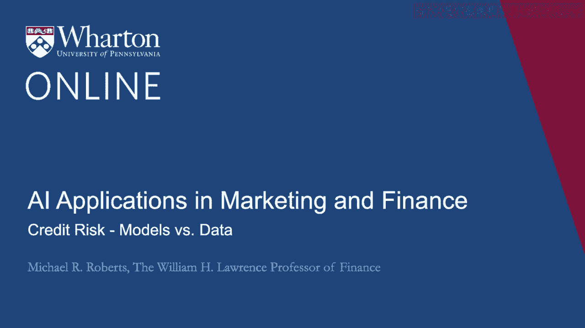
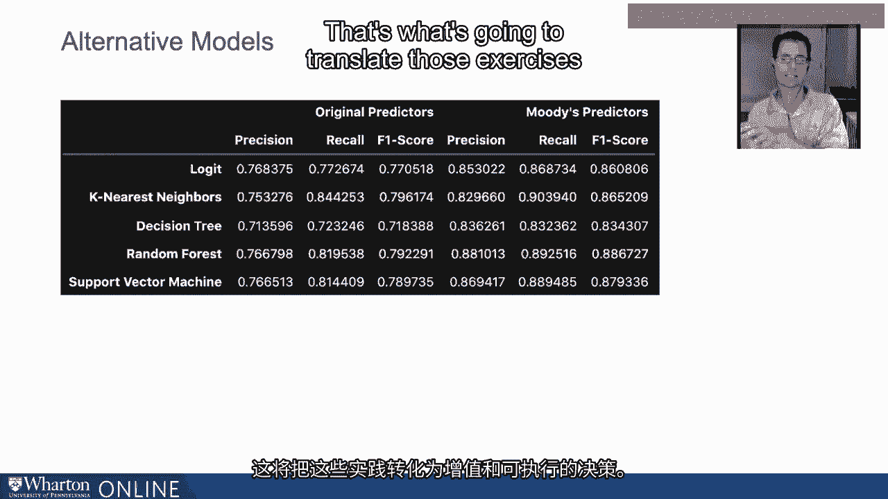

# 沃顿商学院《AI For Business（AI用于商业：AI基础／市场营销+财务／人力／管理）》（中英字幕） - P56：22_信用风险模型与数据.zh_en - GPT中英字幕课程资源 - BV1Ju4y157dK

 So now I want to talk about models versus data。

 And let me remind you of what we've done thus far。

 We have estimated a logit model to predict whether a firm is， investment grade or speculative grade。

 And I'm going to repeat the results， the old results using the 11 predictors that we had discussed in the past。

 the 11 credit risk KPIs。 I'm going to put the precision recall and F1 score for。

 our logit model here just so we have a benchmark for comparison。 And to refresh your memory。

 remember precision is the probability of correctly。

 predicting an investment grade outcome conditional on predicting， investment grade more generally。

 right？ When we predict investment grade， we can either get it right or we can get it wrong。

 So we're getting it right 76。8% of the time。 And then the recall score is the probability of correctly predicting an。

 investment grade outcome when it is an investment grade outcome in the data。

 So the data can either be investment grade or speculative grade。 We are getting it right 77。

3% of the time。 We're overlapping in the data with our model。

 And then the F1 score is this harmonic mean or， weighted average of the precision and recall。

 which is about 77。1%。 What I then did is I looked at several alternative models for。

 classifying speculative grade and investment grade firms。 Specifically， K nearest neighbors。

 a decision tree， a random forest and， a support vector machine。

 I also did something called cross validation for all of the models， including the logit。

 to ensure I'm not just overfitting on one particular sample。 Okay。

 the details of that are not important。 Let's keep this relatively high level。

 The point I'm trying to make here is that when I look at alternative models。

 I do see improvements on different dimensions。 For example， the K nearest neighbors has a very high。

 well， relatively high recall score of 84% compared to all other models。 Although not surprisingly。

 it seems to suffer a bit on precision， at least when compared to the logit random forest and support vector machine。

 The decision tree， this just doesn't do particularly well along any metric。

 relative to the other models。 And in terms of sort of overall precision and recall F1 score。

 we can see that the random forest and the K nearest neighbors， well。

 the K nearest neighbors wins it by a slight margin of 79。6%。

 And so we do see some variation in the predictive accuracy of different models。

 We can do better than logit given our current specification of inputs。

 What I want to talk about now though， is comparing performance not just across， different models。

 but also across different predictors。 Remember our original predictors were the 11 credit KPIs。

 What I then did is I went out and found an old， not too old。

 somewhat old Moody's research report detailing some of the predictors。

 that they use in their credit rating model。 Now， that's not going to lead to perfectly accurate predictions for。

 a variety of reasons， not the least of which I'm looking at S&P credit ratings。

 But also because there's a lot more that goes into credit ratings than just。

 the quantifiable P&L and balance sheet data for a firm。 There's lots of discussions。

 there's industry analysis， competitive analysis， etc。

 But what I'm trying to see here is if I push better data， more informative data through the model。

 will that lead to an improvement？ And how will that improvement compare relative to the improvement I got？

 By looking at different models。 And so I've put all of this on the screen here。

 Let me walk through and explain what it all means。

 So the first three columns measure the precision recall in F1 score of our five。

 different models using the 11 original predictors that we talked about from the。

 very start of this series。 The last three columns present the same metrics for the same models。

 but using different inputs， different X variables， different predictors。

 which I'll just refer to as Moody's predictors。 And what I think is important to take away from this table is that the increase。

 in predictive accuracy across all measures moving from the original data。

 or the original predictors to the Moody's predictors。

 is significantly larger than any increase in accuracy obtained from， alternative models。

 So let's just focus on the F1 score to make things concrete and simple。

 We can see that the F1 scores range from 71 up to 79。6% using the original predictors。

 But when we use Moody's predictors， these numbers jump up all the way to 88。6%。

 in the case of the random forest。 So what's the message here？ The message is data， not models。

 That's what leads to successful machine learning implementations。 Let me repeat that。 Data。

 not models。 Models can help。 I'm not dismissing the importance of models。

 I'm simply saying in terms of relative ranking， where you want to spend your。

 resources is on better data， better understanding of the data generating process。

 That's what's going to drive successful machine learning exercises。

 And that's what's going to translate those exercises into value。

 accretive actionable decisions。 [BLANK_AUDIO]。

