# 沃顿商学院《AI For Business（AI用于商业：AI基础／市场营销+财务／人力／管理）》（中英字幕） - P60：26_金融欺诈检测中的机器学习.zh_en - GPT中英字幕课程资源 - BV1Ju4y157dK

在这次讲座中，我们将探讨机器学习在中的一些应用。

更详细地讨论财务。因此在我们与APUR的对话中。

我们讨论了机器学习的几种应用。

在前台和后台都有。因此，我们将从APURVE提到的后台应用开始。

欺诈检测。现在让我们从信用欺诈检测开始。在过去。

信用欺诈检测在实时中是无法完成的。

最常见的情况是，一旦发生欺诈，通常会在很久之后才。

是某人检测到了欺诈。最常见的是客户在查看其信用时发现。

信用卡账单上，他们会注意到一笔不合法的交易。

他们可能会随后联系公司，公司可能会撤销该交易。

然后发送新卡。

但在这种情况下，客户受到影响，这可能造成了很多损失。

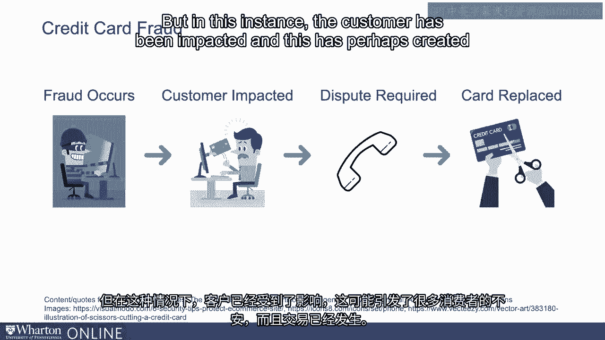

消费者焦虑的情况。此外，交易已经发生。

因此，尽管客户可能会得到赔偿，但信用卡依然会遭受损失。

公司或商家。如今，信用卡欺诈检测的世界正在转变，机器。

学习算法在交易发生时实时评估。

因此，当客户使用信用卡时，无论是在网上还是在店内。

在面对面时，算法可能会评估该交易，然后检测潜在欺诈。

如果它判断交易可能是欺诈，那么客户就会。

被提醒，如果需要，客户会重新发卡。

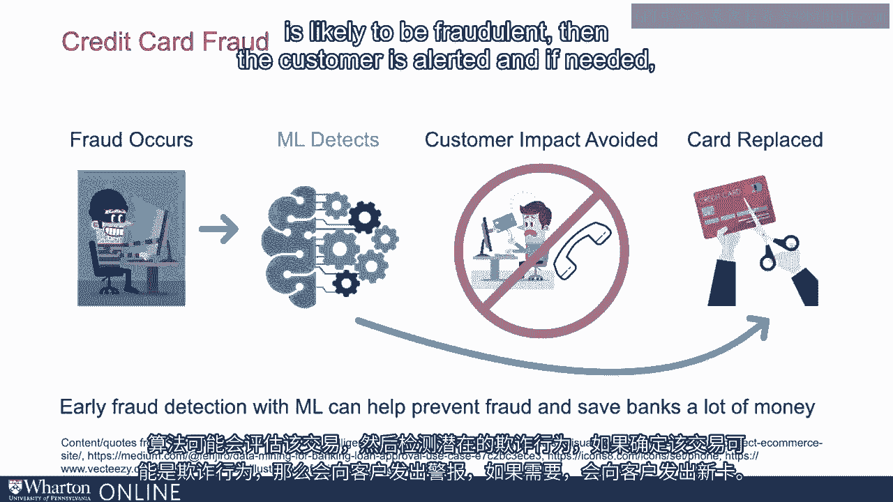

这项技术实现的是我们能够在客户体验之前检测到欺诈。

任何不满或焦虑，同时帮助避免第一次的欺诈交易。

从而为商家或信用卡公司节省了资金。

现在，机器学习应用于欺诈检测时无疑是非常有价值的。

这些算法的准确性极为重要，因为假阳性或假阴性。

负面影响可能代价高昂。假阴性发生在商家未将交易识别为欺诈时。

这让欺诈者能够完成购买。

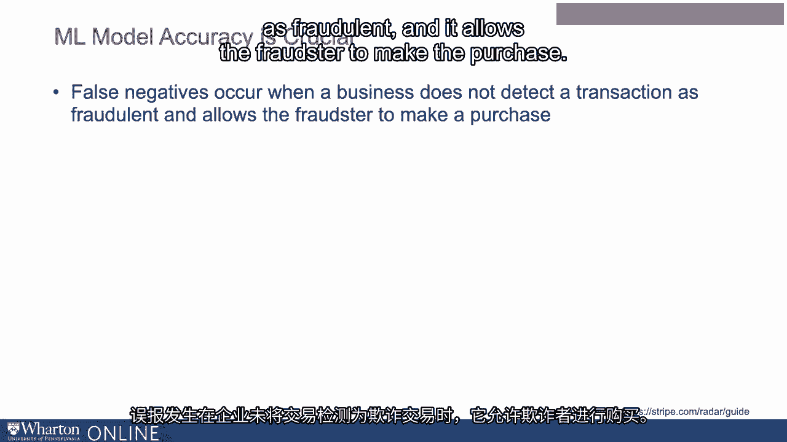

在这种情况下，实际持卡人发现了收费，提出异议并可能获得退款。

由银行承担，但商家或银行要负责出售商品的费用。

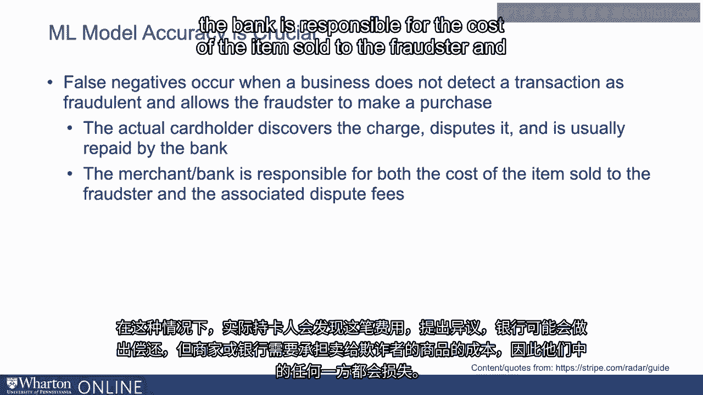

给欺诈者带来损失，因此其中一个会遭受损失。

另一种可能性是误报。这发生在一笔交易被标记为欺诈并被阻止，尽管实际上。

潜在购买实际上并不是欺诈。

在这种情况下，挑战在于它影响客户体验，因为交易。

即使在非欺诈情况下也被阻止，这可能会影响客户的长期保留。

简而言之，对于公司来说，确保它们的机器学习算法。

用于欺诈检测的算法准确度高，假阳性率和假阴性率低。

现在，如果我们打开黑箱，看看内部，看看使用了什么样的算法。

正在被公司使用，它们同时使用监督学习算法和无监督学习。

学习算法。

监督学习算法基于历史数据进行训练，这些数据本质上是。

传递的数据涉及那些随后被标记为欺诈的交易或。

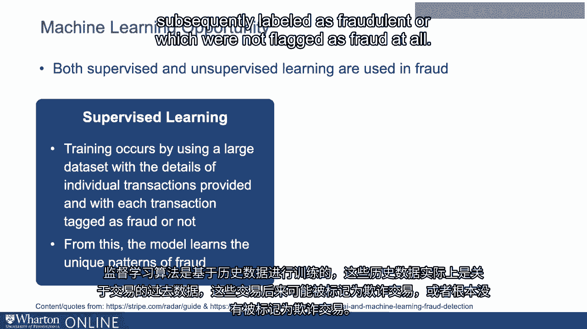

根本没有被标记为欺诈。我们可能会使用这些数据来训练算法，以确定什么构成欺诈交易。

看起来与常规或合法交易不同。

无监督学习算法基本上会查看任何交易并本质上。

进行异常检测。它们会查看这笔交易与其他交易有什么不同。

数据库中包括同一客户的其他交易。

因此，一笔看起来不同的交易会被标记。

所以让我们看看这些想法。首先，监督学习。对于监督学习。

我们需要大量的训练数据。鉴于训练数据。

算法正在查看交易的某些属性。

这些是基于特定交易的一些属性。例如。

这张卡在哪个国家使用，在哪个国家发放的？

或者，进行支付的网站的IP地址是什么，类似的事情。

它们也可能会使用行为数据。例如。

这张卡在多少个不同的国家被使用过？

在过去一个小时内，这张卡的交易数量相较于什么情况。

在这个时间段内交易的常见频率是多少？

所以这些是可能被使用的数据。

监督学习算法可能本质上会使用一个大型数据集。

客户过去交易的各种交易数据。凭借这些知识。

请记住，监督学习算法需要明确标记的输出。

所以它们需要知道那些过去的交易是否是欺诈。

基于这些数据，他们基本上试图识别一个独特的签名或一个独特的。

欺诈交易的特征或标识符集。

然后他们将其应用于未来的交易。

基于这些历史数据，可以学习到，例如，我所提到的决策树。

如图所示，在这个决策树上，算法主要关注某些。

交易属性。例如，首先查看交易金额是否大于或小于。

$20。如果大于$20，接下来会询问交易是否在加拿大进行。

如果金额少于$20，它会询问这张卡是否在超过两个国家使用过。

因此，它会查看这种数据以决定是否认为一笔。

交易是否为欺诈。这种决策树将基于历史数据进行学习。

因此，决策树的准确性依赖于拥有大量的数据，回顾我们的谈话。

在机器学习算法上。你需要大量的数据行和每行中大量的列。

因此，大量的数据行意味着我们需要数百万甚至数十亿的历史交易。

而大量的列意味着对于这些过去的每笔交易，我们需要知道很多。

信息。不仅仅是几张幻灯片之前表格中展示的简单信息。

而是针对每笔交易的非常丰富的数据，关于交易发生的地点。

交易的金额是多少，IP地址是什么，各种信息。

这时我们可以构建准确的监督机器学习算法。现在。

正如我之前提到的，这将与无监督学习算法结合使用。

进行异常检测。你可能会说，这笔交易的金额相对于过去的交易异常高。

而且，这笔交易发生在此人之前没有进行过交易的国家。并且在过去。

外国交易之前是到该国的航班购买。

而这次没有看到。因此，所有这些因素使这笔交易看起来像是一个异常，这可能会导致。

交易被标记为欺诈。

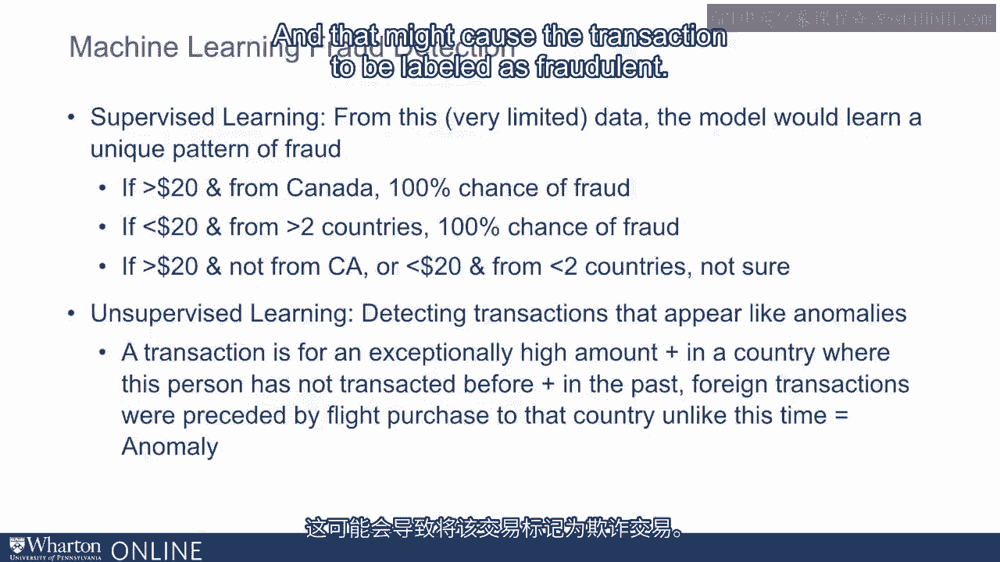

机器学习实际上在当今的银行中被广泛使用。

我们仍处于将机器学习应用于欺诈检测的早期阶段，它可以。

增加巨大的价值。首先，算法可以比任何人类更快地检测欺诈交易。

因此，检测速度极为重要，因为它有助于预防欺诈，而不是。

事后检测欺诈。

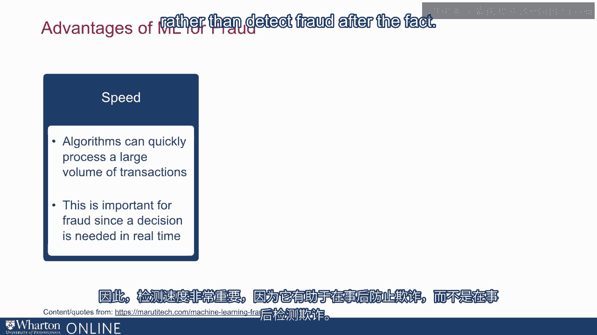

解决方案的规模在这里极为重要，因为人工干预或人类检测。

诈骗交易的检测并不容易扩展，而算法检测可以。

迅速扩展。

最后，使用机器学习的效率以及能力也是关键。

检测欺诈的准确性比人类可行性更高或更好。

考虑到银行今天在欺诈交易中损失数十亿美元，这个价值。

将机器学习应用于降低欺诈率的效果实际上非常显著。

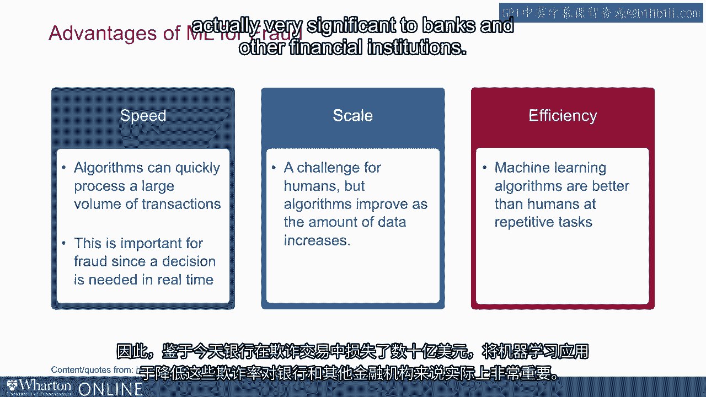

银行和其他金融机构。同时。

使用机器学习进行欺诈检测存在一些局限性。

其中之一是一些最先进的机器学习算法往往。

变得更加不透明，比如深度学习算法或梯度提升等。

因此，它们变得难以解释。如果它们难以解释。

有时可能很难发现算法的问题。

如果我们不理解算法的具体运作方式。同时。

算法中可能存在偏见，导致拒绝某些交易。

在某些邮政编码中，少数族裔可能居住，必须对此有所担忧。

这就是为什么人们对可解释机器学习的理念产生了浓厚兴趣。

被称为可解释的人工智能。其理念是如何使机器预测附带解释。

我们将在第四模块中进一步讨论这个话题。

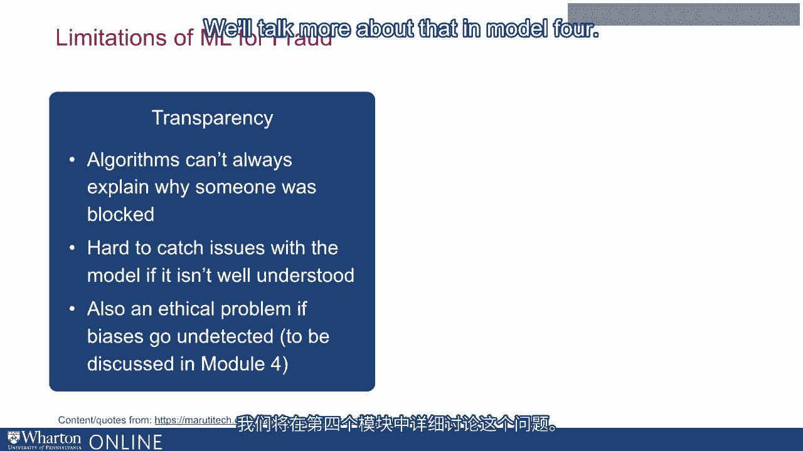

最后，将机器学习应用于欺诈检测的另一个局限是。

机器学习在大量数据下效果最佳。

所以小型组织在数据量非常有限的情况下无法获得最佳效果。

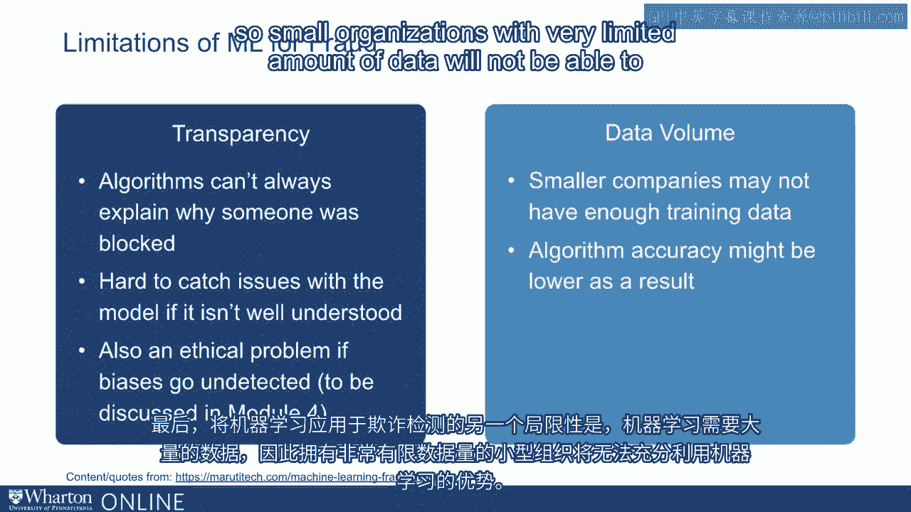

由于这个原因，机器学习的效果有限。[BLANK_AUDIO]。

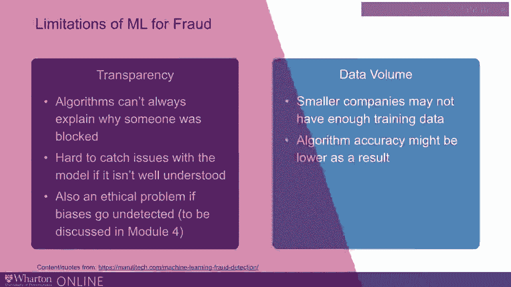
