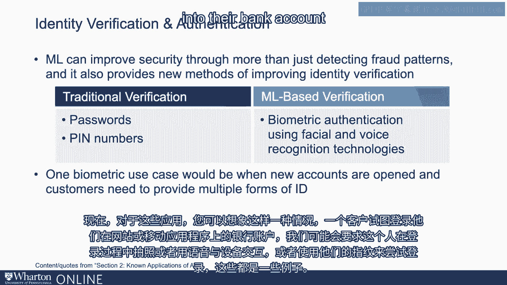
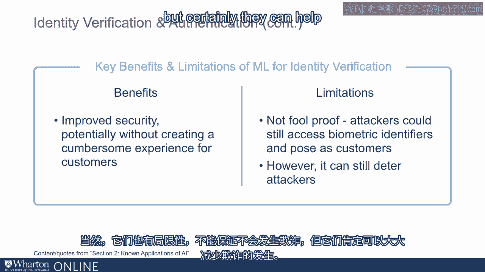
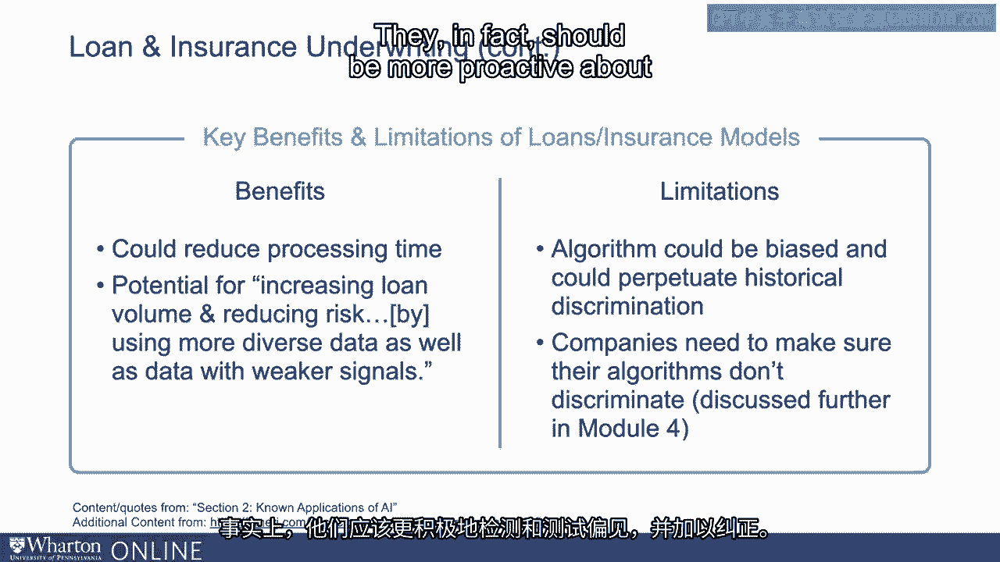

# 沃顿商学院《AI For Business（AI用于商业：AI基础／市场营销+财务／人力／管理）》（中英字幕） - P61：27_金融其他应用中的机器学习.zh_en - GPT中英字幕课程资源 - BV1Ju4y157dK

 In this lecture， we'll talk about additional applications of machine learning in finance。

 beyond just fraud detection。 In the conversation with APU， we talked about some of these examples。

 but in this lecture， we're going to go into the details of how we can apply machine learning for a variety。

 of different needs within financial services。 To begin with。

 let's talk about identity verification and authentication。

 This is extremely important in financial services， because if you're allowing consumers to。

 transact or to move money around， we want to make sure that the person who's actually。

 initiating the transaction is who he or she claims to be。

 And so we need to do identity verification。 The traditional way of doing verification of identities by using passwords or using pin。

 numbers， but the application of machine learning would be in terms of biometric identification。

 For example， to do face recognition or to do fingerprint recognition or to do voice。

 recognition in order to identify who's actually interacting with the company on the website。

 or on a mobile app。 Now in terms of these applications。

 you can imagine a situation where a customer is trying to。

 log into their bank account on a website or on a mobile app， and we might ask the person。

 to take a photo of themselves as part of the login process or speak into the device or。

 perhaps use their fingerprint to try and log in。 And so these are some examples。 In fact。

 in banks in China， it is not uncommon to have ATMs use face recognition。

 So when a customer walks in in front of the ATM， a camera that is on the ATM might actually。

 recognize the customer and then authenticate them and allow them to use the ATM。

 And this is in fact being used by multiple banks in China today。

 And biometric identification needn't just focus on things like a person's fingerprint。

 or their voice。 Over time， companies and researchers are also testing other ways to do customer identification。

 such as look at the unique ways in which they hold the phone or the unique ways in which。

 people tap the phone。 This technology is not mature enough。

 It's not clear whether it will actually be used in practice。

 But today there are multiple uses of biometrics for identification and all of them tend to。

 rely on machine learning to do the identification。

 The advantage of these kinds of techniques is of course the added security that biometrics。

 provides relative to things like passwords。 Of course， a limitation is that they're not foolproof。

 They do not guarantee that a fraud is not occurring。

 But certainly they can help minimize it quite significantly。

 Another application of machine learning is in loan and insurance underwriting。

 So if you look at loan approval decisions， it's made today by loan officers based on。

 some information about customers。 But increasingly there is interest in applying machine learning algorithms to either guide。

 or make the loan decisions themselves。 So these algorithms tend to typically be supervised machine learning algorithms so they get a。

 training data set。 The training data set would include a number of features or covariates or X variables which。

 is customer data such as their age， their income， their employment， their past history。

 their credit rating and so on。 And it will also include a cleanly labeled outcome variables such as what is their credit。

 score in the past or what is their history in terms of repaying loans on time or whether。

 they've defaulted or not。 So if you look at the data， you can see how the data is being used。

 And you can see how the data is being used。

 And you can see how the data is being used。 And you can see how the data is being used。

 And you can see how the data is being used。 And you can see how the data is being used。

 And you can see how the data is being used。 And you can see how the data is being used。

 And you can see how the data is being used。 And you can see how the data is being used。

 And you can see how the data is being used。 And you can see how the data is being used。

 And you can see how the data is being used。 And you can see how the data is being used。

 And you can see how the data is being used。 And you can see how the data is being used。

 And you can see how the data is being used。 And you can see how the data is being used。

 And you can see how the data is being used。 And you can see how the data is being used。

 And you can see how the data is being used。 And you can see how the data is being used。

 And you can see how the data is being used。 And you can see how the data is being used。

 And you can see how the data is being used。 And you can see how the data is being used。

 And you can see how the data is being used。 And you can see how the data is being used。

 And you can see how the data is being used。 And you can see how the data is being used。

 And you can see how the data is being used。 And you can see how the data is being used。

 And you can see how the data is being used。 And you can see how the data is being used。

 And you can see how the data is being used。 And you can see how the data is being used。

 And you can see how the data is being used。 And you can see how the data is being used。

 And you can see how the data is being used。 And you can see how the data is being used。

 And you can see how the data is being used。 And you can see how the data is being used。

 And you can see how the data is being used。 And you can see how the data is being used。

 And you can see how the data is being used。 And you can see how the data is being used。

 And you can see how the data is being used。 And you can see how the data is being used。

 And you can see how the data is being used。 And you can see how the data is being used。

 And you can see how the data is being used。 And you can see how the data is being used。

 And you can see how the data is being used。 And you can see how the data is being used。

 And you can see how the data is being used。 And you can see how the data is being used。

 And you can see how the data is being used。 And you can see how the data is being used。

 And you can see how the data is being used。 And you can see how the data is being used。

 And you can see how the data is being used。 And you can see how the data is being used。

 And you can see how the data is being used。 And you can see how the data is being used。

 And you can see how the data is being used。 And you can see how the data is being used。

 And you can see how the data is being used。 And you can see how the data is being used。

 And you can see how the data is being used。 And you can see how the data is being used。

 And you can see how the data is being used。 And you can see how the data is being used。

 And you can see how the data is being used。 And you can see how the data is being used。

 And you can see how the data is being used。 And you can see how the data is being used。

 And you can see how the data is being used。 And you can see how the data is being used。

 And you can see how the data is being used。 And you can see how the data is being used。

 And you can see how the data is being used。 And you can see how the data is being used。

 And you can see how the data is being used。 And you can see how the data is being used。

 And you can see how the data is being used。

 And you can see how the data is being used。 And you can see how the data is being used。

 And you can see how the data is being used。 And you can see how the data is being used。

 And you can see how the data is being used。 And you can see how the data is being used。

 And you can see how the data is being used。 And you can see how the data is being used。

 And you can see how the data is being used。 And you can see how the data is being used。

 And you can see how the data is being used。 And you can see how the data is being used。

 And you can see how the data is being used。 And you can see how the data is being used。

 And you can see how the data is being used。 And you can see how the data is being used。

 And you can see how the data is being used。 And you can see how the data is being used。

 And you can see how the data is being used。 And you can see how the data is being used。

 And you can see how the data is being used。 And you can see how the data is being used。

 And you can see how the data is being used。 And you can see how the data is being used。

 And you can see how the data is being used。 And you can see how the data is being used。

 And you can see how the data is being used。 And you can see how the data is being used。

 And you can see how the data is being used。 And you can see how the data is being used。

 And you can see how the data is being used。 And you can see how the data is being used。

 And you can see how the data is being used。 And you can see how the data is being used。

 And you can see how the data is being used。 And you can see how the data is being used。

 And you can see how the data is being used。 And you can see how the data is being used。

 And you can see how the data is being used。 And you can see how the data is being used。

 And you can see how the data is being used。 And you can see how the data is being used。

 And you can see how the data is being used。 And you can see how the data is being used。

 And you can see how the data is being used。 And you can see how the data is being used。

 And you can see how the data is being used。 And you can see how the data is being used。

 And you can see how the data is being used。 And you can see how the data is being used。

 And you can see how the data is being used。 And you can see how the data is being used。

 And you can see how the data is being used。 And you can see how the data is being used。

 And you can see how the data is being used。 And you can see how the data is being used。

 And you can see how the data is being used。 And you can see how the data is being used。

 And you can see how the data is being used。 And you can see how the data is being used。

 And you can see how the data is being used。 And you can see how the data is being used。

 And you can see how the data is being used。 And you can see how the data is being used。

 And you can see how the data is being used。

 [BLANK_AUDIO]。