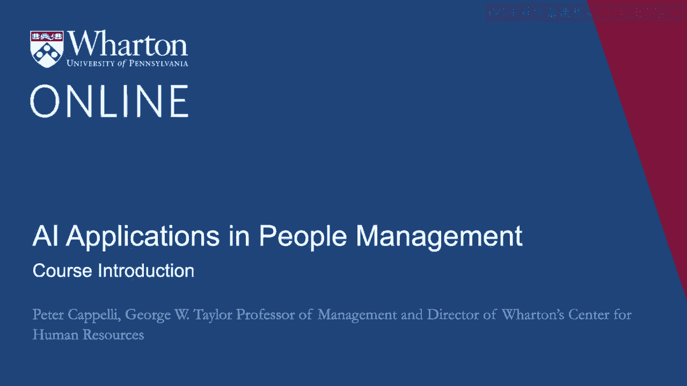
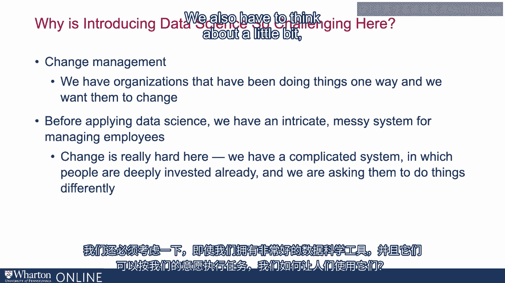

# 沃顿商学院《AI For Business（AI用于商业：AI基础／市场营销+财务／人力／管理）》（中英字幕） - P63：0_课程介绍.zh_en - GPT中英字幕课程资源 - BV1Ju4y157dK

 Folks， welcome。 It's a pleasure to have you with us。 This is our program on the effects。

 of artificial intelligence on the management of people and the related issues there。 My。

 name is Peter Capelli。 I've been a professor here at the Wharton School for 35 years。 I。

 run our Center for Human Resources， among other things。 And I've been setting the workplace。

 for a very long time。 And most recently， I've been looking at changes in how people are。

 paid and changes in how performance is managed and more generally about the move we've been。

 seeing over the last generation toward more open labor markets and movements across employees。

 And my colleagues and I on this program have been looking at the role that artificial intelligence。

 is playing in managing people。 Matthew Bidwell， you'll hear from shortly a colleague here。

 who's created the people analytics courses here at the Wharton School and colleague， Sonny Tambi。

 who is a reformed computer scientist， I guess we could say， who studies workplace。

 issues and particularly how various kinds of electronic markets affect issues like hiring。

 So we're going to spend the next four hours or so with you， depending when you watch this。

 talking about those issues。 So let me begin with the general point about managing people。

 There are some people probably watching this who have not had a lot of experience managing。

 people before， particularly if you're coming at this from the data science or artificial。

 intelligence side。 And managing people is a huge task。 If we look at the costs involved。

 in a typical organization， for example， two thirds of all the costs come from employees。

 or labor various kinds。 If you look just in the United States， every year we hire 66 million。

 people every year。 And that's out of a workforce of 160 million。 So you get a sense that some。

 of those people are going out one door and into another。 It's another issue。 Along the。

 way we have to talk about how to manage people's performance because the big question is how。

 do we get people to do what we want them to do， what we need them to do。 We have to think。

 about how we pay them， the careers through which they move and how we help them move all。

 those kinds of issues。 To get a sense of how big this is， if you look just at the industry。

 that has been formed by people pushing work out， outsourcing， managing people issues， payroll。

 and performance issues but also staffing and hiring issues。 If you total up the size of。

 that industry， it's half a trillion dollars just in the United States。 So that's almost。

 the size now of the entire U。S。 construction industry。 So this is a big， big issue and one。

 with real money consequences for organizations and for societies。 Particularly for businesses。

 one of the things they care about is how the company's brand is affected by people management。

 issues。 We're seeing a lot of concern now about sexual harassment， diversity and inclusion。

 issues is how they affect the company's financial performance。 Lots of companies now are asked。

 to demonstrate their compliance with various diversity inclusion policies and anti-harassment。

 policies。 When we think about how companies compete， the key issue in business strategy。

 at least it seems to me， has been this question of competencies and that is how does a business。

 get good at something in a way that allows them to compete and succeed against competitors。

 around them。 And almost all that conversation now comes down to questions of people and the。

 way we manage them because that's about all that differs， frankly， across companies。 And， of course。

 ultimately， a reason for concern about all these topics is that managing people。

 affects their lives。 Managing people badly causes a range of health problems， stress-related。

 problems in particular， and frankly just makes people miserable。 And if we can manage people， well。

 we can make their lives a whole lot better。 So that， just by itself， is something。

 worth taking very seriously。 So let's talk just a little about what the issues are we're。

 going to talk about here over the course of the next few hours with you。 And we begin。

 with this issue of what is artificial intelligence。 So let's see if we can talk about that for。

 just a minute。 It's a moving target， artificial intelligence。 And the idea behind it is those。

 kinds of decisions that kind of intelligence， which can only be made by people， by humans。

 And the problem is that it is a moving target because we get better with computer science。

 and decision making， et cetera。 We discover that we can do more and more decision making。

 with those。 So what we have at the moment though， when people are talking about artificial intelligence。

 is mainly data science。 And what data science is about is an engineering approach to data。

 So this is the equivalent， you might say， of as engineering is to science， data science。

 is to statistics。 So statistics is the underlying discipline on which data science is based。 Now。

 data science is particularly applying statistics and related data analysis tools to questions。

 of optimization。 So what do we mean by that？ The examples would be thinking about supply， chains。

 thinking about how we make sure we get just the right amount of stuff to our stores。

 at just the right amount of time。 You can think about something like optimal scheduling with。

 truck fleets， for example， to make sure that we know we have just the right number of truck。

 fleets at just the right time。 The problem when we think about people though is that unlike。

 maybe trucks， people get sick， people also get angry and they act out when they're angry。 They quit。

 If they're not engaged in their work， they don't care about it。 They can slow， things down。

 They can actually sabotage。 It was an old technique in the union world called， work to rule。

 And that was if you were really annoyed with the management， what you do is。

 just take the work rules right out of the manual and follow them word for word。 And you could。

 basically just bring the organization to a stop。 So there are a lot of consequences about。

 how you manage people and a lot of implications which are quite different than the optimization。

 norms of data science which came out of things like studying machines and studying equipment。

 The fundamental debate in management over the last century or so or since the beginning。

 of management， something we'll talk about a little later in the program is about the。

 divide between management views， leadership views that think about people as rational。

 actors and think about managing people along those equivalent lines。 Versus a movement。

 that began in the 1930s but didn't hit its stride until the 1950s informed more by psychology。

 thinking about how people actually respond。 And sometimes people call these theory X Douglas。

 McGregor's famous distinction here。 Theory X was people are rational。 That means really。

 they don't really want to work unless you pay them and if you don't check they won't， work hard etc。

 And theory Y which says if you manage them correctly they might actually。

 do what you want them to do。 So the way to test where you think you are on this distinction。

 is to think is it better to tell your employees what to do or ask them what to do。 It's kind。

 of two extreme views right。 And the former is kind of a theory X view and the latter。

 is kind of a theory Y view。 The theory X view aligns itself with engineering principles。

 as we'll see a little later。 And data science and the management of data that goes with。

 it is based on techniques like machine learning。 You apply those two equipment for example。 What。

 are they trying to do？ We're trying to figure out when the ball bearings might fail on this。

 very expensive piece of equipment。 Now how do we want to do that？ Well we might say we。

 don't particularly care as long as you can predict it。 We'll just listen maybe put microphones。

 on there or look for filings in the oil or you know whatever it might be as long as it。

 predicts when the bearings are going to fail we don't care how it's done。 That's all we， care about。

 That's good enough。 Once you move to employees and if you ask the question like。

 well when are these employees going to quit？ And you did things like listen in to their。

 telephone calls for example or go to their social media and check in。 I think the difference。

 there is that we care how you get that answer。 The answer is not simply a good prediction on。

 when people are going to quit。 People get very irritated if you have a good explanation we。

 can predict with 100% who's going to quit。 If it turns out we did that based on listening。

 to your phone records。 And so one of the things of course it's most different about managing。

 people is that these issues like fairness matter a lot and fairness questions get embodied in。

 the law for example in government regulations of all aspects of employment。 And so when we。

 start making employment issues and decisions we start bumping up against these fairness。

 questions and in practice that means we're bumping up against the law a lot。 And you don't。

 see that in other aspects of data science。 So one of the big issues related to managing。

 people when we confront data science with that is the problem of change management。 It's。

 a general capability that is really important in management。 Change management basically。

 means we have organizations that have been doing things one way we want them to change。

 So before data science came along we had a very intricate and you might say very messy。

 system for managing employees。 And if you don't think so go to your human resource department。

 and ask to see the documents and manuals that are there that describe how employees。

 are supposed to be managed。 And you'll see it's all electronic now but you'll see lots。

 and lots of files and hundreds of pages explaining how we should manage people。 We've invested。

 a lot of time in training people as to how to manage employees。 And so if with data science。

 we come into with a very different approach as to how to make decisions on something like。

 hiring we confront this problem of change。 We got this complicated system in which people。

 are deeply invested already and we're asking them to do it differently now。 And so that。

 is going to be a big question we also have to think about a little bit。 Even when we have。

 data science tools which are really good and they do what we want them to do how do we。

 get people to adopt them。 And that's partly a story about how do we get them to give up。

 some of the decision making that they currently are exercising to turn it over to these algorithms。

 So a simple way to think about this is if you're applying data science to something like。

 allocating the hotel rooms let's think about optimal pricing to make sure that we keep our。

 rooms 100% occupancy or as close as we can get。 The hotel room is not going to sue you。

 if you make a mistake with that。 But if you are allocating employees across work tasks。

 and jobs for example and it turns out that those allocations have some implications for。

 fairness it's quite possible the employees might end up suing you。 The same algorithms。

 in different contexts lead to really really different outcomes。 So one of the things we。

 have to think about is the resistance from not just the human resource community but。

 line managers who are currently doing things in a quite different way。 So there are good。

 reasons for thinking about trying to do a better job carefully with managing this process。

 of change。 So let's think just a little bit about the opportunity here。 And I think in。

 my lifetime looking back at the things that I have seen coming along that changed business。

 and changed the managing of people。 This could be one of the very biggest ones because。

 its potential is the knock-on effects that we change the way we make decisions by imposing。

 data science tools on it that changes the way we collect data that changes the allocation。

 of decision rights across people that impacts some of these fairness questions all that kind。

 of stuff。 The good news is that there is a big opportunity here in introducing data science。

 and the reason is because a lot of these decisions we are talking about we just don't do very。

 well right now。 And as I'm sure you know on questions like hiring there is a lot of concern。

 that not only are we not doing a great job getting the right people into the right jobs。

 and finding good employees but that there is a lot of bias involved and a lot of discrimination。

 in these outcomes。 So there is a lot of room to get better。 It is not like we are tweaking。

 a model which is running really really well。 And if we get better this makes people's lives。

 better as well。 So that's where we are with this。 It is a real opportunity to get better。

 It is a real challenge to think about how to apply these tools which were developed for。

 a very different context in things like manufacturing and applying them to people。

 So as I said earlier， I'm going to be here with you throughout this program at different points。

 My colleague， Matthew Biddlebel will be here as well for a while and our colleague Sonny Tamby will be。

 as well。 You will see us in and out over the course of this program。 And we look forward。

 to seeing you all the way through to the end。 [ Silence ]。

