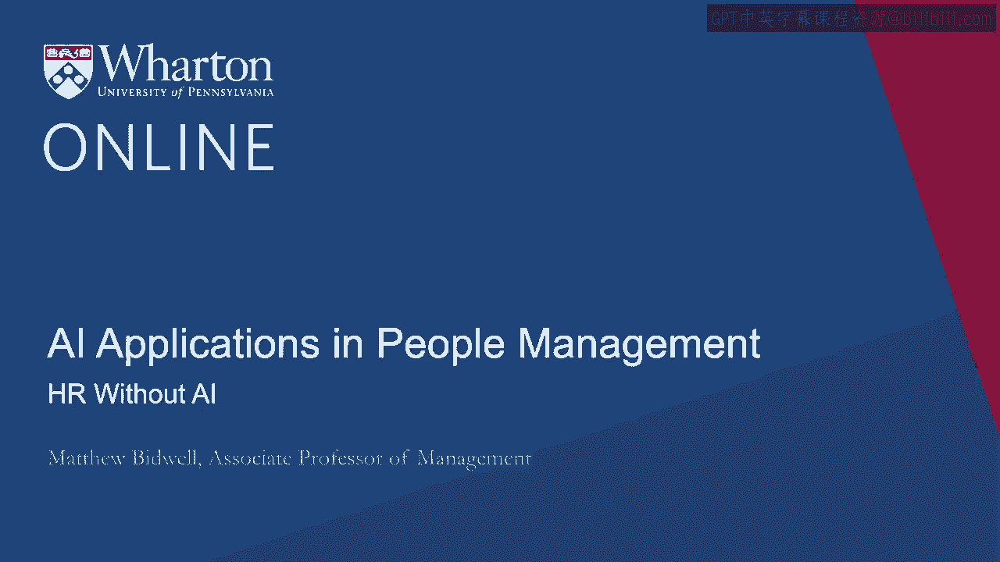
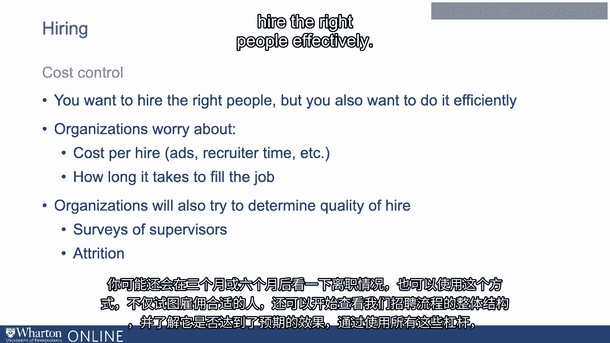

# 沃顿商学院《AI For Business（AI用于商业：AI基础／市场营销+财务／人力／管理）》（中英字幕） - P65：2_没有AI的人力资源.zh_en - GPT中英字幕课程资源 - BV1Ju4y157dK

大家好。我叫**马修·比德威尔**。我是一名管理学副教授。

沃顿商学院的教授联合主任，以及沃顿人力分析计划的联合主任。

我还为MBA和高管教授关于人员分析的课程。我非常兴奋。

今天在这里，或者在你观看这个视频的任何时候，谈论人工智能和人员管理。

正如彼得所描述的，管理人是复杂的。人们有自由意志。没有。

我们不仅需要雇佣他们，还需要激励他们。我们需要说服他们去。

做我们希望他们做的事情。他们非常会对我们管理他们的方式作出反应。

因此，恰当地管理它们是成功运营一个组织的关键。现在。

在本课程中，我们的主要目标是描述新技术的发展。

人工智能和机器学习可以创造新的机会来找到更好的解决方案。

管理人员的方法。在我们深入讨论之前，我认为这实际上是有益的。

说说组织到目前为止是如何管理人员的。毕竟，在人工智能出现之前。

组织面临着所有这些问题，他们正在认真思考。

他们可以做些什么来充分挖掘员工的潜力。现在，显然，为了。

真正深入了解组织如何管理员工，那需要10小时。我想花10分钟，好吗。

但只是简单地回顾一下组织如何看待一些主要问题。

他们面临的挑战，并试图解决这些问题。我想特别谈谈三个。

这些对组织至关重要，我们将在整个过程中真正关注这些。

这些视频。所以稍微谈谈招聘，以及管理员工参与度。

以及一些关于流失的内容。所以让我们谈谈招聘。招聘是一个非常基本的。

管理人员的过程。毕竟，如果你把合适的人带入你的组织。

你不需要太担心训练他们，他们更有可能把工作做好。

希望他们能够更加投入。如果你雇佣了错误的人，他们要么会留下来。

进入一个糟糕的工作环境，或者他们立即离开，你又不得不重新招人。要么。

能够成功招聘的方式对组织来说真的很重要。**彼得**的。

将花费大量时间讨论人工智能如何应用于这一领域。我想花费。

在那之前花一点时间，谈谈，你知道的，传统的是什么。

组织招聘员工的方式。 我认为将其在某种程度上进行描述是公平的。

一种拉锯战，关于采用非常结构化的流程来弄清谁拥有最多。

在招聘时的潜在和管理层的自由裁量权，附带一定的成本控制。

让我谈一谈这些内容中的每一个。所以首先是结构过程。

所以我们可以考虑招聘。在某种程度上，这存在一个测量问题，对吧？很多。

人工智能的关键在于数据，我们如何衡量事物。在任何招聘中，我们真正关注的是。

我们试图衡量申请者的潜力。我们正在弄清楚，如果我们把他们引入。

作为员工，我们对他们的期望有多高？现在，基本上已经过去一个世纪。

心理学家对这个问题的研究，试图弄清楚我们如何评估人们。

并预测他们在不同工作中的潜力。这催生了一系列最佳选择。

组织试图采用的做法。我们大致知道有三件事情是相当重要的。

在预测表现方面表现良好。所以首先也是最重要的是，它是。

我们所称的结构化面试。什么是结构化面试？它是当组织。

首先弄清楚人们哪些属性对完成工作最为重要。然后他们。

想出我们可以使用什么样的问题来实际评估人们是否具备。

这些属性定义了一系列他们将向每位候选人提出的问题。

然后他们还设定了一个评分标准。对于每个问题的答案，他们事先进行了定义。

什么是糟糕的回答、中等的回答和好的回答？他们会对每个候选人进行评估。

通过这个并相应评分。所以结构化面试，非常好。在一些，环境中。

认知能力的测试，广泛的职位知识测试能够很好地评估。

找出谁具备完成这项工作的必要能力。你知道，有一些证据表明个性。

测试也可以是有效的。因此，人力资源部门会采纳这些做法并尝试。

并利用这些方法对人进行结构化评估，以找出谁具有最高的潜力。

在组织中表现良好。 他们也会尽量避免我们已知的事情。

往往效果不佳，特别是在非结构化的面试中。那就是面试。

我们基本上只是和人坐下来，问他们几个我们最喜欢的问题。

进行互动，努力更好地了解他们。所以这就是那种。

招聘的结构化过程方面。 我提到的另一面是管理层的酌情权。 什么。

我所指的是什么呢？嗯，人力资源部门可以将所有这些良好的结构化流程整合起来。

到位。但说到底，在大多数组织中，人力资源部门实际上并不是。

大部分招聘工作都是在进行中。你知道，对于一些高流量的初级职位，这可能会。

经过一个结构化的招聘流程。但大多数时候，新员工实际上是。

被我们称为招聘经理的管理者所聘用，这种管理者就是他们的前线管理人员。

上班。因此，这意味着即使人力资源部门可能拥有所有这些。

结构化流程的使用取决于是否管理者参与，实际上。

想要应用它们。但往往似乎他们并没有。因此我们常常发现管理者。

抵制这些结构化的过程，部分原因是他们觉得这些过程非常僵硬和正式。

他们喜欢与人进行一种顺畅的互动方式。

遵循问卷上的一套固定标准。 但我也认为，因为我们倾向于相信。

我们对人品的判断能力非常强。其实并不是。我们往往相信自己真的很擅长。

了解人们的性格。我们迅速形成对他们的看法，然后大部分时间都在。

我们花时间来证明那些决定。于是，如果你相信自己是个出色的判断者。

关于性格，为什么我需要遵循这个非常结构化的过程，而我可以选择其他方式呢？

只是和他们聊天。所以我们发现很多经理可能不遵循这些流程，而是。

基本上只是更喜欢问人们他们的精神动物是什么，然后再从那里深入探讨。

我提到的关于招聘的第三点是这种来回交流之外的内容。

在结构化流程之间，试图让人们遵循这些流程。这里还有一些元素。

关于交叉控制。你想要雇佣合适的人，但你也希望做到高效。

因此，组织也花费大量时间担心每个雇佣的成本。

那么，我们在广告和招聘方面的外部支出是多少呢？

我们内部花费了多少？为了招募，我们招聘人员等的时间。

在每次招聘中。这样是否太多？我们该如何降低这个标准？他们可能也会对此感到非常担忧。

招聘岗位所需的时间有多长，跟踪填补岗位所需的时间，因为时间越长。

填补这个职位，空缺时间越长，造成的干扰就越多。

所以我们也会关注这些，试着弄清楚如何完成我们的招聘。

正确地。我想彼得会稍微讨论一下。在输入时可能会遇到一些挑战。

很容易测量输入，而输出却很难。也许我们过于关注交叉雇佣和。

在质量上不足。一些组织还会尝试弄清楚我们是否做得好。

这项工作的内容就是这样。因此，例如，您可能在三个月或六个月后担任主管。

并且说，“好的，我们雇佣了这个人。你会再次雇佣他们吗？”你可能还会考虑。

在三个月或六个月后的流失率。因此，使用这些不仅是为了获取。

我们招聘了合适的人，但我们也可以开始审视我们招聘的整体结构。

处理并感知，它是否在做它应该做的事情？通过使用。

在所有这些杠杆中，组织确实努力确保他们雇佣到合适的人。

有效地。我们将在本课程中讨论人员管理的第二个领域。

是参与。你知道，再次回到人们拥有自由意志这一基本问题。

所以我们需要激励他们去做我们希望他们做的事情。

让这个组织成功。现在，我们可以操控很多杠杆。

动机。一个重要的方面是工作设计以及明确人们可以执行的具体任务。

组织的文化以及人们的领导方式也有助于定义。

他们与它的关系，以及他们每天来上班时的兴奋感。

所以我们可以做很多事情。基本上，做好这件事的关键在于真正理解。

人们最初的参与程度如何。因此，组织会花费一定的时间。

花费时间和精力去弄清楚我们的员工是否投入？他们对这个问题的感觉如何？现在。

显然，了解人们的想法和感受并不总是容易的。

所以我们通常尝试做到这一点的标准方法是通过员工参与调查。好的。

我不确定有多少人参与过这些调查，但基本上很多公司。

每年几乎都会向最后的员工发送一份长问卷调查。如何。

你对在这里工作有什么感觉？你喜欢你工作的哪些方面？有哪些缺点？

你对你的经理感觉怎么样？你对你的薪水、福利和公司有什么看法？

所有这些事情？通常它们倾向于使用非常特定的问题集。

由心理学家开发的，确实能让他们清晰地获取特定意见。

关于他们在工作中可能关心的每个属性。好的，为什么要这样做？

首先，它让我们很好地了解整体表现如何，或者人们是否感到兴奋？

当你从一年到下一年这样做时，你可以开始检查趋势，对吧？我们是。

在进步吗？我们是不是在退步？更重要的是，你可以观察不同的群体。

组织中人们参与的部分有哪些？各个部门在哪里？

他们在哪里失去参与感？我们能对此做些什么？通常，这些参与度调查是。

相对有效。如果你想知道人们的参与度，你可以做得更糟。

不仅仅是问他们。话虽如此，可能会出现一些问题。还有一点我会再回来提。

几次吧，不是吗？显然，人们的想法与现实之间存在差距。

他们告诉你他们在想什么。比如，人们可能并不总是说实话。

我记得，在我的劳动经济学课堂上，有一件事让我印象深刻，那就是如果。

你们公司里有没有人问过你，“你的工资够吗？”答案总是，“不够。”不够。

我希望能获得更高的报酬。人们可能在试图达成某种目的时有些策略性。

事情并不乐观，希望别人能为他们改善现状。另一方面，

他们可能会担心报复。如果我在一个小组里，人们在询问。

我关于我的经理，难道我就确定说我的经理很糟糕不会遭到报复吗？

回到她那里，然后再联系我。你需要小心一点。另一个挑战。

进行这些调查的一个问题是它们很昂贵。如果你要让公司里的每个人参与。

填写调查问卷，这需要投入大量的人力资源。甚至。

仅仅确保人们填写这些内容的努力并不是微不足道的。为了避免这些费用。

很多组织因此只会一年进行一次。再说一次，如果你想的话。

对我们整体表现的感知，并不是一个糟糕的想法。但如果你所尝试的。

获取是问题的早期预警信号，你每年只得到一次。什么时候。

事情变化得非常迅速，这在最近的疫情期间发生了，你。

不想等到明年再搞清楚发生了什么。这种等待太长了。

在实施这一过程时，时间和成本之间的关系实际上成为了一项相当大的挑战。

这些参与调查。我要谈论的第三个方面是一个合理的数量。

在这门课程中，**流失**是一个重要问题。人们离职的**周转率**。我们有不同的方法来应对这个问题。

可以描述它。我们为什么花这么多时间谈论它？但我真的很在乎。

因为这对他们来说是一个主要的成本来源。我刚刚提到它真的很重要。

招聘合适的人。好吧，如果我招聘了合适的人，但他们离开了，我就有问题了。

有人出去重新聘用。更换人员的成本很高。但是我。

想得更多一点，来自人员流动的干扰是很大的。

和离开的人共事的人员，必须建立新的关系。

他们现在必须与之共事的人。来替代他们的人，他们并不理解。

这个组织。他们不认识那些人。需要很长时间才能适应。

可能还有一些关于我们产品的非常具体的知识，关于我们的客户。那里。

组织中其他人没有，而当人们离开时，他们就会走出门。

因此，人员流失在组织中往往成本很高，他们花费了大量时间。

思考我们可以做些什么来降低这个问题。现在，仍然有很多杠杆可以利用。

我们可以考虑可能的措施来解决流失问题。我们可以思考我们雇佣谁。我们是否在招聘。

有可能留下的人？我们可以考虑我们的薪酬方案。如果我们支付得更多，希望能够。

人们会停留得更久。我们可以考虑所有驱动参与的因素。如果我们拥有。

更好的领导力，更好的设计工作等等，人们会说，“有很多。

我们可以操控的杠杆是什么？所以我们想知道的问题之一是，“我们应该操控哪一个？”

然后我们需要弄清楚为什么人们离开？所以总的来说，我会说那里。

组织采取的两种方法之一是找出人员流失的原因。

是的。因此，组织通常会跟踪他们的流失率。它们的计算方法基本上是。

在给定时间段内离开的人数，例如六个月或一年，被划分。

通过你在那个时期开始时雇佣的人数。因此可以。

可能是一个小数字。它也可以是一个非常大的数字。在某些领域，比如零售、快餐等。

以及其他，这些可能超过**100%**。所以再说一次，当你跟踪这些流失率随时间的变化时。

你可以开始观察趋势。如果它在上升，我们能对此做些什么吗？可能可以。

不仅如此，通过观察离职率较高的部门和职位。

我们可以再次开始了解可能驱动它的原因。为什么会这样？

这个部门是否会留下更多？这告诉我们需要什么。

该如何应对呢？更直接的方法是，了解人们离开的原因。

离职面谈。离职面谈是指人们与即将离开的人进行座谈。

并问他们为什么离开。这样你可以获得一些见解。也许很多人。

有人告诉你，他们要离开是因为找到了更高薪的工作。也许有人在说。

他们离开是因为另一个角色涉及更多的职业发展。也许他们正在离开。

因为他们的新工作通勤时间更短。并通过系统地分析出现的原因。

组织能够开始了解他们可能需要做些什么。

为了减少流失率。再次强调，离职面谈并不完美。存在一些局限性。

所以其中一个问题是你甚至无法让每个人在离职面谈中作出回应。如果有些人。

只是放弃他们的工作，这种情况可能时常发生，你永远没有机会与他们交谈。

更重要的是，人们在进行这些离职面谈时存在很大的顾虑。

他们告诉你的很多东西并不是真实的，而是他们认为你想要听到的。

因此，人们可能不愿意批评组织中的其他人，提及糟糕的管理。

那些事情，因为他们不知道自己是否还会想回来。

谈论金钱可能会更方便，无论这是否。

他们离开的真正原因并不明确。因此，尽管离职面谈可以提供一些信息。

一些见解，关于你应该多么认真对待这些答案，确实存在一些争论。

鉴于员工对任何组织运作的关键重要性。

多年来，企业投入了大量的思考来尝试解决如何的问题。

我们是否跟踪就业关系的基本维度，以及有哪些杠杆。

我们可以利用这些来改善它。你可以看到他们正在做的一些事情。每一个。

这些方法有重要的局限性。管理人是困难的。部分原因是这些局限性。

认识到员工是复杂的，每个人都是独一无二的。部分原因在于某些事情。

特别是态度，真的很难衡量。但是还有其他挑战。

参与调查时，获取数据通常会变得非常昂贵，诸如此类的事情。

我们经常依赖管理者和监督者在一些核心决策上做出选择。

在招聘时，甚至在解释离职面谈时，我们也感到担忧。

不一定非常可靠。它们可能有自己的偏见。它们可能有自己的议程。

他们试图追求的目标与这些组织并不完全相同。所以。

他们的自由裁量权在某种程度上也可能带来复杂性。所以我们有一堆事情。

它们并不完美。现在，我希望能够说人工智能和机器学习的进步。

让我们能够解决您在管理人员时遇到的所有这些问题。能够做到这一点。

这样说是没错的，但显然这并不是真的。许多这些问题仍然存在。

无论我们投入多少技术，问题依然存在。尽管如此，情况也是如此。

新技术创造了以不同方式做事和寻找新机会的可能性。

评估谁是优秀员工的方法，寻找新的方式来评估人们的参与度。

他们可能会忽视这些事情。它们并不能解决每一个问题，但确实能。

提供这些类型的补充方法。接下来我们想要做的就是实际开始。

解释这些新工具如何运作，什么是**机器学习**，然后继续进行探索。

它们如何在人员管理领域中应用，以开发更有效的方法。

我们所描述的许多问题的解决方案。 [BLANK_AUDIO]。

