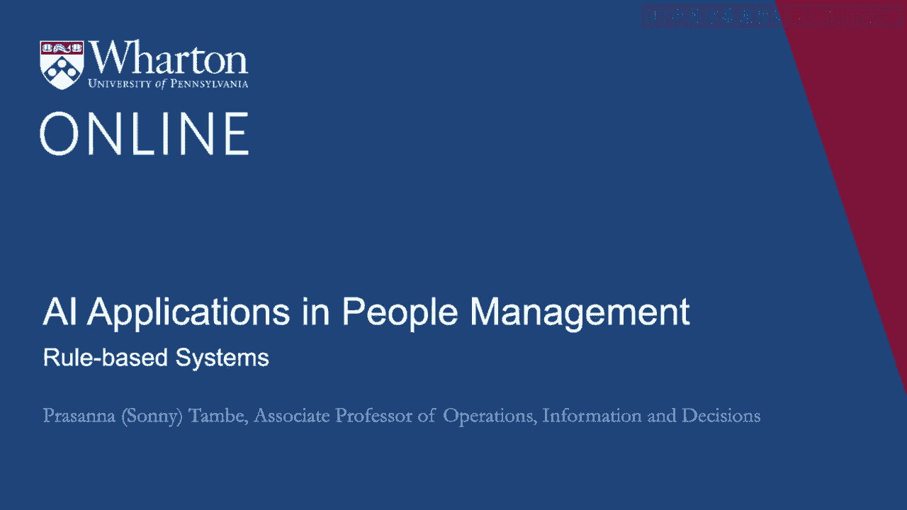

# 沃顿商学院《AI For Business（AI用于商业：AI基础／市场营销+财务／人力／管理）》（中英字幕） - P67：4_基于规则的系统.zh_en - GPT中英字幕课程资源 - BV1Ju4y157dK

 On our journey to talking about how machine learning and AI are used in the HR process。

 or can be used in the HR process， it's useful to stop at rule-based systems or expert systems。

 We talked about a couple of drawbacks to the approach where humans are making decisions。

 It's time consuming for one。 But one thing we can do is take what humans know about the process。

 all their expertise， about hiring and recruiting， and we can put that into software。

 So rule-based systems， basically they encode in experts' knowledge and skills into a software-based model。

 So what these systems do is they convert conditions of hiring in this case into a series of rules。

 For those of you who might be familiar with programming， you can think about these as if-then rules。

 It's very similar to as if an expert， in this case the domain expert or the HR or the recruiter。

 were to write down all of the knowledge they had about how to hire， about what type of candidates。

 a good fit for the organization。 And then a developer might convert those rules into software。

 And so from that point on then， the software which contained the knowledge that the recruiter had。

 could then be used to evaluate applications。 Now systems like this have played an important role historically in the history of AI。

 Going back decades， a lot of the interest in AI was around the development of these types of expert systems。

 They've played a major role in how we think about the progress of AI。

 And it's important to know about this type of AI when we start talking about where we are now with machine learning。

 But let's put this in a recruiting example。 Let's talk about these rule-based systems in a potential recruiting example。

 So imagine you have a set of conditions。 It might include school。 It might include GPA。

 When I say conditions， I mean factors that use to evaluate candidates as they apply to your organization。

 It may include school， it may include GPA， it may include prior employer。

 or signals that you pick up during the interview， the way they answer questions， and so on。

 Some of these can be coded， meaning you can start with the resume and you can create measures of this。

 Same thing is true of interview data。 For instance。

 experience from a prior employer in which employer they worked for could be encoded。

 Once you have that information， a software developer can then use that data or use their rule-based system to evaluate or to recommend whether or not a candidate should be interviewed by the firm。

 The key thing to know here is that you don't need data to build this system。

 This is what's going to differentiate it from what's coming later with machine learning。

 In this case， what we use is human expertise。 A developer sat down with a recruiter and basically encoded that recruiters' knowledge and expertise。

 We don't need data yet to build this type of system。

 This is going to differentiate it from machine learning systems that are coming that we'll talk about a little bit later。

 A system like this， this decision tree that's created by talking to an expert or working with an expert has some limitations。

 Number one is we need access to an expert。 This presents challenges for a couple of reasons。

 It may be hard to get access to an expert。 You can think about very specialty fields like specialty surgery。

 where it may be difficult to get access to an expert。 Even if you have access to an expert。

 it's very difficult to ask people to explain everything they know about a field。

 Sometimes people work on instinct。 They have huge amounts of knowledge。

 but asking them to put that into rules is really more difficult than it sounds sometimes。

 That's one big drawback。 Number two is we can't easily update a system like this when the environment changes。

 If you build a system like this based on these rules and then something about the nature of the application pool starts to change。

 you have to go back and update the system or build a new system。

 There's no way for it to automatically adjust to these kinds of changes。

 Number three is we need to know the relationships that we're thinking about。

 We're basing our decisions on the expertise of a person， of an expert。

 but we need to know the relationships。 We're going to start there and build the system。

 We can't discover new relationships during this process。

 Kind of related to what we're talking about before。

 We can't discover new relationships as we go along。

 The final thing is there's just a lot of work to create a comprehensive knowledge tree。

 We're talking about a very deep body of knowledge。

 thinking about asking an expert to tell a developer everything they know。

 and then asking a developer to put all of this knowledge into a rule-based system。

 All of that together is a substantial amount of work。 As we'll talk about in the next video。

 machine learning sidesteps many of these issues。 [silence]。

