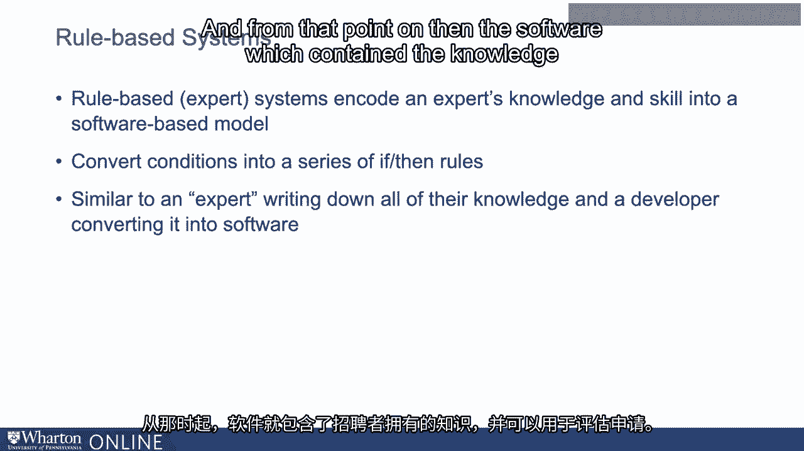
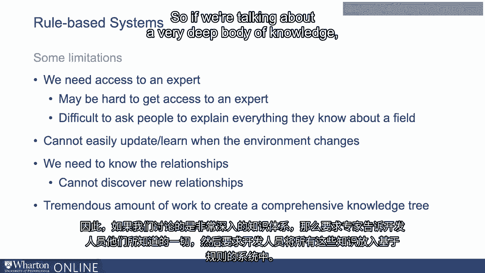

# 沃顿商学院《AI用于商业：AI基础／市场营销+财务／人力／管理》（中英字幕） - P67：4_基于规则的系统.zh_en - GPT中英字幕课程资源 - BV1Ju4y157dK

在我们探讨机器学习和人工智能如何在HR流程中使用的旅程中。

或者可以用于人力资源流程，停留在基于规则的系统或专家系统是很有用的。

我们讨论了人类做出决策的这种方法的一些缺点。

对一个人来说，这是非常耗时的。但我们能做的一件事是利用人类对这个过程的了解。

所有他们的专业知识，关于招聘和选拔，我们可以将其转化为软件。

所以基于规则的系统，基本上是将专家的知识和技能编码到一个基于软件的模型中。

这些系统所做的就是将招聘条件转换成一系列规则。

对于那些可能熟悉编程的人，你可以将这些看作是如果-那么的规则。

这很像是一个专家，在这种情况下是领域专家、HR或招聘者。

如果要把他们关于如何招聘的所有知识，以及关于什么类型候选人的知识都写下来。

适合该组织。然后，开发者可能会将这些规则转换为软件。

从那时起，包含招聘者知识的软件就诞生了。

然后可以用于评估应用程序。如今，像这样的系统在人工智能历史上发挥了重要作用。

回溯几十年前，对人工智能的许多兴趣集中在这些类型的专家系统的发展上。

他们在我们思考人工智能进展方面发挥了重要作用。

当我们开始谈论现在机器学习的发展时，了解这种类型的人工智能是很重要的。

但让我们在一个招聘的例子中来看待这个问题。让我们讨论一下这些基于规则的系统在潜在招聘示例中的应用。

所以想象一下你有一组条件。可能包括学校。可能包括 GPA。

当我提到条件时，我指的是用来评估候选人以适应你们组织的因素。

这可能包括学校，*这可能包括GPA*，*这可能包括之前的雇主*。

或者在面试中你捕捉到的信号、他们回答问题的方式等等。

这些内容中的一些可以被编码，这意味着你可以从简历开始，并且可以创建相应的度量。

面试数据也是如此。例如。

之前雇主的经验可以被编码，这个雇主是他们曾为之工作的。

一旦你掌握了这些信息，软件开发人员就可以使用这些数据或其基于规则的系统来评估或推荐候选人是否应该被公司面试。

这里需要知道的关键是，你不需要数据来构建这个系统。

这将使它与后来的机器学习有所区别。

在这种情况下，我们使用的是人类的专业知识。一名开发者与招聘人员坐下来，基本上将招聘人员的知识和专业技能进行了编码。

我们现在还不需要数据来构建这种类型的系统。

这将使其与稍后我们将讨论的机器学习系统区分开来。

像这样的系统，这个通过与专家交谈或合作而创建的决策树有一些局限性。

第一，我们需要接触到专家。这带来了几个挑战。

获取专家的帮助可能很困难。你可以考虑一些非常专业的领域，比如**专业外科手术**。

在可能难以接触到专家的地方。即使你能接触到专家。

要求人们解释他们所知道的某个领域的所有内容是非常困难的。

有时候，人们凭直觉工作。他们拥有大量的知识。

但是让他们将其变成规则有时真的比听起来要困难得多。

这是一个很大的缺点。第二个缺点是当环境变化时，我们无法轻易更新这样的系统。

如果你基于这些规则构建一个这样的系统，然后应用程序池的性质开始发生变化。

你必须回去更新系统或建立一个新系统。

它无法自动适应这些变化。

第三点是我们需要了解我们所考虑的关系。

我们的决策基于一个人的专业知识，即一位专家。

但我们需要了解关系。我们将从这里开始构建系统。

我们无法在这个过程中发现新的关系。

有点和我们之前讨论的内容相关。

我们无法在过程中发现新的关系。

最后一点是，创建一个全面的知识树需要大量的工作。

我们在讨论一个非常深奥的知识体系。

考虑请专家告诉开发者他们所知道的一切。

然后要求开发人员将所有这些知识纳入基于规则的系统中。

所有这些加在一起是相当庞大的工作量。我们将在下一个视频中讨论。

机器学习避开了许多这些问题。 [沉默]。

