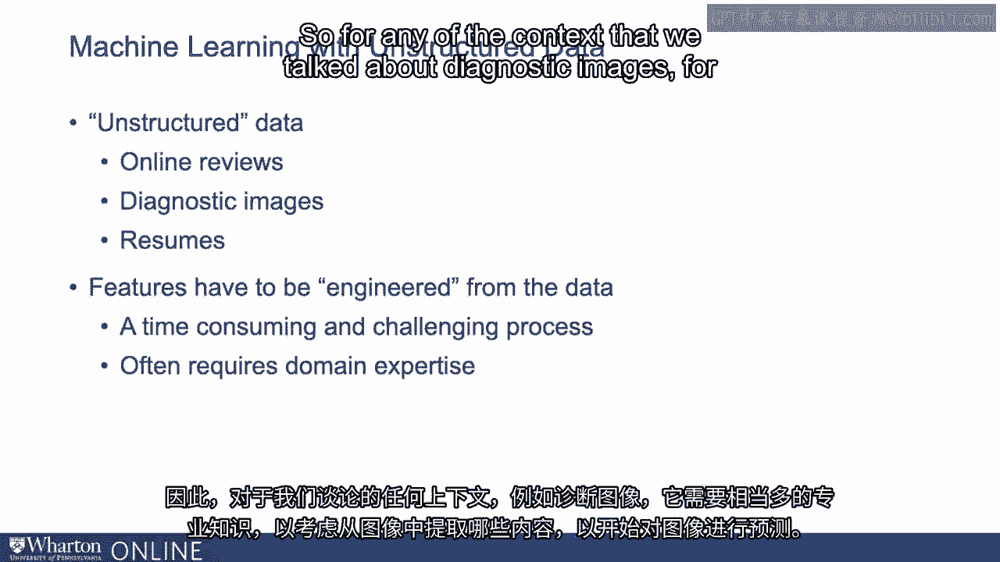
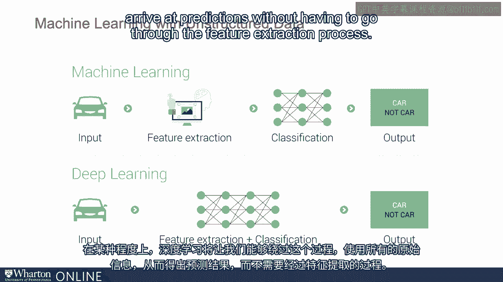

# 沃顿商学院《AI For Business（AI用于商业：AI基础／市场营销+财务／人力／管理）》（中英字幕） - P70：7_结构化数据之外的特征工程.zh_en - GPT中英字幕课程资源 - BV1Ju4y157dK

 The examples we've been talking about for machine learning kind of make the explicit。

 assumption that the data are in a format where we can think about evaluating different conditions。

 of the data。 So we sort of talked or implicitly talked about these examples where you might have。

 data organized in a spreadsheet。 So think about a number of columns and each of these columns has a little bit of information。

 about the applicant。 So you might have different columns that contain the information you care about and。

 then you're going to use that to arrive at a decision。

 As we talked about earlier， if you have this information organized this way and you have。

 information about a decision， machine learning algorithms can learn how to navigate these。

 different conditions to arrive at a decision。

 Data however are not always so nicely structured and a lot of the interest in machine learning。

 has really been about the ability to use machine learning on unstructured data。

 Data that aren't so easily put into columns of a spreadsheet。

 So imagine using online reviews to predict something about restaurants or using diagnostic。

 images like we've talked about to predict something about patients or in the HR case， using resume。

 the raw resume text itself to predict something about applicants。

 In each of these cases features undergo an engineering process feature engineering。

 This is the process of taking raw unstructured data and pulling features out of the data。

 in a way that it can be then used for machine learning algorithms。

 So this is taking the data taking the raw data and converting it into a format。

 You might think about this as a spreadsheet with columns。

 So if you had raw resume data what pieces of the resume do you pull out into columns to。

 start to use for your machine learning prediction algorithm。

 And this is a time consuming and a fairly challenging process。

 It also often requires a fair amount of domain expertise。

 So for any of the context that we talked about diagnostic images for instance it requires。

 a fair amount of expertise to think about what in the image has to be pulled out to start。

 to make predictions about the image。 Now that's not as much of a problem as it sounds like for reasons we'll talk about shortly。

 here but it is useful to know that feature engineering is an important part of this process。

 and this is really what ties these unstructured data sets into the machine learning process。

 It's the notion that you can take raw data， raw unstructured data that's not easily organized。

 in columns and you can use that to make predictions。

 One place this is becoming very relevant in the HR space is increasingly firms and smaller。

 companies in the technology space are thinking about making it possible to use other signals。

 from the interview like audio or video to make predictions about employee performance。

 So you may have heard about firms or tools that will let you record an applicant's interview。

 be able to record an applicant's voice responses to questions and that information itself can。

 potentially tell you something about applicants。 But for that to work successfully it has to undergo this feature engineering process which。

 is to start with the audio signal or to start with the video signal and then engineer features。

 out of this data that can then be used to make prediction。

 Now I made a comment a few seconds ago about the notion that this isn't as large a problem。

 as it sounds like and one of the reasons for this is because of the advent of deep learning。

 and so deep learning this is essentially where deep learning starts to shine。

 So deep learning can help sidestep this feature engineering process and so one of the real。

 advantages of deep learning is being able to take this raw unstructured type of data and。

 make predictions directly so we can kind of step around this process where we have to think。

 about well if we're looking at a video what is it about the person's gestures or facial。

 expressions or voice that really matters that's ultimately a guessing game in some respect。

 what deep learning is going to let us do is basically sidestep this process a little。

 bit to use all the raw information to come to arrive at predictions without having to go。

 through the feature extraction process。

 。 。 [BLANK_AUDIO]。

