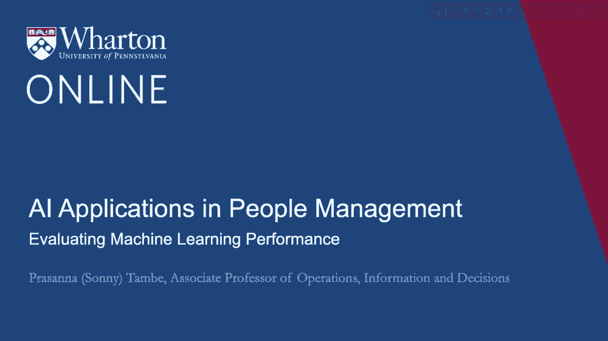

# 沃顿商学院《AI用于商业：AI基础／市场营销+财务／人力／管理》（中英字幕） - P71：8_评估机器学习性能.zh_en - GPT中英字幕课程资源 - BV1Ju4y157dK

当我们试图决定时，有许多因素我们可能需要考虑。

以算法方式做好预测工作。

有多种方法可以衡量绩效，我们不会讨论所有这些方法。

今天我想提到一些你在谈论时可能会遇到的。

算法或听说它们在不同商业环境中的应用。

所以有不同的性能指标，名称如**准确率**、**精确度**、**召回率**、**特异性**。

所有这些都是衡量机器学习算法表现如何的不同标准。

那么，我们为什么需要这么多？我们为什么有那么多不同的性能指标？

原因在于，预测最终嵌入在商业背景中，并且有所不同。

错误的类型有不同的成本和收益。

当我们构建一个推荐算法时，我们可能希望根据权重进行调整。

关于不同类型错误的代价有多高。我们可能不仅仅想在一件事上进行优化。

我们可能希望在其他方面进行优化，具体取决于该特定环境中出现的错误。

所以，例如，考虑一个将简历推进到面试阶段的算法。

所以根据这些简历数据，它预测候选人最终是否可能。

被雇用，因此它基本上是在预测或建议某个公司或雇主应该。

给这个候选人面试的时间。因此，考虑一下这个问题或业务问题，也就是说我想确保绝对的。

我不会错过任何潜在的优秀候选人。在一个非常紧张的劳动市场中，你正在寻找拥有非常稀有技能的人。

你不介意花时间在一些可能不太合适的候选人身上，只要。

因为你想要确保自己不会错过任何潜在的优秀候选人。

在这种情况下，优先考虑确保你看到的任何强有力的候选人都能出现。

数据中的预测被认为是有力的候选者。

并相信这一点适用于一个不同的市场，在那里你可能会说我不想浪费。

我们组织中的任何人花时间与一位不太合适的候选人交谈，都是不值得的，对吧。

所以可能在候选池中有很多潜在候选人。

这个职位不难填补，但使用我们自己员工的时间成本非常高。

评估人选。所以你不想浪费任何人的时间在一个结果不佳的候选人身上。

在这种情况下，我们希望确保不对任何不是……的人进行标签或预测。

很有潜力的候选人可能会意外被预测为强有力的候选人。

所以在这两种不同的情况下，我们可能在优化两件不同的事情，以及我们所认为的。

关于在进行算法预测时需要避免的重要错误。

事实证明，存在权衡。因此，当我们考虑这些系统时，往往必须选择其一。

在投票中表现得很好是非常困难的，因此优先考虑哪个投票是很重要的。

这些我们真正关心的是什么，再次根据业务应用背景而定。

这些错误的代价可能有高有低。

而这最终归结于这些的相对成本是什么。

各种不同的错误。这些假阴性或假阳性有时被称为。

这些错误给你造成的成本是多少？错过一个优秀候选人是否更贵？

浪费员工时间在一个最终不会被录用的候选人身上是否更昂贵。

适合。接下来的视频中，我们将讨论一个将这些概念结合在一起的端到端示例。

谢谢。下一个视频。[BLANK_AUDIO]。

