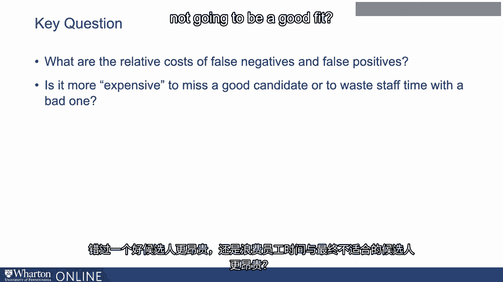

# 沃顿商学院《AI For Business（AI用于商业：AI基础／市场营销+财务／人力／管理）》（中英字幕） - P71：8_评估机器学习性能.zh_en - GPT中英字幕课程资源 - BV1Ju4y157dK

 There are a number of factors we might think about when we're trying to decide that we。

 do a good job making a prediction algorithmically。

 There are a number of ways to measure performance and we're not going to talk about all of them。

 today but I want to mention a few that you might run into when you're talking about。

 algorithms or hearing about how they're being used in different business contexts。

 So different performance metrics with names like accuracy， precision， recall， specificity。

 all of these are different measures of how well a machine learning algorithm is performing。

 So why do we need so many？ Why do we have a number of different performance metrics？

 Well the reason is that prediction is ultimately embedded in a business context and different。

 types of errors have different costs and benefits。

 When we're building an algorithm to make a recommendation we might want to weight it according。

 to how costly different kinds of errors are。 We may not just want to optimize it on one thing。

 we may want to optimize it on something else， depending on the errors that appear in that particular context。

 So， for example， consider an algorithm that moves a resume on to the interview stage。

 So based on these resume data it predicts whether a candidate is likely to eventually。

 be hired so it basically is predicting or recommending that a firm or employer should。

 give the time to interview this candidate。 So consider the problem or the business problem that says I want to make absolutely sure that。

 I don't miss any potentially good candidates。 In a very tight labor market where you're searching for people with a very rare skill set and。

 you don't mind spending the time to on a few candidates who may not be a great fit as long。

 as you want to make absolutely sure that you don't miss any potentially good candidates。

 In this case the priority is to make sure that any strong candidate you might see that appearing。

 in the data are predicted as being strong candidates。

 And trust this with a different market where you might say I don't really want to waste。

 anyone's time in our organization with a candidate who turns out to be not a very good， fit。 Right。

 so maybe there's lots of potential candidates in the pool。

 It's not a hard position to fill but it's very costly to use our own staff's time to。

 evaluate people。 So you don't want to waste anyone's time with a candidate who turns out to be bad。

 In this case we want to make sure we don't label or predict that anyone who is not a。

 very good candidate is going to be predicted accidentally as a strong candidate。

 So in these two different cases we may be optimizing on two different things and what we think。

 about is the important errors to avoid in making an algorithmic prediction。

 It turns out there are trade-offs。 So when we think about these systems we have to choose often one or the other。

 It's very difficult to do really well on votes so it's important to prioritize which one。

 of these do we really care about and again depending on the business application context。

 some of these errors may be more or less costly than others。

 And this is where it ultimately comes down to is what are the relative costs of these。

 kinds of different errors。 These false negatives or false positives is what they're sometimes called。

 How much of these errors costing you is it more expensive to miss a good candidate or。

 is it more expensive to waste staff time with a candidate who is ultimately not going to。

 be a good fit。 In the next video we'll talk about an end-to-end example that puts some of these concepts together。

 Thank you。 the next video。 [BLANK_AUDIO]。

