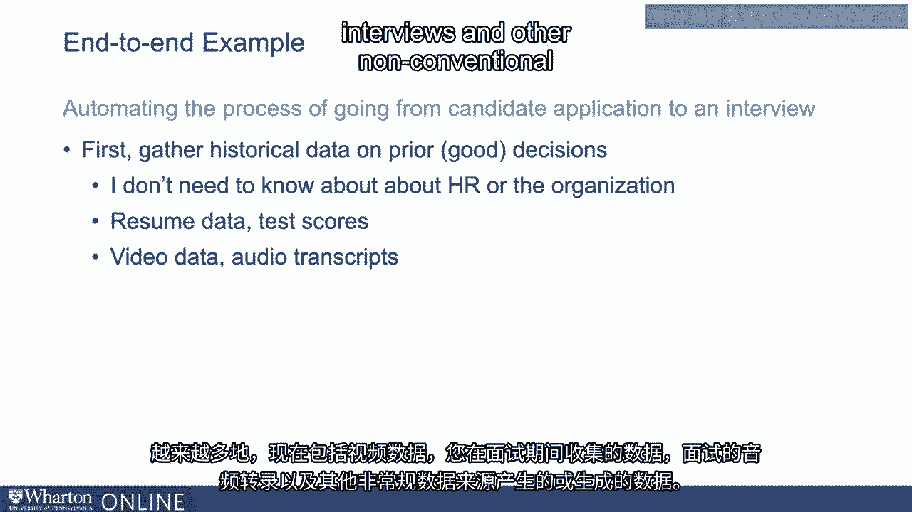
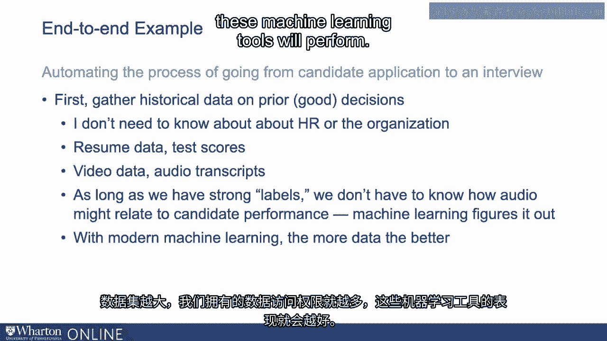

# 沃顿商学院《AI用于商业：AI基础／市场营销+财务／人力／管理》（中英字幕） - P72：9_端到端示例.zh_en - GPT中英字幕课程资源 - BV1Ju4y157dK

让我们谈谈与机器学习相关的一些我们提到过的概念。

相关的训练数据，以及它在整体工作流程中的结合方式。

那么我们来谈谈我们一直在处理的例子，即申请人筛选。

所以想象一下，我们想要构建一个系统来自动化这个过程。

候选申请将在面试中展示。那么整个工作流程是什么样的？

所以我们要做的第一件事是收集以往决策的历史数据。

之前做出的良好决策。因此，我们想确保选择的是由我们所信任的人所做出的决策。

知道在这个特定领域拥有丰富的专业知识。

所以我们将收集关于良好决策的历史数据。还有，再次。

在这个阶段，我们不需要了解任何关于人力资源或组织的内容。

只要数据来自于我们正在研究的特定商业背景。

这就是为什么机器学习如此具有变革性和强大。

所以第一步是从某个来源收集过去良好决策的历史数据。

它可以是档案数据。它可以是你专门为这个任务生成的内容。

这可能包括在此情况下的简历数据测试分数。如今，这种情况越来越普遍。

这包括你在访谈中收集的视频数据，以及访谈的音频转录。

以及其他非常规的。

产生或生成数据的来源。现在，只要我们有强标签。

只要我们有强有力的意义，专家会如何将这样的数据映射到最终决策的例子。

我们实际上不需要了解这些数据是如何重要的。

思考候选人的表现，这将被自动映射。

机器学习算法。

比如，我们不需要知道或事先了解音频是如何工作的。

转录本可能与候选人质量相关。机器学习将会自行学习这一点。

而且，随着现代机器学习的发展，数据越多越好，因此这些数据集越大。

我们对数据的访问越多，这些机器学习工具的表现就会越好。

所以我们将从数据开始。 我可以访问数据。 然后我们将指定一个模型。

确定它是什么。我们正在努力优化我们关心的错误。

然后我们将运行并优化模型，以确保其表现良好。

不仅仅是我们正在使用的数据，构建模型所用的训练数据。

我们还将确保它在一个我们称之为**保留样本**或测试数据的情况下能够良好运行。

所以我们在这个过程中想要做的是利用这些训练示例来构建模型。

然后在其他样本数据上测试模型的性能。

只是为了确保它在我们不需要的数据样本上运行良好。

还没有习惯实际构建模型本身。因此，这个过程也是机器学习工程过程中的一个重要部分。

只是为了确保它在现实世界中处理见过的数据时表现得足够稳健。

不仅仅是用于训练模型的数据。 在我们对其性能满意之后。

我们已经进行了这些测试和检查，以确保它能达到**最佳性能**。

关于我们关心的错误类型，我们已经准备好进行部署。

所以你现在可以开始对候选人的输入数据进行预测，而我们并不知道答案。

所以，我们再次以我们知道的良好历史数据为起点。

我们使用这些数据来训练机器学习算法。

我们确保它在样本外数据上表现良好，我们对此表现感到满意。

然后我们可以在现实世界中部署该算法。

[空白音频]。

