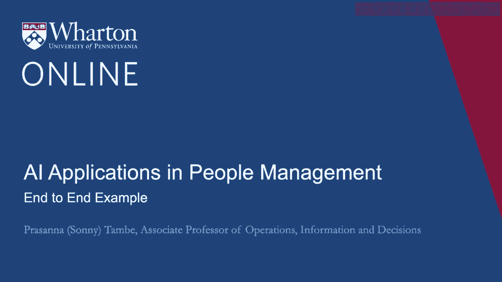
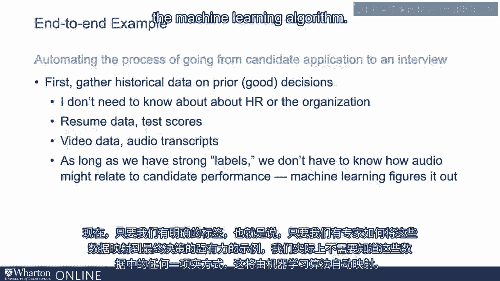
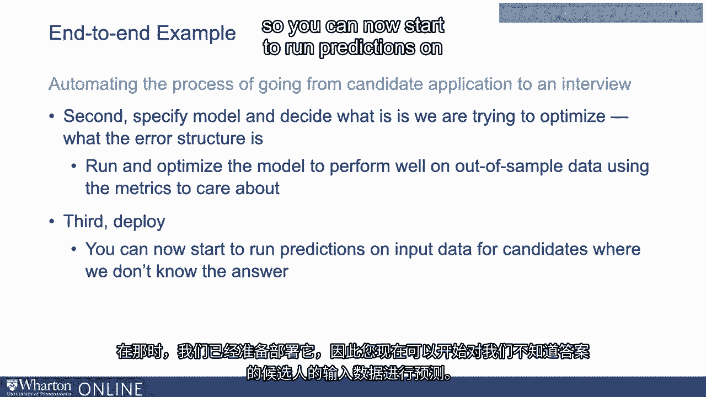
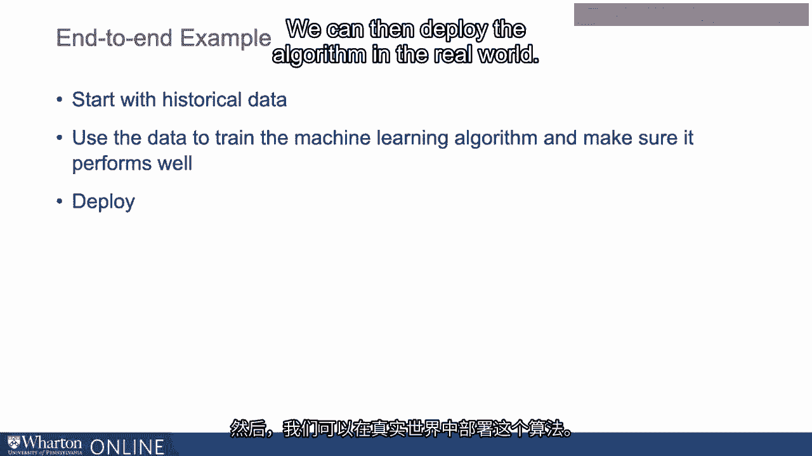

# 沃顿商学院《AI For Business（AI用于商业：AI基础／市场营销+财务／人力／管理）》（中英字幕） - P72：9_端到端示例.zh_en - GPT中英字幕课程资源 - BV1Ju4y157dK

 Let's talk about some of the concepts that we've mentioned related to machine learning。

 related training data， and how it fits together in an overall workflow。

 So let's talk about the example we've been working with which is applicant screening。

 So imagine we want to build a system to automate the process of going from。

 candidate applications to an interview。 So how does that total workflow look？

 So the first thing we're going to do is to gather historical data on prior， decisions。

 prior good decisions。 So we want to make sure that we're choosing decisions made by people that we。

 know have have a lot of expertise in this particular area。

 So we'll gather historical data on good decisions。 And again。

 we don't at this point need to know anything about HR or the organization。

 as long as the data are drawn from the specific business context that we are examining。

 And this is why machine learning is so transformative and so powerful。

 So the first step is to gather historical data on prior good decisions from some， source。

 It can be archival data。 It can be something you generate explicitly for this task。

 And this might include in this case resume data test scores。 Increasingly these days。

 it's including video data that you collect during， interviews， audio transcripts from interviews。

 and other nonconventional。

 sources of data that get produced or generated。 Now， as long as we have strong labels。

 meaning as long as we have strong， examples of how data like this would be mapped by an expert to a final decision。

 we don't really need to know about how any of these data actually matter for。

 thinking about candidate performance that will get automatically mapped by。

 the machine learning algorithm。

 We don't， for example， need to know or have a prior sense of how audio。

 transcripts might relate to candidate quality。 Machine learning will learn that on its own。

 And again， with modern machine learning， the more data the better， so the bigger these data sets。

 the more access to data we have， the better and better these machine learning tools will perform。

 So we'll start with the data。 I can access to data。 Then we're going to specify a model。

 decide what it is。 We're trying to optimize what the errors are that we care about。

 And we're going to then run and optimize the model to perform well。

 not only on the data that we're using， training data that we're using to build the model。

 we're also going to make sure that it works well on a， we call a hold out sample or test data。

 So what we want to do in this process is build the model using these training examples。

 and then test the performance of the model on some other sample of data。

 just to make sure that it works well on a sample of data that we， don't。

 haven't used to actually build the model itself。 And so this process is also an important part of the machine learning engineering process。

 just to make sure that it robustly performs on data seen in the real world。

 not just data used to train the model。 After we're happy with the performance thereafter。

 we've gone through these tests and checks to make sure that it performs as well as it can。

 on the types of errors we care about， we're at that point ready to deploy。

 So you can now start to run predictions on input data for candidates where we don't know the answer。

 So again， we just start with the historical data that we know to be good data。

 We use these data to train the machine learning algorithm。

 We make sure it performs well on out of sample data and we're happy with that performance。

 We can then deploy the algorithm in the real world。

 [BLANK_AUDIO]。

