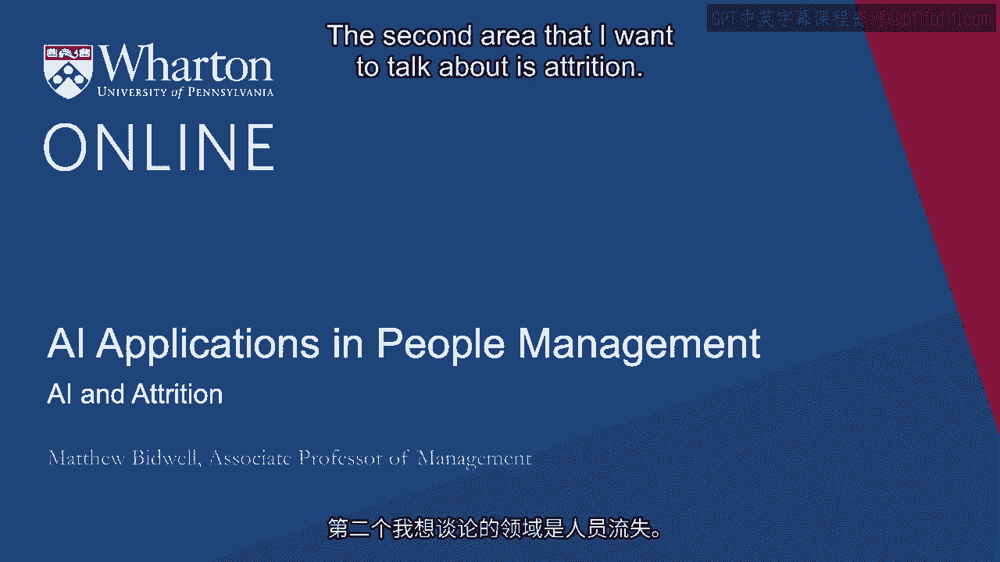

# 沃顿商学院《AI For Business（AI用于商业：AI基础／市场营销+财务／人力／管理）》（中英字幕） - P76：13_AI与流失.zh_en - GPT中英字幕课程资源 - BV1Ju4y157dK

我想谈论的第二个领域是流失。

我在之前的一个视频中提到过，组织支付了大量费用。

关注流失率，试图弄清楚人们为何离开以及他们能做些什么。

他们需要采取措施，因为人员流失对他们来说代价太高。可能正是因为这个原因。

人员流失与招聘是我认为存在问题的领域。

已经是最先进的领域，组织也已经在使用机器学习工具。

大多数人改变了他们管理人员的方式。如果你考虑这些机器学习工具的作用。

再次强调，这并不复杂，对吧？如果我们让我们的朋友来判断谁会离开。

他们会做一些非常像机器学习模型的事情，对吗？

我们正在试图弄清楚谁会离开，并说：“好吧，我们应该查看哪些信息？”

“有很多显而易见的事情。因此，我们会考虑每个人的情况。”

他们的个人情况是什么？他们的职业生涯处于什么阶段？所以，例如。

我们知道年轻人倾向于更频繁地换工作，部分原因是。

他们仍在努力弄清楚自己适合什么位置。

他们也可能更倾向于离开去上学，所以如果他们年轻，可能会这样。

他们的逃跑风险更大。我们还会查看他们的简历。

有人经常换公司。如果他们过去也这样做过。

他们更有可能再次这样做吗？所以，是的。

我们可能会将其中一些包含在我们的估算中。我们可能会考虑他们所在的工作。因此。

某些角色往往有更高的流失率。可能是因为它们很无聊。

这可能是因为这些工作所需技能需求旺盛，且更容易。

在其他地方寻找那些工作。但这两者之间会告诉我们一些关于他们机会的事情。

我已经谈到了参与度。毫无疑问，我们会关注他们是否参与或 disengaged 的任何信号。

我们可能会看看他们在工作上是否顺利，以及他们有多么内向？所以。

如果我们要坐下来观察任何个体，我认为他们。

明年要离开吗？这些是我们可能要考虑的一些事情。

当我们使用机器学习时，这基本上就是我们所做的。只有。

我们正在以系统化的方式结合所有这些特征，利用过去的数据和一切。

关于人们的那些特征，以及过去的数据，哪些人留下来了，哪些人则离开了。

人们仍需理解这些特征如何影响预测模型。

当我们这样做时，相较于让主管猜测谁更有可能，我们获得了两个优势。

离开。第一点是模型将会更加准确。

对于这些估算，我们做得还不错。我们往往不太擅长有效地等待多种不同的标准。

这些机器学习模型的表现远超我们的能力。

另一个优势是你可以让你的经理坐下来，看看谁可能会离开。

也许我们每六个月做一次，但管理者会分心，他们会转向其他事情。

机器学习的一个好处是，它不会分心。

我们可以建立一个模型，不断地在数据中抓取并不断地标记。

看起来这个人可能有逃跑的风险。我们在做这件事时，会考虑这些概率。

然后我们可以对此采取一些措施，因为我会去。

稍微进入一下。 [BLANK_AUDIO]。

