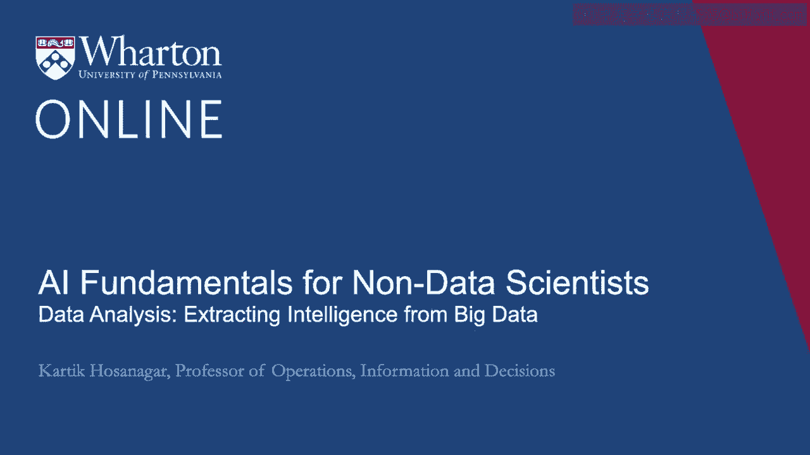
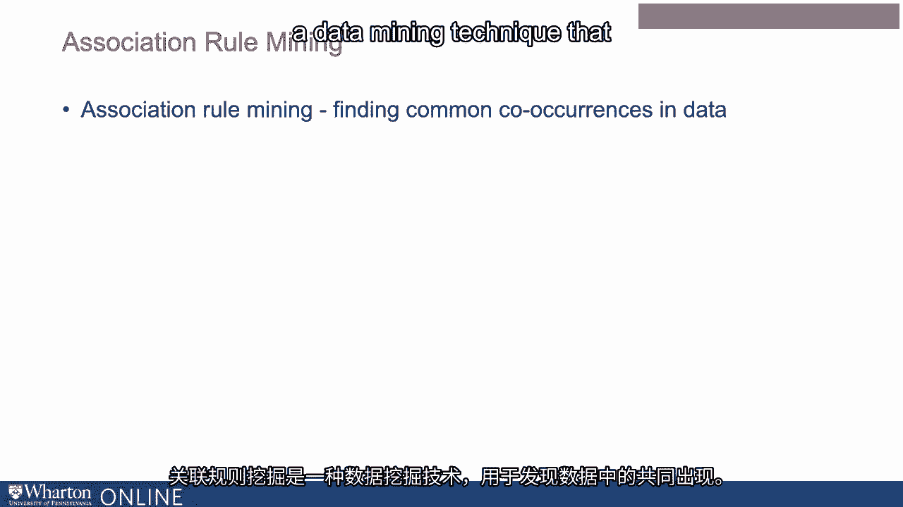
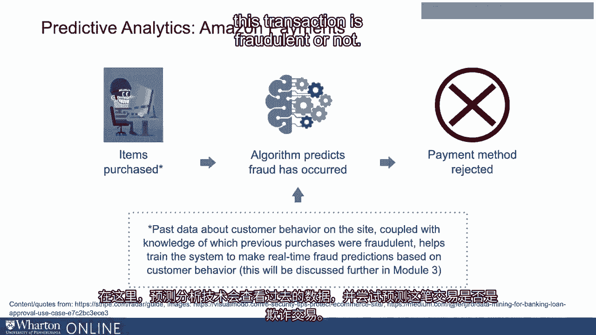

# 沃顿商学院《AI For Business（AI用于商业：AI基础／市场营销+财务／人力／管理）》（中英字幕） - P7：6_从大数据中提取情报的数据分析.zh_en - GPT中英字幕课程资源 - BV1Ju4y157dK

在本次讲座中，我们将讨论数据分析。特别是，我们将开始。

通过讨论数据挖掘。现在数据挖掘是一个广泛的术语，指的是发现工具。

大型数据集中模式。为了理解数据挖掘到底是什么，了解。

与许多人理解的简单统计方法进行对比，。

回归分析。现在，当我们进行回归时，可能会从一个假设开始。

例如，我们试图理解预测客户是否会。

可能违约并且不支付他们的信用卡欠款。因此我们可能提出一个假设。

违约的风险取决于许多因素，例如他们是否在过去违约。

在过去。也就是说，我们假设之前违约过的人是。

再次违约。我们可能还有一个假设，即有大量。

信用卡数量可能会违约，因为他们可能在努力管理。

他们的财务状况。最后，我们可能有一个假设，即有工作的人可能会少。

可能违约。现在，回归的目标可能是测试这些假设。因此我们可能。

基于过去的数据运行回归，测试一个人违约的风险。

这是否取决于这些因素，即之前的信用卡违约数量以及是否。

他们是否有工作。回归告诉我们这些因素是否重要。因此。

它还告诉我们这有多重要。因此在幻灯片上，你可以看到一个人是否。

在过去是否违约对他们未来是否再次违约有影响。

回归系数0.93告诉我们这有多重要。现在，请注意所有。

这些重要变量如信用卡数量，是否有工作。

是否他们在过去有过违约。这来源于分析师的假设。

这就是传统数据分析的核心。这就是回归的核心。

也有测试。相比之下，数据挖掘更侧重于数据驱动的探索。因此它。

可能不会像我之前提到的那样以假设开始。有许多不同的。

是数据挖掘的一部分的技术。实际上，数据挖掘是一个笼统的术语。

一些这些技术。我不会覆盖所有的属于。

数据挖掘的技术确实有一大堆。但是我将。

回顾几个有用的例子。第一个是聚类。聚类是一种数据挖掘。

用于对数据进行分组的技术。因此，聚类本质上会将我们的数据分开。

我们的数据被分成一堆更小的组或簇，使得簇内的数据点。

彼此相似，而不同簇中的数据点则彼此不同。

聚类的一个经典应用可能是在确定顾客细分中，在我们的数据中。

传统的顾客细分方法可能是凭直觉。一个市场经理。

可能会根据他们的经验说我们有三种顾客细分。而且。

他们可能会用一些顾客的人口统计数据来描述这些顾客细分。比如。

他们可能会说其中一个顾客细分可能是四口之家的足球妈妈。

住在郊区的五个人。也许这就是他们如何表达的。

其中一个顾客细分是这样的。相反，当你使用聚类时，我们试图弄清楚。

从数据驱动的方式中找出顾客和顾客细分，而不依赖这些假设。

而聚类可能会验证经理的直觉，并可能指示和展示。

郊区足球妈妈的购买模式与其他购买模式不同。

其他顾客的情况。或者这可能暗示差异并不是那么重要。

也许我们应该以不同的方式来思考顾客细分。另一个。

数据挖掘工具是关联规则挖掘。关联规则挖掘是一种数据挖掘技术。

找到数据中常见的共现。例如，我们可能会分析购物车。

在杂货店的数据或顾客购买模式中。我们可能会查看常见的。

其中的模式。关联规则挖掘软件可能会找到一种模式，例如人们。

在一笔交易中倾向于购买面包和黄油的顾客，也倾向于在同一交易中购买牛奶。

如果我们找到这个交易，我们可能会基于此采取行动。例如，一个传统的。

在实体杂货店中，这意味着一个实体杂货店可能决定存货面包、黄油和。

附近的牛奶。或者一个在线杂货店可能决定如果顾客已经添加了。

如果他们将面包和黄油加入购物车，那么它将向系统推荐。

顾客也会添加牛奶。关联规则挖掘技术有很多应用。

在商业数据中寻找这些数据中的模式。另一个例子可能是应用。

在医疗保健中。我想到的一个例子是对雷诺兹病的分析。

这项工作是由名为唐·斯旺森的计算机科学家或信息科学家完成的。唐·斯旺森。

对于研究雷诺兹病很感兴趣，这是一种影响肌肉骨骼系统的综合征。

他特别感兴趣的是识别雷诺兹病的新治疗方法。

因为那时对雷诺兹病或雷诺兹综合征的已知治疗方法并不多。

综合征。为了回答这个问题，唐·斯旺森查看了许多关于雷诺兹的研究论文。

疾病并发现与雷诺兹病相关的概念。换句话说。

与“雷诺氏病”一词常见的共现是什么？他发现血液。

粘稠度是一个常与讨论雷诺氏病相关的术语。他也。

发现肌肉骨骼问题常在讨论雷诺氏病的文章中出现。

例如，他发现讨论雷诺现象或雷诺氏病的文章。

综合症提到雷诺综合症期间血液粘稠度的增加。接下来，他问什么。

其他一些概念通常与血液粘稠度和肌肉骨骼有关。

虚弱。他发现一个概念，即EPA或二十碳五烯酸，常被讨论。

除了血液粘稠度，还有肌肉骨骼虚弱和其他一些概念。

与雷诺氏病相关。例如。

他发现诸如EPA或二十碳五烯酸等短语有助于降低血液粘稠度。相反。

雷诺氏病会增加血液粘稠度。EPA也与增强肌肉骨骼系统相关，而与之相反。

雷诺氏病与肌肉骨骼系统的虚弱相关。基于此。

唐·斯旺森提出了EPA的假设，这种物质常见于鱼油中。

可以帮助治疗雷诺氏病。实际上，后来的临床试验显示鱼油。

是治疗雷诺氏病的有效方法。现在，我应该在这里澄清，唐·斯旺森确实。

不使用关联规则挖掘软件。相反，他用了相同的想法并手动进行了。

但在他后来的研究中，他谈到了他的科学过程如何可以自动化。

使用寻找数据中常见共现的工具。

这就是关联规则挖掘软件的核心。现在。

数据挖掘技术如聚类和关联规则挖掘。

最终是在数据中寻找模式。下一步不仅仅是寻找模式。

也许是为了预测未来并采取相应行动。例如。

我们能否预测未来对我们产品的需求，并基于此做出生产决策？

我们能否预测刚发生的交易是否是欺诈？这就是关键所在。

预测分析的领域进入了。让我们看看一些示例。

我们可以通过预测分析做到这一点。让我们看看像亚马逊这样的大型零售公司。

一个客户可能会访问网站。他们可能会实际查看或浏览几个产品。

他们最终可能会为这些产品付款，而商品由亚马逊发货。现在。

零售商的目标是说服客户购买产品。

通常像亚马逊这样的零售商会向消费者展示推荐。例如。

推荐，例如购买此商品的人也购买了此商品，或查看此产品的人。

也查看了该产品。在这些推荐的核心是试图找出。

找出客户可能对哪些产品感兴趣。这最终希望能够。

说服客户购买产品。这是一个预测分析应用的例子。

试图预测客户可能对哪种产品感兴趣。

另一个例子可能是，当客户准备购买产品时，他们可能会输入他们的。

信用卡信息并立即点击购买或现在购买。在此时，算法在。

零售商的网站需要判断这是否是一次合法交易。

特别是，信用卡是否是由下单的客户合法拥有的信用卡。

订单是否可能被盗。在这里，预测分析技术查看过去的。

数据并尝试预测该交易是否存在欺诈行为。最终，这只是一个。

这是零售中预测分析的一个例子。实际上，这些方法有很多应用。

在下一个模块中，我们将探讨这些预测分析技术。特别是。

我们将把机器学习视为一种工具，用于进行可操作的预测。

[空音频]。
