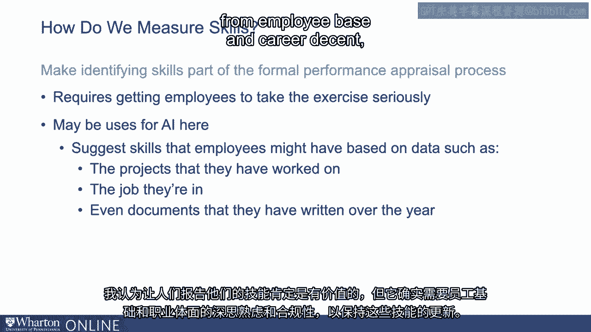
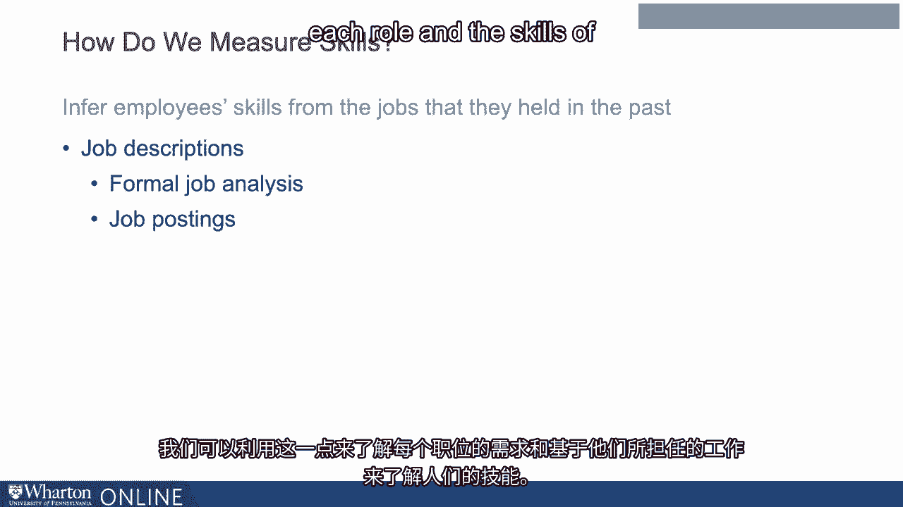

# 沃顿商学院《AI For Business（AI用于商业：AI基础／市场营销+财务／人力／管理）》（中英字幕） - P80：17_技能分析.zh_en - GPT中英字幕课程资源 - BV1Ju4y157dK

 So a lot of organizations that are moving in this direction， that are trying to build。

 some of these applications that are based on the idea of really understanding their。

 employee skills， are now trying to figure out what can we do to actually measure skills。

 both of employees and the jobs they're moving into as inputs to those systems。

 There are broadly a couple of approaches that we can take to measuring skills。

 So one approach to figuring out what skills people have is quite simply to ask them， okay。

 you want to ask them to create a list of all the skills they possess， then you also。

 want to ask them to continue to update that profile as they continue to learn new things。

 Makes sense。 One of the challenges here is getting people actually to fill up those profiles and keep。

 them up to date。 A couple of approaches that organizations have taken to try and actually get them to maintain。

 these skill profiles。 One is really trying to create strong incentives for people to report their skills。

 So a number of organizations have looked to the outside world and said， you know， what's。

 really depressing is that LinkedIn has much better data on our employer skills than we。

 do ourselves and this usually leads to the thought of， but what if we create our own LinkedIn？

 Maybe if we can create internal profiles， particularly if those profiles are useful for。

 getting jobs internally， people will fill in all their skill data on that as well。

 From what I've heard， these efforts haven't always worked terribly well。

 I think often these kind of internal LinkedIn projects suffer from kind of a chicken and。

 egg problem， right， which is I'm excited to fill in this profile if I know that recruiters。

 are going to look at it and recruiters are excited to look at these skill profiles if。

 everybody's filled them in。 But if neither side starts， then we never really get the ball rolling。

 And so these， I think， have been mixed success。 The second approach that some organizations have taken around measuring skills is just。

 making identifying their skills part of the formal performance appraisal process。

 So each year I get my performance appraised， maybe I have to work on setting my goals for。

 next year。 And I have to report all of the skills that I have。 And what I've learned this year。

 those sorts of things。 Does it work？ Again， one of the challenges here is just getting employees to take the exercise seriously。

 Some may do so。 Others it may just become a box checking exercise。 I mean。

 I think this is a place where there can be some other uses for AI， so some organizations。

 have experimented with。 If we can suggest skills that they probably have。

 maybe that will help the process。 They can check the ones that they have and ignore the others。

 You know， how can we do that？ We could maybe do it based on the kind of projects that they've worked on。

 the job they're， in， what are the skills other people in the job have。

 We could even start to look through documents and things that they've written over the year。

 and use that to code kind of what are the skills that are likely if they've used that。

 So there are definitely applications for machine learning here， whether or not it's accurate。

 enough that we can rely on that or whether we need people to at least confirm its accuracy。

 Still an open question。 Yeah， I think getting people to report their skills is definitely valuable。

 but it does， require a lot of thoughtful work from employee base and kind of， yeah。

 decent compliance for。

 them in keeping those skills up to date。 So if we can't get our employees to report their own skills。

 what else can we do？ Well， another way we can try and understand what skills people have had is to look at。

 the jobs that they've had。 Okay， so one of the nice simplifying strategies basically to say， well。

 not only do skills， determine what jobs people will be able to do now。

 but skills also determine what jobs， they've had in the past。

 So I ought to be able to assume that any job that somebody's in， they either had the skills。

 to do or required those skills during the job。 And so by looking at the series of jobs that people have been through in the past。

 I get， a pretty good idea of what skills they ought to have。 Okay， obviously in order to do this。

 we need to know what skills are associated with each， job。 How do we figure that out？ You know。

 again， there are multiple approaches。 So one is we can use existing databases。

 so the most common one here， something called， O-Starnet or O-net。 It's a government database。

 They took about the 900 occupations， the kind of broad jobs that we see in the economy。

 And for each occupation， they coded up a whole series of skills and abilities that people。

 are expected to have in those occupations。 Okay？ And so just by seeing what occupations we have in our organization and what occupations people。

 have moved between， we have some idea of what sort of skills they ought to have。

 The nice thing here is it's very simple， all that data sitting there。 You know。

 the challenge is it kind of assumes that every job within an occupation has the， same skills。

 they don't。 And so there's clearly a lot of measurement error that goes into that。

 But it's still been a common approach for a lot of organizations just getting a first。

 cut at what kind of skills are present in our organization based on the jobs people are。

 doing。 So a more accurate way to understand the skills required from each job is actually to go to。

 the descriptions of the jobs themselves within each organization。

 So here's some organizations might actually do some formal job analysis， what they kind。

 of bring in psychologists to figure out kind of for each job， exactly what it entails。

 But it's a somewhat bureaucratic process。 And like all these things。

 those analyses can swiftly become out of date。 Make a more reliable source of information on these job analyses。

 actually kind of the， job requirements that are posted when jobs are being filled。

 Because ultimately it's when we're hiring for jobs that probably companies think most。

 about what they require in those jobs， what people will be doing， and really codify it。

 And so those job postings can be a nice source of data for understanding the skills that jobs。

 require。 Indeed， there are a number of firms， I'm most prominently a company called Burning Glass。

 that have developed pretty sophisticated algorithms for going through job postings and actually。

 passing them and identifying all of the skills that those jobs require。

 Sometimes those analyses are kind of cross-company and so I think Sonny and Peter will talk a。

 little bit about how AI is changing the broader labor market。

 And a lot of the studies that have been done， look at that， have actually drawn unchanged。

 and job postings as a way to understand changes skill demands。 Obviously though。

 these same approaches can be used inside organizations。

 So we can look at all of the job postings inside the organization to understand what。

 are the skills and incumbents of those roles have been expected to possess。 And therefore。

 what skills should we expect people who've been through those roles will， possess。

 And we can use that then both to understand the demands of each role and the skills of。

 people based on the jobs that they've been through。 As organizations have become more complex。

 just leaving people to figure out their careers， on their own has become more difficult。

 We need to give them guidance， we need to help them understand the possibilities。

 But also as organizations become more complex， helping them understand that has become harder。

 So that's somewhere where AI tools have really been helpful， helping organizations understand。

 the relationships between jobs， helping them understand where the skills are in the organization。

 helping them build paths that people can traverse if they want to build a career within that。

 organization。 [BLANK_AUDIO]。

