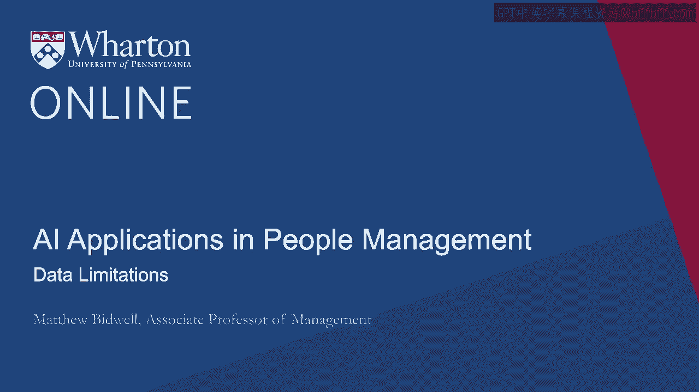
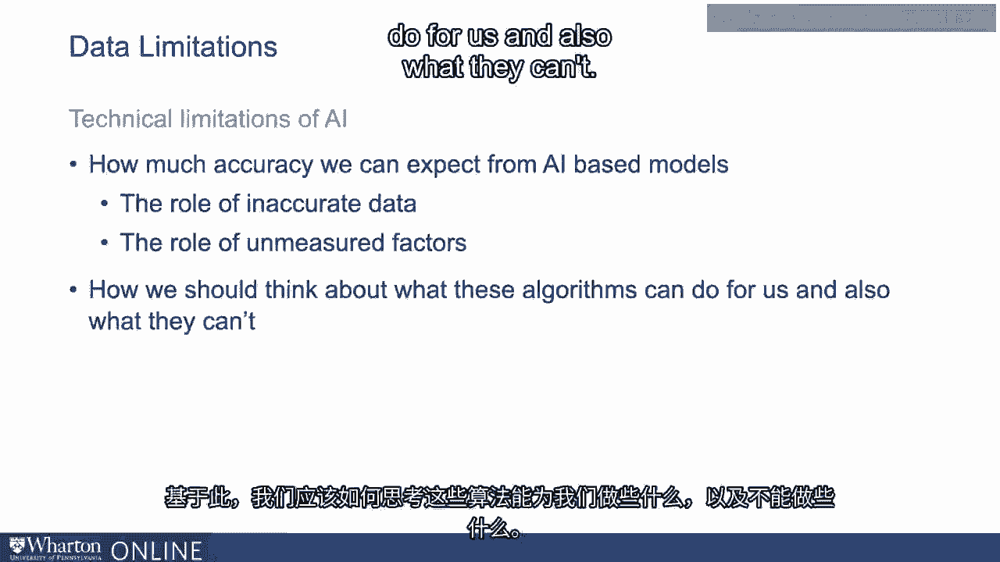
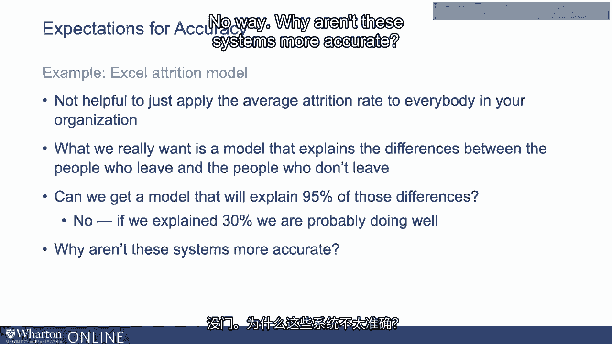

# 沃顿商学院《AI For Business（AI用于商业：AI基础／市场营销+财务／人力／管理）》（中英字幕） - P83：20_数据局限性.zh_en - GPT中英字幕课程资源 - BV1Ju4y157dK

 So what we've tried to convey in these videos is the real potential for AI machine learning。

 to improve the way that we manage people。 At the same time。

 there are a number of important limitations on the extent to which we can， use these models。

 What I want to focus on right now are some of the technical limitations。 Okay。 Specifically。

 what I want to talk about is how much accuracy we can really expect from these。

 models and where we see problems， particularly the role of inaccurate data， particularly the。

 role of unmeasured factors。 And based on this， how we should think about what these algorithms can do for us and also。

 what they can't。

 Let's start by talking a little bit about how much accuracy can we really expect。

 So when you hear some people talk about machine learning， they convey the impression that if。

 we use these models right， we'll be able to get almost perfect predictions about how people。

 will behave。 It's just a question of having the right algorithm。 That's not really true。

 I think a lot of these impressions come from two places。

 I think one is ultimately fairly misleading ways of representing the data。

 I think also kind of analogies to success of AI in other tasks。

 So AI has been incredibly powerful for some applications。

 But in ways that maybe don't tell us very much about how successful it will be for managing。

 people and particularly for predicting human behavior。 Let me talk a little bit about each of these。

 It turns out when we describe the accuracy of our algorithms， there are multiple ways。

 that we can do it。 And some of these roles， some of these ways of describing the algorithms are best flattering。

 or worse， deeply misleading。 My favorite example of this is you'll often hear people tell you that there are attrition。

 models， their predictions of who's going to leave and who's not going to leave have 90。

 or 95% accuracy。 And you listen to that and you think， that's amazing。

 They really know what people can do。 This is some real minority report kind of stuff。 It may not be。

 So what I want to do right now， I want to demonstrate my incredible power。

 So I'm going to actually propose to you a model that we'll predict who's going to leave。

 your organization within the next month。 It's going to do it with at least 95% accuracy。

 at least for most organizations。 In fact， we're going to do it now that there's going to be no extra charge for this service。

 So here's the model that you can use to predict who's going to leave within the next month。

 at least 95% accuracy。 So what I want you to do is I want you to create an Excel spreadsheet and I want you。

 to write in each row the name of each of your employees。

 I want a second column and I want in that column， in each cell in that column， it's going to。

 be an estimate of whether or not this person is going to leave next month。

 And what I want you to do is put a zero in each cell in that column。

 So we're going to predict that none of these employees is going to leave in the next month。

 Now， as long as fewer than 5% of your employees leave next month， pretty accurate for most。

 organizations， as long as fewer than 5% leave。 Next month。

 then this model is going to be 95% accurate， at least， right？

 Because from almost all of your employees， we've predicted they wouldn't leave and they。

 didn't leave。 Okay， so great。 We've got a model that's 95% accurate。 Is it useful？ No， no， it's not。

 What you didn't want to do was just apply the average attrition rate to everybody in your。

 organization and realize by doing that， most of them aren't going to leave next month。

 That's not helpful， right？ What we really want is a model that's going to explain the differences between the people。

 who leave and who don't leave。 Now， can we get a model that's going to explain 95% of those differences。

 right？ Where the probability for those people who leave in the next month is going to be close。

 to one and the probability of those people who stay in the next month is going to be close， to zero。

 Can we get those differences close to 95%？ No。 Frankly。

 I would say if we could explain 30% of those differences between the people who。

 left and the people who stayed， we'd be doing pretty well。 It's similar with hiring， right？

 When we think about hiring， it's really our predictions about how people will perform in。

 the future， right？ How much of the variation in people's performance can we explain through our hiring test？

 And most of the evidence suggests 30% to 50% of the differences across candidates。

 And I don't think there's much evidence that fancier and fancier algorithms are going to。

 get us that much better。 Okay。 And so I think we need to understand that our ability to get strong results on all of these。

 algorithms is somewhat limited。 We can do a better job of explaining who's going to leave。

 We can do a better job of explaining who's going to perform well than we can simply with， chance。

 can we get to 95%？ No way。 So why aren't these systems more accurate？

 [BLANK_AUDIO]。

